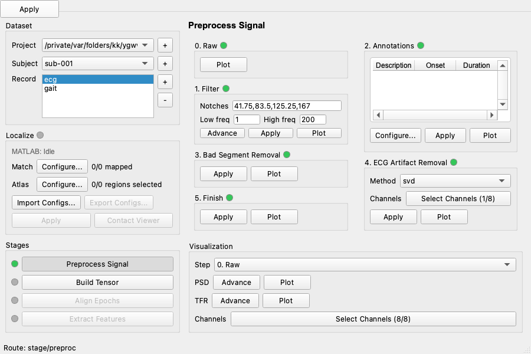

# LFP-TensorPipe App



LFP-TensorPipe is a desktop GUI for DBS LFP workflows that works alongside
Lead-DBS projects. It supports record import, localization setup, signal
preprocessing, tensor building, epoch alignment, and feature extraction.

## What This App Covers

- import records into a Lead-DBS-compatible project
- reuse existing Lead-DBS outputs for `Localize`
- preprocess signals step by step
- build tensor outputs for multiple metrics
- align epochs for paradigms like gait, ERP paradigms
- extract plot-ready features from aligned outputs

## Documentation Map

- Installation guide: [docs/INSTALL.md](docs/INSTALL.md)
- Full tutorial: [docs/APP_TUTORIAL.md](docs/APP_TUTORIAL.md)

Start with the installation guide, then follow the full tutorial for the
example workflow, dialog settings, and config examples.

## Repository Contents

- `src/lfptensorpipe/`: desktop application and package source
- `paper/pd/`: Parkinson's disease paper analysis utilities and export scripts

Public snapshots in this repository exclude `test` and `tests` directories.
This public release tree also excludes private export manifests and other
private-repository metadata.

## Installation

LFP-TensorPipe supports two installation methods:

| Method | Best For | Summary |
|---|---|---|
| `PyInstaller desktop app` | Readers who want the packaged GUI | Install the PyInstaller-built desktop app, then configure `Settings -> Configs` on first launch |
| `Developer setup` | Readers who want a source checkout or a local development environment | Create the `lfptp` Conda environment, install the package in editable mode, and launch the app from that environment |

### PyInstaller Desktop App

1. Download the PyInstaller desktop app package for your platform.
2. Install or unpack it as instructed for that release.
3. Launch the app.
4. Open `Settings -> Configs` and enter valid machine-local paths if you plan to
   use `Localize`.

### Developer Setup

```bash
conda env create -f envs/lfptp_py311_base.yml
conda activate lfptp
python -m pip install -e ".[dev]"
```

After launch, use `Settings -> Configs` for `Lead-DBS Directory` and
`MATLAB Installation Path`. The GUI no longer expects a manual MATLAB Engine
package path.

## Practice Setup

Use the following setup while reading
[docs/APP_TUTORIAL.md](docs/APP_TUTORIAL.md):

- `Project`: `<demo-project-root>`
- `Lead-DBS Directory`: `<lead-dbs-root>`
- `MATLAB Installation Path`: `<matlab-root>`
- `Preprocess` example: `sub-001 / ecg`
- `Localize`, `Build Tensor`, `Align Epochs`, and `Extract Features` example:
  `sub-001 / gait`
- `Extract Features` walkthrough trial: `cycle_l`

Replace `<demo-project-root>`, `<lead-dbs-root>`, and `<matlab-root>` with the
matching local paths on your machine.

`Project` uses a Lead-DBS-compatible layout, so you can point it directly to an
existing Lead-DBS toolbox project path. In the tutorial, `<demo-project-root>`
means the root of your local demo project copy.

## Workflow At a Glance

1. Select `Project`, `Subject`, and `Record`.
2. Configure `Localize` if representative coordinates and brain region mapping are required.
3. Run `Preprocess Signal`.
4. Run `Build Tensor`.
5. Run `Align Epochs`.
6. Run `Extract Features`.

Each downstream stage is gated by the upstream stage: `Build Tensor` by
`Preprocess Signal`, `Align Epochs` by `Build Tensor`, and `Extract Features`
by the selected trial in `Align Epochs`. `Localize` is separate.

## Key UI Concepts

- Stage lights are log-driven and use `gray`, `yellow`, and `green`.
- Inline panel indicators are draft-aware and compare the visible settings
  against the latest successful run or apply.
- `Import Configs...` and `Export Configs...` move record-scoped or trial-scoped
  JSON payloads, not whole projects.
- In `Preprocess`, `Filter -> Plot` is where you review and edit `bad` spans,
  while `Annotations` is where you manage named event annotations.
- `Localize` atlas choices are discovered from the configured Lead-DBS
  installation for the current subject space.
- When `Localize` is green, `Align Epochs -> Finish` attempts to merge the
  Localize representative-coordinate columns into the finished raw tables.

Continue with [docs/APP_TUTORIAL.md](docs/APP_TUTORIAL.md) for the complete
step-by-step workflow.
