# LFP-TensorPipe Control Reference

This page is a GUI control reference, not a workflow guide.

- Use this document when you need to understand what a control does, when it is
  available, and what state or output it affects.
- Use [APP_TUTORIAL.md](APP_TUTORIAL.md) when you want a validated step-by-step
  example workflow.

## 1. Configs

The configs dialog stores runtime dependencies used by Localize and related
MATLAB-backed actions.

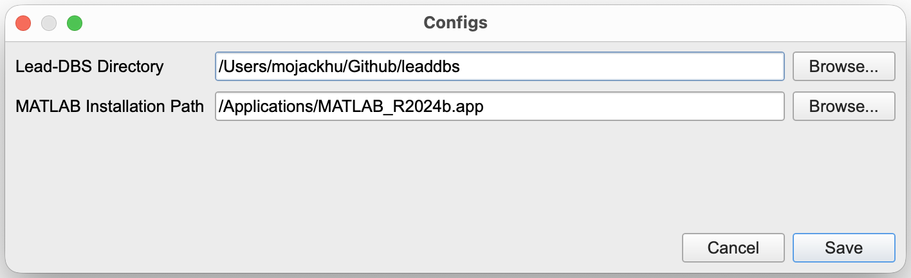

| Control | What it does | What it affects | Availability / blocking rule |
| --- | --- | --- | --- |
| `Lead-DBS Directory` | Points the app to the local Lead-DBS installation root. | Localize atlas discovery and MATLAB-side Lead-DBS helpers. | Must be a valid Lead-DBS directory before Localize can become ready. |
| `Browse` (Lead-DBS) | Opens a directory chooser for the Lead-DBS root. | Fills the `Lead-DBS Directory` field. | Always available. |
| `MATLAB Installation Path` | Points the app to the local MATLAB application or executable path. | MATLAB-backed actions such as Localize Apply and Contact Viewer launch. | Must resolve to a working MATLAB install before MATLAB status can turn ready. |
| `Browse` (MATLAB) | Opens a chooser for the MATLAB application path. | Fills the `MATLAB Installation Path` field. | Always available. |
| `Save` | Validates and stores the current dependency paths in app storage. | Future Localize runtime checks. | Blocks on invalid paths. |
| `Cancel` | Closes the dialog without saving path changes. | No persisted state. | Always available. |

After a valid save, the Localize panel can report `MATLAB: Ready`.

## 2. Main Window Overview

The main window combines shared workspace context, inline Localize controls,
stage navigation, and the currently active stage page.

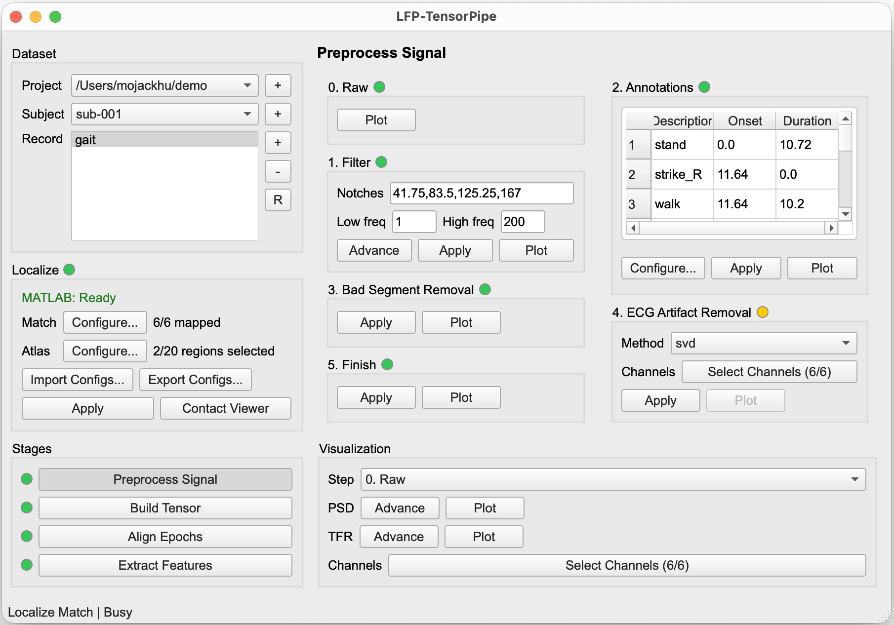

### 2.1 Dataset Context

These controls define the current workspace scope. Downstream panels always act
on the selected project, subject, and record.

| Control | What it does | What it affects | Availability / blocking rule |
| --- | --- | --- | --- |
| `Project` | Selects the active project workspace. | Subject list, record list, and all stage pages. | Always available when at least one project is registered. |
| `Project +` | Adds an existing project path to recent project history. | Available project choices. | Always available. |
| `Subject` | Selects the active subject under the current project. | Record list and all record-scoped panels. | Requires a selected project. |
| `Subject +` | Creates a new subject folder under the current project. | Subject inventory. | Requires a selected project. |
| `Record` | Selects the active record under the current subject. | Localize and all stage pages. | Requires a selected subject. |
| `Record +` | Opens the record import dialog. | Creates a new record when the import completes successfully. | Requires a selected subject. |
| `Record R` | Renames the selected record while preserving compatible downstream artifacts. | Record name and artifact paths that track that name. | Requires exactly one selected record. |
| `Record -` | Deletes the selected record and its derived artifacts. | Record inventory and downstream files for that record. | Requires exactly one selected record. |

### 2.2 Localize Summary Row

The inline Localize block gives a lightweight record-scoped summary even when
you are not currently focused on the full Localize page.

| Control | What it does | What it affects | Availability / blocking rule |
| --- | --- | --- | --- |
| `Localize` indicator | Summarizes Localize freshness for the current record. | Visual readiness for downstream consumers such as Align `Merge Location Info`. | Read-only. |
| `Match` status text | Reports mapped channels versus total channels. | Whether Localize Apply can succeed with the current draft. | Read-only. |
| `MATLAB` status text | Reports MATLAB runtime readiness. | Whether MATLAB-backed Localize actions can run immediately. | Read-only. |
| `Atlas` summary text | Reports the saved atlas/region selection summary. | Localize Apply inputs. | Read-only. |

### 2.3 Stages and Workspace Area

The stage buttons open the full page for each processing stage. The right-hand
workspace area shows whichever stage page is currently active.

| Control | What it does | What it affects | Availability / blocking rule |
| --- | --- | --- | --- |
| Stage indicators | Show readiness or staleness for each stage. | Navigation feedback only. | Read-only. |
| Stage buttons | Open the corresponding stage page in the workspace area. | Which control surface is shown on the right. | Usually enabled only when upstream requirements are satisfied. |
| Active workspace page | Hosts the full controls for the selected stage. | The current page-specific actions and state. | Depends on the active stage. |

## 3. Import Record

The import dialog defines a new record, parses the selected source, and runs any
required pre-import transforms before the record is committed.

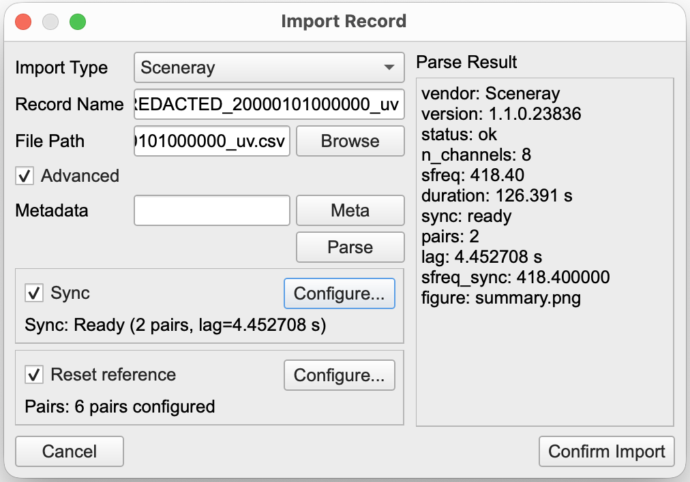

The screenshot shows the visible fields for one parser configuration with
`Advanced` enabled. Other import types can expose additional type-specific
inputs.

### 3.1 Main Form

| Control | What it does | What it affects | Availability / blocking rule |
| --- | --- | --- | --- |
| `Import Type` | Chooses the parser family for the source file. | Which fields, validation rules, and sidecars are required. | Always available. |
| `Record Name` | Defines the record name that will be created under the current subject. | Record folder name and downstream artifact paths. | Required before import can succeed. |
| `File Path` | Points to the primary source file. | Parse result and final imported record contents. | Required before parse. |
| `Browse` | Opens a file chooser for the primary source file. | Fills `File Path`. | Always available. |
| `Advanced` | Reveals optional sidecar inputs supported by the selected import type. | Whether auxiliary import fields are shown. | Always available. |
| `Metadata` | Points to an optional metadata sidecar. | Import metadata enrichment for supported parsers. | Visible only when `Advanced` is enabled and the import type supports it. |
| `Browse` (metadata) | Opens a file chooser for the metadata sidecar. | Fills the metadata path field. | Same gating as `Metadata`. |
| `Parse` | Reads the selected source and previews import metadata without committing the record. | Parsed channels, sample rate, duration, and parser-dependent import state. | Requires a valid source path and any required parser inputs. |
| `Sync` | Enables import-time timeline synchronization. | Whether a saved sync state becomes part of the import requirements. | Requires a successful parse. |
| `Configure...` (Sync) | Opens the sync configuration dialog. | Saved import-time sync state. | Enabled when `Sync` is checked and parse state exists. |
| `Sync` summary | Reports the saved synchronization state. | Import gating feedback. | Read-only. |
| `Reset reference` | Enables pre-import channel remapping. | Whether a saved reset-reference state becomes part of the import requirements. | Requires a successful parse. |
| `Configure...` (Reset reference) | Opens the reset-reference dialog. | Saved reset-reference pairs. | Enabled when `Reset reference` is checked and channels were parsed. |
| `Reset reference` summary | Reports the saved reset-reference state. | Import gating feedback. | Read-only. |
| `Parse Result` | Reports parser summary such as vendor, channels, sampling rate, and duration. | Human validation only. | Read-only after parse. |
| `Confirm Import` | Commits the parsed record into the current subject. | Record creation under the selected subject. | Disabled until parse succeeds and all enabled prerequisite dialogs are saved. |
| `Cancel` | Closes the dialog without importing. | No record creation. | Always available. |

### 3.2 Sync Import Signal

This dialog prepares optional import-time alignment between LFP markers and an
external marker stream.

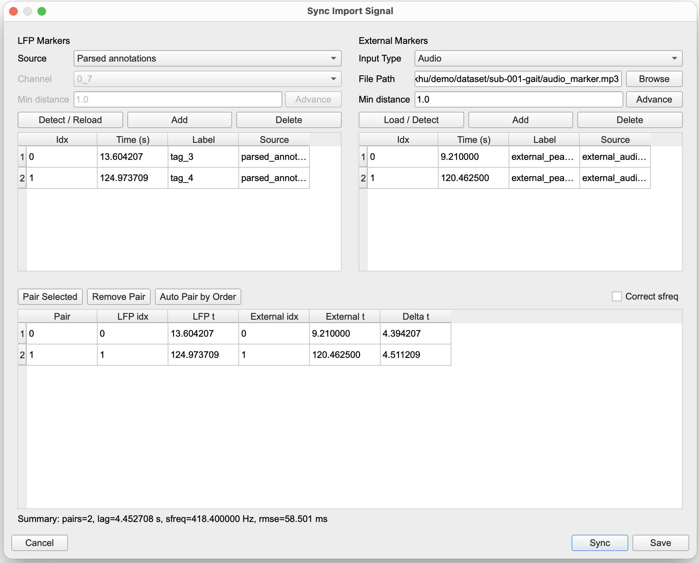

#### Left and right marker panels

| Control | What it does | What it affects | Availability / blocking rule |
| --- | --- | --- | --- |
| `LFP Markers` source | Chooses how the LFP-side markers are obtained. | LFP marker list content. | Always available after the dialog opens. |
| `LFP Channel` | Selects the channel used for peak-based LFP marker detection. | LFP marker detection target. | Enabled when the LFP source is `Channel peaks`. |
| `External` source | Chooses the external marker input type. | External marker list content. | Always available after the dialog opens. |
| `File Path` | Points to the external timing source, such as CSV or audio. | External marker detection input. | Enabled for file-backed external sources. |
| `Browse` | Opens a chooser for the external source file. | Fills the external file path. | Enabled with the external file path field. |
| `Min distance` | Sets the minimum separation between detected markers on that side. | Marker detection sensitivity. | Always available. |
| `Advance` | Opens side-specific detection settings for the selected marker source. | Saved marker-detection configuration for that side. | Always available, but the child dialogs are not illustrated in this screenshot set. |
| `Detect / Reload` or `Load / Detect` | Rebuilds the marker list from the current source settings. | Marker table rows. | Requires the source definition to be valid. |
| `Add` | Adds a marker row manually. | Marker table rows. | Always available. |
| `Delete` | Removes the selected marker row. | Marker table rows. | Requires a selected row. |
| Marker table | Lists detected or manually added markers. | Pairing and sync estimation inputs. | Read-only except for row selection. |

#### Pairing and save area

| Control | What it does | What it affects | Availability / blocking rule |
| --- | --- | --- | --- |
| `Pair Selected` | Pairs the currently selected LFP marker with the currently selected external marker. | Pair table rows. | Requires one selected row on each side. |
| `Remove Pair` | Removes the selected pair row. | Pair table rows. | Requires a selected pair row. |
| `Auto Pair by Order` | Pairs the current marker lists in order. | Pair table rows. | Requires both marker lists to be populated. |
| `Correct sfreq` | Allows the sync estimate to adjust synchronized sampling rate as well as lag. | Sync estimate payload. | Optional; affects the saved estimate. |
| Pair table | Lists paired markers and their timing deltas. | Sync estimation input and summary. | Read-only except for row selection. |
| `Summary` | Reports current sync-estimate status. | Human validation only. | Read-only. |
| `Sync` | Computes or refreshes the synchronization estimate from the current pairs. | Sync preview state and saved summary. | Requires a sufficient pair set. |
| `Save` | Saves the current sync state back to Import Record. | Import gating and imported synchronization behavior. | Typically requires a valid estimate. |
| `Cancel` | Closes the dialog without saving changes. | No sync state update. | Always available. |

### 3.3 Reset Reference

This dialog defines bipolar or unary remapping pairs that are applied before the
record is imported.

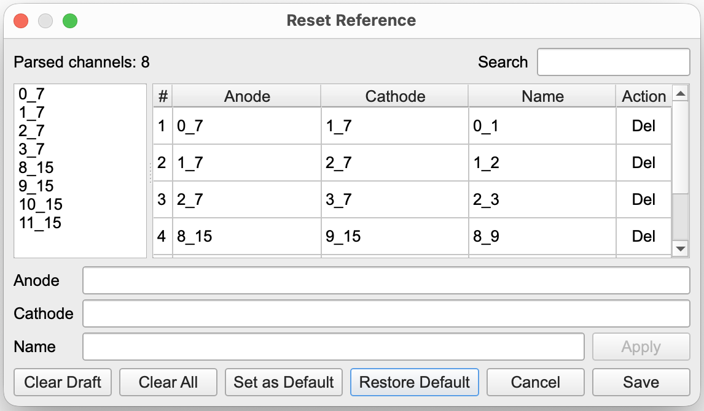

| Control | What it does | What it affects | Availability / blocking rule |
| --- | --- | --- | --- |
| `Search` | Filters parsed channels and configured pairs. | Dialog browsing only. | Always available. |
| Channel list | Provides the parsed input channels used to draft pairs. | Draft anode/cathode selection. | Requires parsed channels. |
| Pair table | Lists the currently configured reset-reference outputs. | Saved reset-reference payload. | Read-only except for delete actions. |
| `Anode` | Draft source channel for the positive pole. | The pending pair draft. | Required unless the pair is cathode-only. |
| `Cathode` | Draft source channel for the negative pole. | The pending pair draft. | Required unless the pair is anode-only. |
| `Name` | Output channel name written into the imported record. | Imported channel naming. | Required for every saved pair. |
| `Apply` | Adds the draft pair to the table. | Pair table rows. | Requires a valid draft. |
| `Clear Draft` | Clears the current draft row. | Draft fields only. | Always available. |
| `Clear All` | Removes all configured pairs. | Pair table rows. | Always available. |
| `Set as Default` | Saves the current pair list as the app default. | Future reset-reference defaults. | Always available. |
| `Restore Default` | Restores the saved default pair list. | Current draft table. | Always available; falls back to an empty list if no default exists. |
| `Save` | Saves the pair list back to Import Record. | Import gating and imported channel names. | Blocks on invalid or empty required state. |
| `Cancel` | Closes the dialog without saving pair changes. | No reset-reference update. | Always available. |

## 4. Localize

The Localize page defines how record channels map to Lead-DBS contacts and how
representative coordinates are exported for downstream use.

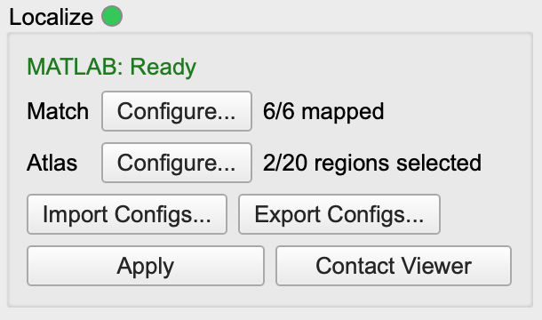

### 4.1 Main Panel

| Control | What it does | What it affects | Availability / blocking rule |
| --- | --- | --- | --- |
| `Localize` indicator | Reports Localize freshness for the current record. | Downstream readiness feedback only. | Read-only. |
| `Match -> Configure...` | Opens the channel-to-contact mapping dialog. | Saved mapping payload. | Requires a selected record and parsed channel inventory. |
| `Match` status | Reports how many record channels are mapped. | Whether Apply can use a complete mapping. | Read-only. |
| `MATLAB` status | Reports whether MATLAB dependencies are currently ready. | Expected runtime availability for Apply and Contact Viewer. | Read-only. |
| `Atlas -> Configure...` | Opens the atlas and region-selection dialog. | Saved atlas payload. | Requires a selected record. |
| `Atlas` summary | Reports the saved atlas/region selection summary. | Human validation only. | Read-only. |
| `Import Configs...` | Loads a Localize configuration payload. | Current match and atlas draft. | Requires a selected record. |
| `Export Configs...` | Saves the current Localize configuration payload. | External JSON config file. | Requires a selected record. |
| `Apply` | Generates representative-coordinate artifacts for the current record. | Localize outputs consumed by downstream alignment and feature views. | Requires complete match state, saved atlas state, and working MATLAB/Lead-DBS dependencies. |
| `Contact Viewer` | Launches the external MATLAB-based contact viewer. | Independent viewer process only. | Requires a valid current atlas and representative-coordinate export context. |

### 4.2 Match: Record Channels ↔ Lead-DBS Contacts

This dialog binds each record channel to an anode, cathode, and representative
coordinate mode.

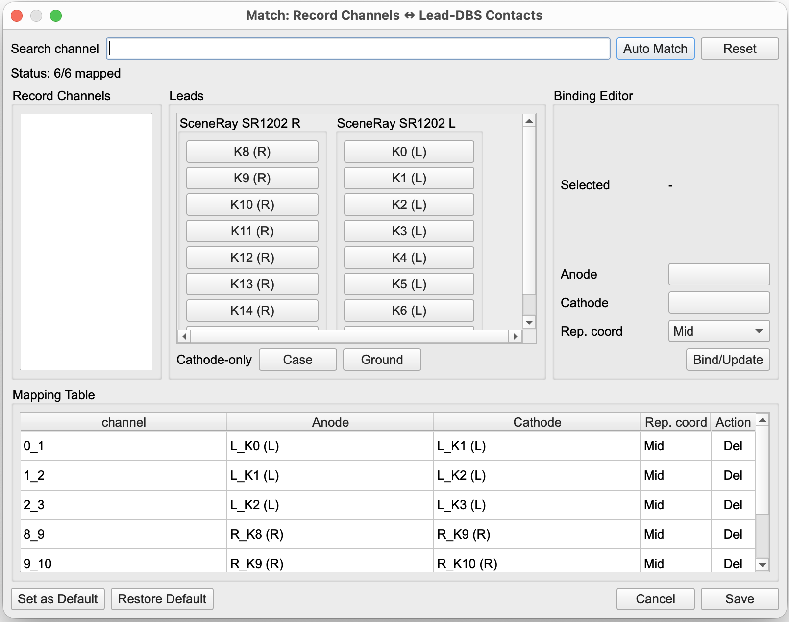

| Control | What it does | What it affects | Availability / blocking rule |
| --- | --- | --- | --- |
| `Search channel` | Filters unmapped channels by name. | Channel list browsing only. | Always available. |
| `Auto Match` | Attempts to auto-bind channels using the implemented contact-index rule. | Mapping draft and committed rows for any channel with a unique candidate. | Requires available leads and channels. |
| `Reset` | Clears all mappings for the current record. | Entire mapping table. | Always available. |
| `Status` | Reports mapped channels versus total channels. | Human validation only. | Read-only. |
| `Record Channels` list | Lists channels that still need mapping. | Active channel selection for editing. | Requires parsed channels. |
| Lead contact buttons | Select an anode or cathode endpoint from a Lead-DBS lead. | Current binding draft. | Requires an active channel. |
| `Case` / `Ground` | Provide cathode-only special endpoints. | Current binding draft. | Require an anode to be chosen first. |
| `Selected` | Shows which record channel is currently being edited. | Human validation only. | Read-only. |
| `Anode` | Shows the drafted anode and lets the user clear it. | Current binding draft. | Requires an active channel. |
| `Cathode` | Shows the drafted cathode and lets the user clear it. | Current binding draft. | Requires an active channel. |
| `Rep. coord` | Chooses the representative coordinate mode exported for this channel. | Representative-coordinate outputs for that channel. | Requires an active channel. |
| `Bind/Update` | Commits the current draft for the active channel. | Mapping table. | Requires a valid draft. |
| `Mapping Table` | Lists committed bindings for this record. | Saved payload and row editing entrypoint. | Read-only except for row selection and row delete actions. |
| `Set as Default` | Saves the current mapping table as the app default. | Future default mappings. | Always available. |
| `Restore Default` | Restores compatible saved mappings from app defaults. | Current mapping table. | Always available. |
| `Save` | Saves the committed mappings back to the Localize page. | Localize readiness and Apply input. | Blocks until all channels are mapped. |
| `Cancel` | Closes the dialog without saving. | No payload change. | Always available. |

### 4.3 Configure Localize Atlas

This dialog defines the atlas space and the interested regions used when
representative coordinates are evaluated against atlas membership.

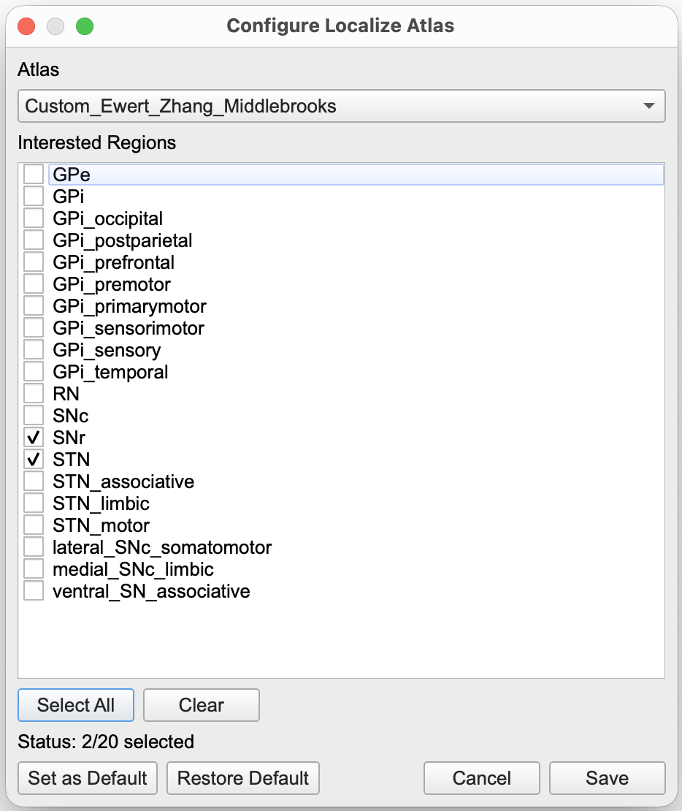

| Control | What it does | What it affects | Availability / blocking rule |
| --- | --- | --- | --- |
| `Space` | Chooses the atlas space that the current Lead-DBS subject must match. | Atlas discovery and Apply compatibility. | Requires available atlas spaces under the configured Lead-DBS tree. |
| `Atlas` | Chooses the atlas within the selected space. | Available region list and atlas membership lookup. | Requires a selected space. |
| `Search` | Filters the available region list. | Region browsing only. | Always available once an atlas is loaded. |
| Region checklist | Chooses which atlas regions are considered during Apply. | Interested-region payload. | Requires an atlas. |
| `Select All` | Selects every region in the current atlas. | Region checklist. | Requires an atlas. |
| `Clear` | Clears the current region selection. | Region checklist. | Requires an atlas. |
| `Save` | Saves the current atlas configuration back to the Localize page. | Atlas summary and Apply input. | Blocks on invalid space/atlas combinations. |
| `Cancel` | Closes the dialog without saving changes. | No atlas payload update. | Always available. |

## 5. Stages Overview

The Stages panel is the page navigator for record-scoped processing stages.

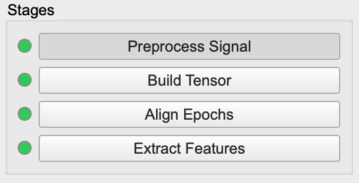

| Control | What it does | What it affects | Availability / blocking rule |
| --- | --- | --- | --- |
| Stage indicators | Show readiness for each stage. | Navigation feedback only. | Read-only. |
| `Preprocess Signal` | Opens the preprocess page. | Active workspace page. | Enabled when the current record is valid for preprocessing. |
| `Build Tensor` | Opens the tensor page. | Active workspace page. | Usually requires a successful preprocess finish. |
| `Align Epochs` | Opens the alignment page. | Active workspace page. | Usually requires tensor outputs and a selected record. |
| `Extract Features` | Opens the feature page. | Active workspace page. | Usually requires finished alignment outputs. |

## 6. Preprocess Signal

The Preprocess page manages record-level signal cleanup and QC views.

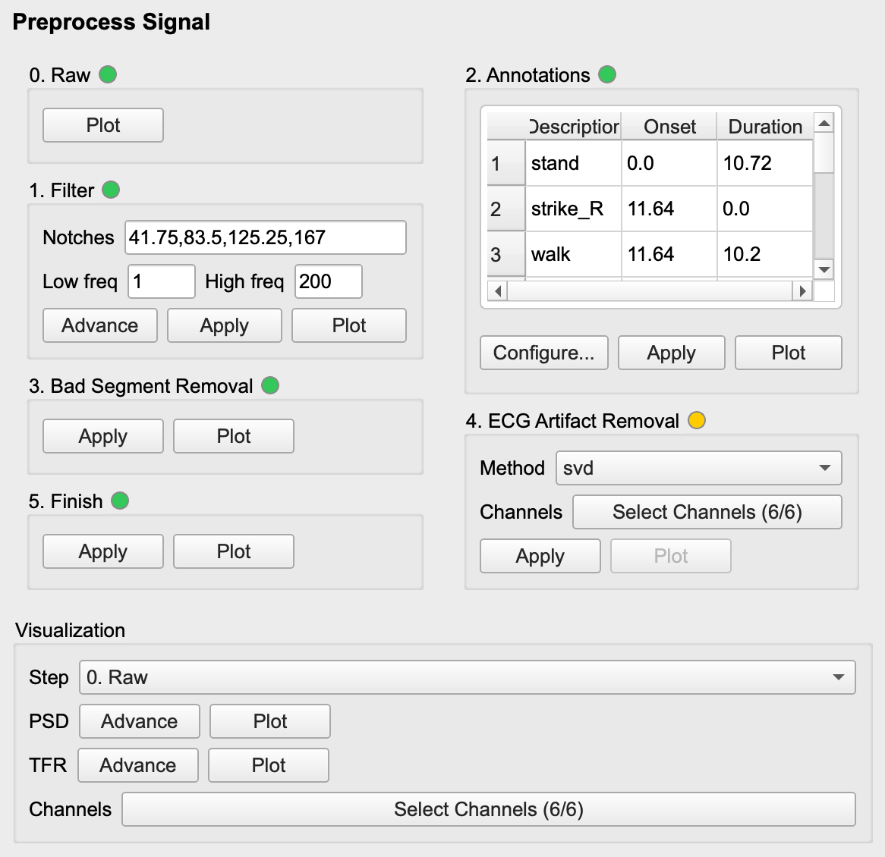

### 6.1 Shared Step Semantics

| Control | What it does | What it affects | Availability / blocking rule |
| --- | --- | --- | --- |
| Step indicators | Show readiness or staleness for each preprocess step. | User feedback only. | Read-only. |
| `Apply` buttons | Execute the corresponding preprocess step. | Step outputs and downstream freshness. | Depend on upstream step state and current parameters. |
| `Plot` buttons | Open a plot for the current step output. | Human QC only. | Require the corresponding step output to exist. |

### 6.2 Raw, Filter, and Annotation Blocks

| Control | What it does | What it affects | Availability / blocking rule |
| --- | --- | --- | --- |
| `Raw` indicator | Reports raw-step readiness. | User feedback only. | Read-only. |
| `Plot` (Raw) | Plots the imported raw signal. | QC only. | Requires raw data. |
| `Notches` | Defines comma-separated notch-center frequencies for filter execution. Use it to suppress narrow contamination bands without changing the broader passband set by `Low freq` and `High freq`. | Filter output. | Used by Filter Apply. |
| `Low freq` | Sets the high-pass cutoff frequency. Raising it removes more slow drift and movement-related low-frequency content, but it can also remove genuine low-frequency neural signal. | Filter output. | Used by Filter Apply. |
| `High freq` | Sets the low-pass cutoff frequency. Lowering it removes more high-frequency noise, but it also narrows the usable signal band for later tensor analysis. | Filter output. | Used by Filter Apply. |
| `Advance` (Filter) | Opens advanced filter parameters. | Filter session/default parameters. | Enabled when raw data is available. |
| `Apply` (Filter) | Runs the filter step. | Filter output and downstream staleness. | Requires valid filter parameters. |
| `Plot` (Filter) | Plots the filter output. | QC only. | Requires successful filter output. |
| Annotation table | Shows the currently configured annotation rows. | Annotation payload. | Read-only except for row selection. |
| `Configure...` (Annotations) | Opens the annotation editor. | Current annotation rows. | Always available. |
| `Apply` (Annotations) | Writes the configured annotations into the preprocess pipeline. | Annotation output used by downstream steps. | Requires a valid annotation set. |
| `Plot` (Annotations) | Plots the annotated signal. | QC only. | Requires successful annotation output. |

### 6.3 Bad Segment, ECG, Finish, and Visualization

| Control | What it does | What it affects | Availability / blocking rule |
| --- | --- | --- | --- |
| `Bad Segment Removal` indicator | Reports bad-segment removal readiness. | User feedback only. | Read-only. |
| `Apply` (Bad Segment Removal) | Removes bad spans and stitches the remaining valid signal. | Cleaned signal for downstream steps. | Requires upstream filter/annotation context. |
| `Plot` (Bad Segment Removal) | Plots bad-segment-removal output. | QC only. | Requires successful bad-segment output. |
| `Method` (ECG) | Chooses the ECG artifact-removal strategy. | ECG step parameters. | Always available. |
| `Channels` (ECG) | Opens the ECG channel selector. | ECG channel subset. | Requires a current record/channel inventory. |
| `Apply` (ECG) | Runs ECG artifact removal. | ECG-cleaned signal. | Requires valid ECG settings. |
| `Plot` (ECG) | Plots ECG-cleaned output. | QC only. | Requires successful ECG output. |
| `Finish` indicator | Reports readiness of the finalized preprocess output. | Downstream stage freshness. | Read-only. |
| `Apply` (Finish) | Writes the finalized preprocess result used by downstream stages. | Tensor, alignment, and feature inputs. | Requires the chosen upstream preprocess chain to be valid. |
| `Plot` (Finish) | Plots the finalized preprocess output. | QC only. | Requires successful finish output. |
| `Step` (Visualization) | Chooses which preprocess output the PSD/TFR QC views should read. | QC plotting source. | Always available once at least one eligible step exists. |
| `Advance` (PSD) | Opens PSD plot settings. | PSD QC session/default settings. | Always available. |
| `Plot` (PSD) | Plots PSD for the selected preprocess step and channels. | QC only. | Requires selected channels and an eligible preprocess step. |
| `Advance` (TFR) | Opens TFR plot settings. | TFR QC session/default settings. | Always available. |
| `Plot` (TFR) | Plots TFR for the selected preprocess step and channels. | QC only. | Requires selected channels and an eligible preprocess step. |
| `Channels` (Visualization) | Chooses channels used by PSD/TFR QC plots. | QC plotting channel subset. | Requires a current channel inventory. |

### 6.4 Filter Advance

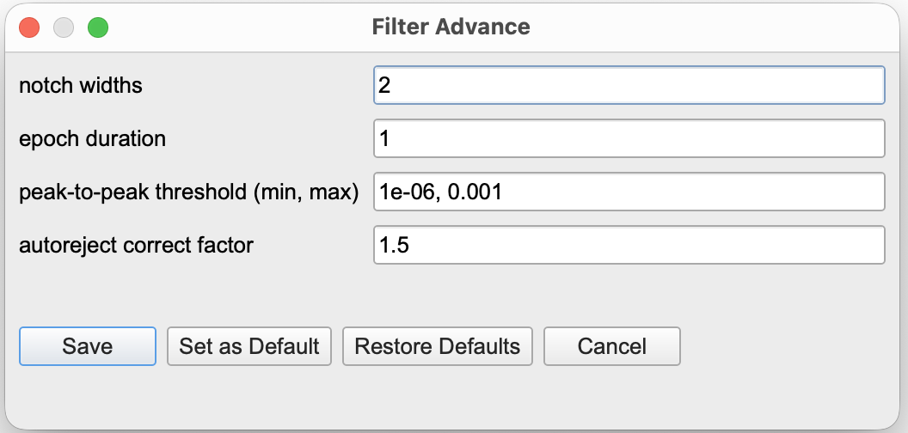

| Control | What it does | What it affects | Availability / blocking rule |
| --- | --- | --- | --- |
| `Notch widths` | Sets the bandwidth used for each configured notch. Wider values remove more contamination around the notch center, but they also suppress more nearby neural signal. | Filter output. | Must parse as valid numeric input. |
| `Epoch duration` | Sets the chunk length used by bad-span detection helpers. Shorter chunks react to brief artifacts, while longer chunks emphasize more sustained contamination patterns. | Filter-related artifact detection behavior. | Must parse as valid numeric input. |
| `Peak-to-peak threshold` | Defines the amplitude range treated as acceptable during bad-span detection. Tighter thresholds flag more segments as artifacts, while wider thresholds are more permissive. | Filter-related artifact detection behavior. | Must parse as `min,max`. |
| `AutoReject correct factor` | Scales the automatically estimated rejection thresholds. Use it when the default AutoReject behavior is systematically too strict or too permissive for the current recording. | Filter-related artifact detection behavior. | Must parse as valid numeric input. |
| `Save` | Saves current advanced values to the session. | Current filter session parameters. | Blocks on invalid values. |
| `Set as Default` | Saves current advanced and basic filter values as defaults. | Future default filter settings. | Blocks on invalid values. |
| `Restore Defaults` | Restores saved default values. | Current dialog fields. | Always available. |
| `Cancel` | Closes the dialog without saving. | No session/default update. | Always available. |

### 6.5 Configure Annotations

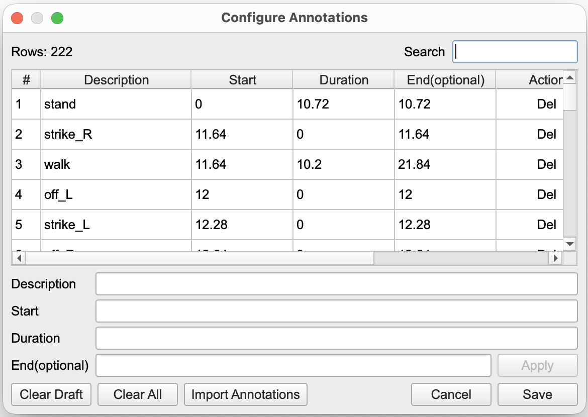

| Control | What it does | What it affects | Availability / blocking rule |
| --- | --- | --- | --- |
| `Search` | Filters configured annotation rows. | Table browsing only. | Always available. |
| Annotation table | Lists the current annotation rows. | Saved annotation payload. | Read-only except for row selection and delete actions. |
| `Description` | Draft label for a new annotation row. | Draft row. | Required for a valid draft. |
| `Start` | Draft onset time in seconds. | Draft row. | Must be numeric. |
| `Duration` | Draft duration in seconds. | Draft row. | Must be numeric. |
| `End` | Optional end time for the draft row. | Draft row. | Optional. |
| `Apply` | Adds the draft row. | Annotation table rows. | Requires a valid draft. |
| `Clear Draft` | Clears the current draft row. | Draft fields only. | Always available. |
| `Clear All` | Removes all configured annotation rows. | Annotation table rows. | Always available. |
| `Import Annotations` | Imports annotation rows from a CSV file. | Annotation table rows. | Requires a valid CSV file. |
| `Save` | Saves the current annotation list back to Preprocess. | Annotation payload. | Blocks on invalid rows. |
| `Cancel` | Closes the dialog without saving. | No annotation update. | Always available. |

### 6.6 ECG Method Selector

The screenshot below shows the method dropdown used by the ECG block.

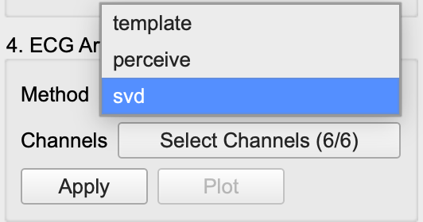

| Control | What it does | What it affects | Availability / blocking rule |
| --- | --- | --- | --- |
| `Method` | Chooses the ECG artifact-removal algorithm. | ECG step execution parameters and the method-specific runtime defaults written into the ECG step config. | Always available. |

The current GUI exposes three ECG-suppression methods:

- `template`: builds a heartbeat-locked ECG template and subtracts that template
  from the signal. It is intuitive and widely used, but can become more
  sensitive when the ECG artifact shape varies over time.
- `perceive`: follows the Perceive-toolbox style QRS interpolation approach,
  replacing contamination around detected heartbeats by interpolation-based
  suppression. It is useful when you want a method that works directly around
  heartbeat windows rather than fitting a reusable artifact template.
- `svd`: uses singular value decomposition on heartbeat-aligned segments to
  isolate dominant ECG components before reconstructing a cleaned signal. It is
  usually more flexible than the other two approaches, but its performance
  depends more strongly on the chosen parameters.

The current GUI default is `svd`, which matches the code path in the ECG step.
That default is a software default only, not a universal recommendation for all
recordings.

Further reading:

- Stam MJ, van Wijk BCM, Sharma P, et al. *A comparison of methods to suppress
  electrocardiographic artifacts in local field potential recordings*.
  *Clinical Neurophysiology*. 2023;146:147-161.
  DOI: [10.1016/j.clinph.2022.11.011](https://doi.org/10.1016/j.clinph.2022.11.011)
- This paper compared Perceive QRS interpolation, template subtraction, and
  SVD for DBS-LFP ECG suppression, and concluded that SVD offered the preferred
  trade-off between artifact cleaning and signal preservation when tuned
  appropriately.
- Use that conclusion as method-selection context rather than as a hard rule;
  the best choice still depends on the artifact shape and how much neural signal
  preservation matters for the current recording.

### 6.7 PSD Advance

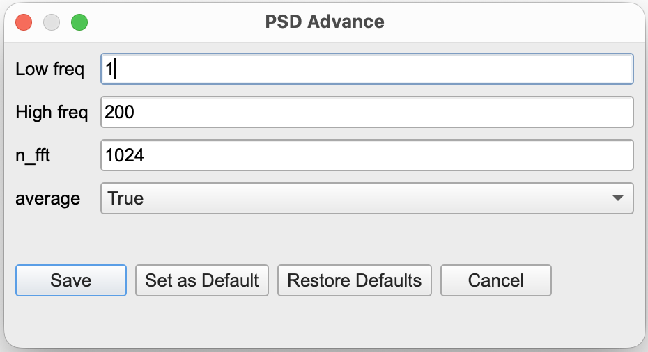

| Control | What it does | What it affects | Availability / blocking rule |
| --- | --- | --- | --- |
| `Low freq` | Sets the lower frequency bound shown in the PSD figure. It changes the QC view only and does not modify stored preprocess outputs. | PSD QC output. | Must be numeric. |
| `High freq` | Sets the upper frequency bound shown in the PSD figure. Keep it within the range that remains meaningful for the current sampling rate and preprocessing. | PSD QC output. | Must be numeric. |
| `n_fft` | Sets the FFT length used for PSD estimation. Larger values produce denser frequency sampling, but they also require longer effective data segments and increase runtime. | PSD QC behavior only. | PSD dialog only. |
| `Average` | Chooses whether PSD is averaged across the selected channels before plotting. Turn it off when you need to compare channels individually rather than as one summary trace. | PSD QC behavior only. | PSD dialog only. |
| `Save` | Saves the current PSD QC settings to the session. | Current PSD session parameters. | Blocks on invalid values. |
| `Set as Default` | Saves the current PSD QC settings as future defaults. | Future PSD defaults. | Blocks on invalid values. |
| `Restore Defaults` | Restores the saved PSD defaults. | Current dialog fields. | Always available. |
| `Cancel` | Closes the dialog without saving. | No session/default update. | Always available. |

**Notes**

- `Low freq` and `High freq` only crop the PSD figure. They do not retroactively change the preprocess output.
- `n_fft` mainly controls spectral sampling density. It is not a substitute for changing the actual filter or tensor frequency range.

### 6.8 TFR Advance

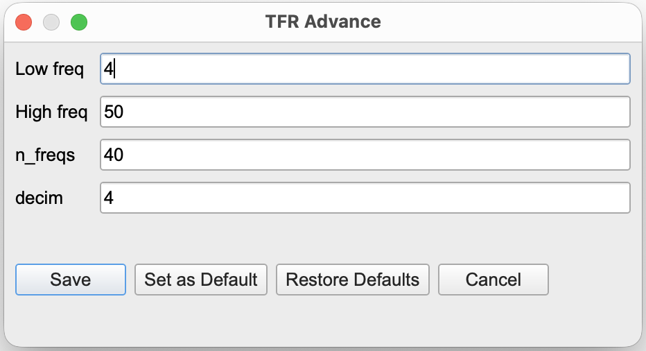

| Control | What it does | What it affects | Availability / blocking rule |
| --- | --- | --- | --- |
| `Low freq` | Sets the lower frequency bound shown in the TFR figure. It limits what is plotted, not what was stored in preprocess. | TFR QC output. | Must be numeric. |
| `High freq` | Sets the upper frequency bound shown in the TFR figure. Keep it within the range supported by the current preprocessing and sampling rate. | TFR QC output. | Must be numeric. |
| `n_freqs` | Sets how many frequency samples are drawn between `Low freq` and `High freq`. More samples create a denser frequency axis, but also increase runtime and memory use. | TFR QC behavior only. | TFR dialog only. |
| `Decim` | Sets the downsampling factor applied to the TFR time axis. Higher decimation speeds up plotting and reduces figure size, but it also makes short-lived structure harder to see. | TFR QC behavior only. | TFR dialog only. |
| `Save` | Saves the current TFR QC settings to the session. | Current TFR session parameters. | Blocks on invalid values. |
| `Set as Default` | Saves the current TFR QC settings as future defaults. | Future TFR defaults. | Blocks on invalid values. |
| `Restore Defaults` | Restores the saved TFR defaults. | Current dialog fields. | Always available. |
| `Cancel` | Closes the dialog without saving. | No session/default update. | Always available. |

**Notes**

- `n_freqs` controls frequency-grid density, while `Decim` controls time-axis density. They solve different plotting problems.
- A heavily decimated TFR is useful for quick QC, but it can hide brief events that are still present in the underlying preprocess output.

### 6.9 Visualization Channels

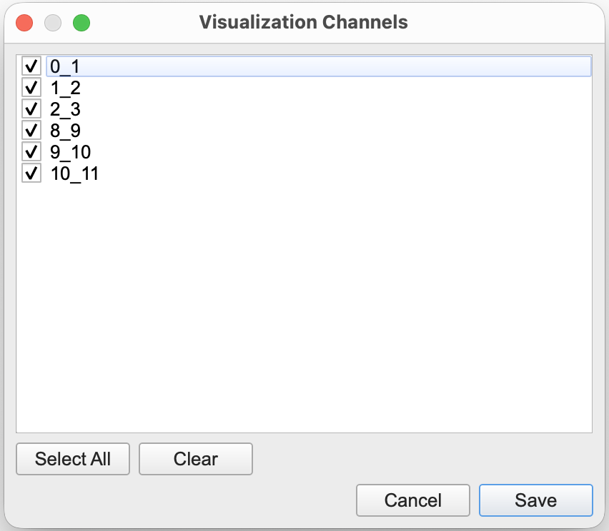

| Control | What it does | What it affects | Availability / blocking rule |
| --- | --- | --- | --- |
| Channel list | Chooses which channels are used by PSD/TFR QC plots. | QC plotting channel subset. | Requires a channel inventory. |
| `Select All` | Selects every available channel. | Current channel subset. | Always available. |
| `Clear` | Clears the current selection. | Current channel subset. | Always available. |
| `Save` | Saves the selected channel subset back to Preprocess. | Visualization channel payload. | Requires at least the app's accepted selection state. |
| `Cancel` | Closes the dialog without saving. | No channel-subset update. | Always available. |

## 7. Build Tensor

The Build Tensor page manages metric selection, metric-local parameter editing,
and the execution of tensor generation.

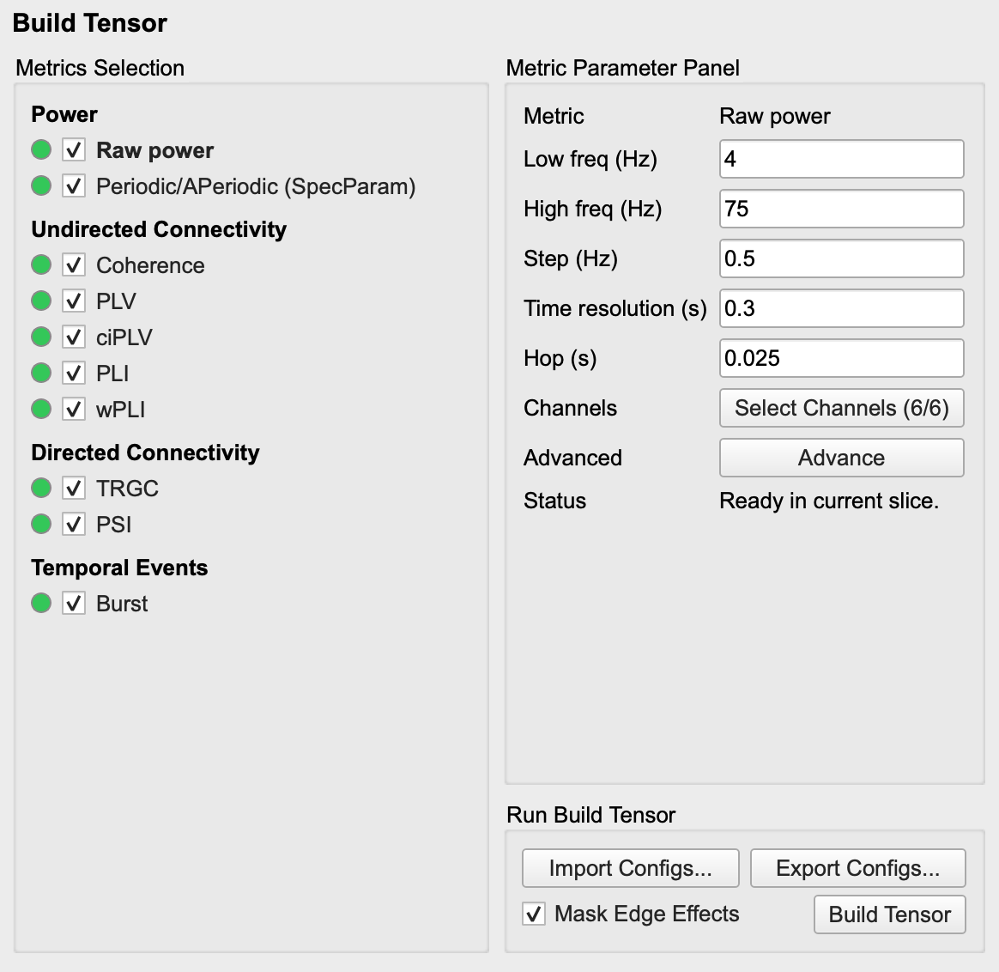

### 7.1 Metrics Selection

| Control | What it does | What it affects | Availability / blocking rule |
| --- | --- | --- | --- |
| Metric indicators | Show readiness for each metric under the current settings. | User feedback only. | Read-only. |
| Metric checkbox | Includes or excludes the metric from the next tensor build run. | Run payload. | Always available for supported metrics. |
| Metric name | Selects the active metric shown in the parameter panel. | Which metric is being configured on the right. | Always available for listed metrics. |

### 7.2 Metric Parameter Panel and Run Block

| Control | What it does | What it affects | Availability / blocking rule |
| --- | --- | --- | --- |
| `Low freq` | Sets the lower bound of the frequency grid that will actually be computed for the active metric. It should stay inside the valid post-preprocess range, rather than being treated as a display-only crop. | Active metric configuration. | Shown only for metrics that expose it. |
| `High freq` | Sets the upper bound of the frequency grid that will actually be computed for the active metric. It cannot exceed the effective preprocess ceiling or the current Nyquist limit. | Active metric configuration. | Shown only for metrics that expose it. |
| `Step` | Sets the spacing between adjacent sampled frequencies. Smaller steps create a denser frequency grid, but they also increase runtime and output size. | Active metric configuration. | Shown only for metrics that expose it. |
| `Time resolution` | Sets the window duration used to estimate time-varying spectra or connectivity. Longer windows usually stabilize low-frequency estimates, while shorter windows preserve faster temporal changes. | Active metric configuration. | Shown only for metrics that expose it. |
| `Hop` | Sets the shift between adjacent analysis windows. Smaller hops make the time axis denser and smoother, but they also increase overlap and compute cost. | Active metric configuration. | Shown only for metrics that expose it. |
| `SpecParam freq range` | Sets the fitting range used by the SpecParam model, not the final display or export range. In practice, it is usually safer to keep this range slightly wider than the final `Low freq` and `High freq` bounds, allowing boundary frequencies to be trimmed using the final `Low freq` and `High freq` bounds because they are often not modeled reliably as oscillatory peaks. | Visible for periodic/aperiodic metrics. |
| `Percentile` | Sets the percentile used to convert the burst baseline into a burst-detection threshold. Higher percentiles make burst calls more conservative, while lower percentiles admit more candidate bursts. | Burst metric configuration. | Visible for burst metrics. |
| `Bands Configure...` | Opens the named-band editor used by metrics that summarize results over frequency bands. Those named bands become part of the metric-specific aggregation or feature definition. | Active metric axis configuration. | Visible only for metrics that expose bands. |
| `Select Channels` | Opens the active metric's channel selector. Use it to limit computation to the channels that matter for that metric instead of computing every available channel. | Active metric channel subset. | Visible for channel-based metrics. |
| `Select Pairs` | Opens the active metric's pair selector. Use it when the metric is defined on channel pairs rather than on single channels. | Active metric pair subset. | Visible for pair-based metrics. |
| `Advance` | Opens the advanced dialog for the active metric. This is where method-specific controls such as cycles, multitaper settings, smoothing, or connectivity-specific options are configured. | Active metric advanced settings. | Disabled for unsupported metrics. |
| `Status` | Reports the active metric state within the current slice. | User feedback only. | Read-only. |
| `Import Configs...` | Loads a tensor configuration payload. | Current page configuration. | Requires a selected record. |
| `Export Configs...` | Saves the current tensor configuration payload. | External tensor config file. | Requires a selected record. |
| `Mask Edge Effects` | Masks samples near the temporal edges where the analysis window or wavelet does not have full support. It protects downstream plots and summaries from edge artifacts, but it does not change the valid central region or the requested frequency range. | Runtime build behavior. | Always available. |
| `Build Tensor` | Runs tensor generation for all checked metrics. | Tensor outputs for the current record. | Requires preprocess finish outputs and valid metric settings. |

**Parameter meaning**

- `Low freq`, `High freq`, and `Step` define the frequency grid.
- `Time resolution` and `Hop` define the time grid.
- `SpecParam freq range` is the fit envelope for periodic/aperiodic modeling, not a second copy of the final output bounds.
- `Mask Edge Effects` is edge masking, not frequency cropping.

### 7.3 Periodic/Aperiodic Basic Panel Variant

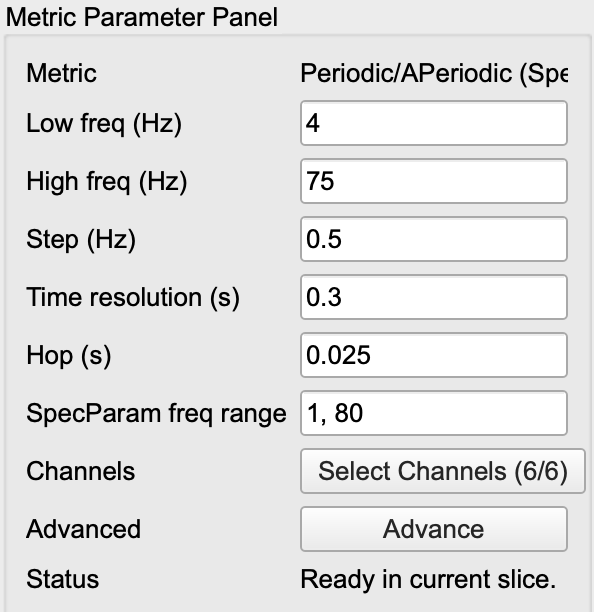

This panel uses the shared tensor controls from the main page and adds the
periodic/aperiodic-specific fit range.

| Control | What it does | What it affects | Availability / blocking rule |
| --- | --- | --- | --- |
| `SpecParam freq range` | Sets the frequency span handed to SpecParam for fitting. It is usually best treated as a slightly wider fitting envelope around the final analysis band, rather than as a duplicate of `Low freq` and `High freq`. | Periodic/aperiodic metric configuration. | Visible only for periodic/aperiodic metrics. |

### 7.4 PSI Basic Panel Variant

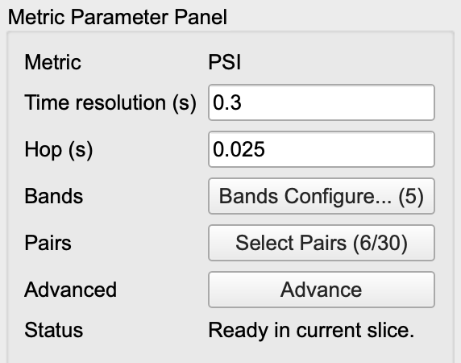

This panel reuses the shared tensor grid controls but emphasizes pair-based
configuration instead of single-channel configuration.

| Control | What it does | What it affects | Availability / blocking rule |
| --- | --- | --- | --- |
| `Select Pairs` | Opens the pair editor used to choose which directed channel pairs will be evaluated by PSI. The chosen pair list limits both runtime and the shape of the resulting tensor output. | PSI pair subset. | Visible only for pair-based metrics such as PSI. |

### 7.5 Burst Basic Panel Variant

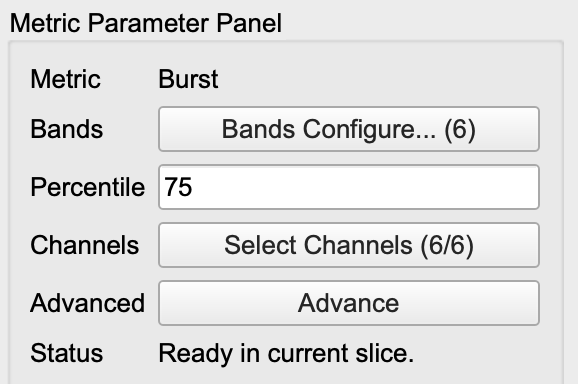

This panel shows the burst-specific controls that sit on top of the shared
tensor frequency and time grid.

| Control | What it does | What it affects | Availability / blocking rule |
| --- | --- | --- | --- |
| `Percentile` | Sets how high the burst threshold sits relative to the baseline distribution. Higher values usually mark only stronger events as bursts. | Burst threshold conservativeness. | Visible only for burst metrics. |
| `Bands Configure...` | Opens the burst-band editor used to define named frequency bands for burst summaries. Those bands determine where burst values are aggregated. | Burst band definitions. | Visible only for burst metrics that expose named bands. |

### 7.6 Tensor Channels

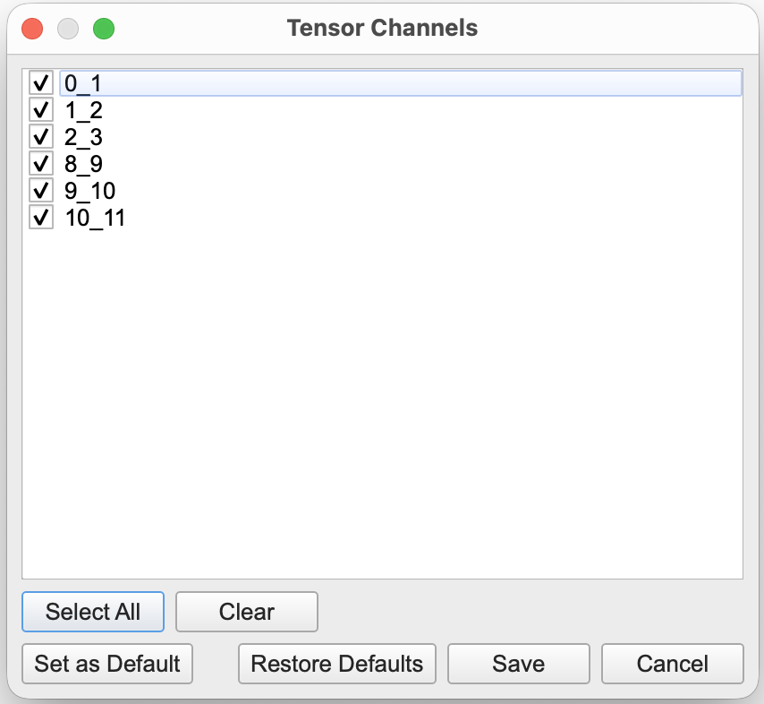

| Control | What it does | What it affects | Availability / blocking rule |
| --- | --- | --- | --- |
| Channel list | Chooses channels for the active metric. | Active metric channel subset. | Requires a channel inventory. |
| `Select All` | Selects every channel. | Current channel subset. | Always available. |
| `Clear` | Clears the current selection. | Current channel subset. | Always available. |
| `Set as Default` | Saves the current channel subset as the default for this control. | Future defaults. | Always available. |
| `Restore Defaults` | Restores the saved default subset. | Current dialog state. | Always available. |
| `Save` | Saves the selected subset back to Build Tensor. | Active metric channel selection. | Requires an accepted selection state. |
| `Cancel` | Closes the dialog without saving. | No channel-subset update. | Always available. |

### 7.7 Raw Power Advance

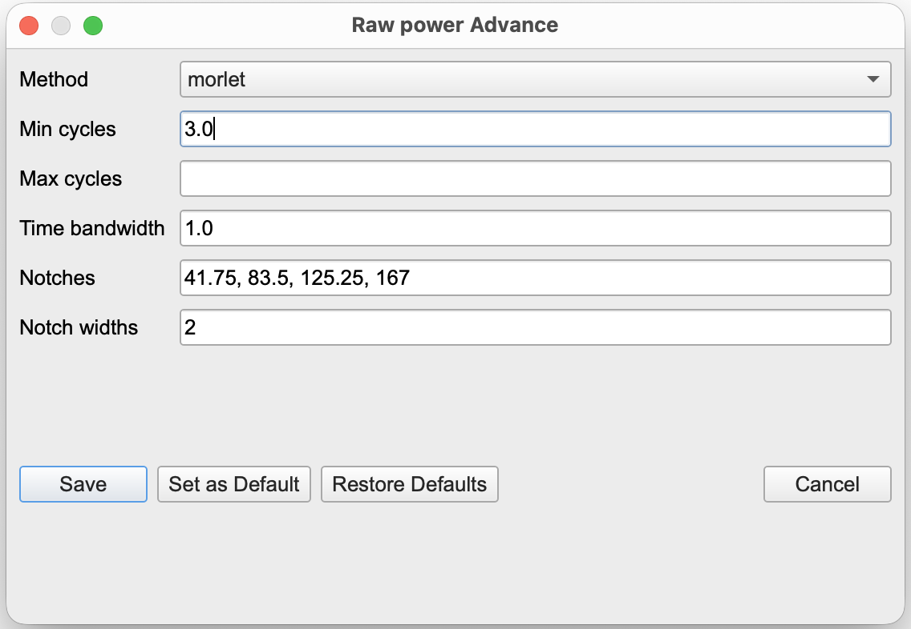

| Control | What it does | What it affects | Availability / blocking rule |
| --- | --- | --- | --- |
| `Method` | Chooses the spectral backend for raw power, typically `morlet` or `multitaper`. This choice determines how time-frequency power is estimated before any downstream use. | Raw-power runtime method. | Always available in this dialog. |
| `Min cycles` | Sets the minimum number of oscillatory cycles used by the spectral estimator. Lower values improve time localization but blur frequency resolution; higher values do the opposite. | Raw-power time/frequency trade-off. | Always available in this dialog. |
| `Max cycles` | Sets an optional upper bound on cycle count when the method supports varying cycles by frequency. Use it to stop high frequencies from becoming overly smoothed in time. | Raw-power time/frequency trade-off. | Optional. |
| `Time bandwidth` | Sets the multitaper time-bandwidth product. Higher values usually stabilize spectra and reduce variance, but they also widen spectral smoothing. | Multitaper behavior. | Relevant when the chosen method uses multitaper. |
| `Notches` | Adds metric-local notch exclusions on top of any preprocess filtering. Use this when a metric still needs narrowband suppression that should not be baked into preprocess globally. | Metric-local runtime filtering. | Supported tensor metrics only. |
| `Notch widths` | Sets the bandwidth for each metric-local notch. Wider values suppress more surrounding energy but can also remove nearby neural content. | Metric-local runtime filtering. | Supported tensor metrics only. |
| `Save` | Saves the dialog values to the current session. | Current raw-power advanced settings. | Blocks on invalid values. |
| `Set as Default` | Saves the current advanced settings as defaults. | Future raw-power defaults. | Blocks on invalid values. |
| `Restore Defaults` | Restores saved defaults. | Current dialog values. | Always available. |
| `Cancel` | Closes the dialog without saving. | No advanced update. | Always available. |

**Notes**

- `Method`, `Min cycles`, `Max cycles`, and `Time bandwidth` jointly control the time-versus-frequency resolution trade-off.
- `Notches` here are metric-local. They do not rewrite the finished preprocess signal.

### 7.8 Periodic/Aperiodic Advance

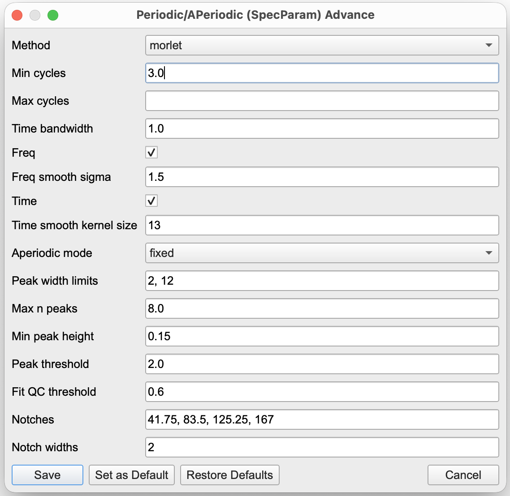

| Control | What it does | What it affects | Availability / blocking rule |
| --- | --- | --- | --- |
| `Method` | Chooses the spectral backend used to generate the input spectrum before SpecParam fitting. This choice changes the stability and smoothness of the spectrum that the periodic/aperiodic model sees. | Periodic/aperiodic runtime method. | Always available in this dialog. |
| `Min cycles` | Sets the minimum cycles used by the spectral estimator. Fewer cycles improve temporal responsiveness, while more cycles usually stabilize spectral peaks. | Spectral estimation trade-off. | Always available in this dialog. |
| `Max cycles` | Sets an optional ceiling on cycle count for methods that vary cycles by frequency. Use it when you want to limit oversmoothing at higher frequencies. | Spectral estimation trade-off. | Optional. |
| `Time bandwidth` | Sets the multitaper time-bandwidth product. Higher values usually make the spectrum smoother and more stable, but they also reduce spectral sharpness. | Multitaper behavior. | Relevant when the chosen method uses multitaper. |
| `Freq` | Enables pre-fit smoothing across the frequency axis. Use it when the input spectrum is too ragged for stable decomposition. | Pre-fit frequency smoothing. | Periodic/aperiodic dialog only. |
| `Freq smooth sigma` | Sets the Gaussian sigma used when frequency smoothing is enabled. Larger values suppress fine ripples more aggressively, which can stabilize fits but also blur narrow peaks. | Pre-fit frequency smoothing strength. | Requires `Freq` smoothing to be enabled. |
| `Time` | Enables pre-fit smoothing across time. This can stabilize frame-to-frame fits when the signal is noisy, but it also reduces sensitivity to brief spectral changes. | Pre-fit temporal smoothing. | Periodic/aperiodic dialog only. |
| `Time smooth kernel size` | Sets the temporal kernel size used when time smoothing is enabled. Larger kernels produce steadier fits across time, but they can hide brief transitions. | Pre-fit temporal smoothing strength. | Requires `Time` smoothing to be enabled. |
| `Aperiodic mode` | Chooses whether the aperiodic background is fit with a simple fixed slope or with a knee term. Use `knee` only when you expect meaningful low-frequency curvature rather than a simple 1/f-like slope. | Aperiodic model form. | Periodic/aperiodic dialog only. |
| `Peak width limits` | Sets the allowed fitted peak-width range in Hz. Keep this range compatible with the oscillation widths you expect, or the model may accept peaks that are too broad or reject peaks that are too narrow. | Peak-fitting constraints. | Periodic/aperiodic dialog only. |
| `Max n peaks` | Sets the maximum number of oscillatory peaks the model is allowed to fit. Lower values force simpler fits; higher values allow more complexity but increase the chance of fitting noise. | Peak-fitting complexity. | Periodic/aperiodic dialog only. |
| `Min peak height` | Sets the minimum peak height required for a component to be kept as a peak. Raising it makes peak detection more conservative. | Peak acceptance threshold. | Periodic/aperiodic dialog only. |
| `Peak threshold` | Sets the peak-detection threshold used during fitting. Lower thresholds admit smaller peaks, while higher thresholds suppress weak candidates. | Peak-detection sensitivity. | Periodic/aperiodic dialog only. |
| `Fit QC threshold` | Sets the minimum quality score required to keep a decomposition result. Higher thresholds discard more uncertain fits and therefore trade coverage for reliability. | Output retention after fitting. | Periodic/aperiodic dialog only. |
| `Notches` | Adds metric-local notch exclusions before fitting. Use this when you need to suppress narrow contamination for this metric without changing preprocess globally. | Metric-local runtime filtering. | Supported tensor metrics only. |
| `Notch widths` | Sets the bandwidth for each metric-local notch. Wider widths remove more surrounding energy but can also trim nearby neural signal. | Metric-local runtime filtering. | Supported tensor metrics only. |
| `Save` | Saves the dialog values to the current session. | Current periodic/aperiodic advanced settings. | Blocks on invalid values. |
| `Set as Default` | Saves the current advanced settings as defaults. | Future periodic/aperiodic defaults. | Blocks on invalid values. |
| `Restore Defaults` | Restores saved defaults. | Current dialog values. | Always available. |
| `Cancel` | Closes the dialog without saving. | No advanced update. | Always available. |

**Notes**

- `Method`, cycle settings, and `Time bandwidth` shape the spectrum before any SpecParam fitting begins.
- `Freq smooth sigma` and `Time smooth kernel size` only matter if their corresponding smoothing checkbox is enabled.
- `Fit QC threshold` is a retention rule after fitting, not a way to improve the fit itself.

### 7.9 PLV Advance

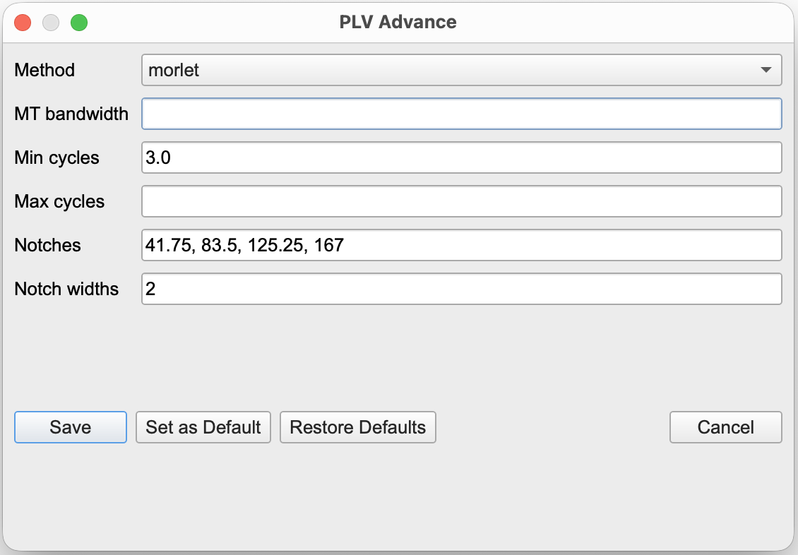

| Control | What it does | What it affects | Availability / blocking rule |
| --- | --- | --- | --- |
| `Method` | Chooses the spectral backend used to estimate the phase representation before PLV is computed. | PLV runtime method. | Always available in this dialog. |
| `MT bandwidth` | Sets the multitaper bandwidth when the multitaper backend is used. Higher values stabilize estimates but reduce spectral sharpness. | Multitaper behavior. | Relevant when the chosen method uses multitaper. |
| `Min cycles` | Sets the minimum wavelet cycles used for PLV estimation. Lower values emphasize temporal precision; higher values emphasize frequency precision. | PLV time/frequency trade-off. | Always available in this dialog. |
| `Max cycles` | Sets an optional ceiling on cycle count. Use it to limit oversmoothing at higher frequencies. | PLV time/frequency trade-off. | Optional. |
| `Notches` | Adds metric-local notch exclusions before PLV is computed. | Metric-local runtime filtering. | Supported tensor metrics only. |
| `Notch widths` | Sets the bandwidth for each metric-local notch. | Metric-local runtime filtering. | Supported tensor metrics only. |
| `Save` | Saves the dialog values to the current session. | Current PLV advanced settings. | Blocks on invalid values. |
| `Set as Default` | Saves the current advanced settings as defaults. | Future PLV defaults. | Blocks on invalid values. |
| `Restore Defaults` | Restores saved defaults. | Current dialog values. | Always available. |
| `Cancel` | Closes the dialog without saving. | No advanced update. | Always available. |

### 7.10 TRGC Advance

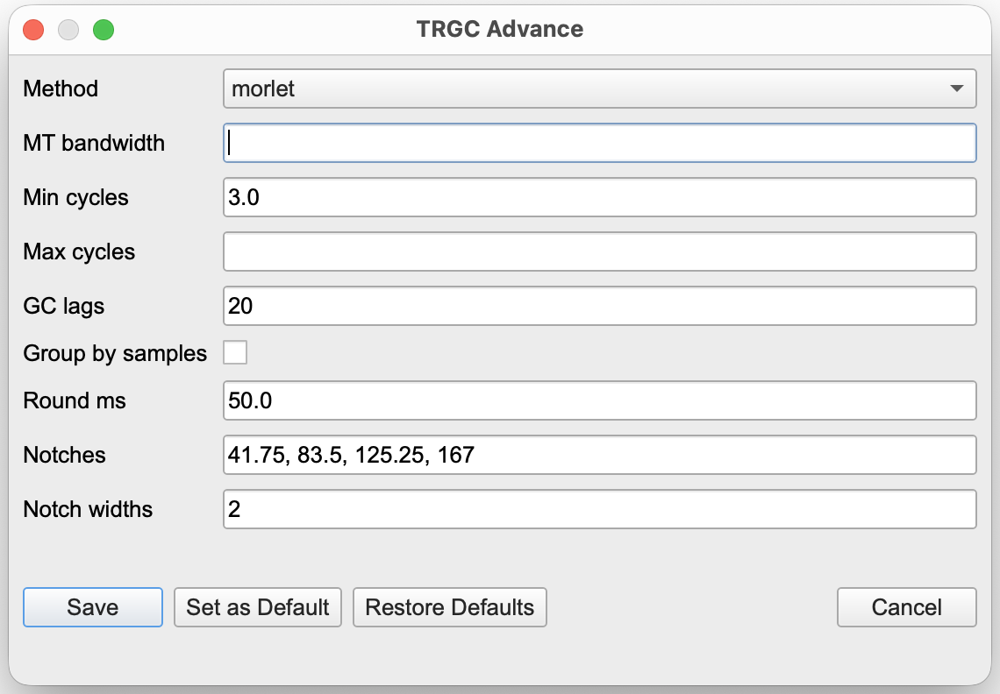

| Control | What it does | What it affects | Availability / blocking rule |
| --- | --- | --- | --- |
| `Method` | Chooses the spectral backend used before TRGC estimation. | TRGC runtime method. | Always available in this dialog. |
| `MT bandwidth` | Sets the multitaper bandwidth when multitaper is used. Higher values smooth more strongly and reduce variance, but they also widen spectral estimates. | Multitaper behavior. | Relevant when the chosen method uses multitaper. |
| `Min cycles` | Sets the minimum cycles used by the spectral estimator. Lower values improve temporal precision; higher values improve spectral stability. | TRGC time/frequency trade-off. | Always available in this dialog. |
| `Max cycles` | Sets an optional ceiling on cycle count. | TRGC time/frequency trade-off. | Optional. |
| `GC lags` | Sets how many past samples are used in the autoregressive part of the TRGC model. More lags can model slower interactions, but they also increase model complexity and data requirements. | TRGC model order. | TRGC dialog only. |
| `Group by samples` | Groups TRGC frequencies by exact window length in samples instead of by a rounded millisecond grid. Use it when you need grouping tied tightly to the recording sample rate. | TRGC grouping strategy. | TRGC dialog only. |
| `Round ms` | Sets the millisecond grid used to group TRGC window lengths when `Group by samples` is off. Smaller values preserve finer distinctions but can create more groups and noisier summaries. | TRGC grouping strategy. | TRGC dialog only; disabled when `Group by samples` is enabled. |
| `Notches` | Adds metric-local notch exclusions before TRGC is computed. | Metric-local runtime filtering. | Supported tensor metrics only. |
| `Notch widths` | Sets the bandwidth for each metric-local notch. | Metric-local runtime filtering. | Supported tensor metrics only. |
| `Save` | Saves the dialog values to the current session. | Current TRGC advanced settings. | Blocks on invalid values. |
| `Set as Default` | Saves the current advanced settings as defaults. | Future TRGC defaults. | Blocks on invalid values. |
| `Restore Defaults` | Restores saved defaults. | Current dialog values. | Always available. |
| `Cancel` | Closes the dialog without saving. | No advanced update. | Always available. |

**Notes**

- `GC lags` changes model order, not the plotted frequency range.
- `Group by samples` and `Round ms` are alternative grouping strategies. When grouping by exact samples is enabled, the rounded-millisecond grid no longer drives grouping.

### 7.11 PSI Advance

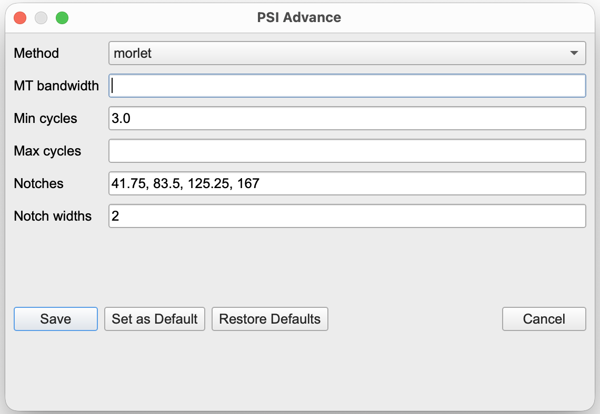

| Control | What it does | What it affects | Availability / blocking rule |
| --- | --- | --- | --- |
| `Method` | Chooses the spectral backend used before PSI is computed. | PSI runtime method. | Always available in this dialog. |
| `MT bandwidth` | Sets the multitaper bandwidth when multitaper is used. Higher values usually increase stability at the cost of spectral sharpness. | Multitaper behavior. | Relevant when the chosen method uses multitaper. |
| `Min cycles` | Sets the minimum cycles used by the spectral estimator. Lower values respond faster in time; higher values stabilize frequency estimates. | PSI time/frequency trade-off. | Always available in this dialog. |
| `Max cycles` | Sets an optional ceiling on cycle count. | PSI time/frequency trade-off. | Optional. |
| `Notches` | Adds metric-local notch exclusions before PSI is computed. | Metric-local runtime filtering. | Supported tensor metrics only. |
| `Notch widths` | Sets the bandwidth for each metric-local notch. | Metric-local runtime filtering. | Supported tensor metrics only. |
| `Save` | Saves the dialog values to the current session. | Current PSI advanced settings. | Blocks on invalid values. |
| `Set as Default` | Saves the current advanced settings as defaults. | Future PSI defaults. | Blocks on invalid values. |
| `Restore Defaults` | Restores saved defaults. | Current dialog values. | Always available. |
| `Cancel` | Closes the dialog without saving. | No advanced update. | Always available. |

### 7.12 Burst Advance

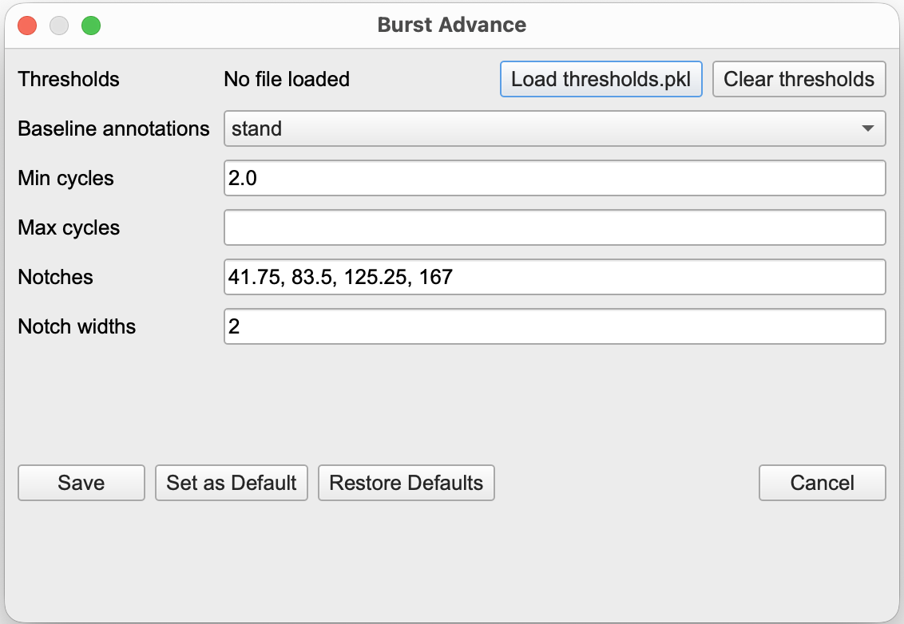

| Control | What it does | What it affects | Availability / blocking rule |
| --- | --- | --- | --- |
| `Thresholds` label | Shows whether a precomputed thresholds file is currently loaded. Use it to verify whether burst thresholds are coming from an external file or from the current session configuration. | Burst threshold source context. | Burst dialog only. |
| `Load thresholds.pkl` | Loads precomputed burst thresholds from a pickle file. This is useful when you want to reuse a threshold definition instead of deriving it again in the current session. | Burst threshold source context. | Burst dialog only. |
| `Clear thresholds` | Removes the loaded thresholds file and returns threshold handling to the remaining burst settings. | Burst threshold source context. | Burst dialog only. |
| `Baseline annotations` | Chooses which finished annotation label should define the baseline segments used for burst thresholding. Pick a label that represents the reference state you want burst thresholds to reflect. | Burst threshold derivation. | Burst dialog only. |
| `Min cycles` | Sets the minimum cycles used for burst detection. Lower values allow shorter events to qualify; higher values demand more sustained oscillatory content. | Burst duration sensitivity. | Burst dialog only. |
| `Max cycles` | Sets an optional ceiling on burst cycle count. Use it when you want to stop very long cycle assumptions from oversmoothing burst detection. | Burst duration sensitivity. | Burst dialog only. |
| `Notches` | Adds metric-local notch exclusions before burst detection is computed. | Metric-local runtime filtering. | Supported tensor metrics only. |
| `Notch widths` | Sets the bandwidth for each metric-local notch. | Metric-local runtime filtering. | Supported tensor metrics only. |
| `Save` | Saves the dialog values to the current session. | Current burst advanced settings. | Blocks on invalid values. |
| `Set as Default` | Saves the current advanced settings as defaults. | Future burst defaults. | Blocks on invalid values. |
| `Restore Defaults` | Restores saved defaults. | Current dialog values. | Always available. |
| `Cancel` | Closes the dialog without saving. | No advanced update. | Always available. |

**Notes**

- A loaded thresholds file can replace threshold estimation work that would otherwise happen inside the current session.
- `Baseline annotations` determines which labeled baseline periods define the burst threshold context when thresholds are derived from data rather than loaded from file.

### 7.13 Undirected Tensor Pairs

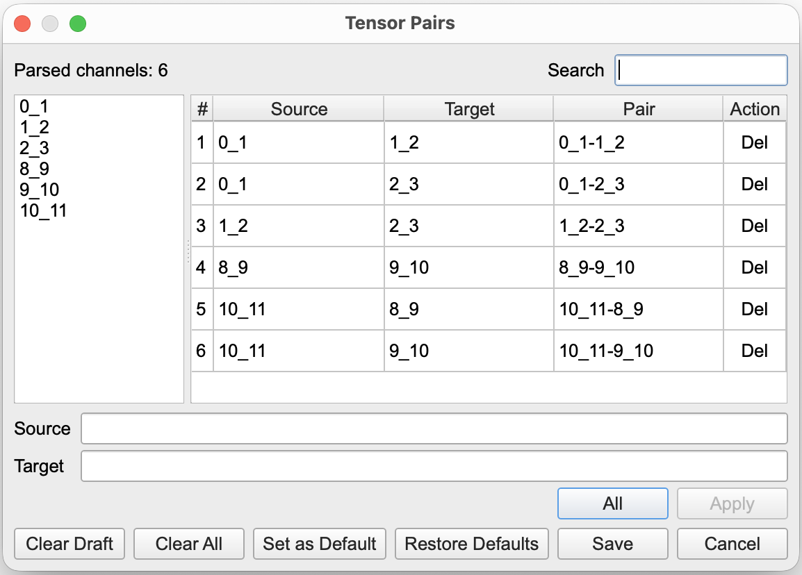

| Control | What it does | What it affects | Availability / blocking rule |
| --- | --- | --- | --- |
| `Search` | Filters the available channels and configured pairs. | Dialog browsing only. | Always available. |
| Channel list | Provides channels used to draft new pairs. | Pair draft source/target. | Requires a channel inventory. |
| Pair table | Lists the currently configured pairs. | Active metric pair subset. | Read-only except for row selection and delete actions. |
| `Source` | Draft source channel. | Pair draft. | Required for a valid draft. |
| `Target` | Draft target channel. | Pair draft. | Required for a valid draft. |
| Draft pair preview | Shows the normalized undirected pair name. It helps confirm whether the pair you are adding is already represented in the opposite order. | Human validation only. | Read-only. |
| `All` | Adds every valid undirected pair from the available channel list. | Pair table rows. | Requires available channels. |
| `Apply` | Adds the current draft pair. | Pair table rows. | Requires a valid draft. |
| `Clear Draft` | Clears the current draft pair. | Draft fields only. | Always available. |
| `Clear All` | Removes all configured pairs. | Pair table rows. | Always available. |
| `Set as Default` | Saves the current pair list as the default. | Future default pair sets. | Always available. |
| `Restore Defaults` | Restores the saved default pair list. | Current pair table. | Always available. |
| `Save` | Saves the selected pairs back to Build Tensor. | Active metric pair subset. | Requires an accepted pair set. |
| `Cancel` | Closes the dialog without saving. | No pair update. | Always available. |

**Notes**

- This editor is for undirected metrics, so the pair is interpreted without directionality.
- The preview is mainly a guard against adding the same undirected relation twice in reversed order.

### 7.14 Directed Tensor Pairs

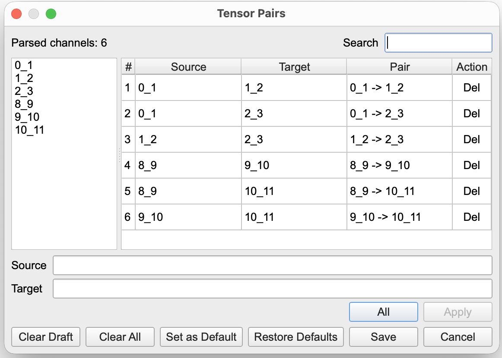

| Control | What it does | What it affects | Availability / blocking rule |
| --- | --- | --- | --- |
| `Search` | Filters the available channels and configured pairs. | Dialog browsing only. | Always available. |
| Channel list | Provides channels used to draft new pairs. | Pair draft source/target. | Requires a channel inventory. |
| Pair table | Lists the currently configured directed pairs. | Active metric pair subset. | Read-only except for row selection and delete actions. |
| `Source` | Draft source channel. In directed metrics this is the first endpoint in the ordered pair. | Pair draft. | Required for a valid draft. |
| `Target` | Draft target channel. In directed metrics reversing source and target creates a different pair. | Pair draft. | Required for a valid draft. |
| Draft pair preview | Shows the ordered pair name before saving. | Human validation only. | Read-only. |
| `All` | Adds all valid directed pairs from the available channel list. | Pair table rows. | Requires available channels. |
| `Apply` | Adds the current draft pair. | Pair table rows. | Requires a valid draft. |
| `Clear Draft` | Clears the current draft pair. | Draft fields only. | Always available. |
| `Clear All` | Removes all configured pairs. | Pair table rows. | Always available. |
| `Set as Default` | Saves the current pair list as the default. | Future default pair sets. | Always available. |
| `Restore Defaults` | Restores the saved default pair list. | Current pair table. | Always available. |
| `Save` | Saves the selected pairs back to Build Tensor. | Active metric pair subset. | Requires an accepted pair set. |
| `Cancel` | Closes the dialog without saving. | No pair update. | Always available. |

**Notes**

- This editor is for directed metrics, so `A -> B` and `B -> A` are different payloads.
- Use the ordered preview to confirm the exact direction that will be computed.

## 8. Align Epochs

The Align page manages trial definitions, alignment-method parameters, epoch
inspection, and the final finished epoch selection.

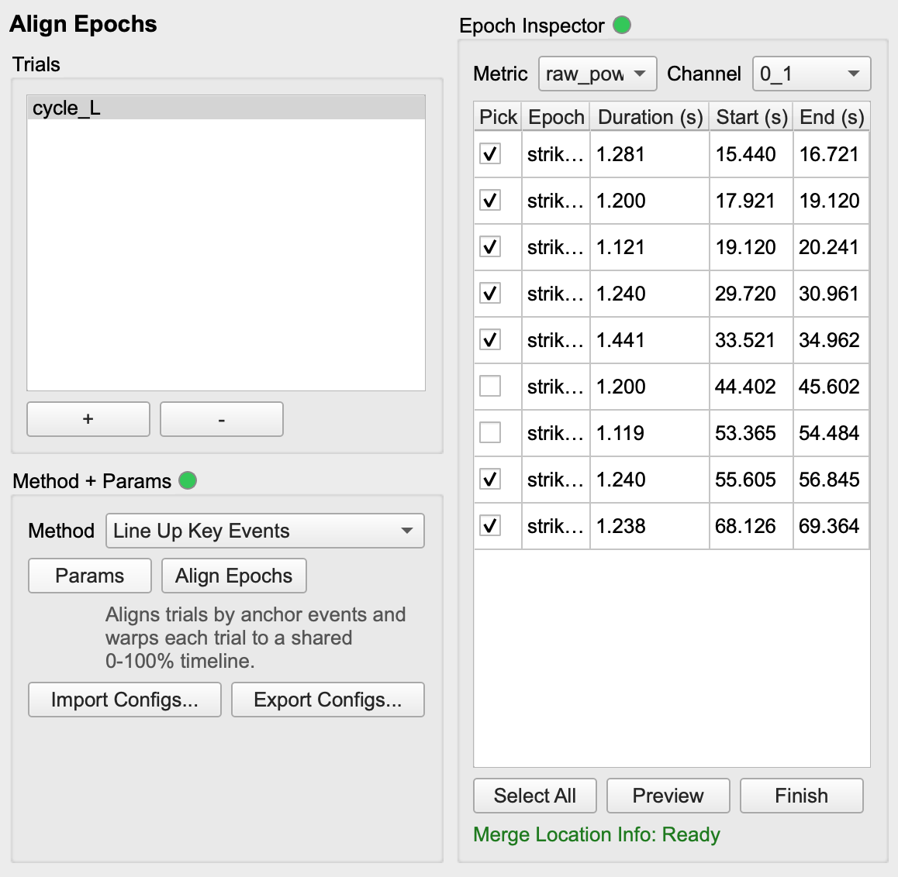

### 8.1 Trials and Method Block

| Control | What it does | What it affects | Availability / blocking rule |
| --- | --- | --- | --- |
| `Trials` list | Chooses the currently active alignment trial. | Which trial is edited and run. | Requires a selected record. |
| `+` | Creates a new alignment trial. | Trial inventory. | Requires a selected record. |
| `-` | Deletes the selected alignment trial. | Trial inventory and trial outputs. | Requires a selected trial. |
| `Method + Params` indicator | Reports method-config freshness for the current trial. | User feedback only. | Read-only. |
| `Method` | Chooses the alignment method for the current trial. | Which params dialog shape is used and how alignment runs. | Requires a selected trial. |
| `Params` | Opens the method-parameter dialog for the selected method. | Saved method parameters. | Requires a selected trial. |
| `Align Epochs` | Runs alignment for the current trial. | Trial alignment outputs and Epoch Inspector freshness. | Requires valid params and upstream data. |
| `Import Configs...` | Loads an alignment configuration for the current trial. | Trial configuration payload. | Requires a selected trial. |
| `Export Configs...` | Saves the current trial configuration. | External alignment config file. | Requires a selected trial. |

### 8.2 Epoch Inspector

| Control | What it does | What it affects | Availability / blocking rule |
| --- | --- | --- | --- |
| `Epoch Inspector` indicator | Reports whether the current run and finish state are fresh for the selected trial. | User feedback only. | Read-only. |
| `Metric` | Chooses which metric is shown in the inspector. | Preview source and table context. | Requires alignment run outputs. |
| `Channel` | Chooses which channel is shown in the inspector preview. | Preview source and table context. | Requires alignment run outputs. |
| Epoch table | Lists detected epochs and their pick state. The pick state is the actual inclusion list used by `Finish`. | Preview and finish selection. | Read-only except for pick toggles. |
| `Select All` | Toggles every epoch pick on or off. | Current pick set. | Requires epoch rows. |
| `Preview` | Opens a preview based on the current pick set only. Use it as a QC surface before deciding which epochs should remain checked. | Preview figure only. | Requires at least one picked epoch and run outputs. |
| `Finish` | Builds finished outputs using the current pick set only. Unchecked epochs are excluded from downstream feature extraction. | Trial finish outputs consumed by feature extraction. | Requires a valid pick set and current alignment outputs. |
| `Merge Location Info` | Reports whether Localize representative-coordinate metadata can be attached during finish. | Finish-time merge behavior only. | Read-only. |

### 8.3 Line Up Key Events Params

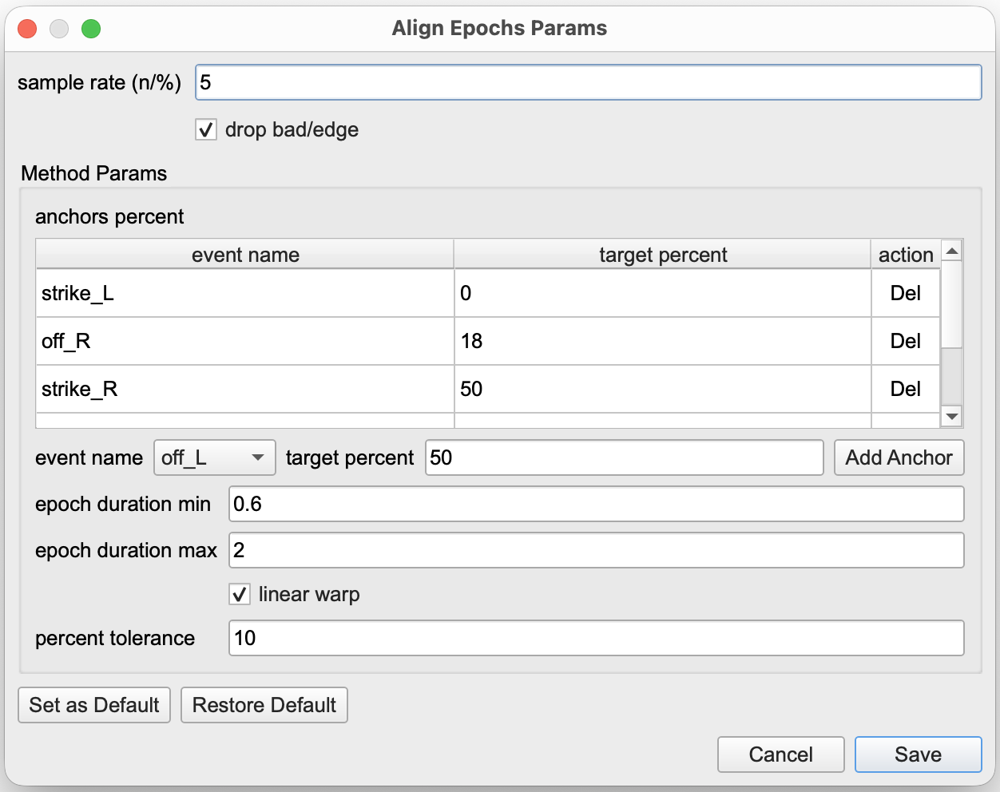

| Control | What it does | What it affects | Availability / blocking rule |
| --- | --- | --- | --- |
| `sample rate (n/%)` | Sets how many samples are allocated per 1% of the normalized epoch timeline. Higher values preserve more temporal detail after warping, but they also increase output size. | Alignment runtime output grid. | Required. |
| `drop bad/edge` | Drops epochs overlapping annotations containing `bad` or `edge`. | Which epochs remain eligible for alignment. | Always available. |
| Anchor table | Lists the event-to-target-percent anchors used to warp epochs onto a shared normalized timeline. | Line-up-by-key-events alignment behavior. | Visible for anchor-based methods. |
| `event name` | Chooses which annotation label should be used as a new anchor. | Anchor draft. | Anchor methods only. |
| `target percent` | Sets where that event should land on the normalized 0-100% timeline. These anchors define the common alignment geometry across epochs. | Anchor draft. | Anchor methods only. |
| `Add Anchor` | Adds the current anchor draft to the table. | Anchor table. | Requires a valid anchor draft. |
| `epoch duration min` | Sets an optional lower bound on accepted epoch duration in seconds. | Epoch eligibility before alignment. | Optional. |
| `epoch duration max` | Sets an optional upper bound on accepted epoch duration in seconds. | Epoch eligibility before alignment. | Optional. |
| `linear warp` | Enables piecewise linear warping between anchors. | Anchor-to-anchor interpolation behavior. | Line-up-by-key-events methods only. |
| `percent tolerance` | Sets how far an observed anchor can deviate from its requested target position before the epoch is treated as a poor fit. Larger values are more permissive; smaller values enforce stricter geometric consistency. | Anchor-warp validation. | Anchor methods only. |
| `Set as Default` | Saves the current method parameters as defaults for this alignment method. | Future method defaults. | Always available. |
| `Restore Default` | Restores saved defaults for this alignment method. | Current dialog values. | Always available. |
| `Save` | Saves the dialog values back to the Align page. | Method configuration payload. | Blocks on invalid values. |
| `Cancel` | Closes the dialog without saving. | No parameter update. | Always available. |

**Notes**

- `sample rate (n/%)` is a normalized-timeline density, not a real-time Hz value.
- `target percent` describes where an event should end up after warping, while `percent tolerance` describes how strictly that target should be enforced.

### 8.4 Clip Around Event Params

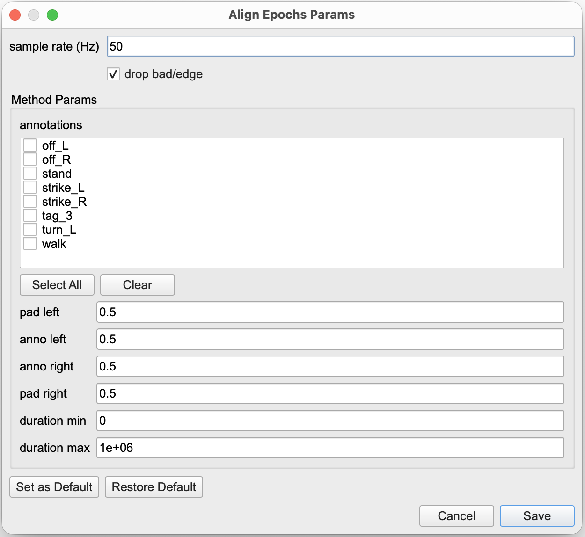

| Control | What it does | What it affects | Availability / blocking rule |
| --- | --- | --- | --- |
| `sample rate (Hz)` | Sets the sampling density of the clipped real-time epoch. Higher values preserve more temporal detail, but they also produce larger aligned outputs. | Alignment runtime output grid. | Required. |
| `drop bad/edge` | Drops epochs overlapping annotations containing `bad` or `edge`. | Which epochs remain eligible for alignment. | Always available. |
| `annotations` checklist | Chooses which annotation labels can define clip windows. | Alignment input event set. | Visible for annotation-list methods. |
| `Select All` / `Clear` | Select or clear all labels in the checklist. | Annotation checklist. | Visible for annotation-list methods. |
| `pad left` | Adds extra time before the selected annotation starts. Use it to capture pre-event context. | Event-anchored clip window. | Clip-style methods only. |
| `anno left` | Keeps a window immediately after annotation start. | Event-anchored clip window. | Clip-style methods only. |
| `anno right` | Keeps a window immediately before annotation end. | Event-anchored clip window. | Clip-style methods only. |
| `pad right` | Adds extra time after annotation end. Use it to capture post-event context. | Event-anchored clip window. | Clip-style methods only. |
| `duration min` | Sets a minimum annotation duration in seconds for an event to be eligible. | Epoch eligibility before clipping. | Clip-style methods only. |
| `duration max` | Sets a maximum annotation duration in seconds for an event to be eligible. | Epoch eligibility before clipping. | Clip-style methods only. |
| `Set as Default` | Saves the current method parameters as defaults for this alignment method. | Future method defaults. | Always available. |
| `Restore Default` | Restores saved defaults for this alignment method. | Current dialog values. | Always available. |
| `Save` | Saves the dialog values back to the Align page. | Method configuration payload. | Blocks on invalid values. |
| `Cancel` | Closes the dialog without saving. | No parameter update. | Always available. |

**Notes**

- `sample rate (Hz)` is a real-time resampling density because this method keeps a real-time window around the event.
- `pad left`, `anno left`, `anno right`, and `pad right` jointly define the total window. They are four pieces of one clip geometry, not four unrelated paddings.

### 8.5 Stack Trials Params

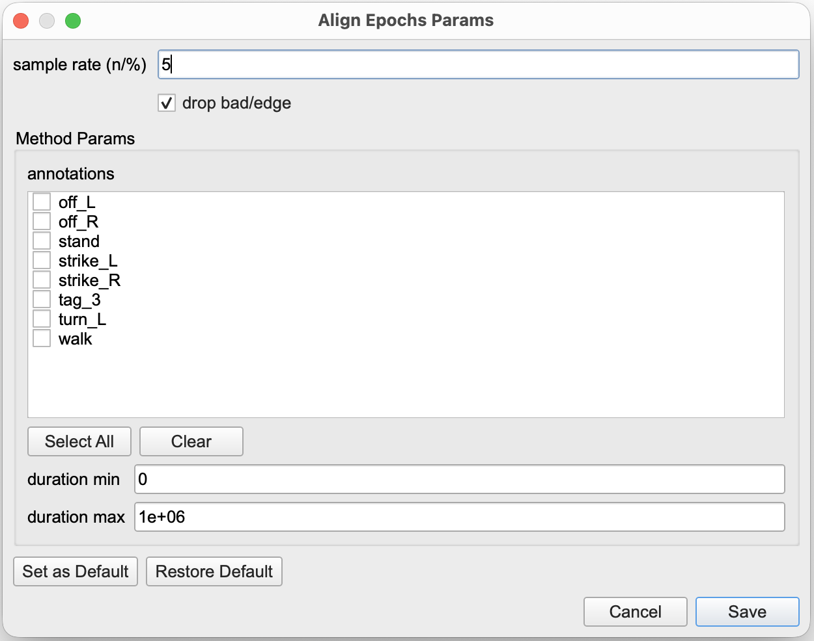

| Control | What it does | What it affects | Availability / blocking rule |
| --- | --- | --- | --- |
| `sample rate (n/%)` | Sets how many samples are allocated per 1% of the normalized stacked timeline. Higher values preserve more detail after normalization, but they also increase output size. | Alignment runtime output grid. | Required. |
| `drop bad/edge` | Drops epochs overlapping annotations containing `bad` or `edge`. | Which epochs remain eligible for alignment. | Always available. |
| `annotations` checklist | Chooses which labels are kept when building stacked trials. | Alignment input event set. | Visible for annotation-list methods. |
| `Select All` / `Clear` | Select or clear all labels in the checklist. | Annotation checklist. | Visible for annotation-list methods. |
| `duration min` | Sets a minimum annotation duration in seconds. | Epoch eligibility before stacking. | Stack-style methods only. |
| `duration max` | Sets a maximum annotation duration in seconds. | Epoch eligibility before stacking. | Stack-style methods only. |
| `Set as Default` | Saves the current method parameters as defaults for this alignment method. | Future method defaults. | Always available. |
| `Restore Default` | Restores saved defaults for this alignment method. | Current dialog values. | Always available. |
| `Save` | Saves the dialog values back to the Align page. | Method configuration payload. | Blocks on invalid values. |
| `Cancel` | Closes the dialog without saving. | No parameter update. | Always available. |

**Notes**

- `sample rate (n/%)` again refers to density over a normalized 0-100% axis, not to physical Hz.
- The duration limits are useful when the same label occurs with variable lengths and you want to exclude unusually short or long instances before stacking.

### 8.6 Stitch Trials Params

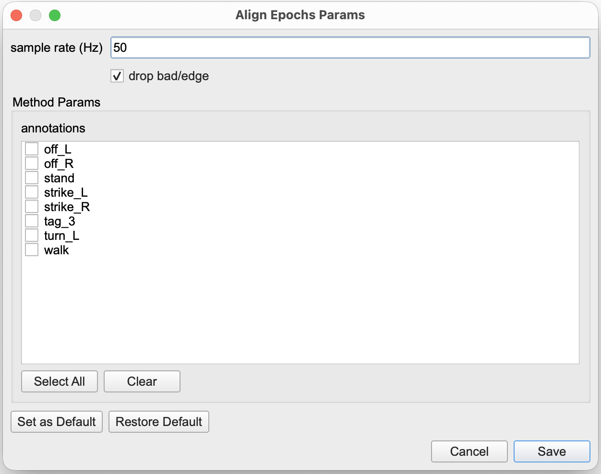

| Control | What it does | What it affects | Availability / blocking rule |
| --- | --- | --- | --- |
| `sample rate (Hz)` | Sets the real-time sampling density of the stitched output. Higher values preserve more temporal detail, but they also create larger concatenated outputs. | Alignment runtime output grid. | Required. |
| `drop bad/edge` | Drops epochs overlapping annotations containing `bad` or `edge`. | Which epochs remain eligible for alignment. | Always available. |
| `annotations` checklist | Chooses which labels are kept when stitching selected event windows together. | Alignment input event set. | Visible for annotation-list methods. |
| `Select All` / `Clear` | Select or clear all labels in the checklist. | Annotation checklist. | Visible for annotation-list methods. |
| `Set as Default` | Saves the current method parameters as defaults for this alignment method. | Future method defaults. | Always available. |
| `Restore Default` | Restores saved defaults for this alignment method. | Current dialog values. | Always available. |
| `Save` | Saves the dialog values back to the Align page. | Method configuration payload. | Blocks on invalid values. |
| `Cancel` | Closes the dialog without saving. | No parameter update. | Always available. |

**Notes**

- This method keeps real-time spacing, so `sample rate (Hz)` is a physical resampling density rather than a normalized per-percent density.
- Stitching is useful when you want one continuous output built from repeated event windows rather than one normalized epoch per event.

## 9. Extract Features and Available Features

The feature page defines feature axes, runs feature extraction, selects derived
feature outputs, and controls plotting/export behavior.

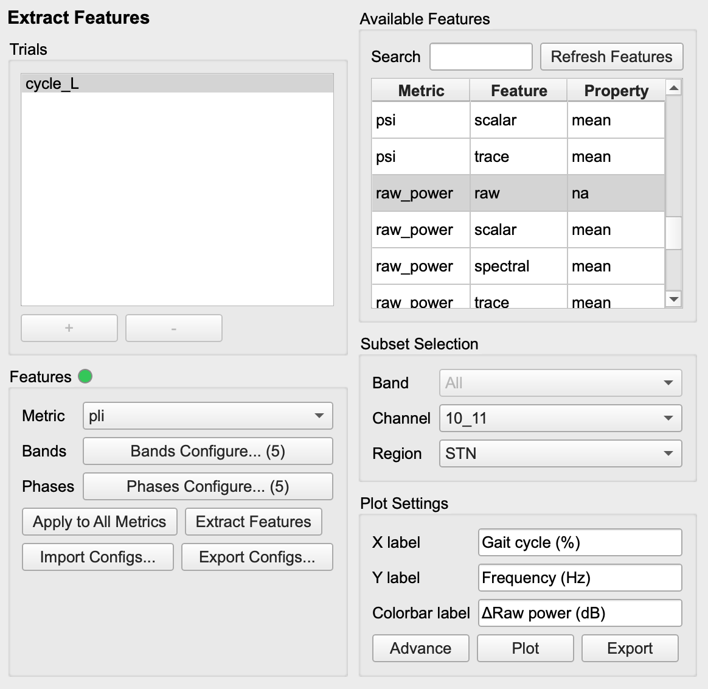

### 9.1 Trials and Features Block

| Control | What it does | What it affects | Availability / blocking rule |
| --- | --- | --- | --- |
| `Trials` list | Chooses the currently active finished alignment trial. | Which trial is used for extraction and plotting. | Requires finished alignment outputs. |
| `+` / `-` | Reserved trial list controls for the current page context. | Trial list management. | Availability depends on the current page state. |
| `Features` indicator | Reports feature-extraction freshness for the selected trial. | User feedback only. | Read-only. |
| `Metric` | Chooses which metric's feature axes are being edited. | Which bands/phases configuration is active. | Requires a selected trial. |
| `Bands Configure...` | Opens the band-axis editor for the selected metric. | Feature band definitions for that metric. | Requires a selected metric. |
| `Phases Configure...` | Opens the phase/time-window editor for the selected metric. | Feature phase definitions for that metric. | Requires a selected metric. |
| `Apply to All Metrics` | Copies the current metric's axes to all metrics in the selected trial. | Trial-wide feature-axis configuration. | Requires a valid source metric axis definition. |
| `Extract Features` | Runs feature extraction for the selected trial. | Generated feature outputs. | Requires finished alignment outputs and valid axes. |
| `Import Configs...` | Loads a feature configuration. | Current trial feature config. | Requires a selected trial. |
| `Export Configs...` | Saves the current feature configuration. | External feature config file. | Requires a selected trial. |

### 9.2 Available Features, Subset Selection, and Plot Settings

| Control | What it does | What it affects | Availability / blocking rule |
| --- | --- | --- | --- |
| `Search` | Filters the available feature list. | Feature table browsing only. | Always available. |
| `Refresh Features` | Rescans generated feature files for the selected trial. | Available feature table contents. | Requires a selected trial. |
| `Available Features` table | Lists feature payloads that can be plotted or exported. | Current feature selection. | Requires extracted feature outputs. |
| `Band` | Filters the selected feature payload by band. | Plot subset. | Choices depend on the selected feature and current channel/region filters. |
| `Channel` | Filters the selected feature payload by channel. | Plot subset. | Choices depend on the selected feature and current band/region filters. |
| `Region` | Filters the selected feature payload by region. | Plot subset. | Choices depend on the selected feature and current band/channel filters. |
| `X label` | Overrides the plotted x-axis label. | Plot output only. | Optional. |
| `Y label` | Overrides the plotted y-axis label. | Plot output only. | Optional. |
| `Colorbar label` | Overrides the plotted colorbar label. | Plot output only. | Optional. |
| `Advance` | Opens plot-time transform and normalization settings. | Plot session/default settings. | Requires a selected feature. |
| `Plot` | Plots the selected feature using the current subset and plot settings. | Plot figure only. | Requires a selected feature and compatible subset. |
| `Export` | Exports the last plotted figure and its plotting data. | Output files only. | Requires an existing plot result. |

### 9.3 Features Bands Editor

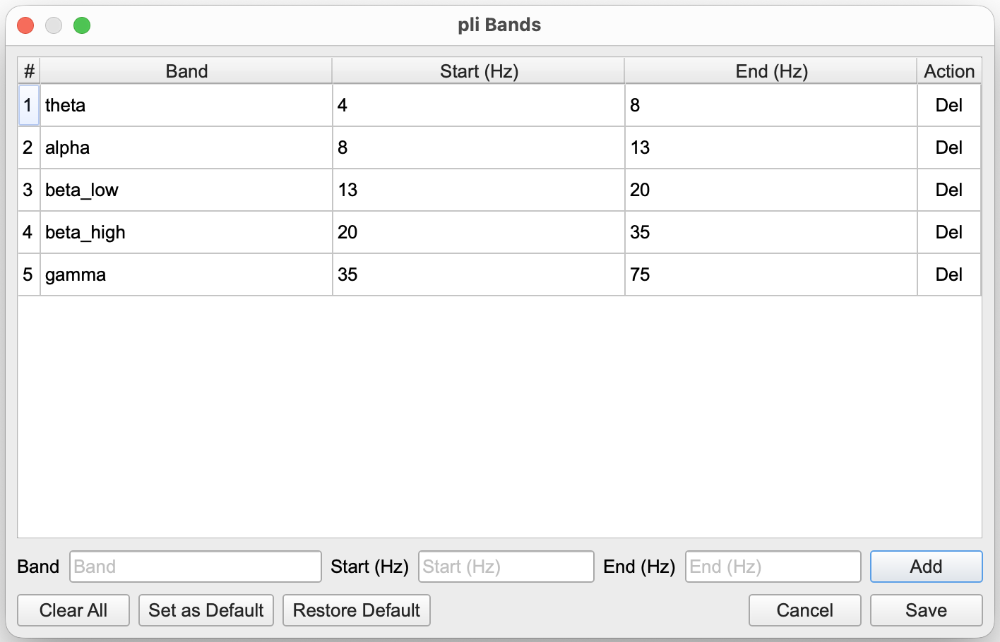

| Control | What it does | What it affects | Availability / blocking rule |
| --- | --- | --- | --- |
| Table | Lists the currently configured named bands for the active metric. | Current band-axis definition. | Read-only except for row deletion. |
| `Band` name | Sets the human-readable name for the draft band. Use names that will still make sense in feature tables and plots. | Draft row. | Required for a valid draft. |
| `Start` | Sets the lower frequency bound of the draft band in Hz. | Draft row. | Must be numeric and inside the allowed frequency range. |
| `End` | Sets the upper frequency bound of the draft band in Hz. | Draft row. | Must be numeric and greater than `Start`. |
| `Add` | Adds the draft band to the current band table. | Current band table. | Requires a valid draft. |
| `Clear All` | Removes all configured bands. | Current band table. | Always available. |
| `Set as Default` | Saves the current bands as defaults. | Future band defaults. | Always available. |
| `Restore Default` | Restores saved defaults. | Current dialog values. | Always available. |
| `Save` | Saves the band definitions back to the Features page. | Selected metric feature-band axis. | Blocks on invalid rows or empty required state. |
| `Cancel` | Closes the dialog without saving. | No band update. | Always available. |

**Notes**

- `Start` and `End` define the frequency interval that will later be summarized into one named feature band.
- Band names are not cosmetic only: they become the labels shown in downstream feature tables and plots.

### 9.4 Features Phases Editor

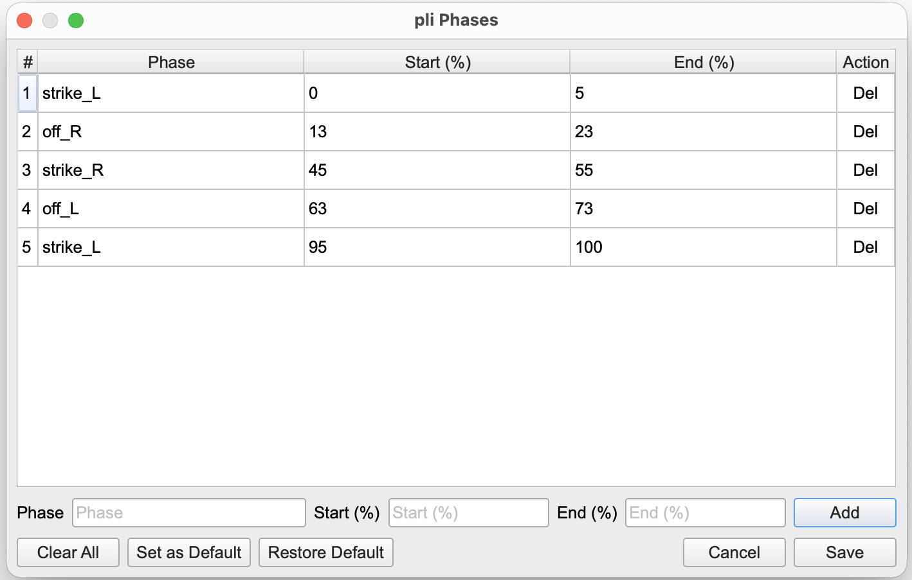

| Control | What it does | What it affects | Availability / blocking rule |
| --- | --- | --- | --- |
| Table | Lists the currently configured named phases or time windows. | Current phase-axis definition. | Read-only except for row deletion. |
| `Phase` name | Sets the human-readable name for the draft phase or window. | Draft row. | Required for a valid draft. |
| `Start` | Sets the lower bound of the draft phase range in the unit shown by the dialog, typically percent of the normalized epoch. | Draft row. | Must be numeric and inside the allowed range. |
| `End` | Sets the upper bound of the draft phase range in the same unit. | Draft row. | Must be numeric and greater than `Start`. |
| `Add` | Adds the draft phase row to the current table. | Current phase table. | Requires a valid draft. |
| `Clear All` | Removes all configured phases. | Current phase table. | Always available. |
| `Set as Default` | Saves the current phases as defaults. | Future phase defaults. | Always available. |
| `Restore Default` | Restores saved defaults. | Current dialog values. | Always available. |
| `Save` | Saves the phase definitions back to the Features page. | Selected metric feature-phase axis. | Blocks on invalid rows or empty required state. |
| `Cancel` | Closes the dialog without saving. | No phase update. | Always available. |

**Notes**

- `Start` and `End` define analysis windows that later combine with named bands to form feature values.
- Phase names become part of the exported feature labels, so they should describe the window meaning rather than only its numeric bounds.

### 9.5 Plot Advance

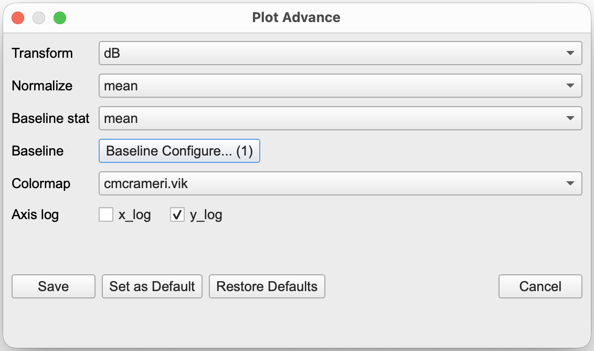

| Control | What it does | What it affects | Availability / blocking rule |
| --- | --- | --- | --- |
| `Transform` | Chooses the value transform applied before plotting, such as leaving values unchanged or converting them to a transformed scale. It changes the plotted and exported plot values, not the source feature files on disk. | Plot output and exported plotting data. | Always available. |
| `Normalize` | Chooses whether values are baseline-normalized before plotting. When normalization is off, baseline-specific controls become irrelevant. | Plot output and exported plotting data. | Can disable baseline-specific controls when set to `none`. |
| `Baseline stat` | Chooses how baseline values are summarized before normalization is applied. This matters when baseline windows contain variability and you need a stable reference statistic. | Plot output and exported plotting data. | Relevant when normalization is enabled. |
| `Baseline Configure...` | Opens the baseline-range editor used to define which percent windows count as baseline. | Baseline percent ranges used for plot-time normalization. | Enabled when normalization uses baseline ranges. |
| `Colormap` | Chooses the colormap used by matrix-style plots. It affects appearance only, not the underlying numbers. | Plot appearance only. | Always available. |
| `x_log` | Uses a logarithmic x-axis when the current feature type supports numeric x values. | Plot appearance only. | Availability depends on the selected feature type. |
| `y_log` | Uses a logarithmic y-axis when the current feature type supports numeric y values. | Plot appearance only. | Availability depends on the selected feature type. |
| `Save` | Saves plot settings to the session. | Current plot settings. | Blocks on invalid combinations. |
| `Set as Default` | Saves plot settings as defaults. | Future plot defaults. | Blocks on invalid combinations. |
| `Restore Defaults` | Restores saved defaults. | Current dialog state. | Always available. |
| `Cancel` | Closes the dialog without saving. | No plot-settings update. | Always available. |

**Notes**

- `Transform` changes how values are displayed and exported from the current plot, not how features were originally computed.
- `Normalize` and `Baseline stat` only matter together with baseline ranges defined in `Baseline Configure...`.
- `x_log` and `y_log` are display options only. They have no effect on extracted feature files and are enabled only when the current axes are numeric and compatible.

### 9.6 Baseline Configure

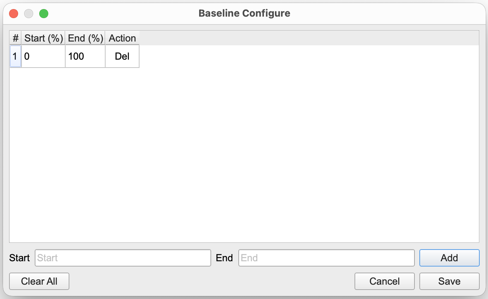

| Control | What it does | What it affects | Availability / blocking rule |
| --- | --- | --- | --- |
| Baseline ranges table | Lists the configured baseline percent ranges. Multiple non-overlapping ranges can be combined to define one composite baseline. | Plot-time normalization baseline. | Read-only except for row deletion. |
| `Start` | Sets the start of the draft baseline range in percent of the current plotted timeline. | Draft baseline row. | Must stay within valid percent bounds. |
| `End` | Sets the end of the draft baseline range in percent of the current plotted timeline. | Draft baseline row. | Must stay within valid percent bounds and be greater than `Start`. |
| `Add` | Adds the draft baseline range to the table. | Baseline table rows. | Requires a valid draft range. |
| `Clear All` | Removes all baseline ranges. | Baseline table rows. | Always available. |
| `Save` | Saves baseline ranges back to Plot Advance. | Baseline normalization payload. | Blocks on invalid or overlapping ranges. |
| `Cancel` | Closes the dialog without saving. | No baseline-range update. | Always available. |

**Notes**

- Baseline ranges are percent windows on the plotted x-axis, not arbitrary absolute times unless the plotted axis itself is already percent-based.
- A range such as `0-20` means “use the first 20% of the current timeline as baseline.” Multiple ranges can be combined when a single continuous baseline window is not appropriate.
