# LFP-TensorPipe Control Reference

This page is a GUI control reference, not a workflow guide.

- Use this document when you need to understand what a control does, when it is
  available, and what state or output it affects.
- Use [APP_TUTORIAL.md](APP_TUTORIAL.md) when you want a validated step-by-step
  example workflow.

## 1. Configs

The configs dialog stores runtime dependencies used by Localize and related
MATLAB-backed actions. Open `LFP-TensorPipe -> Preferences...` on macOS or
`Settings -> Configs` on Windows.

| Control | What it does | What it affects | Availability / blocking rule |
| --- | --- | --- | --- |
| `Lead-DBS Directory` | Points the app to the local Lead-DBS installation root. | Localize atlas discovery and MATLAB-side Lead-DBS helpers. | Must be a valid Lead-DBS directory before Localize can become ready; an empty or invalid path is marked red after editing finishes. |
| `Browse` (Lead-DBS) | Opens a directory chooser for the Lead-DBS root. | Fills the `Lead-DBS Directory` field. | Always available. |
| `MATLAB Installation Path` | Points the app to the local MATLAB application or executable path. | MATLAB-backed actions such as Localize Apply and Contact Viewer launch. | Must resolve to a working MATLAB install before MATLAB status can turn ready; an empty or invalid path is marked red after editing finishes. |
| `Browse` (MATLAB) | Opens a chooser for the MATLAB application path. | Fills the `MATLAB Installation Path` field. | Always available. |
| `Save` | Validates and stores the current dependency paths in app storage. | Future Localize runtime checks. | Blocks on invalid paths. |
| `Cancel` | Closes the dialog without saving path changes. | No persisted state. | Always available. |

After a valid save, the Localize panel can report `MATLAB: Ready`.

## 2. Main Window Overview

The main window combines shared workspace context, inline Localize controls,
stage navigation, and the currently active stage page.

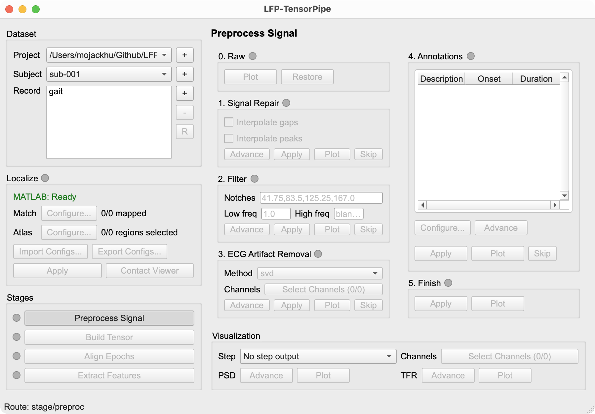

### 2.1 Dataset Context

These controls define the current workspace scope. Downstream panels always act
on the selected project, subject, and record.

| Control | What it does | What it affects | Availability / blocking rule |
| --- | --- | --- | --- |
| `Project` | Selects the active project workspace. | Subject list, record list, and all stage pages. | Always available when at least one project is registered. |
| `Project +` | Adds an existing project path to recent project history. | Available project choices. | Always available. |
| `Subject` | Selects the active subject under the current project. | Record list and all record-scoped panels. | Requires a selected project. |
| `Subject +` | Creates matching Sourcedata and Rawdata subject folders under the current project. | Subject inventory. | Requires a selected project. If either target cannot be created, the app reports the failure and removes only empty subject folders created by that attempt. |
| `Record` | Selects the active record under the current subject. Records are listed when any standard Derivatives, Rawdata, or Sourcedata record root exists. A record with only its Sourcedata root is shown in red. | Localize and all stage pages. | Requires a selected subject. A record with no canonical Rawdata input remains manageable but is not runnable. |
| `Record +` | Opens the record import dialog. | Creates a new record when the import completes successfully. | Requires a selected subject. A name already occupied by any standard record root cannot be imported. |
| `Record R` | Renames the selected record while preserving compatible downstream artifacts. | Record name and artifact paths that track that name. | Requires exactly one selected record. |
| `Record -` | Opens a permanent-delete dialog for the selected record. | The selected standard `Derivatives`, `Rawdata`, and/or `Sourcedata` record roots. | Requires exactly one selected record. Missing scopes are disabled; the first existing scope in Derivatives, Rawdata, Sourcedata order is selected by default. |

`Record -` deletes only the selected standard record roots:

- `Derivatives`: `<project>/derivatives/lfptensorpipe/<subject>/<record>`
- `Rawdata`: `<project>/rawdata/<subject>/ses-postop/lfp/<record>`
- `Sourcedata`: `<project>/sourcedata/<subject>/lfp/<record>`

A record remains listed while any one of these standard roots exists, including
an empty or partially populated root left by an interrupted operation. Deleting
only Derivatives therefore does not hide a record that still has Rawdata or
Sourcedata. A Rawdata-only record starts with gray processing state; the existing
Raw Plot action can bootstrap its preprocessing input from the canonical
`raw.fif`. A Sourcedata-only record can be renamed or deleted but is not runnable
because it has no canonical Rawdata input.

When Sourcedata is the record's only existing standard root, the Record list
shows the record name in red. Selecting that record from another selection opens
a warning that describes the existing manual replacement path:

1. Create and successfully import a new record under a different name with the
   ordinary `Record +` workflow.
2. Select and delete the original Sourcedata-only record with `Record -`.
3. Select the newly imported record.
4. Rename it to the original record name with `Record R`.

The warning is guidance only. It has one `OK` action and does not alter Record
Import, Delete, Rename, stage routing, or stage dependency behavior. Repeated
clicks on the already-selected row and programmatic list refreshes do not reopen
the warning. Sourcedata deletion remains permanent, so the warning tells the
user to preserve a separate source copy first when needed.

The Delete dialog disables scopes whose standard roots do not exist. It selects
only the first existing scope in Derivatives, Rawdata, Sourcedata order and
disables `Delete` when no scope is selected. Deletion is permanent and does not
move files to Trash.

### 2.2 Localize Summary Row

The inline Localize block gives a lightweight record-scoped summary even when
you are not currently focused on the full Localize page.

| Control | What it does | What it affects | Availability / blocking rule |
| --- | --- | --- | --- |
| `Localize` indicator | Summarizes Localize freshness for the current record. | Visual readiness for downstream consumers such as Align `Merge Location Info`. | Read-only. |
| `Match` status text | Reports mapped channels versus total channels. | Whether Localize Apply can succeed with the current draft. | Read-only. |
| `MATLAB` status text | Reports MATLAB runtime readiness. | Whether MATLAB-backed Localize actions can run immediately. | Read-only. |
| `Atlas` summary text | Reports the saved atlas/region selection summary. | Localize Apply inputs. | Read-only. |

### 2.3 Stages and Workspace Area

The stage buttons open the full page for each processing stage. The right-hand
workspace area shows whichever stage page is currently active.

| Control | What it does | What it affects | Availability / blocking rule |
| --- | --- | --- | --- |
| Stage indicators | Show readiness or staleness for each stage. | Navigation feedback only. | Read-only. |
| Stage buttons | Open the corresponding stage page in the workspace area. | Which control surface is shown on the right. | Usually enabled only when upstream requirements are satisfied. |
| Active workspace page | Hosts the full controls for the selected stage. | The current page-specific actions and state. | Depends on the active stage. |

### 2.4 Empty Values, Drafts, and Validation

GUI controls use one visible-value contract across every stage:

- A blank single-value control represents `None`. An empty collection remains
  an empty collection; it is not rewritten to `None`.
- `None` is valid only where the individual control explicitly documents an
  optional meaning. A required empty value or any other invalid active value is
  shown with a red control background or border. Resource states such as
  loading or no available annotations/channels are shown as unavailable rather
  than as user-input errors.
- Invalid draft values do not block navigation, method changes, Cancel,
  Restore Default, or ordinary record-scoped Save. Record UI state preserves
  those values exactly and recomputes validation when reloaded. Uncommitted
  draft rows are not part of the saved configuration until their Add/Apply
  action succeeds.
- Set as Default, Export Configs, scientific Apply, and Run require a valid
  active configuration. A Run request with invalid values reports all current
  errors before starting a worker and does not modify logs or artifacts.
- A control disabled by the selected method or mode preserves its draft value,
  but is not validated, marked invalid, or included in the active computation
  payload.
- Build Tensor active scalar fields recompute their validation state immediately
  after each user edit. Switching the metric parameter panel clears validation
  marks inherited from the previous metric and explicitly validates the newly
  active metric, so a valid value or selector cannot remain red because of an
  earlier draft.
- App defaults and exported configurations must be valid. A required field with
  no scientifically safe automatic value uses an empty initial draft template,
  not an invalid saved default. Examples include Alignment annotation choices
  and channel-to-contact mappings.
- External configuration import previews every normalization before acceptance.
  Missing keys, normalized fields, and removed unavailable values are reported separately. A required value is restored
  only when a documented safe default exists; otherwise import fails.

An invalid or changed draft makes the affected panel stale without deleting its
last accepted artifacts. Returning to the exact normalized configuration of the
still-current successful artifact restores the green indicator and downstream
availability without rerunning. Formatting, key ordering, and equivalent
numeric serialization do not affect that comparison.

## 3. Import Record

The import dialog defines a new record, parses the selected source, and runs any
required pre-import transforms before the record is committed.

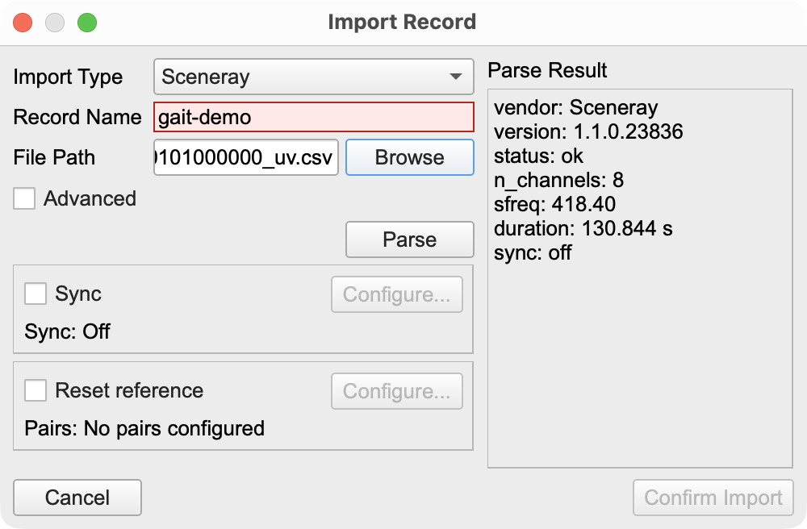

The screenshot shows the visible fields for one parser configuration with
`Advanced` enabled. Other import types can expose additional type-specific
inputs.

### 3.1 Main Form

| Control | What it does | What it affects | Availability / blocking rule |
| --- | --- | --- | --- |
| `Import Type` | Chooses the parser family for the source file. | Which fields, validation rules, and sidecars are required. | Always available. |
| `Record Name` | Defines the record name that will be created under the current subject and reports any occupied standard record paths. | Record folder name and downstream artifact paths. | Required before import can succeed. An empty, malformed, or occupied name is marked red; a conflict does not block Parse, but it disables `Confirm Import`. |
| `File Path` | Points to the primary source file. | Parse result and final imported record contents. | Required before parse. An empty or nonexistent path is marked red after editing finishes. |
| `Browse` | Opens a file chooser for the primary source file. | Fills `File Path`. | Always available. |
| `Advanced` | Reveals optional sidecar inputs supported by the selected import type. | Whether auxiliary import fields are shown. | Always available. |
| `Metadata` | Points to an optional metadata sidecar. | Import metadata enrichment for supported parsers. | Visible only when `Advanced` is enabled and the import type supports it. |
| `Browse` (metadata) | Opens a file chooser for the metadata sidecar. | Fills the metadata path field. | Same gating as `Metadata`. |
| `Sampling rate` | Sets the source sampling rate for Legacy CSV input. | Legacy CSV time axis and all derived timing. | Visible only for Legacy CSV; must be a finite number greater than zero. |
| `Parse` | Reads the selected source and previews import metadata without committing the record. | Parsed channels, sample rate, duration, and parser-dependent import state. | Requires a valid source path and any required parser inputs. |
| `Sync` | Enables import-time timeline synchronization. | Whether a saved sync state becomes part of the import requirements. | Requires a successful parse. |
| `Configure...` (Sync) | Opens the sync configuration dialog. | Saved import-time sync state. | Enabled when `Sync` is checked and parse state exists. |
| `Sync` summary | Reports the saved synchronization state. | Import gating feedback. | Read-only. |
| `Reset reference` | Enables pre-import channel remapping. | Whether a saved reset-reference state becomes part of the import requirements. | Requires a successful parse. |
| `Configure...` (Reset reference) | Opens the reset-reference dialog. | Saved reset-reference pairs. | Enabled when `Reset reference` is checked and channels were parsed. |
| `Reset reference` summary | Reports the saved reset-reference state. | Import gating feedback. | Read-only. |
| `Parse Result` | Reports parser summary such as vendor, channels, sampling rate, and duration. | Human validation only. | Read-only after parse. |
| `Confirm Import` | Commits the parsed record into the current subject. The backend repeats the standard-path conflict check immediately before writing. | Record creation under the selected subject. | Disabled until parse succeeds, all enabled prerequisite dialogs are saved, and the normalized record name is not occupied. |
| `Cancel` | Closes the dialog without importing. | No record creation. | Always available. |

An import name is occupied when any standard Derivatives, Rawdata, or Sourcedata
record root already exists, even if that root is empty or incomplete. A conflict
is rejected before directory creation, Raw saving, source copying, or sync export;
ordinary import never overwrites an occupied record. If a Python exception occurs
after a new import starts writing, rollback removes only standard record roots
created by that import call and preserves pre-existing paths, the caller's source
file, shared subject directories, and unrelated records.

Legacy CSV, PINS, and Sceneray neural-signal inputs reject positive and negative
infinity during `Parse`, before canonical Raw construction. Infinity is not
cleaned, replaced, or partially accepted. Legacy CSV `NaN` missing values and
the documented PINS/Sceneray packet-gap or missing-cell zero behavior retain
their existing meaning. If a previously imported record is known to contain an
infinite sample, correct the source and explicitly re-import it; opening the app
does not scan or rewrite existing records.

PINS and Sceneray also require the final sampling rate selected by the parser to
be finite. A selected NaN or positive-infinite rate blocks `Parse` as invalid
file content before Raw construction and preserves the reported vendor and
device/app version. Parser source priority is unchanged. In particular, the
current Sceneray reader may use a finite txt rate when the CSV rate is NaN,
negative infinity, or zero; a positive-infinite CSV rate remains selected ahead
of txt and is rejected rather than silently replaced by the txt value.
PINS `Packet num` and `Packet length` fields must represent finite mathematical
integers. Values written as `1`, `1.0`, or `1e0` are equivalent, but a
fractional value is rejected instead of being rounded or truncated. Correct the
source export and parse it again; the parser does not alter the packet timeline
or create a partial preview.

Medtronic `TimeDomainData` must be a non-empty one-dimensional sample list.
Nested or nested-empty arrays are rejected during `Parse`; the importer does not
flatten them into time samples or create a zero-length preview. Correct the
source export and parse it again before confirming the import.

Medtronic `SampleRateInHz` is source metadata, not an editable control. It
must be finite and strictly positive before Gain is applied. Invalid rates
block Parse and do not create a record.

Legacy CSV channel names are read from the original logical header, trimmed at
their outer edges once, and required to be non-empty and case-sensitively
unique. The importer does not let pandas or MNE repair a blank or duplicate
identity with `Unnamed`, `.1`, or running-number suffixes. Valid punctuation,
internal spaces, case, quoted commas, numeric names, and explicitly authored
names such as `A.1` or `Unnamed: 0` remain supported. If an existing record is
known to have been imported from an ambiguous header, correct the source and
explicitly re-import it; the app does not infer or rewrite channel identity
from a saved suffix.

### 3.2 Sync Import Signal

This dialog prepares optional import-time alignment between LFP markers and an
external marker stream.

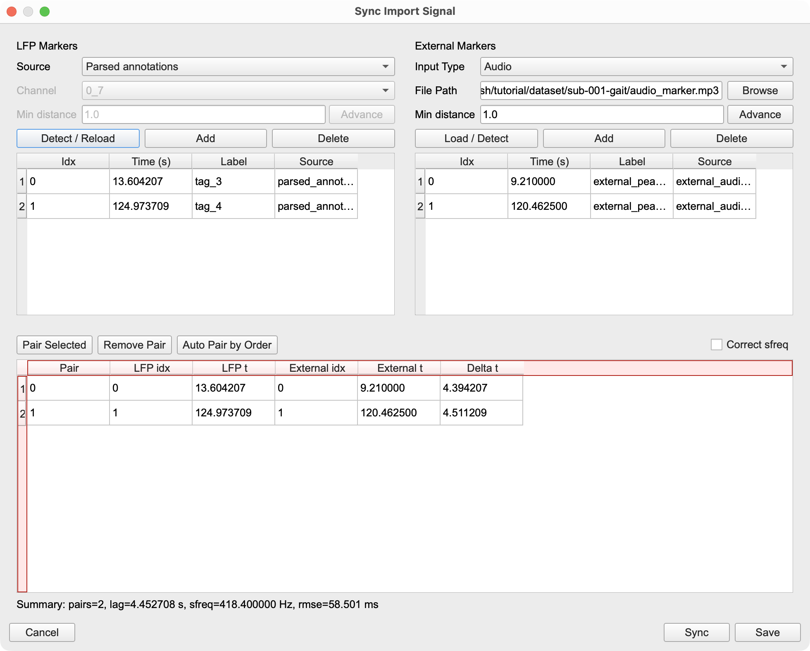

#### Left and right marker panels

| Control | What it does | What it affects | Availability / blocking rule |
| --- | --- | --- | --- |
| `LFP Markers` source | Chooses how the LFP-side markers are obtained. | LFP marker list content. | Always available after the dialog opens. |
| `LFP Channel` | Selects the channel used for peak-based LFP marker detection. | LFP marker detection target. | Enabled when the LFP source is `Channel peaks`. |
| `External` source | Chooses the external marker input type. | External marker list content. | Always available after the dialog opens. |
| `File Path` | Points to the external timing source, such as CSV or audio. | External marker detection input. | Enabled for file-backed external sources. |
| `Browse` | Opens a chooser for the external source file. | Fills the external file path. | Enabled with the external file path field. |
| `Min distance` | Sets the minimum separation between detected markers on that side. | Marker detection sensitivity. | Enabled only for peak/audio detection; must be a finite number greater than zero. |
| `Advance` | Opens side-specific detection settings for the selected marker source. | Saved marker-detection configuration for that side. | Always available, but the child dialogs are not illustrated in this screenshot set. |
| `Detect / Reload` or `Load / Detect` | Rebuilds the marker list from the current source settings. | Marker table rows. | Requires the source definition to be valid. |
| `Add` | Adds a marker row manually. | Marker table rows. | Always available. |
| `Delete` | Removes the selected marker row. | Marker table rows. | Requires a selected row. |
| Marker table | Lists detected or manually added markers. | Pairing and sync estimation inputs. | Read-only except for row selection. |

For `CSV times`, use a headerless single-column file with one marker time in
seconds per nonblank row. Every value must be finite and nonnegative; duplicate
times and extra columns are invalid. Blank rows are ignored, and accepted times
are sorted chronologically. If reload validation fails, the dialog reports the
original CSV line numbers and preserves the currently loaded markers, pairs,
and estimate.

For `Audio`, every decoded mono or multichannel sample must be finite. A file
containing `NaN`, `+Inf`, or `-Inf` is rejected as a whole before channel
averaging and peak detection. Reload failure preserves the current external
markers, pair table, sync estimate, and external preview.

The peak-detection Advance dialog treats blank search-range, height, and
prominence fields as `None`. If either search-range endpoint is supplied, both
must be finite and satisfy `0 <= start < stop`; an optional prominence must be
finite and nonnegative.

#### Pairing and save area

| Control | What it does | What it affects | Availability / blocking rule |
| --- | --- | --- | --- |
| `Pair Selected` | Pairs the currently selected LFP marker with the currently selected external marker. | Pair table rows. | Requires one selected row on each side. |
| `Remove Pair` | Removes the selected pair row. | Pair table rows. | Requires a selected pair row. |
| `Auto Pair by Order` | Pairs the current marker lists in order. | Pair table rows. | Requires both marker lists to be populated. |
| `Correct sfreq` | Allows the sync estimate to adjust synchronized sampling rate as well as lag. | Sync estimate payload. | Optional; affects the saved estimate. |
| Pair table | Lists paired markers and their timing deltas. | Sync estimation input and summary. | Read-only except for row selection. |
| `Summary` | Reports current sync-estimate status. | Human validation only. | Read-only. |
| `Sync` | Computes or refreshes the synchronization estimate from the current pairs. | Sync preview state and saved summary. | Requires a sufficient pair set. |
| `Save` | Saves the current sync state back to Import Record. | Import gating and imported synchronization behavior. | Typically requires a valid estimate. |
| `Cancel` | Closes the dialog without saving changes. | No sync state update. | Always available. |

### 3.3 Reset Reference

This dialog defines bipolar or unary remapping pairs that are applied before the
record is imported.

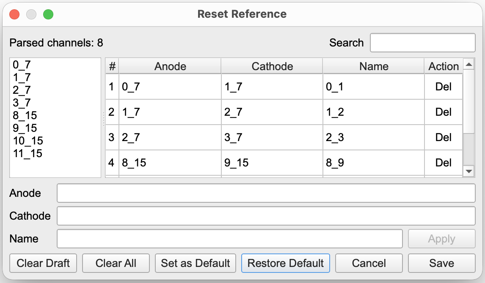

| Control | What it does | What it affects | Availability / blocking rule |
| --- | --- | --- | --- |
| `Search` | Filters parsed channels and configured pairs. | Dialog browsing only. | Always available. |
| Channel list | Provides the parsed input channels used to draft pairs. | Draft anode/cathode selection. | Requires parsed channels. |
| Pair table | Lists the currently configured reset-reference outputs. | Saved reset-reference payload. | Read-only except for delete actions. |
| `Anode` | Draft source channel for the positive pole. | The pending pair draft. | Required unless the pair is cathode-only. |
| `Cathode` | Draft source channel for the negative pole. | The pending pair draft. | Required unless the pair is anode-only. |
| `Name` | Output channel name written into the imported record. | Imported channel naming. | Required for every saved pair. |
| `Apply` | Adds the draft pair to the table. | Pair table rows. | Requires a valid draft. |
| `Clear Draft` | Clears the current draft row. | Draft fields only. | Always available. |
| `Clear All` | Removes all configured pairs. | Pair table rows. | Always available. |
| `Set as Default` | Saves the current pair list as the app default. | Future reset-reference defaults. | Requires at least one valid committed pair; an empty initial table is a draft template, not an app default. |
| `Restore Default` | Restores the saved default pair list. | Current draft table. | Always available; falls back to an empty list if no default exists. |
| `Save` | Saves the pair list back to Import Record. | Import gating and imported channel names. | May retain an empty red draft; Import confirmation remains blocked until valid. |
| `Cancel` | Closes the dialog without saving pair changes. | No reset-reference update. | Always available. |

## 4. Localize

The Localize page defines how record channels map to Lead-DBS contacts and how
representative coordinates are exported for downstream use.

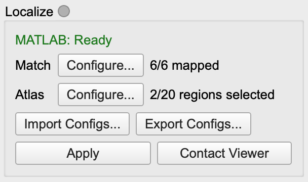

### 4.1 Main Panel

| Control | What it does | What it affects | Availability / blocking rule |
| --- | --- | --- | --- |
| `Localize` indicator | Reports Localize freshness for the current record. | Downstream readiness feedback only. | Read-only. |
| `Match -> Configure...` | Opens the channel-to-contact mapping dialog. | Saved mapping payload. | Requires a selected record and parsed channel inventory. |
| `Match` status | Reports how many record channels are mapped. | Whether Apply can use a complete mapping. | Read-only. |
| `MATLAB` status | Reports whether MATLAB dependencies are currently ready. | Expected runtime availability for Apply and Contact Viewer. | Read-only. |
| `Atlas -> Configure...` | Opens the atlas and region-selection dialog. | Saved atlas payload. | Requires a selected record. |
| `Atlas` summary | Reports the saved atlas/region selection summary. | Human validation only. | Read-only. |
| `Import Configs...` | Loads a Localize configuration payload. | Current match and atlas draft. | Requires a selected record. |
| `Export Configs...` | Saves the current Localize configuration payload. | External JSON config file. | Requires a selected record. |
| `Apply` | Generates representative-coordinate artifacts for the current record. After a successful rewrite, the main window immediately rescans stage state so invalidated Alignment Finish and Features results turn yellow and dependent actions are blocked without requiring record reselection. | Localize outputs consumed by downstream alignment and feature views, plus their current GUI freshness display and action gating. | Requires complete match state, saved atlas state, and working MATLAB/Lead-DBS dependencies. A failed Apply does not invalidate or rescan downstream stages. |
| `Contact Viewer` | Launches the external MATLAB-based contact viewer. | Independent viewer process only. | Requires a valid current atlas and representative-coordinate export context. |

Closing the main window first stops accepting new Localize MATLAB work and
cancels work that has not started. The app then cancels any MATLAB launch that
it started or quits its ready MATLAB Engine session before accepting the window
close. If that owned MATLAB session cannot be confirmed stopped within the
bounded shutdown wait, the main window remains open and reports the shutdown
failure. A separately launched Contact Viewer or any MATLAB session not owned
by the main app is outside this close contract and is not terminated.

### 4.2 Match: Record Channels ↔ Lead-DBS Contacts

This dialog binds each record channel to an anode, cathode, and representative
coordinate mode.

| Control | What it does | What it affects | Availability / blocking rule |
| --- | --- | --- | --- |
| `Search channel` | Filters unmapped channels by name. | Channel list browsing only. | Always available. |
| `Auto Match` | Attempts to auto-bind channels using the implemented contact-index rule. | Mapping draft and committed rows for any channel with a unique candidate. | Requires available leads and channels. |
| `Reset` | Clears all mappings for the current record. | Entire mapping table. | Always available. |
| `Status` | Reports mapped channels versus total channels. | Human validation only. | Read-only. |
| `Record Channels` list | Lists channels that still need mapping. | Active channel selection for editing. | Requires parsed channels. |
| Lead contact buttons | Select an anode or cathode endpoint from a Lead-DBS lead. | Current binding draft. | Requires an active channel. |
| `Case` / `Ground` | Provide cathode-only special endpoints. | Current binding draft. | Require an anode to be chosen first. |
| `Selected` | Shows which record channel is currently being edited. | Human validation only. | Read-only. |
| `Anode` | Shows the drafted anode and lets the user clear it. | Current binding draft. | Requires an active channel. |
| `Cathode` | Shows the drafted cathode and lets the user clear it. | Current binding draft. | Requires an active channel. |
| `Rep. coord` | Chooses the representative coordinate mode exported for this channel. | Representative-coordinate outputs for that channel. | Requires an active channel. |
| `Bind/Update` | Commits the current draft for the active channel. | Mapping table. | Requires a valid draft. |
| `Mapping Table` | Lists committed bindings for this record. | Saved payload and row editing entrypoint. | Read-only except for row selection and row delete actions. |
| `Set as Default` | Saves the current mapping table as the app default. | Future default mappings. | Requires a complete valid mapping; no mapping is synthesized when a safe default does not exist. |
| `Restore Default` | Restores compatible saved mappings from app defaults. | Current mapping table. | Always available. |
| `Save` | Saves the committed mappings back to the Localize page. | Localize readiness and Apply input. | May retain an incomplete red draft; Apply, Set as Default, and Export remain blocked. |
| `Cancel` | Closes the dialog without saving. | No payload change. | Always available. |

### 4.3 Configure Localize Atlas

This dialog defines the atlas space and the interested regions used when
representative coordinates are evaluated against atlas membership.

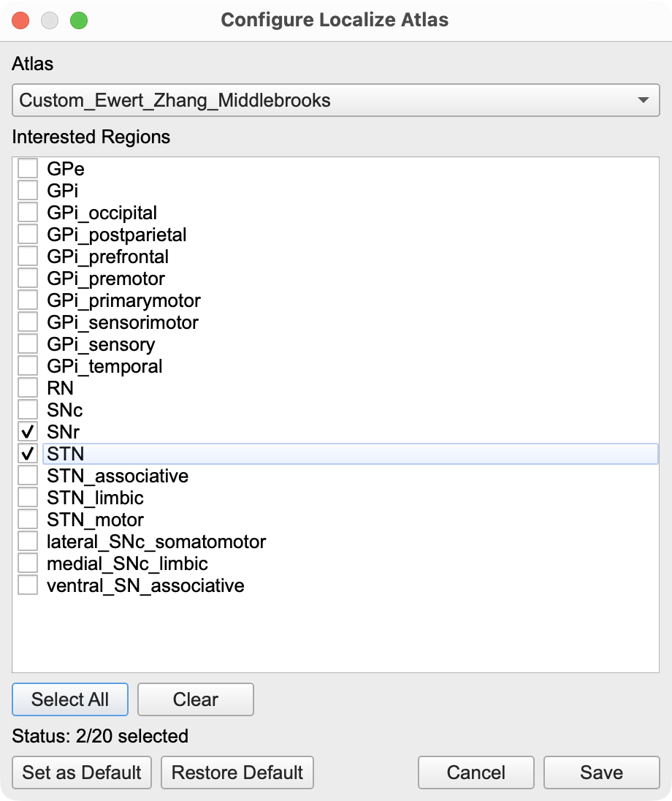

| Control | What it does | What it affects | Availability / blocking rule |
| --- | --- | --- | --- |
| `Space` | Chooses the atlas space that the current Lead-DBS subject must match. | Atlas discovery and Apply compatibility. | Requires available atlas spaces under the configured Lead-DBS tree. |
| `Atlas` | Chooses the atlas within the selected space. | Available region list and atlas membership lookup. | Requires a selected space. |
| `Search` | Filters the available region list. | Region browsing only. | Always available once an atlas is loaded. |
| Region checklist | Chooses which atlas regions are considered during Apply. | Interested-region payload. | Requires an atlas. |
| `Select All` | Selects every region in the current atlas. | Region checklist. | Requires an atlas. |
| `Clear` | Clears the current region selection. | Region checklist. | Requires an atlas. |
| `Save` | Saves the current atlas configuration back to the Localize page. | Atlas summary and Apply input. | May retain an empty interested-region draft; Apply, Set as Default, and Export remain blocked. |
| `Cancel` | Closes the dialog without saving changes. | No atlas payload update. | Always available. |

Atlas region discovery ignores macOS AppleDouble metadata files whose basenames
begin with `._`. Select the corresponding real `.nii` or `.nii.gz` region files.

## 5. Stages Overview

The Stages panel is the page navigator for record-scoped processing stages.

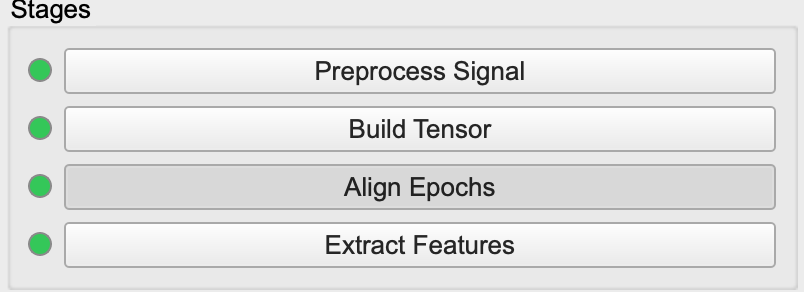

| Control | What it does | What it affects | Availability / blocking rule |
| --- | --- | --- | --- |
| Stage indicators | Show readiness for each stage. | Navigation feedback only. | Read-only. |
| `Preprocess Signal` | Opens the preprocess page. | Active workspace page. | Enabled when the current record is valid for preprocessing. |
| `Build Tensor` | Opens the tensor page. | Active workspace page. | Usually requires a successful preprocess finish. |
| `Align Epochs` | Opens the alignment page. | Active workspace page. | Usually requires tensor outputs and a selected record. |
| `Extract Features` | Opens the feature page. | Active workspace page. | Usually requires finished alignment outputs. |

## 6. Preprocess Signal

Follow the page in order: **0 Raw → 1 Signal Repair → 2 Filter →
3 ECG Artifact Removal → 4 Annotations → 5 Finish**. Each step's controls,
Advance settings, and review behavior appear together below. PSD and TFR
provide additional QC views of any eligible step output.

**Shared step behavior**

`Raw` and `Finish` are required. `Signal Repair`, `Filter`, `ECG Artifact Removal`, and
`Annotations` are optional and retain this displayed order. An absent gray or
checked-Skip optional step is bypassed, so each later step reads the nearest
earlier green output. `Finish` may therefore promote Annotations, ECG,
Filter, Signal Repair, or Raw. The finished output contains zero-duration `EDGE` markers at
the physical recording start and last sample. Preprocess never removes BAD
samples or stitches retained spans. Successful gap interpolation replaces only
its BAD_gap support with INTERPOLATED_gap; other BAD and EDGE annotations remain
attached to the continuous timeline for downstream masking.

An indicator is gray when a step has not been run, green when its current output
completed successfully, and yellow when a run is pending, failed, stale, or
invalid. Skip is an independent routing choice and never changes the owning
indicator: a skipped step can therefore remain green or yellow. A non-skipped
yellow step propagates yellow transitively and blocks later Apply actions; a
skipped yellow step is bypassed and does not propagate that block. Skip retains
existing files and run logs, records only the routing choice, and invalidates
later results when the effective source changes. An unexecuted Signal Repair
can be skipped without invalidating existing results or changing its gray state.

| Control | What it does | What it affects | Availability / blocking rule |
| --- | --- | --- | --- |
| Step indicators | Show readiness or staleness for each preprocess step. | User feedback only. | Read-only. |
| `Skip` (optional steps) | Checkable routing toggle. Checked excludes the step from downstream source selection; clicking it again clears Skip and reintroduces the unchanged underlying run state. It never changes the step indicator, artifact, run log, or pending Filter Preview. Each button remains in the owning panel's action row. | `preproc/<step>/routing.yml` and every later result. | Filter, ECG, and Annotations require a green/yellow owning step and a resolved preceding route for the first click. Signal Repair also permits skipping an unexecuted gray step. A checked Skip remains enabled for the second click. Successful Apply also clears Skip. Clearing Skip reintroduces a yellow underlying step as a downstream blocker. |
| `Apply` buttons | Execute the corresponding preprocess step. | Step outputs and downstream freshness. | Optional-step controls become available after Raw succeeds; Finish requires at least one valid source. |
| `Plot` buttons | Open a plot for the current step output. | Human QC only. | Require a successful corresponding step output. |

### 6.1 Step 0: Raw

| Control | What it does | What it affects | Availability / blocking rule |
| --- | --- | --- | --- |
| `Raw` indicator | Reports raw-step readiness. | User feedback only. | Read-only. |
| `Plot` (Raw) | Opens accepted Raw for annotations (including BAD time ranges) and whole-channel bad editing. If Raw is stale or not yet accepted, opens canonical rawdata for pending review. | Normal close atomically saves edits to `preproc/raw/raw.fif` and its log with a fresh Raw generation; canonical rawdata is never modified. Pending acceptance includes browser edits. Changed Raw invalidates this record's downstream Preprocess, Tensor, Alignment, and Features results. | Unchanged accepted Raw close is a no-op. Deleted/replaced results or changed accepted generations cannot be overwritten by an old window. Pending acceptance requires an unchanged canonical source and ordinary close, with a final pre-promotion check. Retained stale Raw without canonical input remains read-only. Double-precision saving preserves untouched samples. |
| `Restore` (Raw) | Opens a confirmation naming the selected subject and record. | No files change until restoration is confirmed. | Requires both canonical Rawdata and an existing `preproc/raw/raw.fif`; available even when Raw is yellow. Disabled without a record, with either file missing, or while the main window is locked by a plot or processing operation. |
| `Restore` (confirmation) | Replaces the current Raw with the canonical Rawdata FIF file set, including its original annotations and whole-channel bad marks. | Discards Raw Plot edits, accepts Raw as green, and makes this record's dependent Preprocess, Tensor, Alignment, and Features results stale. Output files, parameter drafts, and Skip choices are retained; no processing runs automatically. | Requires confirmation for the same selected record. A changed record or active operation cancels the action. Copy or replacement failure preserves the previous Raw and log. |
| `Cancel` (Restore confirmation) | Closes the confirmation without restoring Raw. | No changes to Raw, logs, or downstream state. | Default button in the confirmation. |

Raw Restore reads
`<project>/rawdata/<subject>/ses-postop/lfp/<record>/raw.fif` and replaces the
FIF set under
`<project>/derivatives/lfptensorpipe/<subject>/<record>/preproc/raw/`.
It preserves the Rawdata source and restores any annotations or bad channels
already present there; it does not simply clear all labels. After successful
replacement, the previous Raw files and log are moved to Trash. If Trash is
unavailable, those files remain at the locations reported in the status message.
A Plot opened before Restore cannot save over the restored Raw. See the
[Raw Restore walkthrough](APP_TUTORIAL.md#512-restore-the-original-raw) for the
confirmation and follow-up steps.

### 6.2 Step 1: Signal Repair

Signal Repair interpolates eligible gaps and transient peaks in accepted Raw.
It preserves the continuous time axis, channel order, and sample count. Gap and
peak interpolation are independently enabled and disabled by default.

| Control | What it does | Availability / effect |
| --- | --- | --- |
| `Interpolate gaps` | Enables interpolation of short intervals labeled exactly `BAD_gap`, ignoring case. | Enables the Gap interpolation group in Advance. |
| `Interpolate peaks` | Enables detection and interpolation of transient peaks. | Enables the Peak interpolation group in Advance. |
| `Advance` | Opens independent gap and peak settings. | Requires current Raw input. |
| `Apply` | Detects eligible intervals, repairs them from Raw, and saves the result and review list. | At least one repair type must be enabled with valid active parameters. |
| `Plot` | Opens the signal and Repair review list. | Requires a saved repair result. |
| `Skip` | Bypasses Signal Repair without deleting its saved result. | Reversible; an unexecuted gray repair step can also be skipped. |

#### 6.2.1 Advance: interpolation settings

The tables give factory defaults. Saved defaults and record-specific settings
can differ, as illustrated by the screenshots. Each group has its own method
and sample limits; disabled groups do not affect processing.

| Parameter | Factory default | Meaning and active condition |
| --- | --- | --- |
| `Interpolation method` | `Linear` | Linear joins the nearest usable sample on each side. PCHIP uses a shape-preserving piecewise cubic interpolant through surrounding context. Available independently for gaps and peaks. |
| `Max gap samples` | `1` | Maximum consecutive gap samples to replace; integer at least 1. Longer spans remain unrepaired. |
| `Max peak samples` | `1` | Maximum consecutive detected peak samples to replace; integer at least 1 for Amplitude MAD and Local z-score. Fixed at 1 and read-only for Local discontinuity. |
| `Duration` | Calculated | Read-only conversion of maximum sample count to milliseconds at the recording's sampling rate. Anchor samples are excluded. |
| `Context samples per side` | `2` | Surrounding samples on each side used by PCHIP; integer at least 2. Visible only for PCHIP. Linear uses one anchor on each side. |
| `Save` | — | Saves dialog values to the record draft; Apply computes the repair result. |
| `Set as Default` | — | Saves the current settings as application defaults. |
| `Restore Default` | — | Loads saved defaults into the dialog. |
| `Cancel` | — | Discards dialog edits. |

Repair uses eligible EEG, SEEG, ECoG, and DBS channels; globally bad channels
are excluded. Anchor/context samples must be finite and outside BAD/EDGE and
existing interpolation support. Repair does not cross annotated point boundaries
or use a detected peak as an anchor. Intervals that
are too long or lack valid surrounding support remain unchanged. Accepted gap
repair replaces only the repaired time/channel support of BAD_gap with
INTERPOLATED_gap; other BAD and EDGE annotations retain their meaning.

#### 6.2.2 Advance: peak detection

`Detection method` defaults to Amplitude MAD. Selecting a detector exposes only
its relevant fields. Larger thresholds require a stronger deviation before a
sample becomes a candidate. Sample-count and interpolation-support conditions
must also pass before that candidate can be repaired.

| Detector | Detection rule | Active parameters |
| --- | --- | --- |
| `Amplitude MAD` | Subtracts a rolling-median baseline and compares residual amplitude with a local median and robust scale (`1.4826 × MAD`). | Baseline window, detection window, MAD threshold. |
| `Local z-score` | Subtracts a rolling-median baseline and compares residual amplitude with the local mean and sample standard deviation. | Baseline window, detection window, Z-score threshold. |
| `Local discontinuity` | Tests a one-sample prediction residual and its entering/leaving slopes against separate left/right backgrounds. Both slopes must form a transient peak, and every threshold condition must pass. | Background window, guard interval, prediction residual threshold, boundary slope threshold. |

For Amplitude MAD and Local z-score:

| Parameter | Factory default | Meaning / units |
| --- | --- | --- |
| `Baseline window (s)` | `0.2` | Positive duration of the rolling-median baseline used before detection. |
| `Detection window (s)` | `1` | Positive duration of the local window used to estimate the detector's center and scale. |
| `MAD threshold` | `8` | Positive, dimensionless robust-deviation threshold for Amplitude MAD. |
| `Z-score threshold` | `3` | Positive, dimensionless standard-deviation threshold for Local z-score. |

The Local z-score screenshot uses a record-specific threshold of 5:

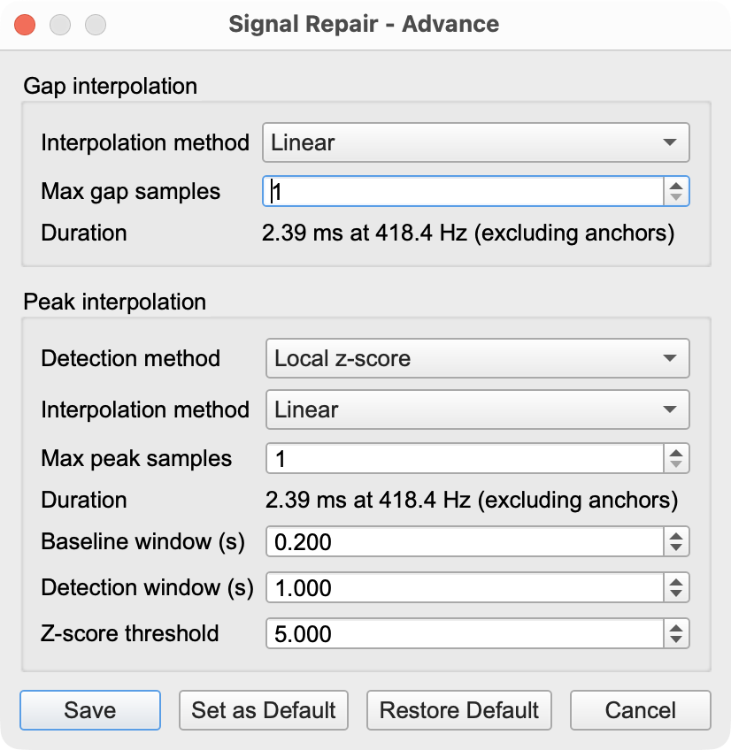

Selecting PCHIP exposes its context field. This Amplitude MAD example also uses
a record-specific threshold of 5:

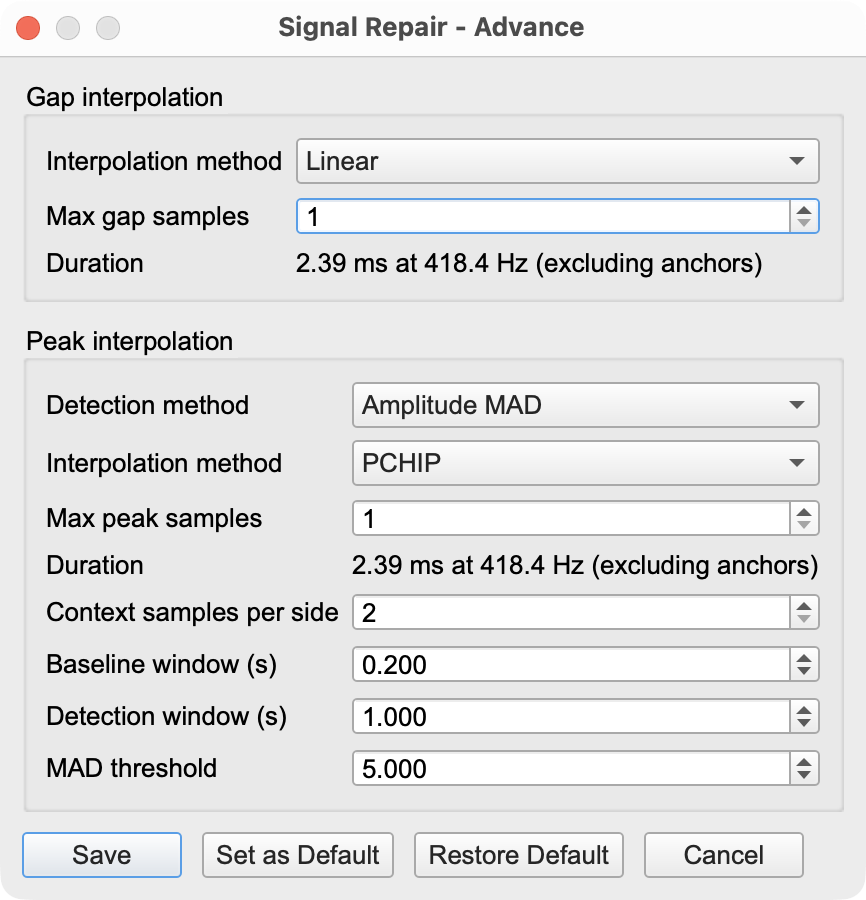

For Local discontinuity:

| Parameter | Factory default | Meaning / units |
| --- | --- | --- |
| `Background window (s)` | `1` | Total positive background duration, divided equally between the left and right sides, outside the guard intervals. |
| `Guard interval (ms)` | `10` | Additional duration excluded on each side of the candidate; zero is allowed. |
| `Prediction residual threshold` | `6` | Positive robust z threshold for deviation from the immediate neighbors' linear prediction, tested against both backgrounds. |
| `Boundary slope threshold` | `6` | Positive robust z threshold applied to both entering and leaving slopes against both backgrounds. |

Both robust thresholds use the background median and `1.4826 × MAD` scale.
Insufficient background support or zero scale does not produce a candidate.
The screenshot uses record-specific residual and slope thresholds of 5:

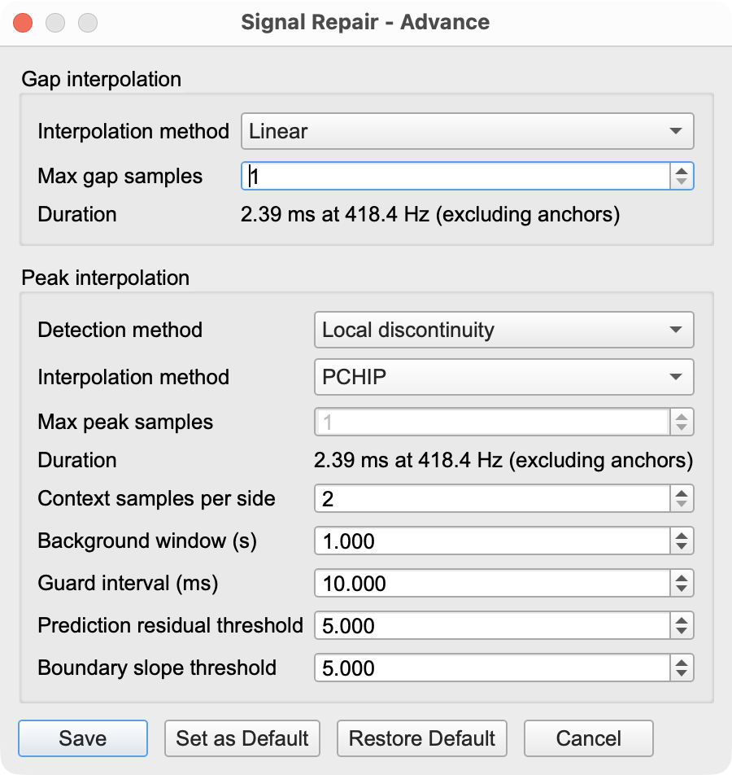

#### 6.2.3 Review: accept or reject an interpolation

Repair review lists reversible repairs with their channel, type, start, end,
sample count, and Accept state. Select a row to center its interval in the plot;
select the matching channel in the browser and zoom in to inspect individual
samples. Skipped candidates appear in the run report rather than in this list.

Checking Accept uses the saved interpolated samples and adds the managed
INTERPOLATED_gap or INTERPOLATED_peak label. Clearing it restores original
samples; rejecting a gap repair also restores its original gap annotation.
Manage these labels through the review list. Other annotations remain editable.
Closing Plot saves changed decisions and annotation edits. An unchanged review
does not rewrite the result or invalidate dependent stages.

See the [matched interpolation example](APP_TUTORIAL.md#524-compare-interpolation-with-the-original-sample)
for the same detected peak with Accept unchecked and checked.

### 6.3 Step 2: Filter

| Control | What it does | What it affects | Availability / blocking rule |
| --- | --- | --- | --- |
| `Notches` | Defines comma-separated notch-center frequencies for filter execution. Use it to suppress narrow contamination bands without changing the broader passband set by `Low freq` and `High freq`. Leave it blank to disable FIR notch processing; enabled window models require at least one center. Active removePLI displays generated harmonics read-only and retains the manual list. | Filter output. | Every provided value must be finite, positive, and below the input Nyquist frequency. Unsupported values block Apply instead of being silently dropped. |
| `Low freq` | Sets the high-pass cutoff frequency. Raising it removes more slow drift and movement-related low-frequency content, but it can also remove genuine low-frequency neural signal. Leave it blank to disable high-pass filtering. | Filter output. | A provided value must be finite and nonnegative. |
| `High freq` | Sets the low-pass cutoff frequency. Lowering it removes more high-frequency noise, but it also narrows the usable signal band for later tensor analysis. Leave it blank to disable low-pass filtering. | Filter output. | A provided value must be finite, positive, and strictly below the input Nyquist frequency. A value at or above Nyquist shows a blocking warning; it is not automatically clipped. |
| `Advance` (Filter) | Opens advanced filter parameters. | Filter session/default parameters. | Enabled when raw data is available. |
| `Apply` (Filter) | Creates a detection-filtered review Preview and runs automatic BAD detection. It does not accept the Preview as the scientific Filter result. | Pending Filter review state only; an earlier accepted Filter generation and its downstream results are not invalidated until finalization succeeds. The complete currently visible record draft, including blank cutoffs, is retained after the action. | Requires successful Raw and valid filter parameters. A successful Apply turns Filter yellow and temporarily blocks later preprocess actions until the Preview is closed and finalized. Existing later Preprocess indicators project yellow while never-run gray indicators stay gray. |
| `Plot` (Filter) | Opens a pending review Preview, or an existing accepted Filter result when no Preview is pending. Closing a Preview automatically refilters from the selected upstream Raw or Signal Repair and accepts it without a confirmation dialog. Closing an accepted result refilters only after annotations or bad-channel selections changed. | Reviewed annotations, accepted Filter output, and dependent-stage freshness after a real accepted change. Independent BAD-boundary filtering and optional `EDGE_filter` marking follow the two Filter Advance controls. | Unavailable before the first successful Apply when no accepted Filter result exists. Available for a valid yellow `review_required` Preview or a green finalized result; other yellow states remain blocked. |

Low freq and High freq are independently optional: blank disables the
corresponding high-pass or low-pass operation. With Model off, blank Notches
disables FIR notches. Leave all three basic fields blank and keep Model off to
disable all frequency filtering. Apply and review retain those blank values.
Step actions retain the complete visible record draft, including unrelated
parameter fields and Skip choices.

#### 6.3.1 Advance: FIR, artifact detection, and boundaries

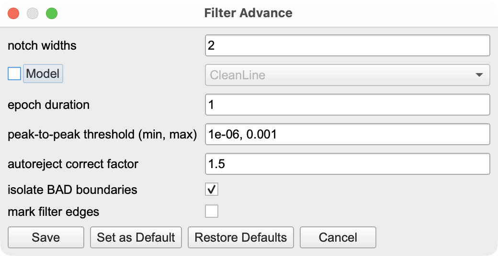

| Control | What it does | What it affects | Availability / blocking rule |
| --- | --- | --- | --- |
| `notch widths` | Sets the FIR bandwidth in Hz for each configured notch (factory default: 2 Hz). One value applies to all centers; a list supplies one per center. Inactive while Model is enabled. Wider values remove more contamination around the notch center, but they also suppress more nearby neural signal. | Filter output. | Requires positive finite values and a matching list length. |
| `epoch duration` | Sets the complete-window length in seconds (factory default: 1 s) used by bad-span detection helpers. Filter evaluates every complete regular-grid window and, when needed, one additional complete window aligned to the final Raw sample so the recording tail is covered. Shorter windows react to brief artifacts, while longer windows emphasize more sustained contamination patterns. | Filter-related artifact detection behavior. | Must be finite and positive. No samples are padded and no incomplete tail window is evaluated. If the recording is shorter than one complete window, Apply is rejected and asks the user to reduce Epoch duration. |
| `peak-to-peak threshold (min, max)` | Defines the amplitude range in volts (factory default: 1e-6, 1e-3 V, equivalent to 1–1000 µV) treated as acceptable during bad-span detection. Tighter thresholds flag more segments as artifacts, while wider thresholds are more permissive. Leave the whole field blank to disable only fixed peak-to-peak rejection; AutoReject remains active. | Filter-related artifact detection behavior. | Must be blank or two finite values satisfying `0 <= min < max`; a partially filled pair is invalid. |
| `autoreject correct factor` | Scales the automatically estimated rejection thresholds (factory default: 1.5). Use it when the default AutoReject behavior is systematically too strict or too permissive for the current recording. | Filter-related artifact detection behavior. | Must be finite and positive. |
| `isolate BAD boundaries` | Selects how the accepted Filter result is produced when the review Preview is finalized. Checked by default: every valid interval between global or channel-specific BAD/EDGE boundaries is filtered independently. Unchecked: the reviewed recording is filtered continuously, exactly like whole-Raw filtering. | Accepted Filter numeric values. | Must be checked or unchecked; changing it makes an existing Filter result stale. |
| `mark filter edges` | When BAD-boundary isolation is enabled, optionally marks the exact support of the active filter and notch model at every valid-segment edge as system-owned `EDGE_filter`. Unchecked by default accepts MNE padding results without adding these annotations. | Accepted Filter annotations only; it does not change the filtered numeric values. | Enabled only while `isolate BAD boundaries` is checked. An inconsistent persisted pair is invalid. |
| `Save` | Saves current advanced values to the session. | Current filter session parameters. | May retain invalid values as a red record draft; Filter Apply and valid-only persistence remain blocked. |
| `Set as Default` | Saves current advanced and basic filter values as defaults. | Future default filter settings. | Blocks on invalid values. |
| `Restore Defaults` | Restores saved default values. | Current dialog fields. | Always available. |
| `Cancel` | Closes the dialog without saving. | No session/default update. | Always available. |

AutoReject estimates its channel thresholds from eligible regular-grid windows
only, then evaluates those thresholds on all eligible windows, including the
end-aligned tail window. A rejected window is marked over its complete duration.

When `isolate BAD boundaries` is checked, BAD/EDGE endpoints are assigned to
Raw-relative source samples with MNE rounding. Positive intervals use
half-open source-index support; if both endpoints round to the same index, the
interval creates neither invalid support nor a point split. A true
zero-duration annotation creates one rounded processing boundary without
marking that sample invalid. Every non-empty valid interval is filtered,
including an interval shorter than twice the FIR support radius. Such a short
interval relies entirely on padding; `mark filter edges` marks it in full when
enabled and leaves it unmarked when disabled. Changing either control requires
Filter review finalization and makes later Preprocess steps and all downstream
Tensor, Alignment, and Features stale, including mask-disabled Tensor results.

Channels already listed in `raw.info["bads"]` remain present in Filter output
but do not participate in automatic peak-to-peak or AutoReject BAD-window
detection. Both detectors use the same remaining channel set. Filter Apply is
blocked when no usable detection channel remains; existing BAD time intervals
continue to participate in AutoReject threshold training.

#### 6.3.2 Advance: model-based notch removal

Enable `Model`, choose a method, and use `More model parameters` to expose its
additional fields. Model is off by default, with CleanLine selected. All four
methods retain independent drafts; only the enabled model's effective settings
affect computation. Basic Low freq and High freq remain active.

The tables give factory defaults. Saved defaults and record-specific values may
differ. Sinusoidal regression, MNE spectrum_fit, and CleanLine use the basic
Notches centers and require at least one. Each valid processing segment must
contain a complete model window. All target frequencies must be below Nyquist.
removePLI generates its own centers and displays them read-only in Notches while
retaining the manual list. Unsupported active settings block Apply.

##### Sinusoidal regression

Fits the configured sinusoidal components in overlapping windows and subtracts
the reconstructed waveforms. Each window uses least-squares sine/cosine
regression at the requested frequencies; the fitted constant is retained.
Mewett et al. (2001) provide related regression-subtraction background
([references](#filter-model-references)). LFP-TensorPipe estimates the components
within each processing window and blends overlapping estimates.

| Parameter | Factory default | Meaning / valid input |
| --- | --- | --- |
| `Window length (s)` | `4` | Positive estimation-window duration. |
| `Window overlap (%)` | `50` | Overlap between adjacent windows; at least 0 and less than 100. |

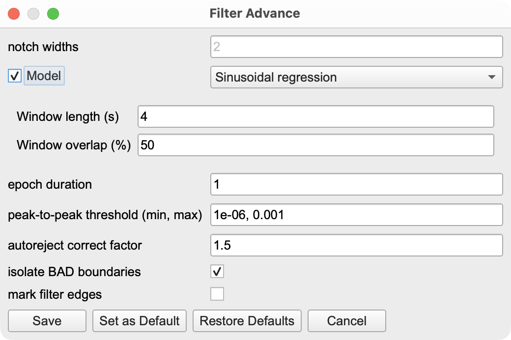

##### MNE spectrum_fit

Fits Fourier components around each notch center using MNE's multitaper
estimation and overlap-add reconstruction. The method reference recommended by
MNE is Mitra and Bokil (2008); Gramfort et al. (2013) describe the MNE-Python
software ([references](#filter-model-references)). LFP-TensorPipe supplies
explicit notch centers, so MNE's automatic F-test frequency detection is not
used for this model.

| Parameter | Factory default | Meaning / valid input |
| --- | --- | --- |
| `Window length (s)` | `4` | Positive fitting-window duration. MNE manages its overlap internally. |
| `Fit width (Hz)` | `1` | Full frequency width around each center. Nonnegative; 0 selects the nearest Fourier bin. Fitting bands must remain strictly inside Nyquist. |
| `Multitaper bandwidth (Hz)` | Blank (`Auto`) | Positive full bandwidth for line fitting, or blank for MNE's automatic choice. Exposed by More model parameters. |
| `Limit over-subtraction` | Off | Enables background-scaled subtraction, described below. |
| `Background radius (Hz)` | `10` | Positive radius on each side of a requested center used to find background candidates; active only with Limit over-subtraction. |
| `Background bandwidth (Hz)` | `1` | Positive full multitaper bandwidth for the separate background PSD; active only with Limit over-subtraction. Window length × bandwidth must be at least 3. |

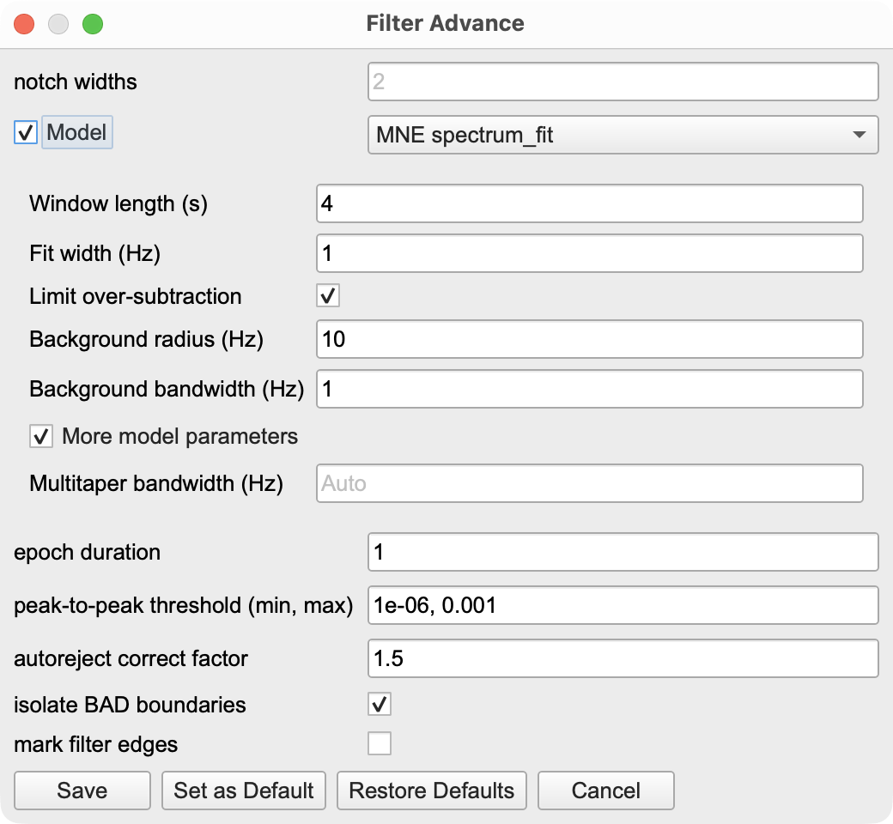

##### CleanLine

Detects significant line components in sliding multitaper windows. Frequency
search and global or channel-specific significance thresholds determine which
components are removed. LFP-TensorPipe uses a Python translation of SCCN's
CleanLine implementation. Mullen's CleanLine documentation describes the method
and cites Mitra and Bokil, Section 7.3.4, for its multitaper regression and line
detection basis ([references](#filter-model-references)).

| Parameter | Factory default | Meaning / valid input |
| --- | --- | --- |
| `Window length (s)` | `4` | Positive estimation-window duration. |
| `Window overlap (%)` | `50` | Window overlap, at least 0 and less than 100. |
| `Frequency search` | On | Searches around each center; when off, tests its nearest frequency bin. |
| `Search radius (Hz)` | `0.5` | Positive radius around each center for search. Also defines exclusion around detected peaks during background-scaled subtraction, so it remains active when Limit over-subtraction is on. |
| `Significance threshold` | `0.01` | Global F-test p-value threshold, strictly between 0 and 1. Smaller values remove fewer components. Exposed by More model parameters. |
| `Per-channel thresholds` | Off | Enables channel-name overrides edited with Configure. |
| `Configure...` | No overrides | Opens channel thresholds. Blank cells inherit the global threshold; explicit values must be strictly between 0 and 1. |
| `Multitaper bandwidth (Hz)` | `2` | Positive full bandwidth for line fitting, independent of search radius. Exposed by More model parameters. |
| `Limit over-subtraction` | Off | Enables background-scaled subtraction. |
| `Background radius (Hz)` | `10` | Positive radius for background candidates on both sides; active only with Limit over-subtraction. |
| `Background bandwidth (Hz)` | `1` | Positive full bandwidth of the background PSD, independent of fitting bandwidth. Active only with Limit over-subtraction; window length × bandwidth must be at least 3. |

The screenshot uses a record-specific search radius of 1 Hz and enables
Limit over-subtraction:

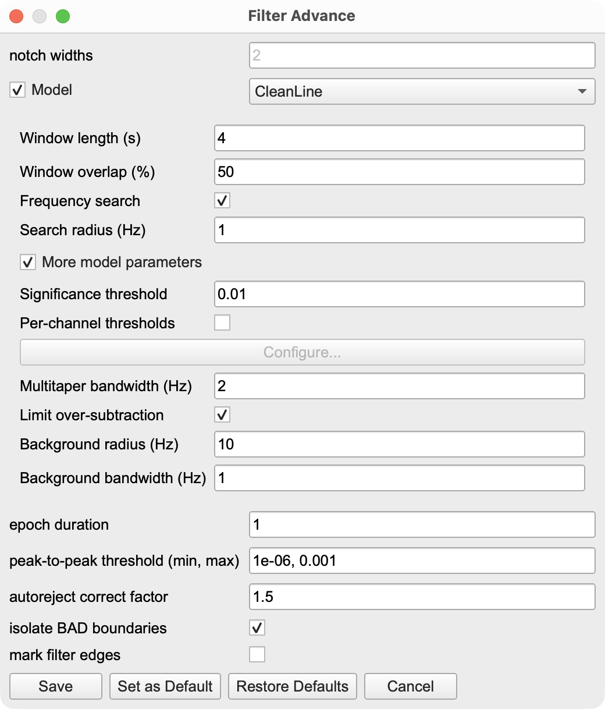

An active override for an absent channel blocks Apply until it is cleared or
overrides are disabled. Disabling overrides retains their drafts. Only effective
threshold changes make Filter stale; inactive drafts and overrides equal to the
global threshold do not. Run reports record each channel's effective threshold.

##### removePLI

Tracks a fundamental and its harmonics with adaptive frequency, amplitude, and
phase estimates. Settling and transition times specify time to reach 95% of the
corresponding asymptotic response. LFP-TensorPipe uses a Python translation of
Keshtkaran's removePLI implementation of Keshtkaran and Yang (2014)
([references](#filter-model-references)).

| Parameter | Factory default | Meaning / valid input |
| --- | --- | --- |
| `Fundamental frequency (Hz)` | `50` | Positive base frequency. Its ±2 Hz estimator band must fit within the available frequency range. |
| `Harmonic count` | `2` | Positive integer; generates fundamental × 1 through fundamental × count. All centers must remain below Nyquist. |
| `Amplitude/phase settling time (s)` | `1` | Positive adaptation time for the reconstructed harmonic components. |

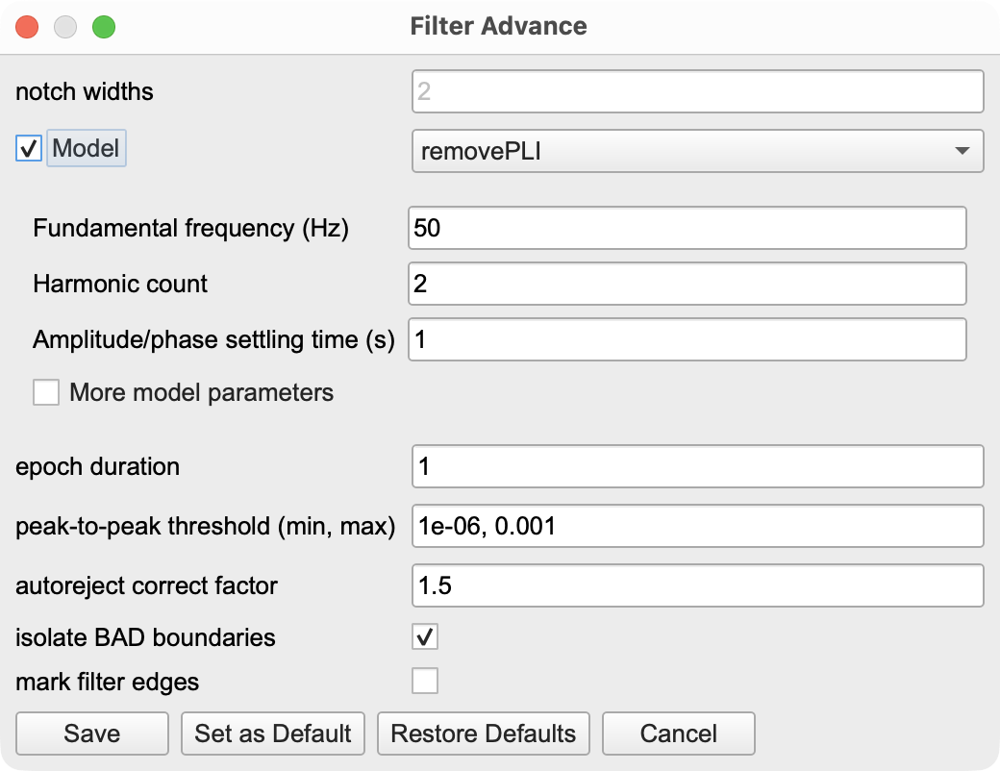

Expand More model parameters for frequency tracking:

| Parameter | Factory default | Meaning / valid input |
| --- | --- | --- |
| `Initial tracking bandwidth (Hz)` | `50` | Positive starting bandwidth of the frequency estimator. |
| `Final tracking bandwidth (Hz)` | `0.2` | Positive settled bandwidth of the frequency estimator. |
| `Bandwidth transition time (s)` | `1` | Positive transition duration from initial to final tracking bandwidth. |
| `Initial frequency settling time (s)` | `0.1` | Positive initial response time of frequency tracking. |
| `Final frequency settling time (s)` | `4` | Positive settled response time of frequency tracking. |
| `Settling-time transition (s)` | `1` | Positive transition duration between initial and final frequency settling times. |

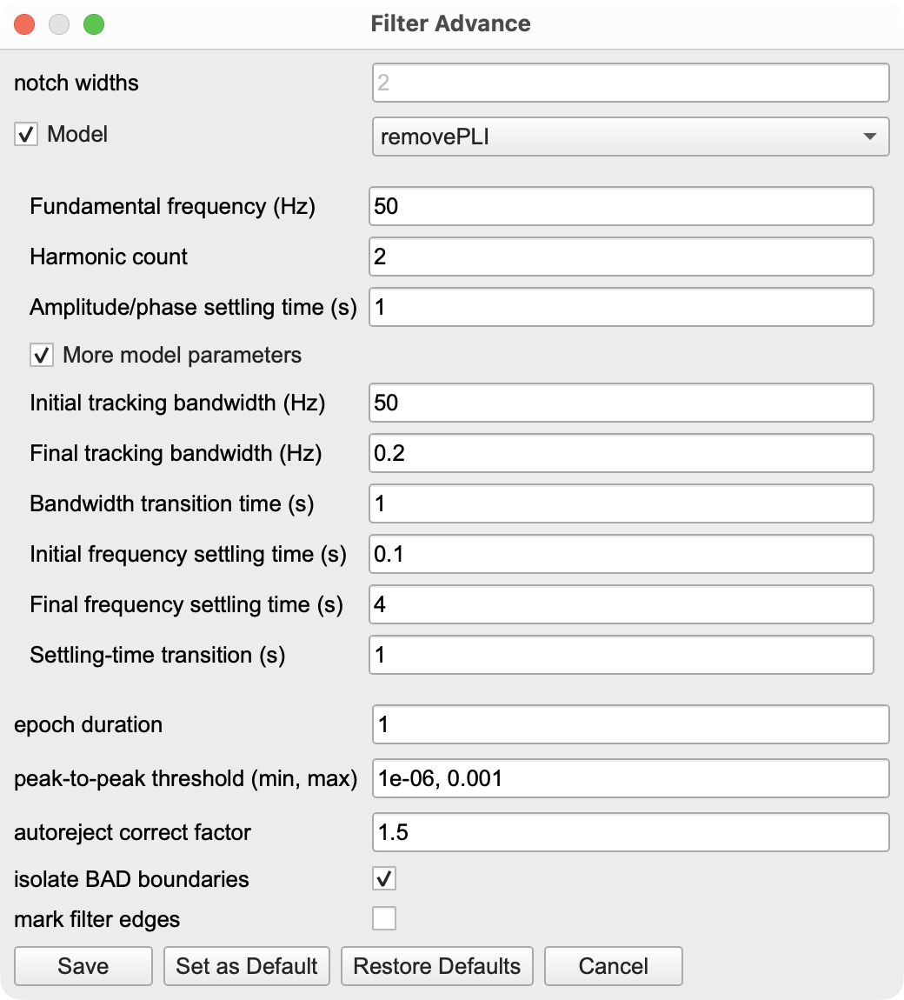

##### Background-scaled subtraction

CleanLine and MNE spectrum_fit provide `Limit over-subtraction`, off by default.
This background-scaling step is an LFP-TensorPipe extension to the cited line
estimators. Each method has independent `Background radius (Hz)` and `Background bandwidth
(Hz)` values, initially 10 and 1. Background bandwidth controls a separate
multitaper PSD estimate; it does not set the line-fitting bandwidth.

When enabled, each fitted target waveform receives one nonnegative coefficient
per channel and processing segment. Coefficients may exceed one. The objective
compares residual power with a background fitted from both sides of the excluded
noise band; it does not enforce a hard frequency-by-frequency power floor.
Background points must lie inside the configured passband and outside fitted or
detected noise bands. Insufficient background support leaves the component
unsubtracted and is reported. Overlapping target exclusions that cannot be
assigned independently are rejected.

Use Plot to inspect remaining peaks and depressions. A smoother PSD alone does
not demonstrate recovery of the underlying signal or phase. Reports include the
channel, segment bounds, target, background fit, coefficient, residual error,
downward deviation, and convergence. Finalization recomputes them from the
original source under the reviewed boundaries. Adaptive coefficients depend on
the complete processing segment; `mark filter edges` can therefore mark that
whole segment. Inactive background controls do not affect freshness.

##### Filter model references

- **Sinusoidal regression — methodological background:** Mewett DT, Nazeran H,
  Reynolds KJ. (2001). *Removing power line noise from recorded EMG*.
  Proceedings of the 23rd Annual International Conference of the IEEE
  Engineering in Medicine and Biology Society, 3:2190–2193.
  [Author-institution record and paper](https://fac.flinders.edu.au/items/60faac19-6daa-4af0-8605-b68b19403b72).
  The paper estimates sine/cosine coefficients from a quiet interval; the model
  here fits each overlapping window and does not require a separate quiet
  interval.
- **MNE spectrum_fit — method and software:** Mitra P, Bokil H. (2008).
  *Observed Brain Dynamics*. Oxford University Press, Section 7.3.4.
  DOI: [10.1093/acprof:oso/9780195178081.001.0001](https://doi.org/10.1093/acprof:oso/9780195178081.001.0001).
  This is the method citation requested by the
  [MNE notch_filter documentation](https://mne.tools/stable/generated/mne.filter.notch_filter.html).
  For MNE-Python itself: Gramfort A, Luessi M, Larson E, et al. (2013).
  *MEG and EEG data analysis with MNE-Python*. Frontiers in Neuroscience, 7:267.
  DOI: [10.3389/fnins.2013.00267](https://doi.org/10.3389/fnins.2013.00267).
- **CleanLine — software and method:** Mullen T. *CleanLine: EEGLAB plugin*.
  SCCN, University of California San Diego.
  [Official documentation](https://eeglab.org/plugins/cleanline/) and
  [upstream implementation](https://github.com/sccn/cleanline).
  The method background is Mitra and Bokil, *Observed Brain Dynamics*, Section
  7.3.4, cited above. This is a software reference with a separate methodological
  source.
- **removePLI — algorithm and implementation:** Keshtkaran MR, Yang Z. (2014).
  *A fast, robust algorithm for power line interference cancellation in neural
  recording*. Journal of Neural Engineering, 11(2):026017.
  DOI: [10.1088/1741-2560/11/2/026017](https://doi.org/10.1088/1741-2560/11/2/026017).
  [Author manuscript](https://arxiv.org/abs/1402.6862) and
  [upstream implementation](https://github.com/mrezak/removePLI).

#### 6.3.3 Review and values inside BAD/EDGE intervals

Preview and accepted Filter outputs store filtered values inside excluded
intervals. With boundary isolation enabled, each affected channel obtains a
continuous filtered reference from the original channel. Only excluded samples
are copied from that reference; every valid interval is filtered independently
from its original samples. The reference never supplies valid-segment estimator
input. A point annotation splits intervals without excluding a sample; an
all-BAD channel retains the continuous filtered reference.

This policy applies to FIR and all four models. It preserves BAD/EDGE annotations
and their downstream exclusion meaning. Short excluded intervals need no separate
model fit, although the full recording must support the chosen model. CleanLine
reference diagnostics are recorded separately from valid-segment diagnostics.
An unchanged Plot closes without recomputation; reviewed edits regenerate Filter
from the original source. Accepted changes affect Filter's dependent results only.

In any editable MNE Raw plot, press `a` to enter annotation mode and drag across
the signal to create an all-channel interval. To make the interval
channel-specific, hold `Shift` and left-click its shaded region over each
affected trace. A channel-specific interval uses a lighter fill and dashed
outline. Clicking a channel name instead marks or unmarks the entire channel in
`raw.info["bads"]`; it does not scope one annotation interval. Global BAD/EDGE
intervals mask every local channel and connectivity pair. A channel-specific
interval masks only that local channel and connectivity pairs containing it.

### 6.4 Step 3: ECG Artifact Removal

| Control | What it does | What it affects | Availability / blocking rule |
| --- | --- | --- | --- |
| `Method` (ECG) | Chooses the ECG artifact-removal strategy. | ECG step parameters. | Available after Raw succeeds and the earlier optional steps are absent/gray, green, or bypassed by checked Skip. |
| `Channels` (ECG) | Opens the ECG channel selector. | ECG channel subset. | Requires channels from the current valid ECG input source. |
| `Advance` (ECG) | Opens method-specific ECG parameters and the shared `mark filter edges` review policy. | Current-record and global ECG defaults. The review policy is independent of template, perceive, and SVD algorithm parameters. | Available after Raw succeeds and the earlier route is resolved. |
| `Apply` (ECG) | Runs ECG artifact removal. | ECG-cleaned signal. | Requires Raw, valid ECG settings, and a resolved earlier route: absent/gray, green, or bypassed by checked Skip. |
| `Plot` (ECG) | Plots ECG-cleaned output and saves accepted annotation or bad-channel edits on close. With `mark filter edges` enabled, newly added or expanded `BAD*` support is surrounded by the exact accepted Filter support and recorded as `EDGE_filter_post_ecg`. | ECG annotations and downstream freshness; ECG-cleaned numeric samples are not recomputed. | Requires successful ECG output. Filter-edge marking requires that ECG consumed the current accepted Filter generation; when Filter is skipped the policy is disabled and false. Existing upstream BAD support cannot be shortened or removed here. |

#### 6.4.1 Method and Advance parameters

The screenshot below shows the method dropdown used by the ECG block. The ECG
action row also provides `Advance`, `Apply`, and `Plot`; the screenshot is kept
as the method-selector reference and does not illustrate the Advance dialog.

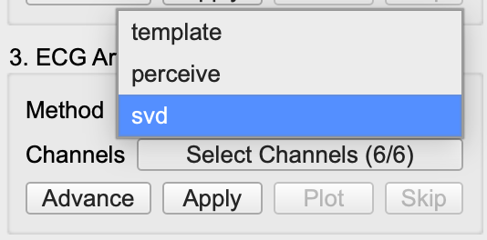

| Control | What it does | What it affects | Availability / blocking rule |
| --- | --- | --- | --- |
| `Save` | Saves the displayed parameters for the current record and method without running ECG removal. | Current-record ECG parameters and freshness state. | May retain an invalid cross-field combination as a red record draft; ECG Apply and valid-only persistence remain blocked. |
| `Set as Default` | Saves the displayed values as global defaults for the selected method. | Future records without saved ECG parameters. | Blocks on invalid values. |
| `Restore Defaults` | Loads the selected method's global defaults into the dialog. | Dialog fields only until Save is selected. | Always available. |
| `Cancel` | Closes the dialog without changing record parameters. | No record update. | Always available. |

The current GUI exposes three ECG-suppression methods:

- `template`: builds a heartbeat-locked ECG template and subtracts that template
  from the signal. It is intuitive and widely used, but can become more
  sensitive when the ECG artifact shape varies over time.
- `perceive`: follows the Perceive-toolbox style QRS interpolation approach,
  replacing contamination around detected heartbeats by interpolation-based
  suppression. It is useful when you want a method that works directly around
  heartbeat windows rather than fitting a reusable artifact template.
- `svd`: uses singular value decomposition on heartbeat-aligned segments to
  isolate dominant ECG components before reconstructing a cleaned signal. It is
  usually more flexible than the other two approaches, but its performance
  depends more strongly on the chosen parameters.

`template` exposes the following Advance parameters:

| Control | Default | What it changes |
| --- | ---: | --- |
| `Baseline window (ms)` | 200 | Median-filter window used to estimate and subtract the local baseline before QRS peak detection. |
| `Peak height minimum (z-score)` | 2.5 | Minimum standardized QRS peak height. |
| `Limit maximum peak height` / `Peak height maximum (z-score)` | Disabled | Optional standardized peak-height upper limit. |
| `Minimum interpeak interval (ms)` | 300 | Minimum distance between detected QRS peaks. |
| `Peak orientation` | Dominant | Dominant, positive, or negative peak detection. |
| `Pre-peak duration (ms)` | 150 | Epoch duration before each detected R peak. |
| `Post-peak duration (ms)` | 150 | Epoch duration after each detected R peak. |
| `Boundary tail (ms)` | 60 | Search width used for template cropping. |
| `QRS duration (ms)` | 120 | Expected QRS duration used during template cropping. |
| `Use full PQRST` | Disabled | Uses the full PQRST epoch instead of the QRS crop. |

`svd` exposes every `template` parameter plus:

| Control | Default | What it changes |
| --- | ---: | --- |
| `SVD components` | 2 | Number of leading components used to reconstruct the ECG artifact. |

`perceive` exposes:

| Control | Default | What it changes |
| --- | ---: | --- |
| `Epoch length (ms)` | 1000 | Initial non-overlapping template epochs. |
| `Baseline window (ms)` | 200 | Median-filter window used to estimate and subtract the local baseline before cross-correlation alignment of the initial template epochs. |
| `Amplitude threshold (µV)` | 200 | Amplitude threshold used to identify QRS template boundaries. |
| `Crop padding (ms)` | 15 | Padding around the detected QRS template. |
| `Minimum heart rate (BPM)` | 40 | Minimum plausible heart rate. |
| `Maximum heart rate (BPM)` | 180 | Maximum plausible heart rate. |
| `Threshold mode` | Data-driven | Data-driven or manual correlation-threshold search. |
| `Threshold start` | Data-driven | Manual correlation-threshold starting value. |
| `Threshold step` | Data-driven | Manual correlation-threshold increment. |
| `Maximum attempts` | 100 | Maximum threshold-search attempts. |
| `Pass rate (%)` | 95 | Required fraction of valid inter-beat intervals. |
| `Before peak (ms)` | 50 | Duration before each peak in the refined template. |
| `After peak (ms)` | 100 | Duration after each peak in the refined template. |
| `Enforce maximum interval` | Enabled | Enforces both minimum and maximum inter-beat intervals. |

The current GUI default is `svd`, which matches the code path in the ECG step.
That default is a software default only, not a universal recommendation for all
recordings.

Further reading:

- Stam MJ, van Wijk BCM, Sharma P, et al. *A comparison of methods to suppress
  electrocardiographic artifacts in local field potential recordings*.
  *Clinical Neurophysiology*. 2023;146:147-161.
  DOI: [10.1016/j.clinph.2022.11.011](https://doi.org/10.1016/j.clinph.2022.11.011)
- This paper compared Perceive QRS interpolation, template subtraction, and
  SVD for DBS-LFP ECG suppression, and concluded that SVD offered the preferred
  trade-off between artifact cleaning and signal preservation when tuned
  appropriately.
- Use that conclusion as method-selection context rather than as a hard rule;
  the best choice still depends on the artifact shape and how much neural signal
  preservation matters for the current recording.

#### 6.4.2 Review and filter-edge marking

ECG Advance exposes its own shared `mark filter edges` control, unchecked by
default. ECG Apply records the policy but does not create edge annotations.
When an ECG Plot closes after annotation edits, the application compares the
reviewed channel-aware `BAD*` sample support with the direct accepted Filter
input. It removes its prior system-owned `EDGE_filter_post_ecg` annotations and,
when marking is enabled, rebuilds exact support only around BAD samples or true
zero-duration BAD boundaries that were added or expanded after Filter. It uses
the accepted Filter log's integer `filter_support_radius_samples`; it does not
recompute the radius from seconds or current library defaults. Repeated review
therefore does not accumulate duplicate edges. The operation fails atomically
if the matching Filter generation cannot be verified. Filter-input BAD support
may be added to or expanded during ECG review but may not be shortened or
removed, because Filter and ECG may have intentionally skipped those samples.

### 6.5 Step 4: Annotations

| Control | What it does | What it affects | Availability / blocking rule |
| --- | --- | --- | --- |
| Annotation table | Shows the currently configured annotation rows. | Annotation payload. | Read-only except for row selection. |
| `Configure...` (Annotations) | Opens the annotation editor. | Current annotation rows. | Available after Raw succeeds and the earlier Filter/ECG route is resolved, including any checked Skip. |
| `Advance` (Annotations) | Opens the compact Annotations Advance dialog immediately from the right of `Configure...` in the first of two compact control rows. The second row contains `Apply`, `Plot`, and `Skip`, so no label is clipped at the default window width. | The current record's Annotations edge-marking policy. | Available whenever Annotations controls are available. |
| `mark filter edges` (Annotations Advance) | When enabled, rebuilds system-owned `EDGE_filter_post_annotations` around BAD support added or expanded by Annotations Apply or Plot. | Annotations only; numeric samples and BAD support are unchanged. | Off by default. Enabled only when the selected source lineage contains a current accepted Filter generation with an exact integer support radius. |
| `Apply` (Annotations) | Writes the configured annotations into the preprocess pipeline. Submitted onset values are seconds from the first retained sample; inherited source annotations keep their existing timing and channel scope when the rows are appended. A positive-duration row is clipped to its intersection with the Raw support, and a row with no temporal overlap is silently omitted. | Annotation output used by downstream steps. | Requires successful Raw and a structurally valid annotation set. Duration must remain finite and non-negative; onset may be negative when a positive-duration interval overlaps the Raw. Zero-duration points are retained only inside `[0,n_times/sampling_rate)`. The table, CSV, Raw, config, and log adopt the effective clipped/retained rows after a successful Apply. |
| `Plot` (Annotations) | Plots the annotated signal. | QC only. | Requires successful annotation output. |

#### 6.5.1 Configure annotations

| Control | What it does | What it affects | Availability / blocking rule |
| --- | --- | --- | --- |
| `Search` | Filters configured annotation rows. | Table browsing only. | Always available. |
| Annotation table | Lists the current annotation rows. | Saved annotation payload. | Read-only except for row selection and delete actions. |
| `Description` | Draft label for a new annotation row. | Draft row. | Required for a valid draft. |
| `Start` | Draft onset time in seconds. | Draft row. | Must be a finite number greater than or equal to zero. |
| `Duration` | Draft duration in seconds. Zero represents a point annotation. | Draft row. | Must be a finite number greater than or equal to zero. |
| `End` | Optional end time used to derive duration. | Draft row. | When supplied, it must be finite and greater than or equal to `Start`. |
| `Apply` | Adds the draft row. | Annotation table rows. | Requires a valid draft. |
| `Clear Draft` | Clears the current draft row. | Draft fields only. | Always available. |
| `Clear All` | Removes all configured annotation rows. | Annotation table rows. | Always available. |
| `Import Annotations` | Imports annotation rows from a CSV file. | Annotation table rows. | Requires non-empty descriptions and finite, non-negative onset/duration values. |
| `Save` | Saves the current annotation list back to Preprocess. | Annotation payload. | Blocks on invalid rows. |
| `Cancel` | Closes the dialog without saving. | No annotation update. | Always available. |

Annotation table and CSV onsets are record-relative: zero is the first retained
Raw sample. This applies to dated and undated recordings, including Raw files
with nonzero `first_samp`. Source annotations preserve their descriptions,
durations, channel scopes, and absolute-time reference. Apply clips intervals
to the record and writes the effective rows to `annotations.csv` and the run log.

### 6.6 Step 5: Finish

| Control | What it does | What it affects | Availability / blocking rule |
| --- | --- | --- | --- |
| `Finish` indicator | Reports readiness of the finalized preprocess output. | Downstream stage freshness. | Read-only. |
| `Apply` (Finish) | Writes the finalized preprocess result and adds zero-duration `EDGE` markers at its physical start and last sample. | Tensor, alignment, and feature inputs. | Requires the nearest green source in priority order Annotations, ECG, Filter, Signal Repair, Raw, excluding checked-Skip steps and with no unresolved yellow predecessor. |
| `Plot` (Finish) | Plots the finalized preprocess output. | QC only. | Requires successful finish output. |

Build Tensor applies a separate whole-channel eligibility rule to the accepted
`Finish` Raw. A channel listed in `finish/raw.fif` under `raw.info["bads"]`
remains available for preprocess QC, but it is not eligible for Tensor
computation. Channel metrics omit that channel, and connectivity metrics omit
every pair containing it. This exclusion is independent of `Mask Edge Effects`;
that control continues to govern annotation-derived time support only. Removing
the bad-channel mark and applying `Finish` again makes the channel eligible for
future selection, but does not add it automatically to an existing explicit
Tensor selection.

Applying a changed Finish result makes this record's Tensor metrics and their
Alignment/Features dependents stale. Other records remain unaffected.

### 6.7 PSD and TFR QC

| Control | What it does | What it affects | Availability / blocking rule |
| --- | --- | --- | --- |
| `Step` (Visualization) | Chooses which preprocess output the PSD/TFR QC views should read. | QC plotting source. | Always available once at least one eligible step exists. |
| `Advance` (PSD) | Opens PSD plot settings. | PSD QC session/default settings. | Always available. |
| `Plot` (PSD) | Plots PSD for the selected preprocess step and channels. | QC only. | Requires selected channels and an eligible preprocess step. |
| `Advance` (TFR) | Opens TFR plot settings. | TFR QC session/default settings. | Always available. |
| `Plot` (TFR) | Plots TFR for the selected preprocess step and channels, with red shadows over MNE-rounded sample support from positive-duration `BAD*`/`EDGE*` annotations. Channel-specific shadows follow the selected channels; a multi-channel averaged TFR uses their sample-support union. | QC only; Exclude BAD/EDGE isolates computation and leaves missing support as NaN. With exclusion off, shadows only annotate continuous estimates. | Requires selected channels and an eligible preprocess step. |
| `Channels` (Visualization) | Chooses channels used by PSD/TFR QC plots. | QC plotting channel subset. | Requires a current channel inventory. |

#### 6.7.1 PSD Advance

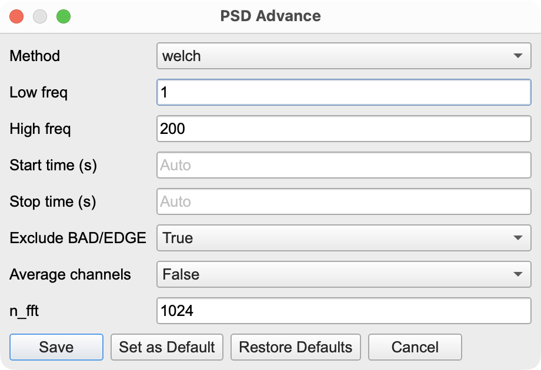

| Control | What it does | What it affects | Availability / blocking rule |
| --- | --- | --- | --- |
| `Low freq` | Sets the lower frequency bound shown in the PSD figure. It changes the QC view only and does not modify stored preprocess outputs. | PSD QC output. | Must be numeric. |
| `High freq` | Sets the upper frequency bound shown in the PSD figure. Keep it within the range that remains meaningful for the current sampling rate and preprocessing. | PSD QC output. | Must be numeric. |
| `n_fft` | Sets the Welch window and FFT length. Only complete windows contribute; shorter segments are dropped. | PSD QC behavior only. | PSD dialog only. |
| `Average` | Chooses whether PSD is averaged across the selected channels before plotting. Turn it off when you need to compare channels individually rather than as one summary trace. | PSD QC behavior only. | PSD dialog only. |
| `Save` | Saves the current PSD QC settings to the session. | Current PSD session parameters. | May retain invalid values as a red record draft; plotting and valid-only persistence remain blocked. |
| `Set as Default` | Saves the current PSD QC settings as future defaults. | Future PSD defaults. | Blocks on invalid values. |
| `Restore Defaults` | Restores the saved PSD defaults. | Current dialog fields. | Always available. |
| `Cancel` | Closes the dialog without saving. | No session/default update. | Always available. |

**Notes**

- `Low freq` and `High freq` only crop the PSD figure. They do not retroactively change the preprocess output.
- `n_fft` controls Welch window support and spectral sampling. It is inactive for Multitaper and Morlet.

#### 6.7.2 TFR Advance

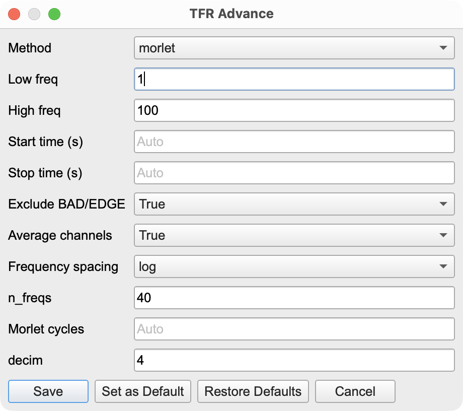

| Control | What it does | What it affects | Availability / blocking rule |
| --- | --- | --- | --- |
| `Low freq` | Sets the lower frequency bound shown in the TFR figure. It limits what is plotted, not what was stored in preprocess. | TFR QC output. | Must be numeric. |
| `High freq` | Sets the upper frequency bound shown in the TFR figure. Keep it within the range supported by the current preprocessing and sampling rate. | TFR QC output. | Must be numeric. |
| `n_freqs` | Sets how many frequency samples are drawn between `Low freq` and `High freq`. More samples create a denser frequency axis, but also increase runtime and memory use. | TFR QC behavior only. | TFR dialog only. |
| `Decim` | Sets the downsampling factor applied to the TFR time axis. Higher decimation speeds up plotting and reduces figure size, but it also makes short-lived structure harder to see. | TFR QC behavior only. | TFR dialog only. |
| `Save` | Saves the current TFR QC settings to the session. | Current TFR session parameters. | May retain invalid values as a red record draft; plotting and valid-only persistence remain blocked. |
| `Set as Default` | Saves the current TFR QC settings as future defaults. | Future TFR defaults. | Blocks on invalid values. |
| `Restore Defaults` | Restores the saved TFR defaults. | Current dialog fields. | Always available. |
| `Cancel` | Closes the dialog without saving. | No session/default update. | Always available. |

**Notes**

- `n_freqs` controls frequency-grid density, while `Decim` controls time-axis density. They solve different plotting problems.
- A heavily decimated TFR is useful for quick QC, but it can hide brief events that are still present in the underlying preprocess output.
- TFR shadows match `BAD` and `EDGE` as case-insensitive description prefixes and use MNE-rounded source-sample support. Global intervals always appear; channel-specific intervals appear only when at least one affected channel is selected. A merged-channel TFR displays the sample-support union across selected channels. Zero-duration points are not shaded, and the overlay does not alter TFR values.

#### 6.7.3 Spectral methods and missing support

PSD offers Welch, whole-segment Multitaper, and Morlet mean power. TFR offers
Morlet and Multitaper. Each method retains independent drafts; only its active
fields are validated. Shared controls include frequency bounds, optional
record-relative start/stop times (stop exclusive), channel averaging, and
`Exclude BAD/EDGE`, enabled by default.

Welch uses `n_fft` and its native frequency grid. Multitaper PSD uses each complete
valid segment and the selected full bandwidth in Hz. Morlet uses a frequency
grid and optional cycles; blank cycles use `max(2, frequency/4)`. Multitaper TFR
uses window duration T and full bandwidth B, with `n_cycles = frequency * T`
and `time_bandwidth = T * B`; T * B must be at least 2. Linear/log spacing and
frequency count set the grid. TFR Decim controls output time sampling only.

With exclusion on, each channel is split at its BAD/EDGE intervals and point
boundaries; separated samples are never concatenated. Segments too short for the
estimator are omitted and reported. Missing TFR kernel support remains NaN;
Morlet mean power uses only supported samples. Whole-segment PSDs interpolate
linear power within native frequency support onto a common display grid, without
extrapolation, and weight by contributing duration at each frequency. Welch uses
only complete windows. Missing outputs retain the requested shape with NaN.

Channel averaging uses equal-weight finite linear power before dB conversion.
There is no automatic notch exclusion or interpolation across missing frequency
values. PSD density uses microvolt squared per Hz; Morlet mean power and TFR
use estimator power in microvolt squared. All-NaN plots report that no data can
be estimated. With exclusion off, estimation is continuous and annotations appear
as shadows. These settings recompute only the requested QC plot, leaving saved
Preprocess, Tensor, Alignment, and Features results unchanged.

#### 6.7.4 Visualization channels

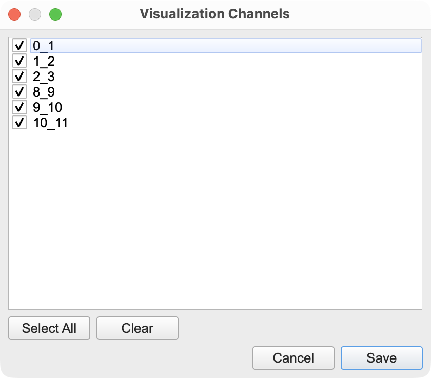

| Control | What it does | What it affects | Availability / blocking rule |
| --- | --- | --- | --- |
| Channel list | Chooses which channels are used by PSD/TFR QC plots. | QC plotting channel subset. | Requires a channel inventory. |
| `Select All` | Selects every available channel. | Current channel subset. | Always available. |
| `Clear` | Clears the current selection. | Current channel subset. | Always available. |
| `Save` | Saves the selected channel subset back to Preprocess. | Visualization channel draft. | May retain an empty red record draft; PSD/TFR plotting remains blocked until at least one channel is selected. |
| `Cancel` | Closes the dialog without saving. | No channel-subset update. | Always available. |

## 7. Build Tensor

The Build Tensor page manages metric selection, metric-local parameter editing,
and the execution of tensor generation.

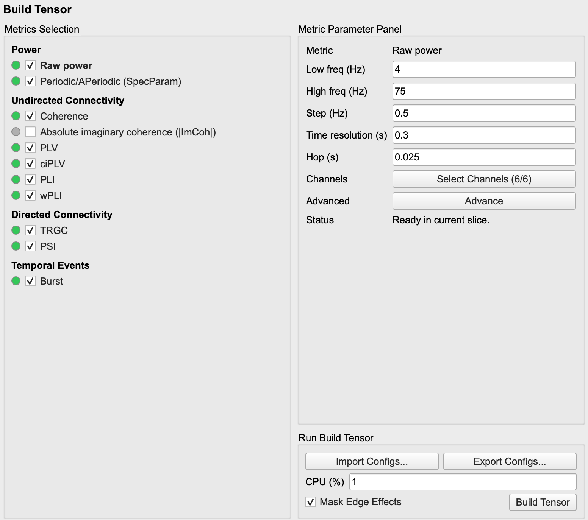

### 7.1 Metrics Selection

| Control | What it does | What it affects | Availability / blocking rule |
| --- | --- | --- | --- |
| Metric indicators | Show readiness for each metric under the current settings. A completed log whose metric signature is missing or malformed is yellow rather than current. | User feedback only. | Read-only. |
| Metric checkbox | Includes or excludes the metric from the next tensor build run. | Run payload. | Always available for supported metrics. |
| Metric name | Selects the active metric shown in the parameter panel. | Which metric is being configured on the right. | Always available for listed metrics. |

Metric indicators compare the effective channel or pair selection after Finish
bad-channel exclusion with the accepted result. The public
`tensor_metric_panel_state` API accepts an optional `channel_inventory`: a
supplied inventory is reused, while an omitted inventory is read from the
current record's Finish only when a completed result needs a current-signature
comparison. The GUI supplies its current inventory to avoid repeating that
read for every metric. If the inventory cannot be read, an existing completed
result is yellow rather than being validated against unfiltered selectors.
No record or no metric log retains the existing gray state. Existing lineage
and parameter checks still apply; this status check does not rerun computation
or invalidate artifacts.

### 7.2 Metric Parameter Panel and Run Block

| Control | What it does | What it affects | Availability / blocking rule |
| --- | --- | --- | --- |
| `Low freq` | Sets the lower bound of the frequency grid that will actually be computed for the active metric. It should stay inside the valid post-preprocess range, rather than being treated as a display-only crop. | Active metric configuration. | Shown only for metrics that expose it. |
| `High freq` | Sets the upper bound of the frequency grid that will actually be computed for the active metric. It cannot exceed the effective preprocess ceiling or the current Nyquist limit. | Active metric configuration. | Shown only for metrics that expose it. |
| `Step` | Sets the spacing between adjacent sampled frequencies. Smaller steps create a denser frequency grid, but they also increase runtime and output size. | Active metric configuration. | Shown only for metrics that expose it. |
| `Time resolution` | Sets the target Morlet time scale or target Multitaper window before cycle bounds. With Multitaper, `MT min cycles` may lengthen low-frequency windows and `MT max cycles` may shorten high-frequency windows. | Active metric configuration. | Shown only for metrics that expose it. |
| `Hop` | Sets the shift between adjacent analysis windows. Smaller hops make the time axis denser and smoother, but they also increase overlap and compute cost. | Active metric configuration. | Shown only for metrics that expose it. |
| `SpecParam freq range` | Sets the fitting range used by the SpecParam model, not the final display or export range. In practice, it is usually safer to keep this range slightly wider than the final `Low freq` and `High freq` bounds, allowing boundary frequencies to be trimmed using the final `Low freq` and `High freq` bounds because they are often not modeled reliably as oscillatory peaks. | Visible for periodic/aperiodic metrics. |
| `Percentile` | Sets the percentile used to convert the burst baseline into a burst-detection threshold. Higher percentiles make burst calls more conservative, while lower percentiles admit more candidate bursts. | Burst metric configuration. | Visible for burst metrics. Disabled while a structured external threshold snapshot is loaded because supplied thresholds replace percentile estimation. |
| `Bands Configure...` | Opens the named-band editor used by metrics that summarize results over frequency bands. Those named bands become part of the metric-specific aggregation or feature definition. | Active metric axis configuration. | Visible only for metrics that expose bands. Every Start/End value must be finite and satisfy `0 < Start < End`; invalid rows are rejected consistently by Apply and default persistence. |
| `Select Channels` | Opens the active metric's channel selector. Use it to limit computation to the channels that matter for that metric instead of computing every eligible channel. Channels marked bad in the accepted Finish Raw are excluded. | Active metric channel subset. | Visible for channel-based metrics and requires at least one usable Finish channel. |
| `Select Pairs` | Opens the active metric's pair selector. Use it when the metric is defined on channel pairs rather than on single channels. Pairs containing a channel marked bad in the accepted Finish Raw are excluded. | Active metric pair subset. | Visible for pair-based metrics and requires usable Finish channels. |
| `Advance` | Opens the advanced dialog for the active metric. This is where method-specific controls such as cycles, multitaper settings, smoothing, or connectivity-specific options are configured. | Active metric advanced settings. | Disabled for unsupported metrics. |
| `Status` | Reports the active metric state within the current slice. | User feedback only. | Read-only. |
| `Import Configs...` | Loads a tensor configuration payload. | Current page configuration. | Requires a selected record. |
| `Export Configs...` | Saves the current tensor configuration payload. | External tensor config file. | Requires a selected record. |
| `Mask Edge Effects` | Treats samples within annotations whose labels contain `bad` or `edge` as edge-affected. Non-Burst metrics apply their method-specific output mask. Burst applies the toggle before threshold estimation and event detection: checked makes the effective band-specific support invalid, while unchecked leaves annotated support eligible. | Runtime build behavior for every selected metric. | Always available. |
| `Build Tensor` | Runs tensor generation for all checked metrics after excluding channels listed in the accepted Finish Raw's `raw.info["bads"]`. | Tensor outputs for the current record. | Requires preprocess finish outputs and non-empty effective channel or pair selections for every checked metric. |

With no record selected, both selector buttons show `0/0`, remain disabled, and
use a neutral tooltip asking the user to select a record. They do not retain
channel names or bad-channel exclusions from the previously selected record.

If one or more metric results have already been accepted but the record-level
Build Tensor summary cannot be saved, the run result preserves those metric
outcomes and reports `Build Tensor stage summary warning:`. The application
still marks only the Alignment trials and Features that consume each changed
metric as stale. A stale summary file may remain on disk, but the
metric indicators and stage state continue to use accepted metric artifacts
and lineage rather than treating the summary as a scientific result.

The same authority boundary applies after `Stop`: individual metric success or
cancellation logs determine recovery. If only the aggregate cancellation
summary cannot be saved, the application records an operational warning,
invalidates dependents of successful metrics, and completes recovery instead of
leaving the controls locked. Failure to save an individual metric cancellation
log remains a recovery error and keeps the existing retry path.

**Parameter meaning**

- `Low freq`, `High freq`, and `Step` define the frequency grid.
- `Time resolution` and `Hop` define the time grid.
- `SpecParam freq range` is the fit envelope for periodic/aperiodic modeling, not a second copy of the final output bounds.
- `Mask Edge Effects` controls annotation-derived masking, not frequency
  cropping or algorithmic availability. PSI output centers without a complete
  centered averaging interval and kernel padding remain `NaN` for both methods
  when this control is off.
- Finish bad-channel exclusion is always active and is not controlled by `Mask
  Edge Effects`. If an explicit channel or pair selection becomes empty after
  exclusion, Build Tensor reports the affected metric instead of substituting
  unrelated channels or falling back to every Raw channel.
- When `Mask Edge Effects` is on, every finite output time and matched
  annotation endpoint is assigned to a Raw-relative source sample using MNE
  rounding. Positive-duration annotations use half-open source-index support;
  if both endpoints round to the same index, that positive interval has no
  sample support. Boolean output masks select coordinates assigned to the
  rounded sample of a true zero-duration annotation with no padding. Segment
  isolation instead treats that sample index only as a processing boundary,
  not invalid support. Padding is applied before rounding, so a padded point is
  a positive interval rather than a point.
- Irregular, duplicate, or unsorted output times are mapped independently.
  Output coordinates assigned to the same source sample receive the same mask
  membership. NaN and infinite output times are never assigned to a sample and
  remain outside annotation support. Global and channel-specific annotation
  scope is unchanged.
- An empty required control is an invalid draft. It may be retained by ordinary
  record-scoped Save, but blocks Set as Default, Export Configs, and
  computation. A documented optional control may be left empty and is stored
  as `None`. Controls disabled by the selected method or mode retain their draft
  value but are not validated or used.
- Active Tensor controls are revalidated after each user edit and after metric
  selection changes. Red invalid-draft highlighting is removed immediately when
  the active value or collection becomes valid; a previous error must not leave
  persistent red styling on a valid control.
- Documented defaults apply to optional keys absent from an imported
  configuration. Explicit `NaN`, `Inf`, non-numeric, negative, out-of-range, or
  fractional integer values are rejected rather than repaired or truncated.
  The documented exception is `max_n_peaks=inf`, which means no peak-count
  limit.

#### Notch inheritance from Preprocess

After Finish, accepted FIR Filter settings can supply Tensor notch defaults.
An accepted model-based Filter result suppresses automatic notch inheritance.
The decision uses the completed Filter log, not an unsaved model selection.
Existing per-metric notch centers and radii remain unchanged, including explicit
empty lists. Change Tensor settings deliberately when further frequency exclusion
is needed. Only effective metric settings and accepted input changes affect the
corresponding metric and its downstream results.

### 7.3 Periodic/Aperiodic Basic Panel Variant

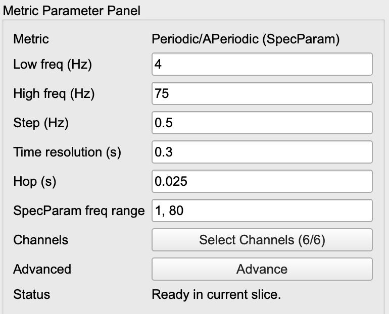

This panel uses the shared tensor controls from the main page and adds the
periodic/aperiodic-specific fit range.

| Control | What it does | What it affects | Availability / blocking rule |
| --- | --- | --- | --- |
| `SpecParam freq range` | Sets the frequency span handed to SpecParam for fitting. It is usually best treated as a slightly wider fitting envelope around the final analysis band, rather than as a duplicate of `Low freq` and `High freq`. | Periodic/aperiodic metric configuration. | Visible only for periodic/aperiodic metrics. |

### 7.4 PSI Basic Panel Variant

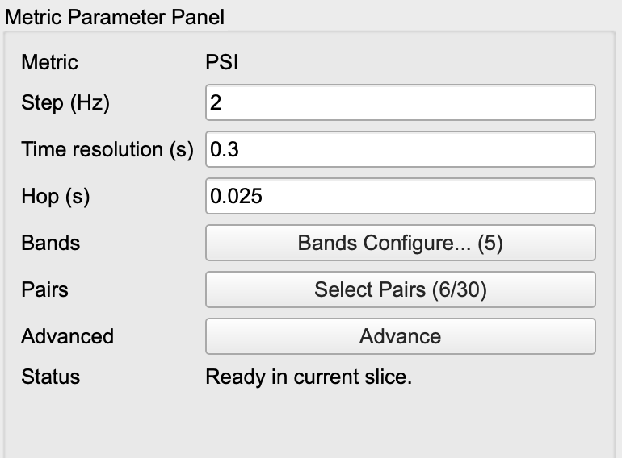

This panel reuses the shared tensor grid controls but emphasizes pair-based
configuration instead of single-channel configuration.

`Step (Hz)` is active for both Morlet and Multitaper. Each method estimates
complex coherency on that frequency grid before PSI combines adjacent-frequency
phase information within each band. Frequencies in the same band share the
longest required central averaging interval while retaining their individual
spectral-kernel lengths. `Hop` controls output-center spacing rather than the
independence or effective temporal resolution of those estimates.

| Control | What it does | What it affects | Availability / blocking rule |
| --- | --- | --- | --- |
| `Select Pairs` | Opens the pair editor used to choose which directed channel pairs will be evaluated by PSI. The chosen pair list limits both runtime and the shape of the resulting tensor output. | PSI pair subset. | Visible only for pair-based metrics such as PSI. |

### 7.5 Burst Basic Panel Variant

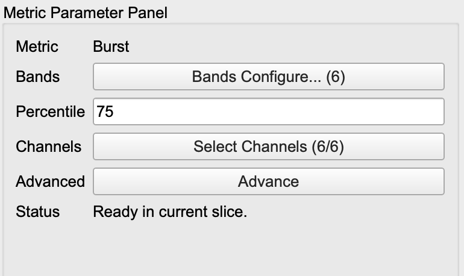

This panel shows the Burst-specific basic controls. `Step (Hz)` is configured
in Burst Advance instead of this panel. It is dormant for Hilbert, so changing
it does not alter Hilbert computation or freshness. Morlet and Multitaper use
it to build the retained frequency grid; changing it can alter their Burst
results and freshness. The active estimator determines whether Step participates
in computation.

| Control | What it does | What it affects | Availability / blocking rule |
| --- | --- | --- | --- |
| `Percentile` | Sets how high the burst threshold sits relative to the baseline distribution. Higher values usually mark only stronger events as bursts. | Burst threshold conservativeness. | Visible only for burst metrics. |
| `Bands Configure...` | Opens the burst-band editor used to define named frequency bands for burst summaries. Those bands determine where burst values are aggregated. | Burst band definitions. | Visible only for burst metrics that expose named bands. |

### 7.6 Tensor Channels

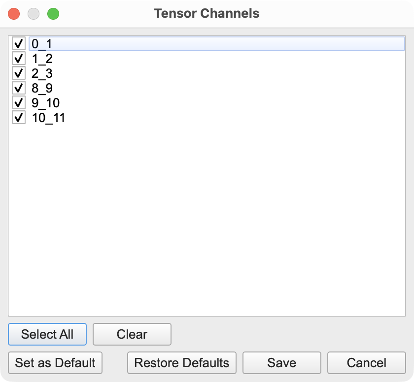

| Control | What it does | What it affects | Availability / blocking rule |
| --- | --- | --- | --- |
| Channel list | Chooses usable Finish channels for the active metric. Channels listed in `raw.info["bads"]` are not offered for Tensor computation. | Active metric channel subset. | Requires at least one usable Finish channel. |
| `Select All` | Selects every usable Finish channel. | Current channel subset. | Always available while the dialog is open. |
| `Clear` | Clears the current selection. | Current channel subset. | Always available. |
| `Set as Default` | Saves the current channel subset as the default for this control. | Future defaults. | Requires a non-empty valid subset for an active channel-based metric. |
| `Restore Defaults` | Restores the saved default subset. | Current dialog state. | Always available. |
| `Save` | Saves the selected subset back to Build Tensor. | Active metric channel-selection draft. | May retain an empty red draft; Set as Default, Export, and Build Tensor remain blocked until the subset is valid. |
| `Cancel` | Closes the dialog without saving. | No channel-subset update. | Always available. |

### 7.7 Raw Power Advance

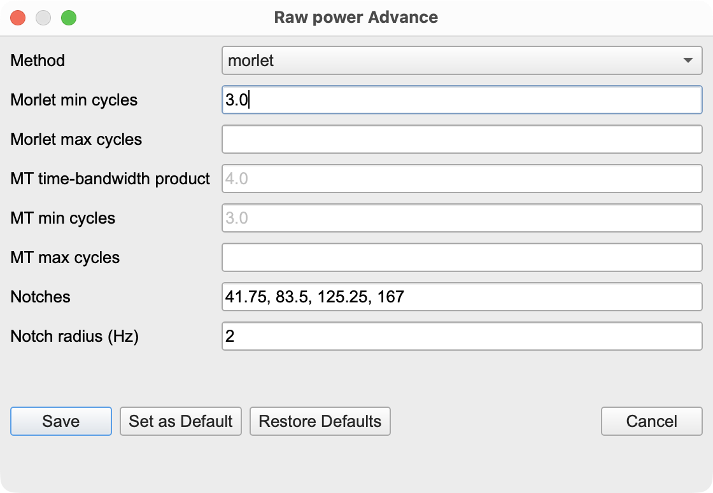

| Control | What it does | What it affects | Availability / blocking rule |
| --- | --- | --- | --- |
| `Method` | Chooses the spectral backend for raw power, typically `morlet` or `multitaper`. This choice determines how time-frequency power is estimated before any downstream use. | Raw-power runtime method. | Always available in this dialog. |
| `Morlet min cycles` | Sets the minimum Morlet cycle count. | Morlet time/frequency trade-off. | Enabled only for Morlet. |
| `Morlet max cycles` | Sets the optional maximum Morlet cycle count. | Morlet time/frequency trade-off. | Enabled only for Morlet. |
| `MT time-bandwidth product` | Sets the dimensionless DPSS time-bandwidth product. The default is `4.0`. Higher values use more smoothing and usually more tapers. | Multitaper behavior. | Enabled only for Multitaper; must be at least `2`. |
| `MT min cycles` | Sets the minimum oscillation cycles in a Multitaper window. Low frequencies use a longer window when needed. The default is `3.0`. | Multitaper low-frequency stability and temporal support. | Enabled only for Multitaper; must be greater than `0`. |
| `MT max cycles` | Optionally caps the oscillation cycles in a Multitaper window. High frequencies then use shorter windows and wider absolute bandwidth. Leave blank for no cap; set equal to `MT min cycles` for fixed cycles. | Multitaper high-frequency temporal support and bandwidth. | Enabled only for Multitaper; blank or finite, greater than `0`, and not below `MT min cycles`. |
| `Notches` | Adds metric-local notch exclusions on top of any preprocess filtering. Use this when a metric still needs narrowband suppression that should not be baked into preprocess globally. | Metric-local runtime filtering. | Supported tensor metrics only. |
| `Notch radius (Hz)` | Sets the half-width on each side of a metric-local notch center. A `50 Hz` center with a `2 Hz` radius excludes `48–52 Hz`, for a complete excluded width of `4 Hz`. | Metric-local runtime filtering. | Use one positive value for every center or one value per center. |
| `Save` | Saves the dialog values to the current session. | Current raw-power advanced settings. | Preserves invalid values as a red draft; computation and valid-only persistence remain blocked. |
| `Set as Default` | Saves the current advanced settings as defaults. | Future raw-power defaults. | Blocks on invalid values. |
| `Restore Defaults` | Restores saved defaults. | Current dialog values. | Always available. |
| `Cancel` | Closes the dialog without saving. | No advanced update. | Always available. |

**Notes**

- Morlet uses `Morlet min cycles` and `Morlet max cycles`. Multitaper instead uses
  `MT time-bandwidth product`, `MT min cycles`, and optional `MT max cycles`.
- `Notches` here are metric-local. They do not rewrite the finished preprocess signal.
- Build Tensor intentionally preserves an inherited Preprocess notch-width
  value as its default radius. A Preprocess width of `2 Hz` therefore becomes
  a Tensor radius of `2 Hz`, producing a default complete exclusion of `4 Hz`.
  This is a conservative default, not a mandatory minimum. A Tensor radius at
  least half the inherited Preprocess width covers the nominal stop band and
  does not produce a coverage warning.

### 7.8 Periodic/Aperiodic Advance

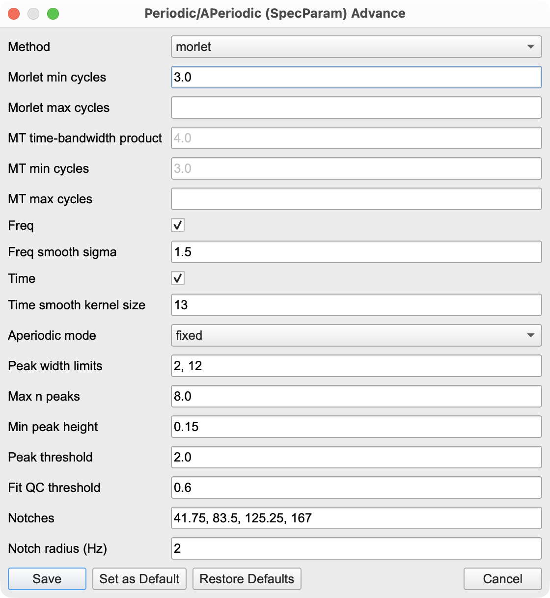

| Control | What it does | What it affects | Availability / blocking rule |
| --- | --- | --- | --- |
| `Method` | Chooses the spectral backend used to generate the input spectrum before SpecParam fitting. This choice changes the stability and smoothness of the spectrum that the periodic/aperiodic model sees. | Periodic/aperiodic runtime method. | Always available in this dialog. |
| `Morlet min cycles` | Sets the minimum Morlet cycle count. | Morlet spectral estimation trade-off. | Enabled only for Morlet. |
| `Morlet max cycles` | Sets the optional maximum Morlet cycle count. | Morlet spectral estimation trade-off. | Enabled only for Morlet. |
| `MT time-bandwidth product` | Sets the dimensionless DPSS time-bandwidth product. The default is `4.0`. | Multitaper smoothing and stability. | Enabled only for Multitaper; must be at least `2`. |
| `MT min cycles` | Sets the minimum cycles in the Multitaper window. Low frequencies use a longer window when needed. The default is `3.0`. | Multitaper low-frequency stability and temporal support. | Enabled only for Multitaper; must be greater than `0`. |
| `MT max cycles` | Optionally caps cycles in the Multitaper window. High frequencies then use shorter windows and wider absolute bandwidth. Leave blank for no cap; set equal to `MT min cycles` for fixed cycles. | Multitaper high-frequency temporal support and bandwidth. | Enabled only for Multitaper; blank or finite, greater than `0`, and not below `MT min cycles`. |
| `Freq` | Enables pre-fit smoothing across the frequency axis. Use it when the input spectrum is too ragged for stable decomposition. | Pre-fit frequency smoothing. | Periodic/aperiodic dialog only. |
| `Freq smooth sigma` | Sets the Gaussian sigma used when frequency smoothing is enabled. Larger values suppress fine ripples more aggressively, which can stabilize fits but also blur narrow peaks. | Pre-fit frequency smoothing strength. | Requires `Freq` smoothing to be enabled. |
| `Time` | Enables pre-fit smoothing across time. This can stabilize frame-to-frame fits when the signal is noisy, but it also reduces sensitivity to brief spectral changes. | Pre-fit temporal smoothing. | Periodic/aperiodic dialog only. |
| `Time smooth kernel size` | Sets the temporal kernel size used when time smoothing is enabled. Larger kernels produce steadier fits across time, but they can hide brief transitions. | Pre-fit temporal smoothing strength. | Requires `Time` smoothing to be enabled. |
| `Aperiodic mode` | Chooses whether the aperiodic background is fit with a simple fixed slope or with a knee term. Use `knee` only when you expect meaningful low-frequency curvature rather than a simple 1/f-like slope. | Aperiodic model form. | Periodic/aperiodic dialog only. |
| `Peak width limits` | Sets the allowed fitted peak-width range in Hz. Keep this range compatible with the oscillation widths you expect, or the model may accept peaks that are too broad or reject peaks that are too narrow. | Peak-fitting constraints. | Periodic/aperiodic dialog only. |
| `Max n peaks` | Sets the maximum number of oscillatory peaks the model is allowed to fit. Lower values force simpler fits; higher values allow more complexity but increase the chance of fitting noise. | Peak-fitting complexity. | Periodic/aperiodic dialog only. |
| `Min peak height` | Sets the minimum peak height required for a component to be kept as a peak. Raising it makes peak detection more conservative. | Peak acceptance threshold. | Periodic/aperiodic dialog only. |
| `Peak threshold` | Sets the peak-detection threshold used during fitting. Lower thresholds admit smaller peaks, while higher thresholds suppress weak candidates. | Peak-detection sensitivity. | Periodic/aperiodic dialog only. |
| `Fit QC threshold` | Sets the minimum quality score required to keep a decomposition result. Higher thresholds discard more uncertain fits and therefore trade coverage for reliability. | Output retention after fitting. | Periodic/aperiodic dialog only. |
| `Notches` | Defines the center frequencies of metric-local Periodic/Aperiodic exclusion intervals. Frequencies inside each interval are omitted from spectral estimation and refilled before SpecParam fitting. | Metric-local spectral preparation. | Supported tensor metrics only. |
| `Notch radius (Hz)` | Defines the half-width of each Periodic/Aperiodic exclusion interval. For example, center `50 Hz` and radius `2 Hz` refills grid bins from `48` through `52 Hz`, inclusive. | Metric-local spectral preparation. | Use one positive value for every center or one value per center. |
| `Save` | Saves the dialog values to the current session. | Current periodic/aperiodic advanced settings. | Blocks if an effective notch interval touches or crosses a SpecParam fitting boundary or has no clean equal-width donor segment. |
| `Set as Default` | Saves the current advanced settings as defaults. | Future periodic/aperiodic defaults. | Uses the same notch-boundary and donor-availability validation as `Save`. |
| `Restore Defaults` | Restores saved defaults. | Current dialog values. | Always available. |
| `Cancel` | Closes the dialog without saving. | No advanced update. | Always available. |

**Notes**

- Morlet cycle settings or the three Multitaper settings shape the spectrum
  before any SpecParam fitting begins.
- `Freq smooth sigma` and `Time smooth kernel size` only matter if their corresponding smoothing checkbox is enabled.
- `Fit QC threshold` is a retention rule after fitting, not a way to improve the fit itself.
- Periodic/Aperiodic notch intervals are reconstructed in
  log-frequency/log-power space. Neighboring valid bins define the local
  baseline, while clean, equal-width segments from the same spectrum supply
  the residual shape. Donor sides and orientations are balanced across time
  windows with a reproducible record-specific assignment, preserving local
  variance, frequency covariance, and extrema.
- Effective intervals are sorted on the SpecParam frequency grid. Overlapping
  intervals, and intervals with no valid model bin between them, are merged so
  their baseline anchors cannot fall inside another notch.
- Each merged interval requires at least one continuous donor segment whose
  interior contains the same number of bins as the target interval. The donor
  and both of its measured boundary bins must remain on the model grid and
  outside every effective notch interval.
- A notch wholly outside the SpecParam fitting range is ignored. An interval
  that intersects the fitting range must remain strictly inside both fitting
  boundaries. Advance saving, Tensor config import/export, and Build Tensor
  validation reject intervals that touch or cross a boundary or have no clean,
  equal-width donor segment.
- The reconstructed tensor follows the configured smoothing steps before
  SpecParam decomposition.

### 7.9 Undirected Connectivity Common Parameters

Coherence, absolute imaginary coherence (`|ImCoh|`), PLV, ciPLV, PLI, and wPLI
share the same basic and Advance controls. PLV illustrates those controls in
the screenshots below. Each metric keeps its own settings and pair selection;
selecting a metric name opens its editor, while its checkbox selects it for
computation.

| Metric | What the output measures |
| --- | --- |
| Coherence | Magnitude of the cross-spectrum divided by the geometric mean of the two auto-spectra. The output is coherence magnitude, not magnitude-squared coherence. |
| Absolute imaginary coherence (\|ImCoh\|) | Absolute value of the imaginary component of complex coherency. It summarizes the non-zero phase-lag component and discards its sign. |
| PLV | Phase-locking value: concentration of the phase difference after normalizing individual cross-spectral values to unit magnitude. |
| ciPLV | Corrected imaginary PLV: magnitude of imaginary phase locking, normalized using the real phase-locking component. |
| PLI | Phase-lag index: magnitude of the mean sign of the imaginary cross-spectrum; measures whether one phase-lag sign predominates. |
| wPLI | Weighted phase-lag index: weights that sign consistency by the magnitude of the imaginary cross-spectrum, giving small imaginary components less influence. |

All six use undirected channel pairs. Their values do not establish lead-lag
direction or causality. In particular, `|ImCoh|` is an absolute magnitude, not
signed imaginary coherence. For comparisons across metrics, match the pairs,
frequency grid, time settings, spectral method, notch exclusions, and masking.
See the [tutorial's connectivity interpretation notes](APP_TUTORIAL.md#6-build-tensor)
for the ciPLV and PLI/wPLI limitations with identical signals.

#### 7.9.1 Shared basic panel

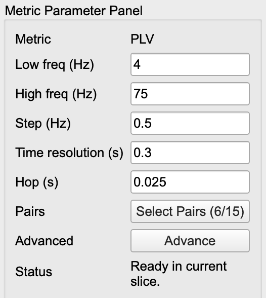

`Low freq`, `High freq`, `Step`, `Time resolution`, and `Hop` have the shared
[tensor-grid meanings](#72-metric-parameter-panel-and-run-block) for all six
metrics. `Select Pairs` opens the
[undirected pair selector](#713-undirected-tensor-pairs). Pairs containing a bad
Finish channel are excluded; at least one usable pair is required. `Advance`
opens the spectral and notch settings below. These controls configure the
active metric only; matching field names do not synchronize metric drafts.

#### 7.9.2 Shared Advance controls

The PLV dialog below also represents Coherence, `|ImCoh|`, ciPLV, PLI, and wPLI.
Choose Morlet or Multitaper to enable that method's fields. Inactive method
fields retain their drafts but do not affect computation.

| Control | What it does | What it affects | Availability / blocking rule |
| --- | --- | --- | --- |
| `Method` | Chooses Morlet or Multitaper to estimate the spectral representation used by the active connectivity metric. | Active metric's spectral method. | Always available in this dialog. |
| `MT time-bandwidth product` | Sets the dimensionless DPSS time-bandwidth product. The default is `4.0`. | Multitaper smoothing and stability. | Enabled only for Multitaper; must be at least `2`. |
| `MT min cycles` | Sets the minimum cycles in a Multitaper connectivity window. Low frequencies use a longer window when needed. | Multitaper low-frequency stability and temporal support. | Enabled only for Multitaper; must be greater than `0`. |
| `MT max cycles` | Optionally caps cycles in a Multitaper connectivity window. High frequencies then use shorter windows and wider absolute bandwidth. Leave blank for no cap; set equal to `MT min cycles` for fixed cycles. | Multitaper high-frequency temporal support and bandwidth. | Enabled only for Multitaper; blank or finite, greater than `0`, and not below `MT min cycles`. |
| `Morlet min cycles` | Sets the minimum Morlet cycle count used for connectivity estimation. | Morlet time/frequency trade-off. | Enabled only for Morlet. |
| `Morlet max cycles` | Sets the optional maximum Morlet cycle count. | Morlet time/frequency trade-off. | Enabled only for Morlet. |
| `Notches` | Defines metric-local frequency exclusions for connectivity estimation. | Active metric's frequency support. | Available for all six metrics. |
| `Notch radius (Hz)` | Sets the half-width on each side of a metric-local notch center. | Active metric's frequency support. | Use one positive value for every center or one value per center. |
| `Save` | Saves the dialog values to the current session. | Active metric's advanced settings. | Preserves invalid values as a red draft; computation and valid-only persistence remain blocked. |
| `Set as Default` | Saves the current advanced settings as defaults for the active metric. | That metric's future defaults. | Blocks on invalid values. |
| `Restore Defaults` | Restores saved defaults. | Current dialog values. | Always available. |
| `Cancel` | Closes the dialog without saving. | No advanced update. | Always available. |

### 7.10 TRGC Advance

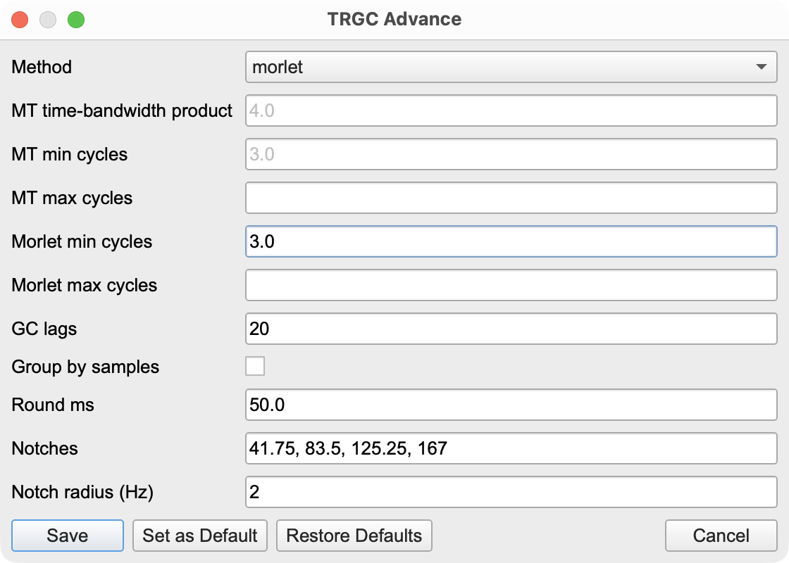

| Control | What it does | What it affects | Availability / blocking rule |
| --- | --- | --- | --- |
| `Method` | Chooses the spectral backend used before TRGC estimation. | TRGC runtime method. | Always available in this dialog. |
| `MT time-bandwidth product` | Sets the dimensionless DPSS time-bandwidth product. The default is `4.0`. | Multitaper smoothing and stability. | Enabled only for Multitaper; must be at least `2`. |
| `MT min cycles` | Sets the minimum cycles in each Multitaper TRGC window. Low frequencies use a longer window when needed. | Multitaper low-frequency stability and temporal support. | Enabled only for Multitaper; must be greater than `0`. |
| `MT max cycles` | Optionally caps cycles in each Multitaper TRGC window. High frequencies then use shorter windows and wider absolute bandwidth. Leave blank for no cap; set equal to `MT min cycles` for fixed cycles. | Multitaper high-frequency temporal support and bandwidth. | Enabled only for Multitaper; blank or finite, greater than `0`, and not below `MT min cycles`. |
| `Morlet min cycles` | Sets the minimum Morlet cycle count. | Morlet TRGC time/frequency trade-off. | Enabled only for Morlet. |
| `Morlet max cycles` | Sets the optional maximum Morlet cycle count. | Morlet TRGC time/frequency trade-off. | Enabled only for Morlet. |
| `GC lags` | Sets how many past samples are used in the autoregressive part of the TRGC model. More lags can model slower interactions, but they also increase model complexity and data requirements. | TRGC model order. | TRGC dialog only. |
| `Group by samples` | Groups TRGC frequencies by exact window length in samples instead of by a rounded millisecond grid. Use it when you need grouping tied tightly to the recording sample rate. | TRGC grouping strategy. | TRGC dialog only. |
| `Round ms` | Sets the millisecond grid used to group TRGC window lengths when `Group by samples` is off. Smaller values preserve finer distinctions but can create more groups and noisier summaries. | TRGC grouping strategy. | TRGC dialog only; disabled when `Group by samples` is enabled. |
| `Notches` | Adds metric-local notch exclusions before TRGC is computed. | Metric-local runtime filtering. | Supported tensor metrics only. |
| `Notch radius (Hz)` | Sets the half-width on each side of a metric-local notch center. | Metric-local runtime filtering. | Use one positive value for every center or one value per center. |
| `Save` | Saves the dialog values to the current session. | Current TRGC advanced settings. | Preserves invalid values as a red draft; computation and valid-only persistence remain blocked. |
| `Set as Default` | Saves the current advanced settings as defaults. | Future TRGC defaults. | Blocks on invalid values. |
| `Restore Defaults` | Restores saved defaults. | Current dialog values. | Always available. |
| `Cancel` | Closes the dialog without saving. | No advanced update. | Always available. |

**Notes**

- `GC lags` changes model order, not the plotted frequency range.
- `Group by samples` and `Round ms` are alternative grouping strategies. When grouping by exact samples is enabled, the rounded-millisecond grid no longer drives grouping.
- After `Run Build Tensor` resolves the effective TRGC frequency grid and
  estimation windows, it displays a warning when the actual runtime plan has
  more than one frequency group. `Return` is the default and cancels the launch
  without changing the parameters. `Continue` starts the existing grouped
  calculation. Closing the warning is equivalent to `Return`.
- The warning explains that independently estimated group results are
  concatenated, that same-frequency comparisons across runs require unchanged
  TRGC settings and group assignments, and that a concatenated result must not
  be treated as one continuous TRGC spectrum or reduced across a frequency band
  that crosses a group boundary.
- Group preview failure does not cancel `Run Build Tensor` and does not display
  the grouped-estimation dialog. The worker still receives every selected
  metric, records a genuine TRGC preparation failure in the TRGC metric log,
  and continues unrelated metrics according to the existing per-metric failure
  isolation behavior.

### 7.11 PSI Advance

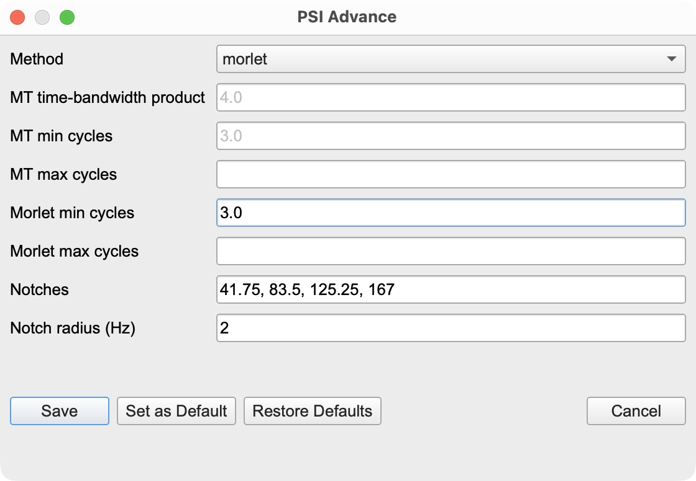

| Control | What it does | What it affects | Availability / blocking rule |
| --- | --- | --- | --- |
| `Method` | Chooses the spectral backend used before PSI is computed. | PSI runtime method. | Always available in this dialog. |
| `MT time-bandwidth product` | Sets the dimensionless DPSS time-bandwidth product used by the shared local spectral estimator. Full bandwidth at each frequency equals this product divided by that frequency's kernel duration. | Multitaper spectral smoothing and taper count. | Enabled only for Multitaper; must be at least `2`. |
| `MT min cycles` | Sets the minimum cycles in each frequency's Multitaper kernel. The longest required interval among a band's retained frequencies determines its common averaging interval. | Multitaper low-frequency stability and temporal support. | Enabled only for Multitaper; must be greater than `0`. |
| `MT max cycles` | Optionally caps cycles in each frequency's Multitaper kernel. Shorter kernels widen the corresponding spectral bandwidth. Leave blank for no cap. | Multitaper temporal support and spectral bandwidth; `Step (Hz)` determines the sampled frequency grid. | Enabled only for Multitaper; blank or finite, greater than `0`, and not below `MT min cycles`. |
| `Morlet min cycles` | Sets the minimum Morlet cycle count. | Morlet PSI time/frequency trade-off. | Enabled only for Morlet. |
| `Morlet max cycles` | Sets the optional maximum Morlet cycle count. | Morlet PSI time/frequency trade-off. | Enabled only for Morlet. |
| `Notches` | Adds metric-local notch exclusions before PSI is computed. | Metric-local runtime filtering. | Supported tensor metrics only. |
| `Notch radius (Hz)` | Sets the half-width on each side of a metric-local notch center. | Metric-local runtime filtering. | Use one positive value for every center or one value per center. |
| `Save` | Saves the dialog values to the current session. | Current PSI advanced settings. | Preserves invalid values as a red draft; computation and valid-only persistence remain blocked. |
| `Set as Default` | Saves the current advanced settings as defaults. | Future PSI defaults. | Blocks on invalid values. |
| `Restore Defaults` | Restores saved defaults. | Current dialog values. | Always available. |
| `Cancel` | Closes the dialog without saving. | No advanced update. | Always available. |

### 7.12 Burst Advance

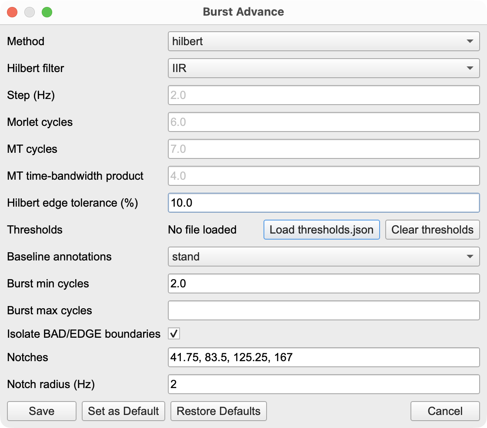

| Control | What it does | What it affects | Availability / blocking rule |
| --- | --- | --- | --- |
| `Method` | Chooses `hilbert`, `morlet`, or `multitaper` as the Burst magnitude estimator before the shared threshold and event-duration rules. | Burst magnitude, estimator guard, reusable-threshold identity, and result freshness. | Burst dialog only. The selection enables only that method's active fields. |
| `Hilbert filter` | Chooses the fixed `IIR` or `FIR` band-pass implementation inside the Hilbert estimator. IIR preserves the fourth-order zero-phase Butterworth path; FIR uses the fixed automatic Hamming `firwin` contract. | Hilbert magnitude, automatic numerical guard, reusable-threshold identity, and Burst freshness. | Enabled only for Hilbert; defaults to `IIR`. FIR order, transitions, window, phase, and padding are derived internals and are not exposed. |
| `Step (Hz)` | Sets the frequency spacing of the retained Morlet or Multitaper computation grid inside each effective named-band segment. | Spectral Burst frequency sampling, pooled magnitude, and estimator identity. | Enabled for Morlet and Multitaper; disabled for Hilbert. Must be finite and positive. |
| `Morlet cycles` | Sets one fixed Morlet cycle count at every retained frequency. | Morlet temporal/spectral support and five-sigma edge guard. | Enabled only for Morlet. Must be finite and positive. |
| `MT cycles` | Sets one fixed DPSS Multitaper window cycle count at every retained frequency. | Multitaper window duration, smoothing, and half-window edge guard. | Enabled only for Multitaper. Must be finite and positive. |
| `MT time-bandwidth product` | Sets the dimensionless DPSS time-bandwidth product while `MT cycles` determines window duration. | Multitaper taper family, spectral concentration, and magnitude estimate. | Enabled only for Multitaper. Must be finite and at least `2`. |
| `Hilbert edge tolerance (%)` | Sets the maximum representative-amplitude-normalized isolated-versus-continuous Hilbert magnitude error allowed outside the automatic per-band numerical guard. | Hilbert guard duration, retained valid support, and estimator identity. | Enabled only for Hilbert. Must be finite and strictly between `0` and `100`; default `10`. |
| `Thresholds` label | Shows the loaded JSON filename and its band-by-channel coverage. Loading validates the file structure; compatibility with the final channel and effective-band selection is checked when Burst runs. | Burst threshold source context. | Burst dialog only. |
| `Load thresholds.json` | Loads a non-executable structured Burst threshold snapshot. The JSON may cover a superset of channels and bands; the run extracts and reorders the requested subset by identity. | Burst threshold source context. | Burst dialog only; accepts `.json` files. |
| `Clear thresholds` | Clears the loaded threshold snapshot and source path, returns Burst to data-derived threshold estimation, and re-enables the saved Percentile/Baseline values. | Burst threshold source context. | Burst dialog only. |
| `Baseline annotations` | Chooses which finished annotation label should define the baseline segments used for burst thresholding. Pick a label that represents the reference state you want burst thresholds to reflect. | Burst threshold derivation. | Burst dialog only. Disabled while a structured threshold snapshot is loaded. When deriving thresholds from data, the run fails if the exact selected label is absent or has no samples remaining after BAD/EDGE exclusion. |
| `Burst min cycles` | Sets the minimum accepted event duration in cycles of the named band's union-center frequency. Shorter supra-threshold runs are excluded. | Burst event-duration eligibility. | Burst dialog only. Must be finite and positive. |
| `Burst max cycles` | Sets an optional maximum accepted event duration in cycles of the named band's union-center frequency. Longer supra-threshold runs are excluded; leave blank for no maximum. | Burst event-duration eligibility. | Burst dialog only. When provided, it must be finite, positive, and greater than or equal to `Burst min cycles`. |
| `Isolate BAD/EDGE boundaries` | Prevents samples inside global or channel-specific BAD/EDGE annotations from entering the selected Burst estimator for adjacent valid support. Each valid continuous segment is processed independently and loses only its own automatic transform guard. Build Tensor preserves the saved boolean unchanged through runtime-plan dispatch. | Burst magnitude, data-derived thresholds, event topology, and retained valid duration. | Burst dialog only; checked by default and disabled while global `Mask Edge Effects` is unchecked. Unchecking selects a whole-record transform followed by post-computation masking. |
| `Notches` | Adds metric-local notch exclusions before burst detection is computed. | Metric-local runtime filtering. | Supported tensor metrics only. |
| `Notch radius (Hz)` | Sets the half-width on each side of a metric-local notch center. | Metric-local runtime filtering. | Use one positive value for every center or one value per center. |
| `Save` | Saves the dialog values to the current session. | Current burst advanced settings. | Preserves invalid values as a red draft; computation and valid-only persistence remain blocked. |
| `Set as Default` | Saves the current advanced settings as defaults. | Future burst defaults. | Blocks on invalid values. |
| `Restore Defaults` | Restores saved defaults. | Current dialog values. | Always available. |
| `Cancel` | Closes the dialog without saving. | No advanced update. | Always available. |

**Notes**

- A loaded threshold snapshot replaces threshold estimation. Percentile and
  Baseline values remain dormant until `Clear thresholds` is selected.
- The JSON must contain strictly positive finite values plus unique channel and
  band identities. A run accepts a requested channel/band subset, reorders
  values to the runtime order, and fails Burst before numerical computation if
  any requested identity is absent or a band's effective notch-split segments
  do not match.
- Successful Burst runs write `thresholds.json` for the actual runtime subset.
  The source file path is provenance only and is never reopened for the run.
- `Baseline annotations` determines which labeled baseline periods define the burst threshold context when thresholds are derived from data rather than loaded from file. Missing or wholly excluded baseline data blocks the run; Burst does not fall back to the full recording.
- Boundary isolation changes the transform input, not only the display mask.
  Short valid segments with no interior after both transform guards remain
  `NaN`; the application never substitutes unfiltered data or valid non-Burst
  zeros. With isolation off, the transform uses the whole record before the
  output mask is applied.

### 7.13 Undirected Tensor Pairs

| Control | What it does | What it affects | Availability / blocking rule |
| --- | --- | --- | --- |
| `Search` | Filters the available channels and configured pairs. | Dialog browsing only. | Always available. |
| Channel list | Provides usable Finish channels used to draft new pairs. Channels listed in `raw.info["bads"]` are excluded. | Pair draft source/target. | Requires a usable channel inventory. |
| Pair table | Lists the currently configured pairs. | Active metric pair subset. | Read-only except for row selection and delete actions. |
| `Source` | Draft source channel. | Pair draft. | Required for a valid draft. |
| `Target` | Draft target channel. | Pair draft. | Required for a valid draft. |
| Draft pair preview | Shows the normalized undirected pair name. It helps confirm whether the pair you are adding is already represented in the opposite order. | Human validation only. | Read-only. |
| `All` | Adds every valid undirected pair from the available channel list. | Pair table rows. | Requires available channels. |
| `Apply` | Adds the current draft pair. | Pair table rows. | Requires a valid draft. |
| `Clear Draft` | Clears the current draft pair. | Draft fields only. | Always available. |
| `Clear All` | Removes all configured pairs. | Pair table rows. | Always available. |
| `Set as Default` | Saves the current pair list as the default. | Future default pair sets. | Requires at least one valid pair. |
| `Restore Defaults` | Restores the saved default pair list. | Current pair table. | Always available. |
| `Save` | Saves the selected pairs back to Build Tensor. | Active metric pair-selection draft. | May retain an empty red draft; Set as Default, Export, and Build Tensor remain blocked until the pair set is valid. |
| `Cancel` | Closes the dialog without saving. | No pair update. | Always available. |

**Notes**

- This editor is for undirected metrics, so the pair is interpreted without directionality.
- The preview is mainly a guard against adding the same undirected relation twice in reversed order.

### 7.14 Directed Tensor Pairs

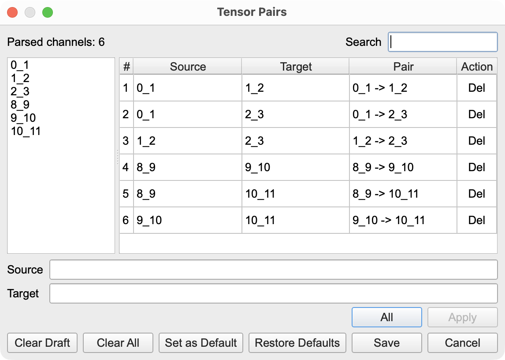

| Control | What it does | What it affects | Availability / blocking rule |
| --- | --- | --- | --- |
| `Search` | Filters the available channels and configured pairs. | Dialog browsing only. | Always available. |
| Channel list | Provides usable Finish channels used to draft new pairs. Channels listed in `raw.info["bads"]` are excluded. | Pair draft source/target. | Requires a usable channel inventory. |
| Pair table | Lists the currently configured directed pairs. | Active metric pair subset. | Read-only except for row selection and delete actions. |
| `Source` | Draft source channel. In directed metrics this is the first endpoint in the ordered pair. | Pair draft. | Required for a valid draft. |
| `Target` | Draft target channel. In directed metrics reversing source and target creates a different pair. | Pair draft. | Required for a valid draft. |
| Draft pair preview | Shows the ordered pair name before saving. | Human validation only. | Read-only. |
| `All` | Adds all valid directed pairs from the available channel list. | Pair table rows. | Requires available channels. |
| `Apply` | Adds the current draft pair. | Pair table rows. | Requires a valid draft. |
| `Clear Draft` | Clears the current draft pair. | Draft fields only. | Always available. |
| `Clear All` | Removes all configured pairs. | Pair table rows. | Always available. |
| `Set as Default` | Saves the current pair list as the default. | Future default pair sets. | Requires at least one valid pair. |
| `Restore Defaults` | Restores the saved default pair list. | Current pair table. | Always available. |
| `Save` | Saves the selected pairs back to Build Tensor. | Active metric pair-selection draft. | May retain an empty red draft; Set as Default, Export, and Build Tensor remain blocked until the pair set is valid. |
| `Cancel` | Closes the dialog without saving. | No pair update. | Always available. |

**Notes**

- This editor is for directed metrics, so `A -> B` and `B -> A` are different payloads.
- Use the ordered preview to confirm the exact direction that will be computed.

## 8. Align Epochs

The Align page manages trial definitions, alignment-method parameters, epoch
inspection, and the final finished epoch selection.

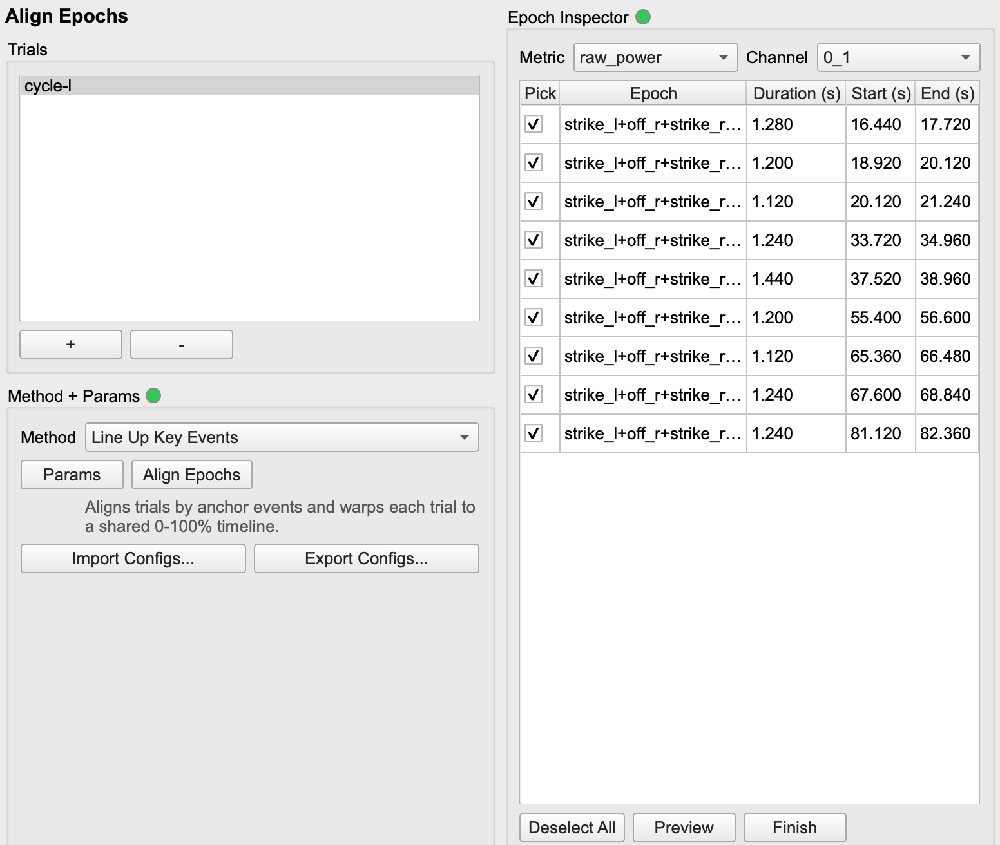

### 8.1 Trials and Method Block

| Control | What it does | What it affects | Availability / blocking rule |
| --- | --- | --- | --- |
| `Trials` list | Chooses the currently active alignment trial. | Which trial is edited and run. | Requires a selected record. |
| `+` | Creates a new alignment trial. | Trial inventory. | Requires a selected record. |
| `-` | Deletes the selected alignment trial. | Trial inventory and trial outputs. | Requires a selected trial. |
| `Method + Params` indicator | Reports method-config freshness for the current trial. | User feedback only. | Read-only. |
| `Method` | Chooses the alignment method for the current trial. | Which params dialog shape is used and how alignment runs. | Requires a selected trial. |
| `Params` | Opens the method-parameter dialog for the selected method. | Saved method parameters. | Requires a selected trial. |
| `Align Epochs` | Runs alignment for the current trial. If no usable Tensor result is available, a warning directs the user to run or rerun Build Tensor. | Trial alignment outputs and Epoch Inspector freshness. | Requires valid params and upstream data. |
| `Import Configs...` | Loads an alignment configuration for the current trial. | Trial configuration payload. | Requires a selected trial. |
| `Export Configs...` | Saves the current trial configuration. | External alignment config file. | Requires a selected trial. |

**Method default behavior**

The four method-parameter dialogs store app defaults independently for
`linear_warper`, `pad_warper`, `stack_warper`, and `concat_warper`.
`Set as Default` replaces the complete default parameter set for the active
method without changing the other method defaults or the current trial.
`Restore Default` loads the saved default for the active method into the dialog
draft; it uses the built-in method default only when no saved entry exists.
The current trial changes only after `Save` is selected.

Every supplied numeric method parameter must be finite. `NaN`, positive
infinity, and negative infinity are invalid for sample rates, target
percentages, duration bounds, clip-window offsets, and percentage tolerance.
The duration minimum and maximum fields for Line Up Key Events, Clip Around
Event, and Stack Trials may be blank independently; blank is stored as `None`
and means that the corresponding lower or upper duration limit is not applied.
`percent tolerance` may also be blank; its `None` value disables anchor-geometry
deviation filtering while retaining the configured target anchors. Clip/Stack
duration bounds and percentage tolerance default to `None`, so these filters are
off until the user supplies a finite value. An invalid draft may remain in
record-scoped state after ordinary `Save`, but it cannot be
saved as an app default, exported as a valid configuration, or used to run Align
Epochs.

Zero-duration annotations remain valid point events. `Line Up Key Events` uses
them as anchors, and `Clip Around Event` can build real pre/post windows around
their timestamps. `Stack Trials` and `Stitch Trials` omit point instances that
have no effective signal duration while retaining positive-duration instances
with the same label. A successful run reports the omitted count; if no
positive-duration instance remains, the run fails without replacing the prior
Alignment artifacts. No Alignment method promotes a zero-width interval to an
implicit one-sample signal.

During restore, annotations that are unavailable in the current trial remain
unselected. For `linear_warper`, anchors that reference unavailable annotations
are removed. If the remaining anchors do not form a valid mapping, the anchor
table is left empty so the existing automatic-anchor behavior remains
available. Missing references do not produce warnings, error highlighting,
fuzzy matching, or automatic replacements. This filtering changes only the
dialog draft and does not modify the saved app default.

### 8.2 Epoch Inspector

| Control | What it does | What it affects | Availability / blocking rule |
| --- | --- | --- | --- |
| `Epoch Inspector` indicator | Reports whether the current run and finish state are fresh for the selected trial. | User feedback only. | Read-only. |
| `Metric` | Chooses which metric is shown in the inspector. | Preview source and table context. | Requires alignment run outputs. |
| `Channel` | Chooses which channel is shown in the inspector preview. | Preview source and table context. | Requires alignment run outputs. |
| Epoch table | Lists detected epochs and their pick state. The pick state is the actual inclusion list used by `Finish`. | Preview and finish selection. | Read-only except for pick toggles. |
| `Select All` | Toggles every epoch pick on or off. | Current pick set. | Requires epoch rows. |
| `Preview` | Opens a preview based on the current pick set only. Use it as a QC surface before deciding which epochs should remain checked. | Preview figure only. | Requires at least one picked epoch and run outputs. |
| `Finish` | Builds finished outputs using the current pick set only. Unchecked epochs are excluded from downstream feature extraction. | Trial finish outputs consumed by feature extraction. | Requires a valid pick set and current alignment outputs. |
| `Merge Location Info` | Reports whether Localize representative-coordinate metadata can be attached during finish. | Finish-time merge behavior only. | Read-only. |

### 8.3 Line Up Key Events Params

| Control | What it does | What it affects | Availability / blocking rule |
| --- | --- | --- | --- |
| `sample rate (n/%)` | Sets the output sampling density over the normalized 0-100% timeline. Higher values preserve more temporal detail after warping, but they also increase output size. | Alignment runtime output grid. | Required. |
| `drop bad/edge` | Drops epochs overlapping annotations containing `bad` or `edge`. | Which epochs remain eligible for alignment. | Always available. |
| Anchor table | Lists the event-to-target-percent anchors used to warp epochs onto a shared normalized timeline. | Line-up-by-key-events alignment behavior. | Visible for anchor-based methods. |
| `event name` | Chooses which annotation label should be used as a new anchor. | Anchor draft. | Anchor methods only. |
| `target percent` | Sets where that event should land on the normalized 0-100% timeline. These anchors define the common alignment geometry across epochs. | Anchor draft. | Anchor methods only. |
| `Add Anchor` | Adds the current anchor draft to the table. | Anchor table. | Requires a valid anchor draft. |
| `epoch duration min` | Sets an optional lower bound on accepted epoch duration in seconds. | Epoch eligibility before alignment. | Optional. |
| `epoch duration max` | Sets an optional upper bound on accepted epoch duration in seconds. | Epoch eligibility before alignment. | Optional. |
| `linear warp` | Enables piecewise linear warping between anchors. | Anchor-to-anchor interpolation behavior. | Line-up-by-key-events methods only. |
| `percent tolerance` | Sets how far an observed anchor can deviate from its requested target position before the epoch is treated as a poor fit. Larger values are more permissive; smaller values enforce stricter geometric consistency. Leave blank to disable this eligibility filter. | Anchor-warp validation. | Optional for anchor methods. |
| `Set as Default` | Saves the complete displayed parameter set as the app default for this alignment method. | Active method app default; the current trial is unchanged. | Blocks on invalid values. |
| `Restore Default` | Loads the saved default for this alignment method into the dialog draft. | Current dialog values; the current trial is unchanged until `Save` is selected. | Always available. |
| `Save` | Applies the displayed dialog values to the current trial. | Method configuration payload. | May retain an invalid red draft; Set as Default, Export, and Run remain blocked. |
| `Cancel` | Closes the dialog without saving. | No parameter update. | Always available. |

**Notes**

- `sample rate (n/%)` is a normalized-timeline density, not a real-time Hz value.
- `target percent` describes where an event should end up after warping, while `percent tolerance` describes how strictly that target should be enforced.
- Blank `percent tolerance` is stored as `None` and applies no target-deviation
  rejection. It does not remove or alter the target anchors.
- Starts are processed chronologically. Each start is paired with the earliest
  duration-eligible end that has not already been consumed by an accepted
  event group. This pairing is not bounded by the next start, so valid aligned
  epochs may overlap.
- After the end is fixed, the event group is accepted only when exactly one
  complete, strictly ordered intermediate-anchor sequence satisfies the
  configured tolerance. A missing or ambiguous sequence rejects that start;
  the method does not silently choose one candidate or rematch the start to a
  later end.
- With `drop bad/edge` enabled, a BAD/EDGE overlap rejects the fixed event
  group. Rejected groups do not consume their end, while an end accepted for
  one group is not reused as another group's end.
- The output grid is uniform from 0% through 100%. Line Up Key Events evaluates
  each output percent directly against the configured target anchors. An anchor
  is an exact output sample when that percentage is representable on the chosen
  grid; otherwise it remains the continuous piecewise-warp breakpoint between
  the two neighboring output samples.

### 8.4 Clip Around Event Params

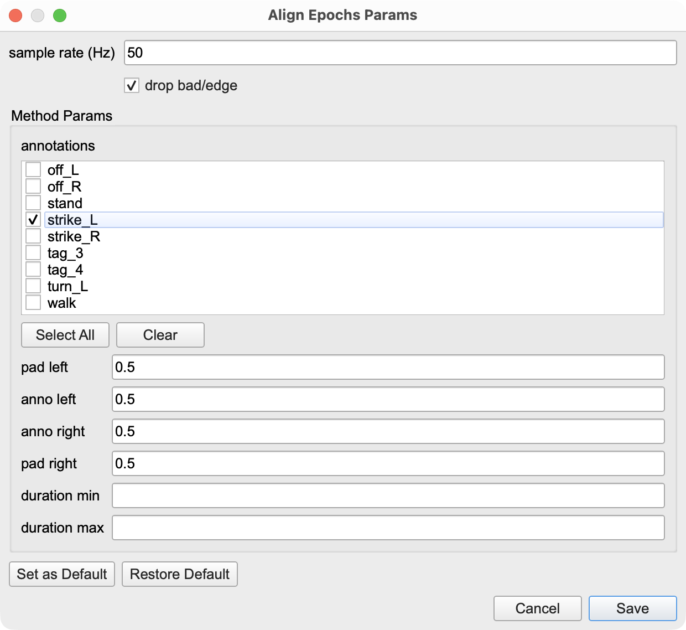

| Control | What it does | What it affects | Availability / blocking rule |
| --- | --- | --- | --- |
| `sample rate (Hz)` | Sets the sampling density of the clipped real-time epoch. Higher values preserve more temporal detail, but they also produce larger aligned outputs. | Alignment runtime output grid. | Required. |
| `drop bad/edge` | Drops epochs overlapping annotations containing `bad` or `edge`. | Which epochs remain eligible for alignment. | Always available. |
| `annotations` checklist | Chooses which annotation labels can define clip windows. | Alignment input event set. | Visible for annotation-list methods. |
| `Select All` / `Clear` | Select or clear all labels in the checklist. | Annotation checklist. | Visible for annotation-list methods. |
| `pad left` | Adds extra time before the selected annotation starts. Use it to capture pre-event context. | Event-anchored clip window. | Clip-style methods only. |
| `anno left` | Keeps a window immediately after annotation start. | Event-anchored clip window. | Clip-style methods only. |
| `anno right` | Keeps a window immediately before annotation end. | Event-anchored clip window. | Clip-style methods only. |
| `pad right` | Adds extra time after annotation end. Use it to capture post-event context. | Event-anchored clip window. | Clip-style methods only. |
| `duration min` | Sets a minimum annotation duration in seconds for an event to be eligible. The default blank value means no lower limit. | Epoch eligibility before clipping. | Optional for Clip-style methods. |
| `duration max` | Sets a maximum annotation duration in seconds for an event to be eligible. The default blank value means no upper limit. | Epoch eligibility before clipping. | Optional for Clip-style methods. |
| `Set as Default` | Saves the complete displayed parameter set as the app default for this alignment method. | Active method app default; the current trial is unchanged. | Blocks on invalid values. |
| `Restore Default` | Loads the saved default for this alignment method into the dialog draft. | Current dialog values; the current trial is unchanged until `Save` is selected. | Always available. |
| `Save` | Applies the displayed dialog values to the current trial. | Method configuration payload. | May retain an invalid red draft, including an empty annotation selection; Set as Default, Export, and Run remain blocked. |
| `Cancel` | Closes the dialog without saving. | No parameter update. | Always available. |

**Notes**

- `sample rate (Hz)` is a real-time resampling density because this method keeps a real-time window around the event.
- `pad left`, `anno left`, `anno right`, and `pad right` jointly define the total window. They are four pieces of one clip geometry, not four unrelated paddings.
- A zero-duration annotation is a valid event timestamp for this method. An
  explicitly zero-width left or right piece contributes no sample; at least one
  configured piece must have positive width.
- The two retained source pieces are hard boundaries. Each output sample is
  interpolated within its own piece; the software never interpolates from the
  end of one piece to the beginning of the other.
- If the configured window duration is `D` and rounding produces `N` samples,
  their physical coordinates are `0, D/N, ..., (N-1)D/N` and represent
  half-open support `[0,D)`. The saved metadata records both the requested rate
  and the effective rate `N/D`.

### 8.5 Stack Trials Params

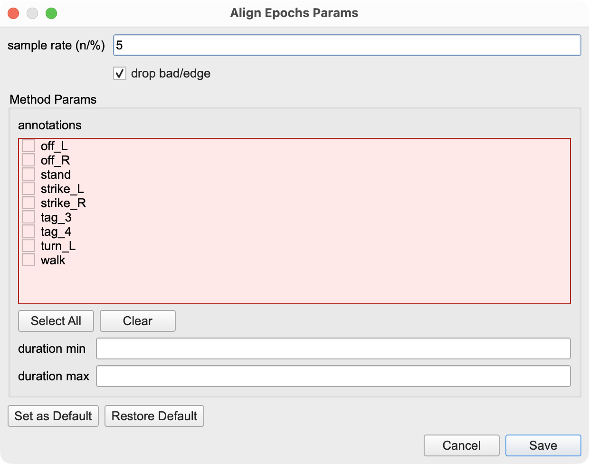

| Control | What it does | What it affects | Availability / blocking rule |
| --- | --- | --- | --- |
| `sample rate (n/%)` | Sets how many samples are allocated per 1% of the normalized stacked timeline. Higher values preserve more detail after normalization, but they also increase output size. | Alignment runtime output grid. | Required. |
| `drop bad/edge` | Drops epochs overlapping annotations containing `bad` or `edge`. | Which epochs remain eligible for alignment. | Always available. |
| `annotations` checklist | Chooses which labels are kept when building stacked trials. | Alignment input event set. | Visible for annotation-list methods. |
| `Select All` / `Clear` | Select or clear all labels in the checklist. | Annotation checklist. | Visible for annotation-list methods. |
| `duration min` | Sets a minimum annotation duration in seconds. The default blank value means no lower limit. | Epoch eligibility before stacking. | Optional for Stack-style methods. |
| `duration max` | Sets a maximum annotation duration in seconds. The default blank value means no upper limit. | Epoch eligibility before stacking. | Optional for Stack-style methods. |
| `Set as Default` | Saves the complete displayed parameter set as the app default for this alignment method. | Active method app default; the current trial is unchanged. | Blocks on invalid values. |
| `Restore Default` | Loads the saved default for this alignment method into the dialog draft. | Current dialog values; the current trial is unchanged until `Save` is selected. | Always available. |
| `Save` | Applies the displayed dialog values to the current trial. | Method configuration payload. | May retain an invalid red draft, including an empty annotation selection; Set as Default, Export, and Run remain blocked. |
| `Cancel` | Closes the dialog without saving. | No parameter update. | Always available. |

**Notes**

- `sample rate (n/%)` again refers to density over a normalized 0-100% axis, not to physical Hz.
- The duration limits are useful when the same label occurs with variable lengths and you want to exclude unusually short or long instances before stacking.
- A zero-duration instance has no interval to normalize and is omitted at run
  time. Positive-duration instances with the same label remain eligible. If
  none remain, Run reports the condition instead of repeating one point sample
  across the normalized timeline.

### 8.6 Stitch Trials Params

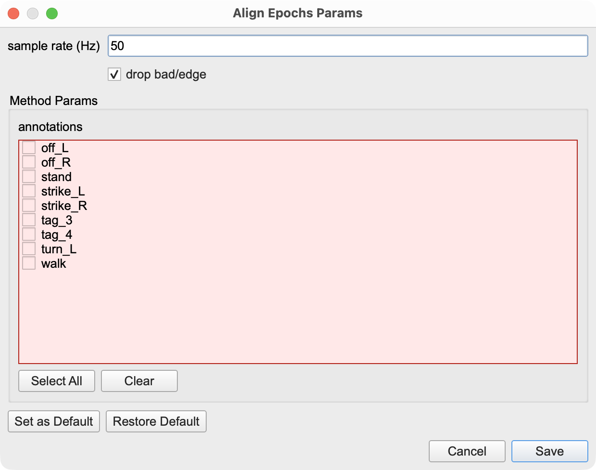

| Control | What it does | What it affects | Availability / blocking rule |
| --- | --- | --- | --- |
| `sample rate (Hz)` | Sets the real-time sampling density of the stitched output. Higher values preserve more temporal detail, but they also create larger concatenated outputs. | Alignment runtime output grid. | Required. |
| `drop bad/edge` | Drops epochs overlapping annotations containing `bad` or `edge`. | Which epochs remain eligible for alignment. | Always available. |
| `annotations` checklist | Chooses which labels are kept when stitching selected event windows together. | Alignment input event set. | Visible for annotation-list methods. |
| `Select All` / `Clear` | Select or clear all labels in the checklist. | Annotation checklist. | Visible for annotation-list methods. |
| `Set as Default` | Saves the complete displayed parameter set as the app default for this alignment method. | Active method app default; the current trial is unchanged. | Blocks on invalid values. |
| `Restore Default` | Loads the saved default for this alignment method into the dialog draft. | Current dialog values; the current trial is unchanged until `Save` is selected. | Always available. |
| `Save` | Applies the displayed dialog values to the current trial. | Method configuration payload. | May retain an invalid red draft, including an empty annotation selection; Set as Default, Export, and Run remain blocked. |
| `Cancel` | Closes the dialog without saving. | No parameter update. | Always available. |

**Notes**

- This method keeps real-time spacing, so `sample rate (Hz)` is a physical resampling density rather than a normalized per-percent density.
- Stitching is useful when you want one continuous output built from repeated event windows rather than one normalized epoch per event.
- A zero-duration instance contributes no interval and is omitted. Other
  positive-duration instances with the same selected label are still stitched;
  if none remain, Run fails instead of inserting a point sample.
- Every stitched interval remains a hard boundary for interpolation and Feature
  integration. No transition is synthesized between the final sample of one
  interval and the first sample of the next.
- For total retained duration `D` and `N` output samples, physical coordinates
  are `0, D/N, ..., (N-1)D/N`, representing `[0,D)`. Saved metadata distinguishes
  the requested rate from the effective rate `N/D` after sample-count rounding.

## 9. Extract Features and Available Features

The feature page defines feature axes, runs feature extraction, selects derived
feature outputs, and controls plotting/export behavior.

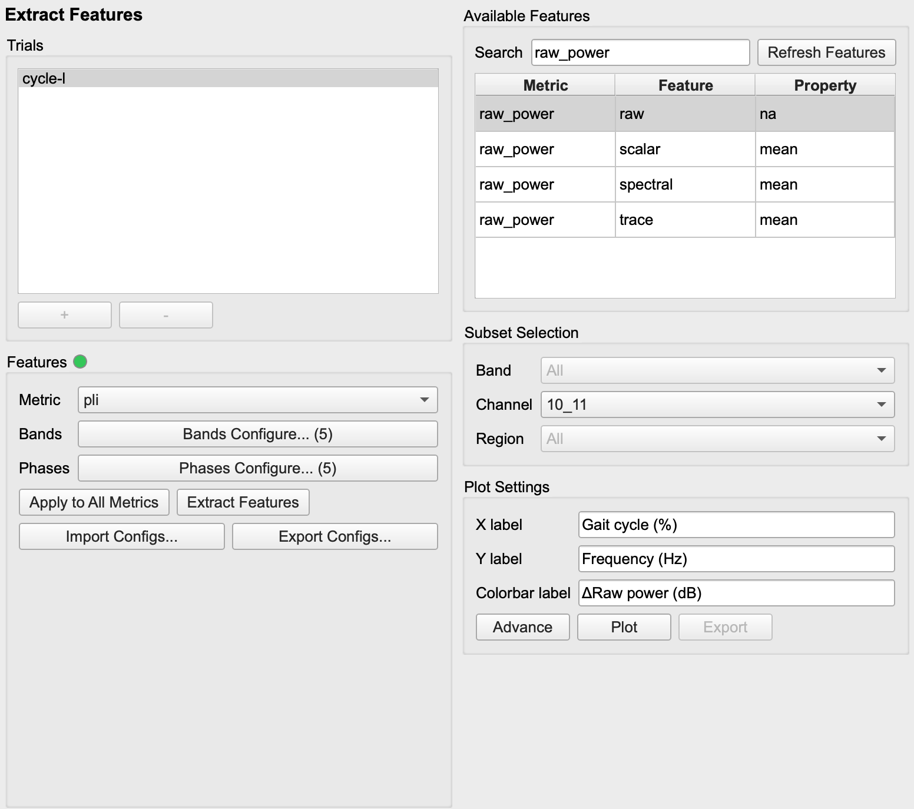

### 9.1 Trials and Features Block

| Control | What it does | What it affects | Availability / blocking rule |
| --- | --- | --- | --- |
| `Trials` list | Chooses the currently active finished alignment trial. | Which trial is used for extraction and plotting. | Requires finished alignment outputs. |
| `+` / `-` | Reserved trial list controls for the current page context. | Trial list management. | Availability depends on the current page state. |
| `Features` indicator | Reports feature-extraction freshness for the selected trial. | User feedback only. | Read-only. |
| `Metric` | Chooses which currently accepted metric's feature axes are being edited. | Editor selection only; changing the selection does not change extraction parameters. | Requires a selected trial with a current accepted Align Finish metric manifest. |
| `Bands Configure...` | Opens the band-axis editor for the selected metric. | Feature band definitions for that metric. | Requires a selected metric. |
| `Phases Configure...` | Opens the phase/time-window editor for the selected metric. `Start (%)` and `End (%)` use the explicit 0-to-100 scale, so `1` means 1%. | Feature phase definitions for that metric. | Requires a selected metric. |
| `Apply to All Metrics` | Copies phases to every currently accepted metric. Bands are copied only between manually configured metrics; automatic-band metrics continue to inherit their bands from accepted Alignment data. | Trial-wide feature-axis configuration. | Requires a valid source metric axis definition. |
| `Extract Features` | Runs feature extraction for the selected trial. | Generated feature outputs. | Requires finished alignment outputs and valid axes. |
| `Import Configs...` | Loads a feature configuration. | Current trial feature config. | Requires a selected trial. |
| `Export Configs...` | Saves the current feature configuration. | External feature config file. | Requires a selected trial. |

**Feature draft and metric-manifest behavior**

Feature axes and plot controls are stored per trial. Rerunning, failing, or
cancelling an upstream stage can make Extract Features unavailable or stale,
but it does not reset the stored feature draft. A temporarily unavailable Align
Finish manifest means that metric availability is unknown; it is never treated
as an accepted empty metric set.

Only a current accepted Align Finish result with a complete, nonempty metric
manifest and every declared `na-raw.pkl` input may reconcile the active metric
list. Metrics newly added by that manifest receive defaults only for their own
missing axes. Removed metrics become dormant: they are excluded from the editor
and the next extraction run, while their stored axes remain available if the
metric returns. Reordering metrics does not change any axes, and a rename is
handled as one removal plus one addition unless an explicit mapping exists.

Automatic-band metrics store no manual band rows. Their band names are resolved
from the accepted Alignment `na-raw.pkl` `Value` index at run time. A new
accepted Alignment generation may therefore change their resolved bands and
make prior Feature outputs stale, but it does not change phases or plot
settings. Manual bands and phases change only through an explicit axis edit,
confirmed config import, restore-default action, or Apply to All Metrics.

Metric selection, feature-file selection, subset filters, search text, plot
labels, and plot-advance settings are UI or plotting state. They do not alter
the extraction axes. If a manual band becomes incompatible with newly accepted
input support, the saved row is retained and extraction remains blocked until
the user explicitly corrects it; it is not clipped or restored silently.

**Feature storage behavior**

Extract Features follows the transform policy attached to each metric. Power
metrics can be interpolated and reduced in a transformed domain such as `dB`,
but every current Feature output is converted back to its native domain before
it is saved. This conversion applies to `mean` and `median`. The `count`,
`rate`, `duration`, and the Burst `occupancy` reducer return native derived quantities,
so they are saved unchanged with an identity transform policy. The assigned
metric transform remains in mean/median Feature metadata. Plot-time transforms
selected through `Advance` affect only plotting and export data; they do not
rewrite the source Feature files.

Burst is handled specially. The aligned Burst raw table is a display artifact,
and its sampling rate does not define Burst scalar features. For all four
Alignment methods, percentage phases are mapped back to the original
full-rate Burst tensor before calculating `mean`, `rate`, `duration`, and
`occupancy`. Positive amplitudes are averaged in the `log10` domain with source
cell duration as the weight, then converted back to volts. Therefore Burst
`mean` is a duration-weighted geometric mean, while zeros continue to mean
valid non-Burst support and never enter the logarithm. The `mean` output keeps
the `log10` transform policy; `rate`, `duration`, and `occupancy` keep the
identity policy. Their Unit values are `V`, `bursts/s`, `s`, and `%`.
Each native timestamp begins one half-open Burst state cell ending at the next
timestamp; the final cell uses the last observed sample interval. This makes
`N` samples at sampling rate `f_s` contribute exactly `N/f_s` seconds without
changing the Tensor timestamps or detected values.

### 9.2 Available Features, Subset Selection, and Plot Settings

| Control | What it does | What it affects | Availability / blocking rule |
| --- | --- | --- | --- |
| `Search` | Filters the available feature list. | Feature table browsing only. | Always available. |
| `Refresh Features` | Rescans generated feature files for the selected trial. | Available feature table contents. | Requires a selected trial. |
| `Available Features` table | Lists feature payloads that can be plotted or exported. | Current feature selection. | Requires extracted feature outputs. |
| `Band` | Filters the selected feature payload by band. | Plot subset. | Choices depend on the selected feature and current channel/region filters. |
| `Channel` | Filters the selected feature payload by channel. | Plot subset. | Choices depend on the selected feature and current band/region filters. |
| `Region` | Filters the selected feature payload by region. | Plot subset. | Choices depend on the selected feature and current band/channel filters. |
| `X label` | Overrides the plotted x-axis label. | Plot output only. | Optional. |
| `Y label` | Overrides the plotted y-axis label. | Plot output only. | Optional. |
| `Colorbar label` | Overrides the plotted colorbar label. | Plot output only. | Optional. |
| `Advance` | Opens plot-time transform and normalization settings. | Plot session/default settings. | Requires a selected feature. |
| `Plot` | Plots the selected feature using the current subset and plot settings. | Plot figure only. | Requires a selected feature and compatible subset. |
| `Export` | Exports the last plotted figure and its plotting data. | Output files only. | Requires an existing plot result. |

### 9.3 Features Bands Editor

| Control | What it does | What it affects | Availability / blocking rule |
| --- | --- | --- | --- |
| Table | Lists the currently configured named bands for the active metric. | Current band-axis definition. | Read-only except for row deletion. |
| `Band` name | Sets the human-readable name for the draft band. Use names that will still make sense in feature tables and plots. | Draft row. | Required for a valid draft. |
| `Start` | Sets the lower frequency bound of the draft band in Hz. | Draft row. | Must be numeric and inside the allowed frequency range. |
| `End` | Sets the upper frequency bound of the draft band in Hz. | Draft row. | Must be numeric and greater than `Start`. |
| `Add` | Adds the draft band to the current band table. | Current band table. | Requires a valid draft. |
| `Clear All` | Removes all configured bands. | Current band table. | Always available. |
| `Set as Default` | Saves the current bands as defaults. | Future band defaults. | Requires a non-empty valid committed band set for a manually banded metric. |
| `Restore Default` | Restores saved defaults. | Current dialog values. | Always available. |
| `Save` | Saves the band definitions back to the Features page. | Selected metric feature-band axis. | May retain an empty red draft; Set as Default, Export, and Extract remain blocked. |
| `Cancel` | Closes the dialog without saving. | No band update. | Always available. |

**Notes**

- `Start` and `End` define the frequency interval that will later be summarized into one named feature band.
- Band names are not cosmetic only: they become the labels shown in downstream feature tables and plots.

### 9.4 Features Phases Editor

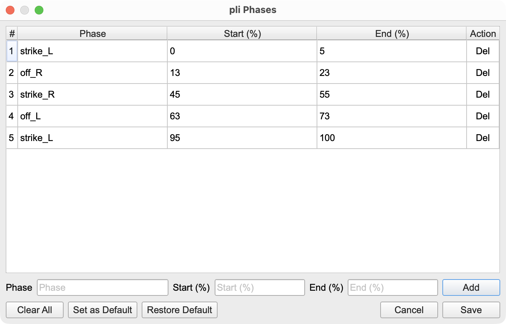

| Control | What it does | What it affects | Availability / blocking rule |
| --- | --- | --- | --- |
| Table | Lists the currently configured named phases or time windows. | Current phase-axis definition. | Read-only except for row deletion. |
| `Phase` name | Sets the human-readable name for the draft phase or window. | Draft row. | Required for a valid draft. |
| `Start` | Sets the lower bound of the draft phase range in the unit shown by the dialog, typically percent of the normalized epoch. | Draft row. | Must be numeric and inside the allowed range. |
| `End` | Sets the upper bound of the draft phase range in the same unit. | Draft row. | Must be numeric and greater than `Start`. |
| `Add` | Adds the draft phase row to the current table. | Current phase table. | Requires a valid draft. |
| `Clear All` | Removes all configured phases. | Current phase table. | Always available. |
| `Set as Default` | Saves the current phases as defaults. | Future phase defaults. | Requires a non-empty valid committed phase set. |
| `Restore Default` | Restores saved defaults. | Current dialog values. | Always available. |
| `Save` | Saves the phase definitions back to the Features page. | Selected metric feature-phase axis. | May retain an empty red draft; Set as Default, Export, and Extract remain blocked. |
| `Cancel` | Closes the dialog without saving. | No phase update. | Always available. |

**Notes**

- `Start` and `End` define analysis windows that later combine with named bands to form feature values.
- Phase names become part of the exported feature labels, so they should describe the window meaning rather than only its numeric bounds.

### 9.5 Plot Advance

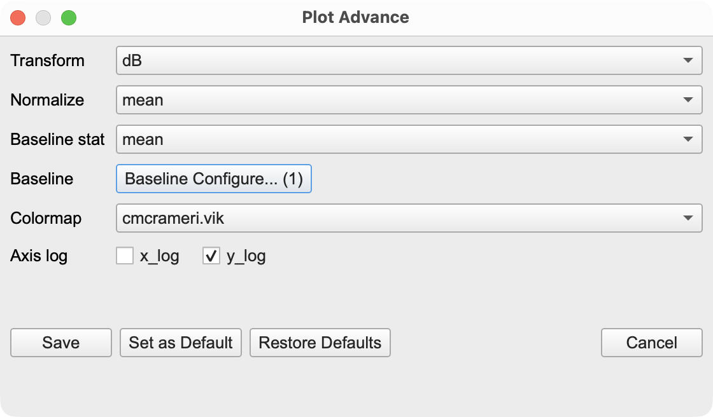

| Control | What it does | What it affects | Availability / blocking rule |
| --- | --- | --- | --- |
| `Transform` | Chooses the value transform applied before plotting, such as leaving values unchanged or converting them to a transformed scale. It changes the plotted and exported plot values, not the source feature files on disk. | Plot output and exported plotting data. | Always available. |
| `Normalize` | Chooses whether values are baseline-normalized before plotting. When normalization is off, baseline-specific controls become irrelevant. | Plot output and exported plotting data. | Can disable baseline-specific controls when set to `none`. |
| `Baseline stat` | Chooses how baseline values are summarized before normalization is applied. This matters when baseline windows contain variability and you need a stable reference statistic. | Plot output and exported plotting data. | Relevant when normalization is enabled. |
| `Baseline Configure...` | Opens the baseline-range editor used to define which percent windows count as baseline. | Baseline percent ranges used for plot-time normalization. | Enabled when normalization uses baseline ranges. |
| `Colormap` | Chooses the colormap used by matrix-style plots. It affects appearance only, not the underlying numbers. | Plot appearance only. | Always available. |
| `x_log` | Uses a logarithmic x-axis when the current feature type supports numeric x values. | Plot appearance only. | Availability depends on the selected feature type. |
| `y_log` | Uses a logarithmic y-axis when the current feature type supports numeric y values. | Plot appearance only. | Availability depends on the selected feature type. |
| `Save` | Saves plot settings to the session. | Current plot-settings draft. | May retain an invalid red draft; Plot, Set as Default, and plot export remain blocked until the active settings are valid. |
| `Set as Default` | Saves plot settings as defaults. | Future plot defaults. | Blocks on invalid combinations. |
| `Restore Defaults` | Restores saved defaults. | Current dialog state. | Always available. |
| `Cancel` | Closes the dialog without saving. | No plot-settings update. | Always available. |

**Notes**

- `Transform` changes how values are displayed and exported from the current plot, not how features were originally computed.
- `Normalize` and `Baseline stat` only matter together with baseline ranges defined in `Baseline Configure...`.
- `x_log` and `y_log` are display options only. They have no effect on extracted feature files and are enabled only when the current axes are numeric and compatible.

### 9.6 Baseline Configure

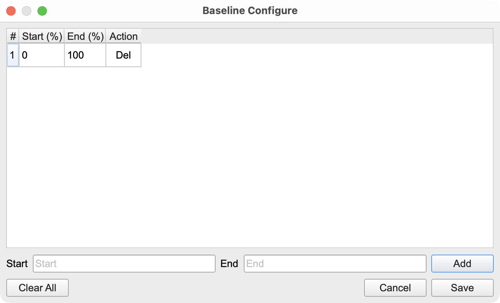

| Control | What it does | What it affects | Availability / blocking rule |
| --- | --- | --- | --- |
| Baseline ranges table | Lists the configured baseline percent ranges. Multiple non-overlapping ranges can be combined to define one composite baseline. | Plot-time normalization baseline. | Read-only except for row deletion. |
| `Start` | Sets the start of the draft baseline range in percent of the current plotted timeline. | Draft baseline row. | Must stay within valid percent bounds. |
| `End` | Sets the end of the draft baseline range in percent of the current plotted timeline. | Draft baseline row. | Must stay within valid percent bounds and be greater than `Start`. |
| `Add` | Adds the draft baseline range to the table. | Baseline table rows. | Requires a valid draft range. |
| `Clear All` | Removes all baseline ranges. | Baseline table rows. | Always available. |
| `Save` | Saves baseline ranges back to Plot Advance. | Baseline normalization payload. | Blocks on invalid or overlapping ranges. |
| `Cancel` | Closes the dialog without saving. | No baseline-range update. | Always available. |

**Notes**

- Baseline ranges are percent windows on the plotted x-axis, not arbitrary absolute times unless the plotted axis itself is already percent-based.
- A range such as `0-20` means “use the first 20% of the current timeline as baseline.” Multiple ranges can be combined when a single continuous baseline window is not appropriate.
