# LFP-TensorPipe Demo Tutorial

This tutorial follows one validated single-record path from import to final
feature visualization:

- `Subject`: `sub-001`
- `Record`: `gait`
- `Trial`: `cycle_l`

Use this page when you want to reproduce the published demo end to end. Use
[APP_CONTROL_REFERENCE.md](APP_CONTROL_REFERENCE.md) when you want a control-
level explanation of a specific panel or dialog.

## 1. Demo Background

The demo dataset was recorded with a SceneRay `SR1202` system from a gait task
performed by a patient implanted in `STN + SNr`.

The acquisition was synchronized with a wireless electrophysiology recorder:

- the click sound generated by pressing the recorder marker button was captured by the gait-video audio track
- the same click sound was also visible in the LFP-side sync markers
- aligning those two click streams aligns the LFP recording with the video

The shipped demo inputs mean:

- `audio_marker.mp3`: the click sound captured from the gait-video audio track
- `annotations.csv`: manually labeled gait events
- `dataset/configs/*`: the validated tutorial configs used to reproduce the
  walkthrough quickly

Throughout this guide:

- `<demo-project-root>` means your local demo project copy
- `<lead-dbs-root>` means your local Lead-DBS installation root
- `<matlab-root>` means your local MATLAB installation root

## 2. First Launch and Project Context

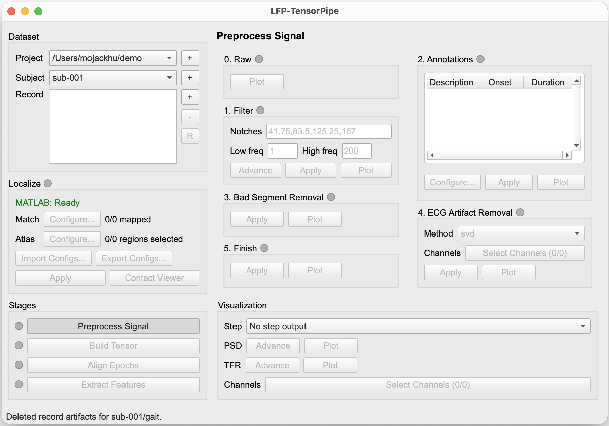

The key status to notice is the `Localize` block. Once the machine-local
dependencies are configured correctly, it should show `MATLAB: Ready`.

On first launch, open the configs dialog and set the local paths used by
`Localize`:

- Windows: app-window top-left `Settings -> Configs`
- macOS: screen top-left menu bar `LFP-TensorPipe -> Preferences -> Configs`

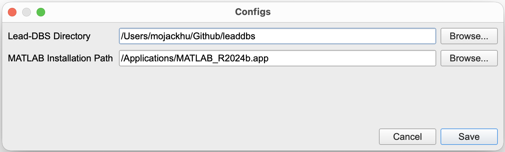

Use:

| Control | Value |
|---|---|
| `Lead-DBS Directory` | `<lead-dbs-root>` |
| `MATLAB Installation Path` | `<matlab-root>` |

After saving valid paths, return to the home page and confirm that
`Localize -> MATLAB: Ready` is visible.

This walkthrough assumes one fixed local context for the whole run:

| Item | Value |
|---|---|
| `Project` | `<demo-project-root>` |
| `Subject` | `sub-001` |
| `Record` | `gait` |
| `Trial` | `cycle_l` |

## 3. Import `sub-001 / gait`

This step creates the project record from the raw SceneRay export and turns it
into the single `gait` record used by the rest of the tutorial.

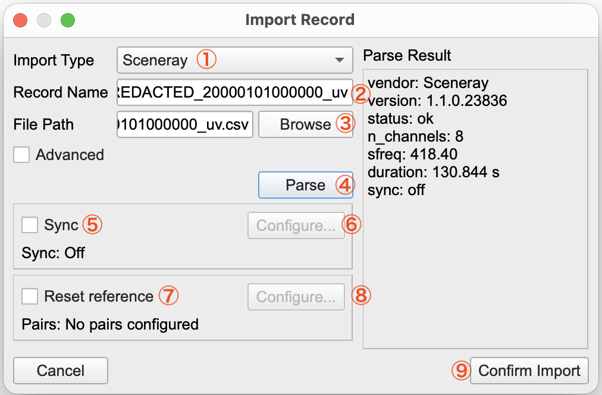

Control map:

- `① Import Type`: choose the parser flow. For this demo the UI label is
  `Sceneray`.
- `② Record Name`: enter the imported record name. Use `gait`.
- `③ File Path`: point to
  `<demo-project-root>/dataset/sub-001-gait/IPG_SERIAL_REDACTED_20000101000000_uv.csv`.
- `④ Parse`: parse the selected file before importing.
- `⑤ Sync`: enable pre-import timeline alignment.
- `⑥ Configure...`: open the sync dialog.
- `⑦ Reset reference`: enable bipolar remapping before import.
- `⑧ Configure...`: open the reset-reference dialog.
- `⑨ Confirm Import`: commit the imported record after all required setup is
  saved.

Also enable `Advanced` and set the metadata sidecar to:

- `<demo-project-root>/dataset/sub-001-gait/IPG_SERIAL_REDACTED_20000101000000.txt`

Click `Parse` first. The parse summary should report the SceneRay vendor,
sampling rate, duration, and channel count.

### 3.1 Configure `Sync`

This step aligns the LFP recording with the gait-video time base. In this
demo, the alignment is built from the recorder button clicks that appear both
in the LFP-side markers and in the video audio track.

Check `Sync`, then open `Configure...`.

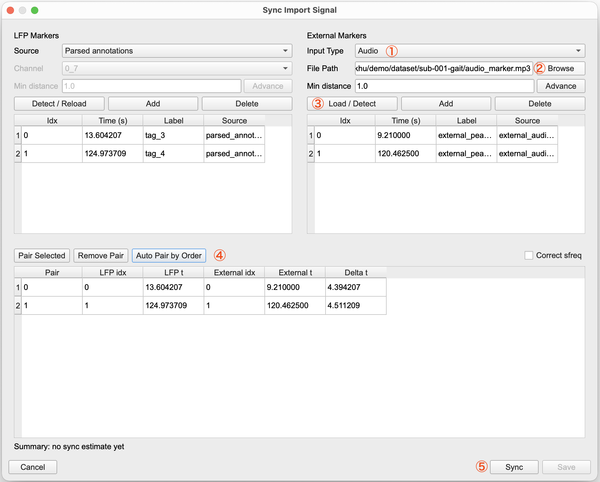

Control map:

- `① Input Type`: choose `Audio` for the external source.
- `② File Path`: use
  `<demo-project-root>/dataset/sub-001-gait/audio_marker.mp3`.
- `③ Load / Detect`: detect the external peaks from the audio file.
- `④ Auto Pair by Order`: pair the detected LFP markers and external markers.
- `⑤ Sync`: run the lag estimate and create the QC preview.

Use the validated demo values:

| Control | Value |
|---|---|
| `LFP source` | `Parsed annotations` |
| `External source` | `Audio` |
| `External path` | `<demo-project-root>/dataset/sub-001-gait/audio_marker.mp3` |
| `Pairing` | `Auto Pair by Order` |
| `Correct sfreq` | unchecked |

The demo uses two marker pairs:

- `tag_3` ↔ `external_peak_0`
- `tag_4` ↔ `external_peak_1`

Click `Sync` to generate the preview shown in the below figure.

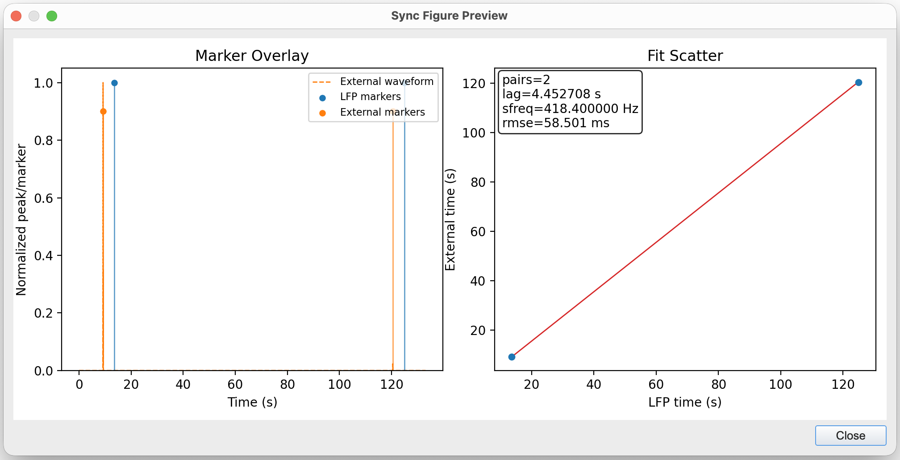

In the preview:

- `pairs` is the number of explicit marker pairs used by the estimate
- `lag` is the time offset applied during import
- `sfreq` is the synchronized sampling rate

Click `Save` in the sync dialog before returning to the import window.

### 3.2 Configure `Reset Reference`

This step remaps the imported vendor channels into the bipolar derivations used
throughout the tutorial.

Check `Reset reference`, then open `Configure...`.

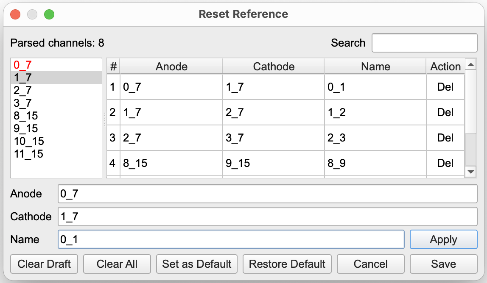

Add these six bipolar rows so the imported channel names match the tutorial
configs used later by `Localize` and `Build Tensor`:

| Anode | Cathode | Name |
|---|---|---|
| `0_7` | `1_7` | `0_1` |
| `1_7` | `2_7` | `1_2` |
| `2_7` | `3_7` | `2_3` |
| `8_15` | `9_15` | `8_9` |
| `9_15` | `10_15` | `9_10` |
| `10_15` | `11_15` | `10_11` |

Click `Save` before returning to the import dialog.

When both are ready, click `Confirm Import`.

Expected imported channels:

- `0_1`
- `1_2`
- `2_3`
- `8_9`
- `9_10`
- `10_11`

### 3.3 Fix a Wrong Record Name with `R`

If you typed the record name incorrectly during import, you do not need to
delete and re-import the record. This action corrects the record name without
throwing away the imported data or later artifacts. Use `Record R` instead.

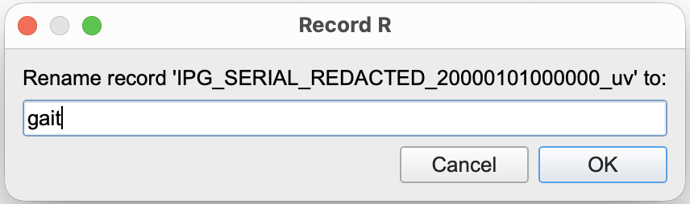

## 4. Localize

`Localize` is record-scoped and independent from the preprocess/tensor/align
stage chain. It can be configured as soon as the imported record is available.
This stage attaches representative anatomical coordinates and atlas labels to
the imported bipolar channels so later outputs can carry localization context.

Before clicking `Apply`, make sure the Lead-DBS subject space matches the space
used during Lead-DBS localization. The tutorial assumes:

- `MNI152NLin2009bAsym`

To reproduce the tutorial result, place the dataset atlas folder under:

- `leaddbs/templates/space/MNI152NLin2009bAsym/atlases`

The below figure shows the `Localize` block.

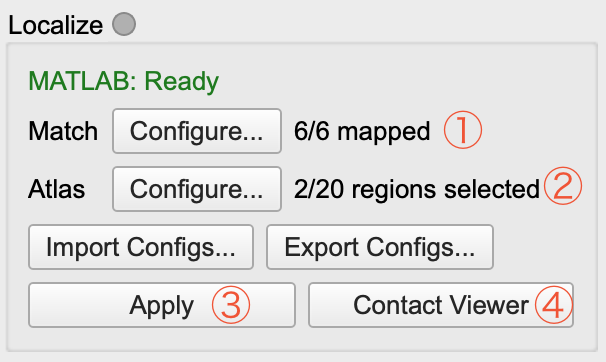

Control map:

- `① Match status`: how many record channels are mapped
- `② Atlas status`: how many regions are selected
- `③ Apply`: generate representative-coordinate outputs
- `④ Contact Viewer`: launch the MATLAB-based 3D viewer

Use `Import Configs...` to load the tutorial config quickly:

- `dataset/configs/localize/lfptensorpipe_localize_config.json`

Use `Export Configs...` whenever you want to save your own local variant.

### 4.1 Match Record Channels to Lead-DBS Contacts

This step binds each imported bipolar channel to the Lead-DBS contacts that
define it. In this demo, the match table also defines that each channel uses
the midpoint between its anode and cathode as the representative coordinate.

Open `Match -> Configure...`.

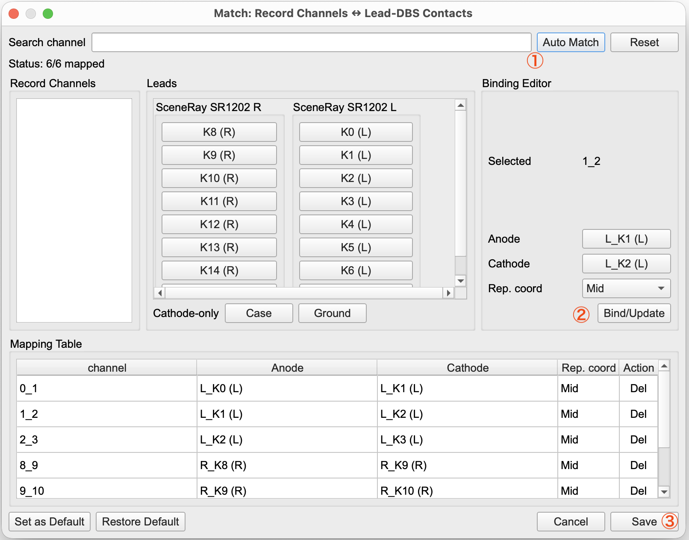

Control map:

- `① Auto Match`: attempt automatic channel-to-contact mapping
- `② Binding Editor / Bind-Update`: manual mapping area used when Auto Match is
  incomplete or not ideal
- `③ Save`: write the current record-scoped match table

The tutorial mapping uses `rep_coord = Mid` for all six bipolar channels.

Auto Match follows the current implementation contract:

- parse record channels as `left_right` with an optional trailing `_L` or `_R`
- build per-lead contact-index maps from contact labels such as `K1 (L)` or
  `K10 (R)`
- match both endpoints on the same lead
- apply the trailing `_L/_R` token only as a side constraint
- compare endpoint indices case-insensitively
- write `Anode`, `Cathode`, and `Rep. coord = Mid` only when exactly one lead
  is a valid candidate
- skip ambiguous or missing matches instead of writing a guess

If Auto Match is not ideal, use the Binding Editor in `②` to select
`Anode`, `Cathode`, `Rep. coord`, then click `Bind/Update`.

### 4.2 Configure the Atlas

This step defines which atlas and which regions are queried when representative
coordinates are converted into anatomical labels. In this demo, those labels
are later merged into aligned epochs and feature outputs.

Open `Atlas -> Configure...`.

The below figure shows the atlas configuration used by the tutorial.

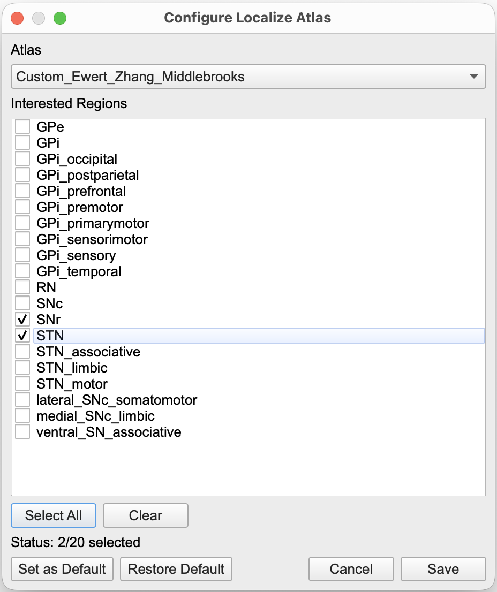

Use:

| Control | Value |
|---|---|
| `Atlas` | `Custom_Ewert_Zhang_Middlebrooks` |
| `Interested Regions` | `SNr`, `STN` |

### 4.3 Localize and Contact Viewer

Click `Apply` in the Localize block after Match and Atlas are ready.

`Contact Viewer` is a visual QC surface for the localization result. Use it to inspect the reconstructed contacts and the representative points before trusting the
record-level anatomy metadata.

When you open `Contact Viewer`, MATLAB starts first and may need time to load.
The below figure shows the sphere control used to adjust representative-point
size inside the viewer workflow.

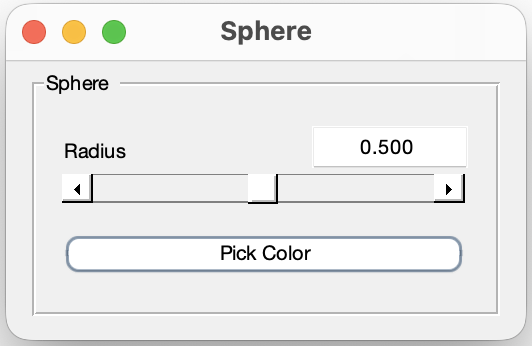

The figure shows the rendered contact-viewer scene.

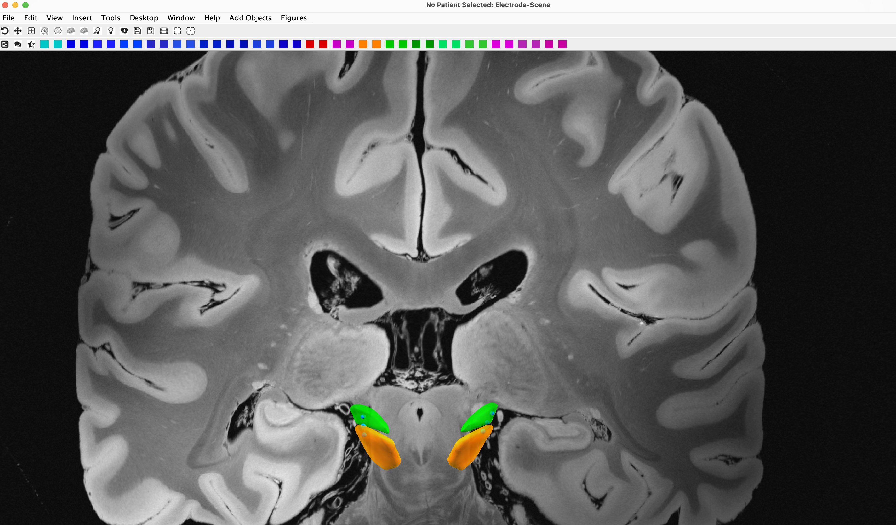

## 5. Preprocess Signal and QC

This stage cleans the imported record and prepares the final continuous signal
used by tensor building, epoch alignment, and feature extraction.

The below figure is the control overview of the `Preprocess Signal` page.

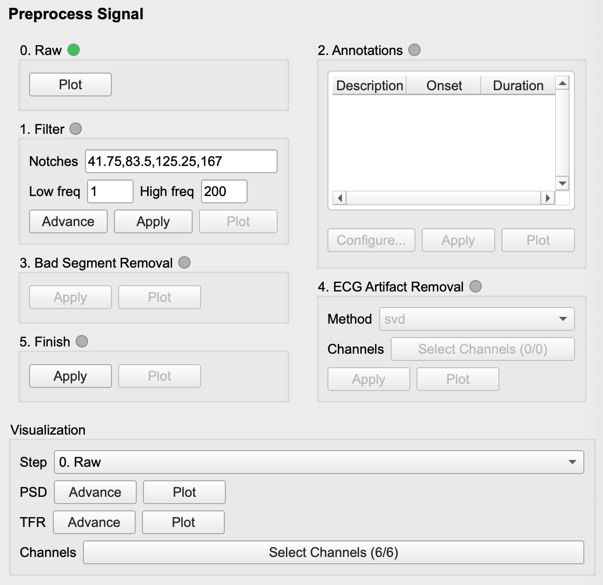

Use the following step-purpose map while reading the rest of the preprocess
section:

| Step | Purpose | Demo action | Feeds |
|---|---|---|---|
| `0. Raw` | Confirm that the imported raw signal, markers, and duration entered the project correctly | run | filter QC |
| `1. Filter` | Apply core band-pass and demo-specific notch filtering, and annotate bad spans | run | annotations and bad-span QC |
| `2. Annotations` | Write manually labeled gait events onto the filtered time axis | run | alignment anchors and feature timing |
| `3. Bad Segment Removal` | Remove bad spans and stitch the remaining valid signal into one clean stream | run | finish output |
| `4. ECG Artifact Removal` | Optionally suppress residual cardiac contamination | skip | finish output when needed |
| `5. Finish` | Export the finalized preprocess result for downstream modules | run | tensor, align, features |
| `Visualization` | Show PSD/TFR QC without rewriting the data | run as needed | manual QC only |

The validated preprocess path for this demo is:

1. `Raw -> Apply`
2. `Filter -> Apply`
3. `Filter -> Plot` for manual QC
4. `Annotations -> Configure... -> Apply`
5. `Bad Segment Removal -> Apply`
6. skip `ECG Artifact Removal`
7. `Finish -> Apply`
8. `Visualization` QC with PSD and TFR plots

### 5.1 Step 0: Raw

This step is the import sanity check. In this demo, it confirms that the raw
signal, marker timing, and channel set are correct before any cleanup starts.

The below figure is the plot for `Preprocess Signal step 0.Raw`.

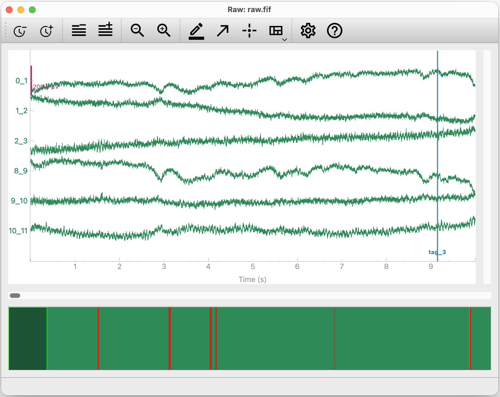

Run `Raw -> Apply` first, then use `Plot` to confirm the imported signal and
markers are visible before filtering.

### 5.2 Step 1: Filter

This step performs the base signal cleanup used by the rest of the pipeline. In
this demo, it applies the tutorial band-pass and SceneRay-specific notch filtering, and annotates bad spans before any event-related processing.

The tutorial filter uses:

| Parameter | Value |
|---|---|
| `Low freq` | `1.0` |
| `High freq` | `200.0` |
| `Notches` | `41.75, 83.5, 125.25, 167.0` |

This notch list is demo-specific. SceneRay uses `83.5 Hz` AC coupling between
the LFP recorder and the IPG, so this dataset needs the half-frequency harmonic
series to be notched. That is why the tutorial notches `41.75`, `83.5`,
`125.25`, and `167.0 Hz`. Do not treat this list as a universal default for
other datasets.

The below figure is the plot for `Preprocess Signal 1.Filter`.

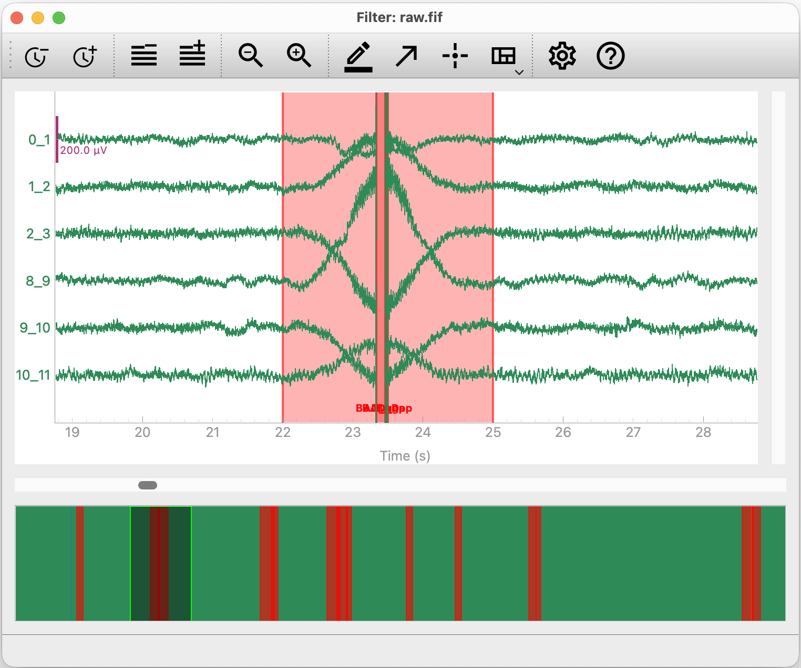

This is the main manual QC step of the preprocess section:

- click `Filter -> Apply`
- open `Filter -> Plot`
- press `a` in the MNE browser to enter annotation edit mode
- adjust the `BAD` spans if the automatically detected windows are not
  acceptable. The modifications are saved automatically upon closing the window.

### 5.3 Step 2: Import Annotations

This step writes the manually labeled gait events onto the filtered signal
timeline. In this demo, those annotations later define the alignment anchors
and feature windows.

Open `Annotations -> Configure...`.

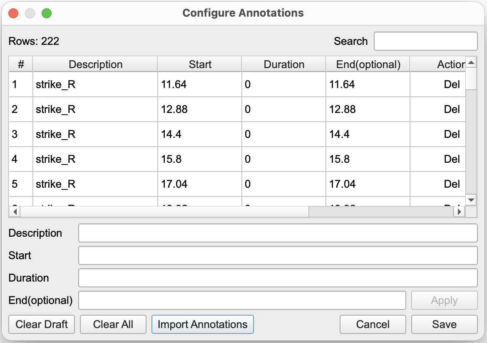

Import:

- `<demo-project-root>/dataset/sub-001-gait/annotations.csv`

Then click `Apply`.

The below figure is the plot for `Preprocess Signal 2.Annotations`.

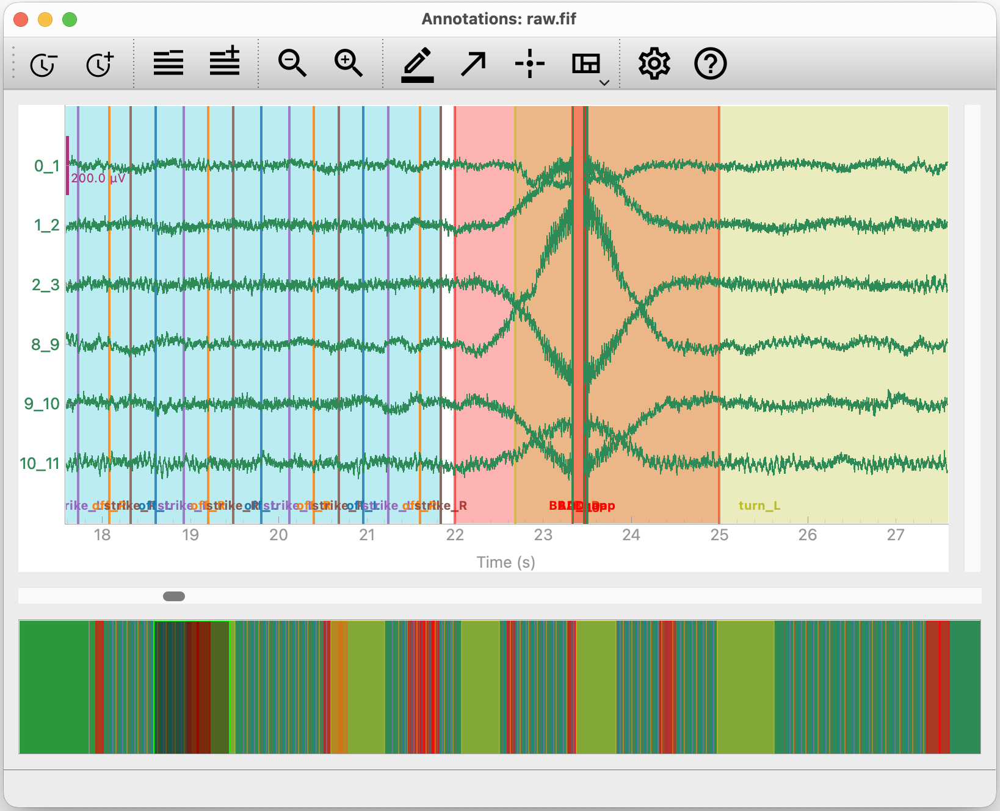

At this stage the manually labeled gait events should be visible together with
the filtered signal.

### 5.4 Step 3: Bad Segment Removal

This step removes previously marked bad spans and stitches the remaining valid
signal into a clean continuous stream. In this demo, that stitched output is
the last cleaning step before the record is finalized.

Click `Bad Segment Removal -> Apply`.

The below figure is the plot for `Preprocess Signal 3.Bad Segment Removal`.

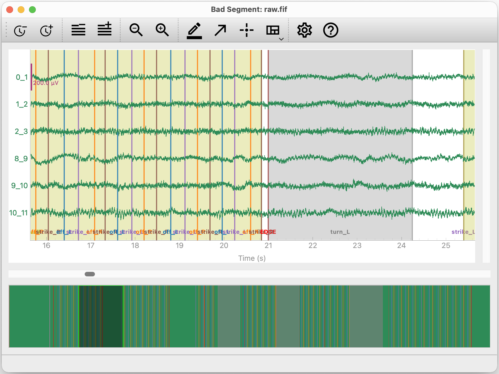

This is the cleaned signal that feeds the rest of the tutorial.

### 5.5 Step 4: ECG Artifact Removal

This step is an optional cleanup pass for residual cardiac contamination. It is skipped in the demo, as no such contamination is present.

If real data still show ECG bleed-through after the earlier preprocess steps,
apply ECG cleanup here before finalizing the record.

### 5.6 Step 5: Finish

This step exports the finalized preprocess result that downstream modules read.
In this demo, `Finish -> Apply` promotes the `Bad Segment Removal` output, so
Tensor, Align, and Features all start from the same cleaned record.

After skipping ECG cleanup in this walkthrough, go directly to `Finish ->
Apply`.

### 5.7 PSD and TFR QC

These QC views let you inspect the cleaned signal in the frequency domain
without changing any saved preprocess artifact. In this demo, they are the last
quality check before moving on to tensor building.

The below figure shows PSD QC on the `0. Raw`.

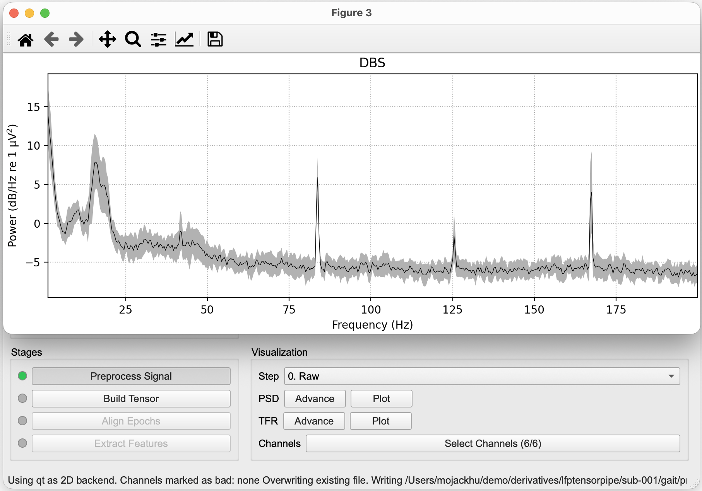

The figure shows PSD QC on the cleaned `3. Bad Segment Removal`.

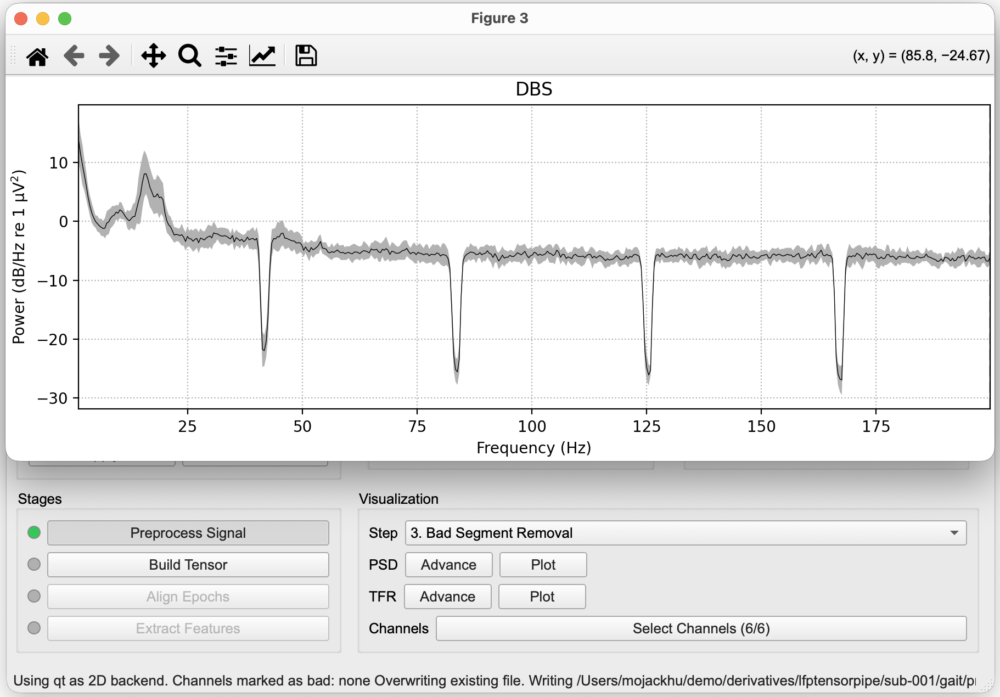

The figure shows the TFR visualization parameters dialog.

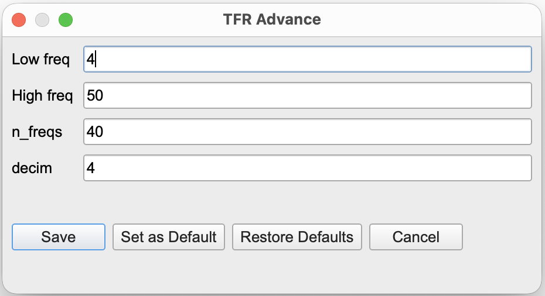

Use:

| Parameter | Value |
|---|---|
| `Low freq` | `4` |
| `High freq` | `50` |
| `n_freqs` | `40` |
| `decim` | `4` |

The below figure shows the TFR QC result after finishing preprocess.

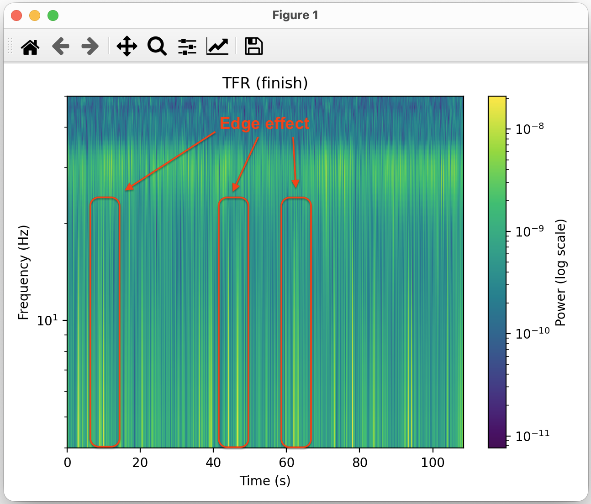

## 6. Build Tensor

This stage converts the finalized preprocess signal into time-frequency and
connectivity tensors. In this demo, those tensors become the source used by
epoch alignment and feature extraction.

Switch to `Build Tensor`.

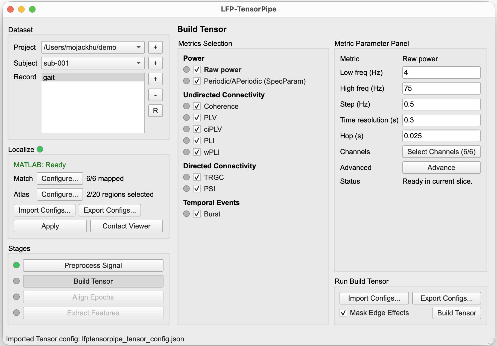

Import the tutorial config:

- `dataset/configs/tensor/lfptensorpipe_tensor_config.json`

Use `Export Configs...` if you want to save your own local tensor variant.

The core tensor parameters define the shared time-frequency grid used by most
metrics:

| Parameter | Meaning |
|---|---|
| `Low freq` | Lower bound of the analyzed frequency range |
| `High freq` | Upper bound of the analyzed frequency range |
| `Step` | Frequency sampling interval, which controls how dense the frequency axis is |
| `Time resolution` | Window scale used for each time-frequency estimate |
| `Hop` | Time step between adjacent windows on the output time axis |

These controls define the base grid. More specialized method-specific and
metric-specific parameters are configured in each metric's `Advance` dialog.

The validated demo config enables:

- `raw_power`
- `periodic_aperiodic`
- `coherence`
- `plv`
- `ciplv`
- `pli`
- `wpli`
- `trgc`
- `psi`
- `burst`

For this walkthrough:

1. import the config
2. verify the enabled metric list
3. keep `Mask Edge Effects` enabled so edge-prone samples near window
   boundaries stay masked during downstream analysis
4. click `Build Tensor`

## 7. Align Epochs

This stage aligns epochs. In this gait demo, it cuts the continuous tensor into event-locked gait epochs and warps them onto a common percentage timeline, turning multiple gait cycles into a comparable cycle-level analysis set.

Switch to `Align Epochs`.

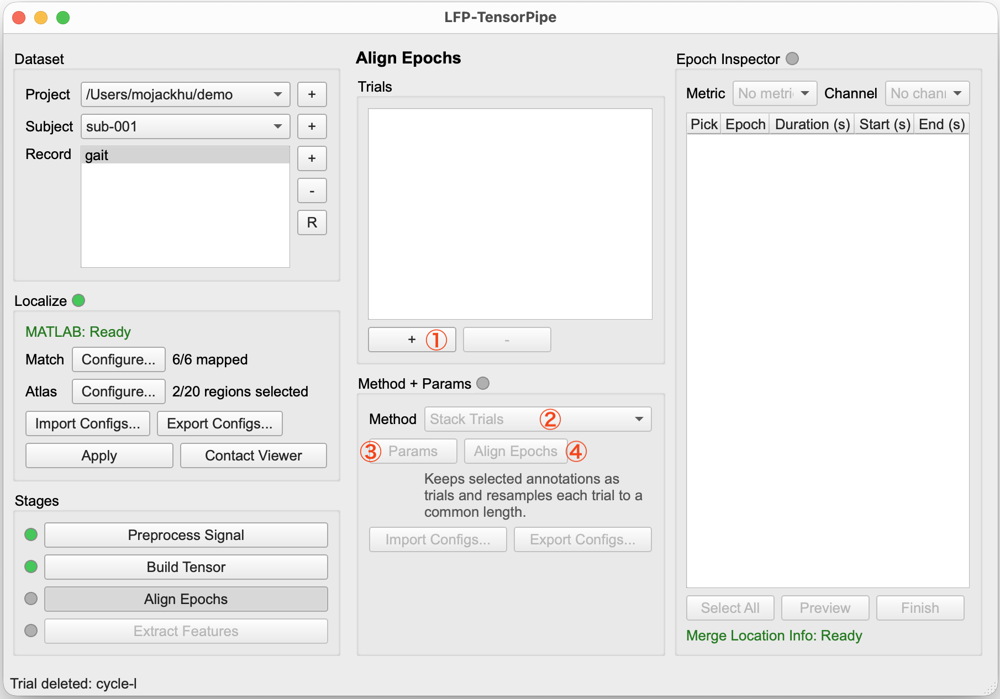

Control map:

- `① +`: create or select the trial definition
- `② Method`: choose the alignment method
- `③ Params`: edit the method parameters
- `④ Align Epochs`: generate the warped tensors for the selected trial

Import the tutorial config:

- `dataset/configs/align/lfptensorpipe_alignment_cycle-l_config.json`

Use `Export Configs...` if you want to save your own alignment variant.

The below figure shows the validated parameter set for `cycle_l`.

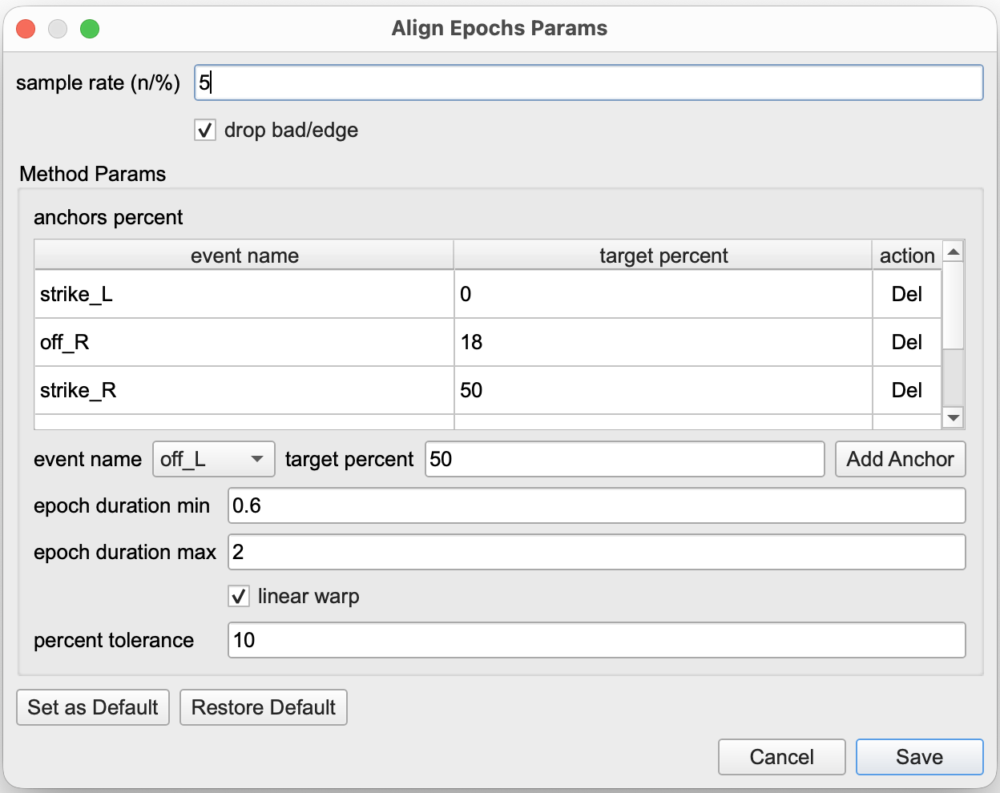

Use:

| Control | Value |
|---|---|
| `Method` | `Line Up Key Events` |
| `Anchors` | `0=strike_L`, `18=off_R`, `50=strike_R`, `68=off_L`, `100=strike_L` |
| `Epoch duration min` | `0.6 s` |
| `Epoch duration max` | `2.0 s` |
| `Linear warp` | enabled |
| `Percent tolerance` | `10` |
| `Drop bad/edge` | enabled |
| `Sample rate` | `5 Hz` |

### 7.1 Pick, Preview, and Finish

This QC step decides which aligned epochs are trustworthy enough to keep. In
this demo, only the picked epochs are exported and all later feature analyses
use that accepted set.

After running `Align Epochs`, stay in `Epoch Inspector`.

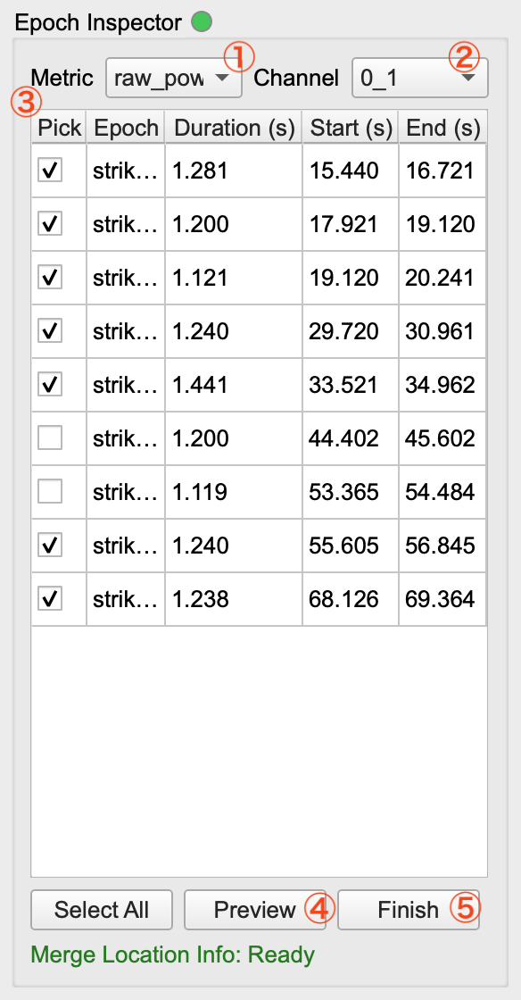

Control map:

- `① Metric`: choose the tensor used for QC
- `② Channel`: choose the representative channel
- `③ Pick`: keep or exclude individual epochs
- `④ Preview`: inspect the currently picked set
- `⑤ Finish`: export the currently picked set

This is the key downstream rule:

- only the checked rows in `Pick` are included in all later analysis

Use `Preview` as the manual QC surface for deciding whether an epoch should be
excluded.

The below figure shows the preview result for the selected picked set.

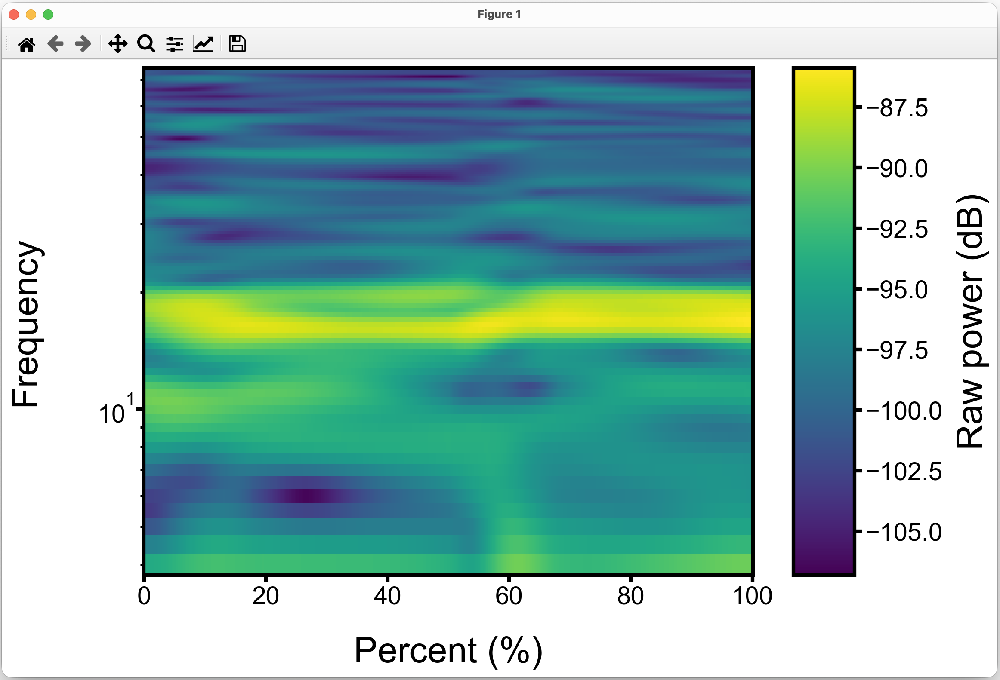

Before clicking `Finish`, confirm that the footer says:

- `Merge Location Info: Ready`

That status means the aligned export will merge localization metadata together
with the picked epochs.

## 8. Extract Features and Available Features

This stage reduces the aligned tensors into quantitative feature tables and
then visualizes selected feature slices. In this demo, the same stage also
defines which frequency bands and time windows the software will summarize.

Switch to `Extract Features`.

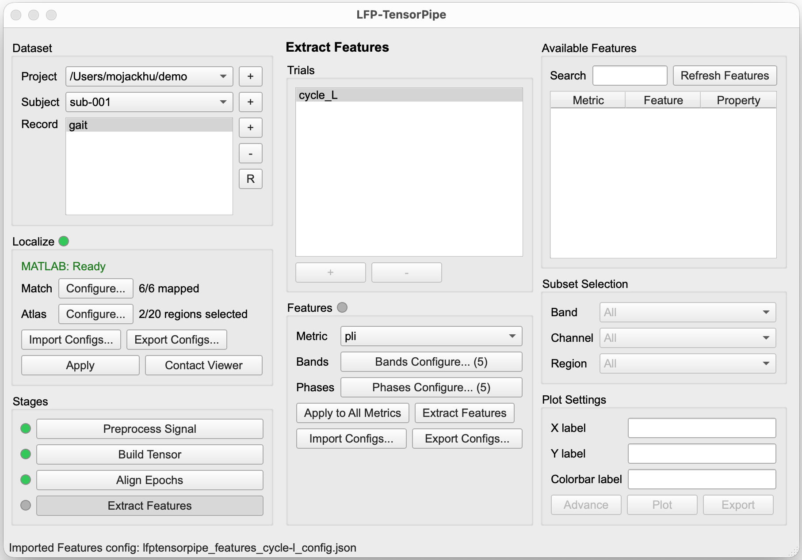

Import the tutorial config:

- `dataset/configs/feature/lfptensorpipe_features_cycle-l_config.json`

Use `Export Configs...` if you want to save your own feature-axes variant.

Click `Extract Features` after the import is complete.

Use `Bands Configure...` to define the frequency bands of interest and
`Phases Configure...` to define the time windows of interest. The software
computes feature values for the combinations of those configured bands and time
windows for each selected metric. The next two figures show the tutorial's
saved band and phase definitions.

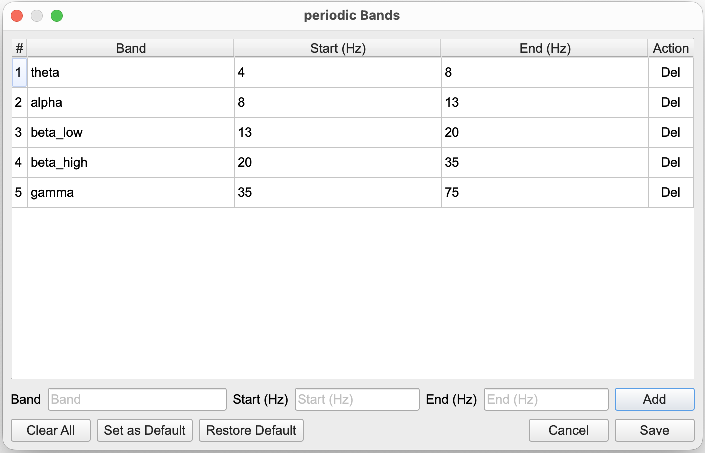

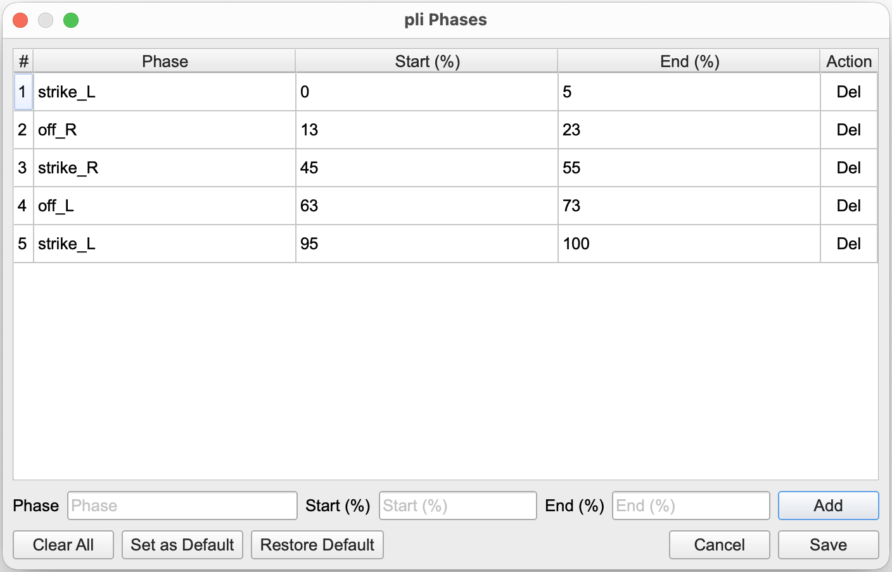

### 8.1 Select the Feature to Plot

This step chooses which extracted feature table to inspect and which subset of
that table to render. In this demo, it narrows the output to one metric, one
channel, and one region for plotting.

After extraction finishes, click `Refresh Features` and select the row shown in
the below figure.

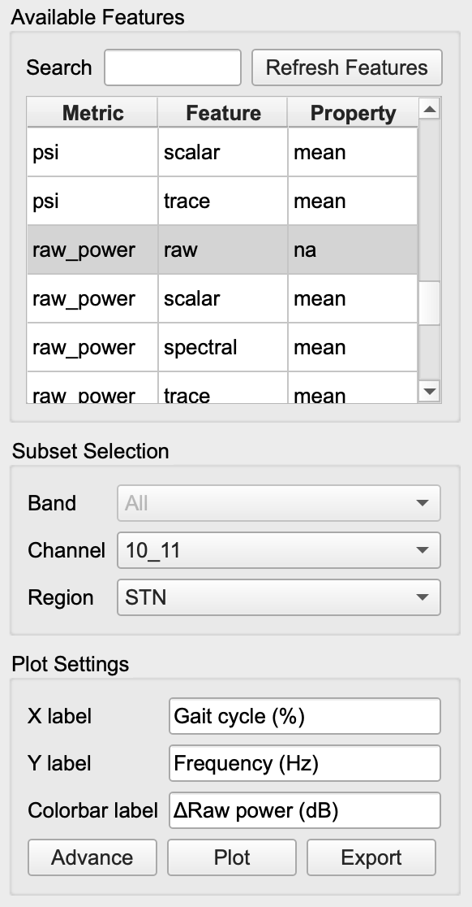

Use:

| Control | Value |
|---|---|
| `Feature row` | `raw_power | raw | na` |
| `Band` | `All` |
| `Channel` | `10_11` |
| `Region` | `STN` |
| `X label` | `Gait cycle (%)` |
| `Y label` | `Frequency (Hz)` |
| `Colorbar label` | `ΔRaw power (dB)` |

### 8.2 Baseline and Plot Settings

This step controls how the selected feature is normalized and rendered. In this
demo, plot advance sets the transform, normalization, and color mapping, then
baseline configure defines the percentage time interval used for normalization.

The below figure shows the plot-advance state used by the tutorial.

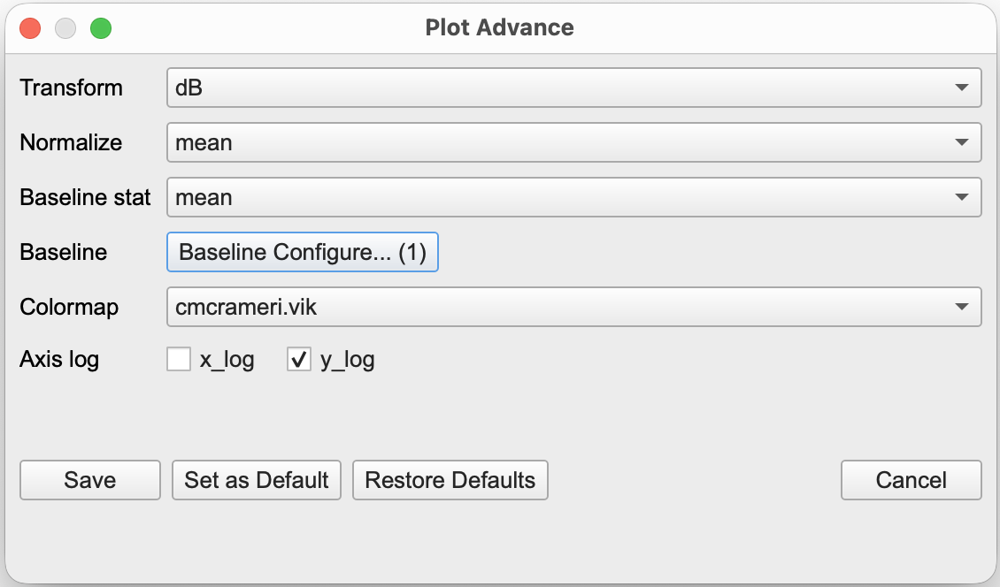

Use:

| Parameter | Value |
|---|---|
| `Transform` | `dB` |
| `Normalize` | `mean` |
| `Baseline stat` | `mean` |
| `Baseline` | `0-100` |
| `Colormap` | `cmcrameri.vik` |
| `x_log` | `false` |
| `y_log` | `true` |

From `Baseline Configure...`, define the percentage time interval used for
normalization. In this tutorial, the baseline uses the full gait-cycle range.

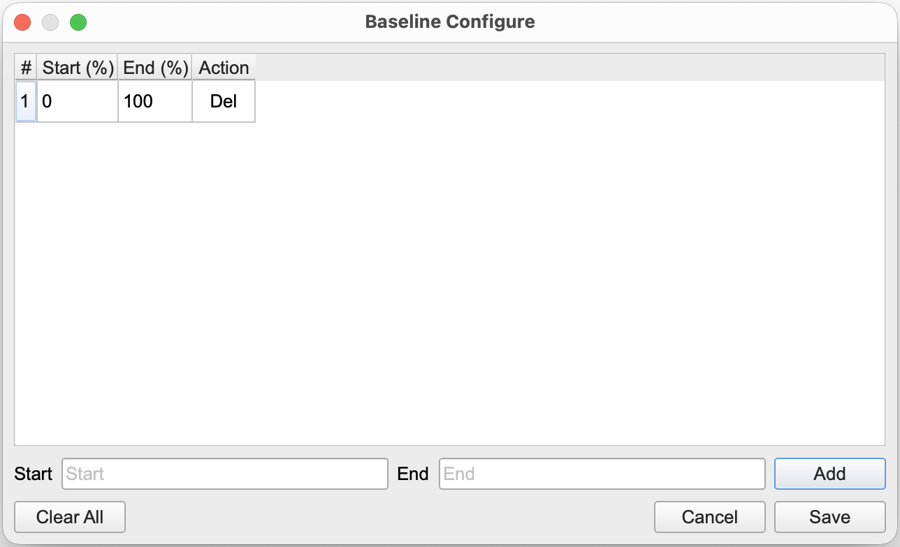

Add one baseline range:

- `0` to `100`

Use `Export` in the plot settings area when you want to save both the current
figure and the data used to render it.

### 8.3 Final Plot

This step renders the final visual output of the walkthrough. In this demo, it
closes the pipeline by turning one imported record, one aligned trial, and one
selected feature into a publication-style heatmap.

Click `Plot` to generate the result shown in the below figure.

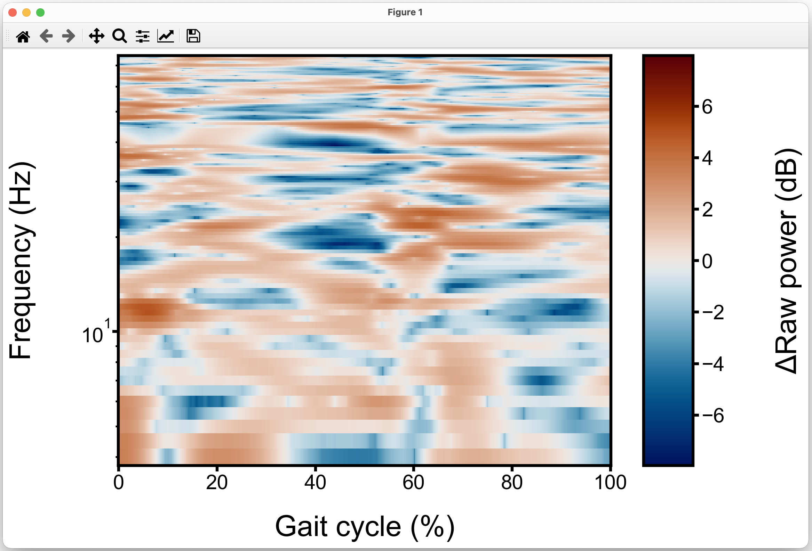

## 9. Quick Reproduction Notes

- Use the tutorial configs through `Import Configs...` whenever the page offers
  it. That is the fastest way to reproduce the walkthrough result.
- Use `Export Configs...` to save your own local variant after you modify a
  page.
- `Confirm Import` stays disabled until both `Sync` and `Reset reference` are
  saved.
- The SceneRay notch list in this demo is data-source specific and should not
  be copied blindly to unrelated datasets.
- The tutorial intentionally skips `ECG Artifact Removal`.
- The downstream analysis uses only the epochs checked in `Pick`.

For control-level descriptions of each page and dialog, continue with
[APP_CONTROL_REFERENCE.md](APP_CONTROL_REFERENCE.md).
