# LFP-TensorPipe App Tutorial


Follow this guide with the demo project in Section 2. The workflow starts with
installation and record selection, then moves through preprocess, localization,
tensor building, epoch alignment, and feature extraction.

## 1. Installation

LFP-TensorPipe supports two installation methods.

| Method | Best For | Summary |
|---|---|---|
| `PyInstaller desktop app` | Readers who want the packaged GUI | Install the PyInstaller-built app, launch it, and configure `Settings -> Configs` |
| `Developer setup` | Readers who want a source checkout or local development environment | Create the `lfptp` Conda environment, install the package in editable mode, and launch the GUI from that environment |

See [INSTALL.md](INSTALL.md) if you want the installation steps on a separate
page.

### 1.1 PyInstaller Desktop App

1. Download the PyInstaller desktop app package for your release.
2. Install or unpack it as instructed for your platform.
3. Launch the app.
4. Open `Settings -> Configs` on first launch if you plan to use `Localize`.

### 1.2 Developer Setup

```bash
conda env create -f envs/lfptp_py311_base.yml
conda activate lfptp
python -m pip install -e ".[dev]"
```

To launch the GUI from the developer environment:

```bash
lfptensorpipe
```

or:

```bash
lfptp
```

### 1.3 First Launch: `Settings -> Configs`

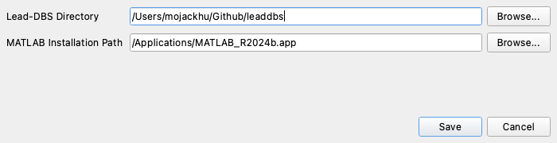

The `Settings -> Configs` dialog stores the machine-local paths used by
`Localize`.

Use the following values:

| Control | Value | Meaning |
|---|---|---|
| `Lead-DBS Directory` | `<lead-dbs-root>` | Root directory of the local Lead-DBS installation |
| `MATLAB Installation Path` | `<matlab-root>` | Root directory of the local MATLAB installation |

These values are stored in app settings, not in the repository.

Throughout this guide:

- `<lead-dbs-root>` means your local Lead-DBS installation root
- `<matlab-root>` means your local MATLAB installation root
- `<demo-project-root>` means the root of your local demo project copy
- `demo/records` and `demo/configs` mean the repository-shipped demo assets

## 2. Project Setup

Use one project throughout this guide:

| Item | Value |
|---|---|
| `Project` | `<demo-project-root>` |
| `Subject` | `sub-001` |
| `Record for Preprocess` | `ecg` |
| `Record for Localize` | `gait` |
| `Record for Build Tensor` | `gait` |
| `Record for Align Epochs` | `gait` |
| `Record for Extract Features` | `gait` |
| `Trial for Extract Features` | `cycle_l` |

`Project` can point directly to an existing Lead-DBS-compatible toolbox project
path. In the examples below, `<demo-project-root>` is the project root.
The walkthrough later returns to this same setup in the left-side `Dataset`
block, where you switch between `ecg` and `gait` on the same subject.

## 3. Demo Data and Config Files

This guide uses two independent demo sources:

- the working project under `<demo-project-root>`
- the repository demo assets under `demo/records` and `demo/configs`

They are intentionally independent:

- a record sample is a data-import example
- a config example is a reusable parameter example

### 3.1 Record Import Samples in the Repository Demo

| Import Type in UI | Example File(s) | What It Demonstrates |
|---|---|---|
| `Medtronic` | `demo/records/medrtronic/Report_Json_Session_Report_20250227T105610.json` | Medtronic JSON report import |
| `PINS` | `demo/records/PINS/EEGRealTime_PATIENT_REDACTED_500Hz_2000-01-01-00-00-00.txt` | PINS main data file |
| `PINS` optional sidecars | `demo/records/PINS/EEGRealTime_PATIENT_REDACTED_500Hz_2000-01-01-00-00-00_Para.txt`, `demo/records/PINS/RealTimeMarker_PATIENT_REDACTED_2000-01-01-00-00-00.txt` | Metadata and marker inputs for the `Advanced` section |
| `Sceneray` | `demo/records/sceneray/IPG_SERIAL_REDACTED_20000101000000_uv.csv` | SceneRay voltage CSV import |
| `Sceneray` optional sidecar | `demo/records/sceneray/IPG_SERIAL_REDACTED_20000101000000.txt` | Optional metadata sidecar |
| `Legacy (MNE supported)` | `demo/records/mne/gait.fif` | Direct MNE-readable import |
| `Legacy (CSV)` | `demo/records/csv/ecg_contaminated.csv` | Plain channel-only CSV import |

The main walkthrough below does not start from the import dialog. It uses the
already imported `sub-001 / ecg` and `sub-001 / gait` records inside the example
project.

### 3.2 Config Files Used in This Guide

| Example File | Scope | What It Demonstrates |
|---|---|---|
| `demo/configs/localize/lfptensorpipe_localize_config.json` | `Localize` | Example atlas, selected regions, and channel/contact match for the gait workflow |
| `demo/configs/tensor/lfptensorpipe_tensor_config.json` | `Build Tensor` | Example tensor setup for the gait workflow |
| `demo/configs/tensor/lfptensorpipe_tensor_sit_config.json` | `Build Tensor` | Tensor example for steady-state data such as sit |
| `demo/configs/align/lfptensorpipe_alignment_cycle-l_config.json` | `Align Epochs` | `Line Up Key Events` for one gait cycle from left strike to the next left strike |
| `demo/configs/align/lfptensorpipe_alignment_turn_config.json` | `Align Epochs` | `Clip Around Event` for turning with `pre`, `onset`, `offset`, and `post` windows |
| `demo/configs/align/lfptensorpipe_alignment_turn-stack_config.json` | `Align Epochs` | `Stack Trials` for the full turning interval normalized to `0-100%` |
| `demo/configs/align/lfptensorpipe_alignment_walk_config.json` | `Align Epochs` | `Stitch Trials` for concatenating all walking segments |
| `demo/configs/feature/lfptensorpipe_features_cycle-l_config.json` | `Extract Features` | The `cycle_l` feature walkthrough |
| `demo/configs/feature/lfptensorpipe_features_turn_config.json` | `Extract Features` | Turn-centered feature phases |
| `demo/configs/feature/lfptensorpipe_features_turn-stack_config.json` | `Extract Features` | Turn-stack full-span phases |
| `demo/configs/feature/lfptensorpipe_features_walk_config.json` | `Extract Features` | Walk full-span phases |

UI trial names and config filenames are related but not identical in every case.
For example:

- UI trial `cycle_l` uses config file `lfptensorpipe_alignment_cycle-l_config.json`
- UI trial `turn_stack` uses config file `lfptensorpipe_alignment_turn-stack_config.json`

### 3.3 Built-In Defaults vs Config Files

Built-in defaults are baseline templates. Example configs are scenario-specific.

- built-in defaults seed initial values into app storage
- example configs show one concrete use case

For example, the tensor config above is a gait-oriented setup, while the
built-in tensor defaults are only the starting point.

## 4. Workflow and UI Logic

The normal workflow is:

1. Select `Project`, `Subject`, and `Record`.
2. Configure `Localize` if representative coordinates are needed.
3. Run `Preprocess Signal`.
4. Run `Build Tensor`.
5. Run `Align Epochs`.
6. Run `Extract Features`.

### 4.1 Stage Gating

| Stage | Opens When | Why |
|---|---|---|
| `Preprocess Signal` | Always | It is the first stage page |
| `Build Tensor` | `Preprocess Signal` is green | Tensor building depends on finished preprocess output |
| `Align Epochs` | `Build Tensor` is green | Alignment depends on tensor outputs |
| `Extract Features` | The current shared trial in `Align Epochs` is green | Feature extraction depends on finished alignment outputs |
| `Localize` | Independent from stage gating | It is record-scoped and always available in the left column |

### 4.2 Indicator Logic

| Indicator Type | Gray | Yellow | Green |
|---|---|---|---|
| Left stage light | No log yet | Latest log exists but is stale or incomplete | Latest log exists and is ready/current |
| Inline panel light | No successful run or apply yet | Current draft no longer matches the latest successful state, or the latest attempt failed | Current draft matches the latest successful state |

### 4.3 Common Dialog Actions

Many dialogs reuse the same footer verbs.

| Action | Meaning |
|---|---|
| `Save` | Apply the dialog result to the current record or current trial |
| `Set as Default` | Save the current dialog values into app-level defaults |
| `Restore Default` / `Restore Defaults` | Reload the saved defaults for that dialog scope |
| `Clear Draft` | Clear only the draft row or draft pair |
| `Clear All` | Remove all currently configured rows |
| `Cancel` | Close without applying the current dialog result |
| `Select All` / `Clear` | Toggle all available checkable items |

## 5. Dataset and Record Selection

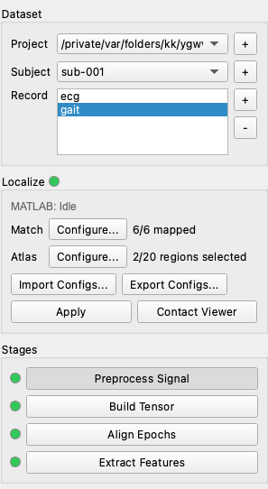

The left column is persistent across all stage pages.

### 5.1 Dataset Block

Use the following sequence:

1. Select `Project = <demo-project-root>`
2. Select `Subject = sub-001`
3. Select `Record = ecg` for the preprocess chapter
4. Switch to `Record = gait` for the Localize, Tensor, Align, and Features chapters

| Control | Meaning | Notes |
|---|---|---|
| `Project` | Current project root | A Lead-DBS-compatible project path is valid directly |
| `Subject` | Current subject inside the selected project | Refreshes the record list |
| `Record` list | Records available for the current subject | Selecting a record restores record-scoped UI state |
| `Project +` | Add a project path | Adds it to recent-project history |
| `Subject +` | Create a new subject | Enforces the `sub-*` naming rule |
| `Record +` | Open the import flow | Used to ingest a new record |
| `Record -` | Delete the selected record and its artifacts | Destructive |

### 5.2 Localize Panel

| Control | Meaning | Notes |
|---|---|---|
| Localize indicator | Draft-aware Localize freshness light | Compares the saved `atlas + selected_regions + match` against the latest successful apply |
| `MATLAB: ...` | Runtime status label | Reports warmup or readiness state |
| `Match -> Configure...` | Open the channel-to-contact match dialog | Record-scoped |
| `Atlas -> Configure...` | Open the atlas and region dialog | Record-scoped |
| `Import Configs...` / `Export Configs...` | Load or save the current Localize JSON payload | Record-scoped |
| `Apply` | Run Localize for the current record | Writes representative coordinate artifacts |
| `Contact Viewer` | Open the representative-coordinate viewer | Requires successful Localize output |

## 6. Record Import Reference

The main walkthrough uses records that are already imported into the example
project. This section explains the import dialog for readers who want to add new
records.

### 6.1 Example Import States

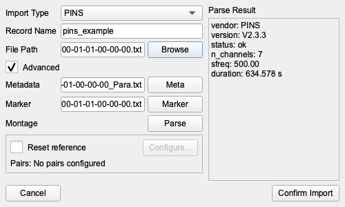

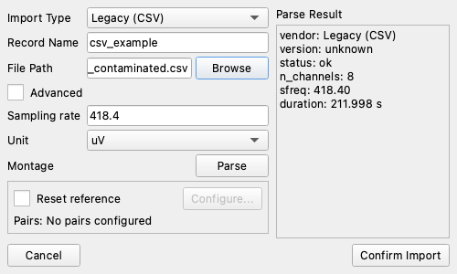

Use the following SceneRay files for the reset-reference example in this
section:

- `demo/records/sceneray/IPG_SERIAL_REDACTED_20000101000000_uv.csv`
- `demo/records/sceneray/IPG_SERIAL_REDACTED_20000101000000.txt`

### 6.2 Main Import Controls

| Control | Meaning | Notes |
|---|---|---|
| `Import Type` | Select the parser flow | Changes the visible optional fields |
| `Record Name` | Name of the record to create | Must be unique inside the subject |
| `File Path` | Main source file | `Browse` opens a file picker |
| `Advanced` | Show optional sidecar fields | Relevant for `PINS` and `Sceneray` |
| `Metadata` | Optional sidecar path | Used by `PINS` and `Sceneray` |
| `Marker` | Optional sidecar path | Used by `PINS` |
| `Sampling rate` | Required for `Legacy (CSV)` | Manual input |
| `Unit` | Required for `Legacy (CSV)` | `V`, `mV`, `uV`, or `nV` |
| `Parse` | Validate the selected inputs | `Confirm Import` stays disabled until parsing succeeds |
| `Reset reference` | Enable import-time reset reference | Requires at least one configured pair |
| `Configure...` | Open the reset-reference dialog | Enabled only after parsing succeeds and reset reference is checked |
| `Confirm Import` | Finalize the import | Disabled until parsing succeeds and reset-reference requirements are satisfied |

### 6.3 Import-Type Matrix

| Import Type | Required Inputs | Optional Inputs |
|---|---|---|
| `Medtronic` | one `.json` file | none |
| `PINS` | one main `.txt` file | metadata `.txt`, marker `.txt` |
| `Sceneray` | one `_uv.csv` file | metadata `.txt` |
| `Legacy (MNE supported)` | one MNE-readable file | none |
| `Legacy (CSV)` | one plain channel-only `.csv`, manual sampling rate, manual unit | none |

### 6.4 `Reset Reference` Dialog

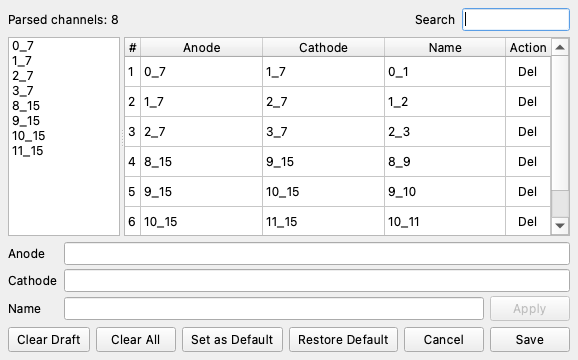

The SceneRay example above uses these rows:

- `0_7 - 1_7 -> 0_1`
- `1_7 - 2_7 -> 1_2`
- `2_7 - 3_7 -> 2_3`
- `8_15 - 9_15 -> 8_9`
- `9_15 - 10_15 -> 9_10`
- `10_15 - 11_15 -> 10_11`

| Control | Meaning | Notes |
|---|---|---|
| `Search` | Filter parsed channels and existing rows | Does not change saved rows |
| Channel list | Parsed channels from the just-parsed source | Click once for `Anode`, then another channel for `Cathode` |
| row table | Configured reset-reference rows | Shows `Anode`, `Cathode`, output `Name`, and delete action |
| `Name` | Output channel name | Must be unique |
| `Apply` | Add the draft row | Requires a valid draft |
| `Clear Draft` / `Clear All` | Common dialog behavior | See Section 4.3 |
| `Set as Default` / `Restore Default` | Common default behavior | Stored in app-level record defaults |
| `Save` | Use the configured rows for the current import | The import dialog uses them only if `Reset reference` is checked |

Reset-reference rows follow the signal rule implemented by the app:

- at least one of `Anode` or `Cathode` must be non-empty
- if both are filled, the output is `Anode - Cathode`
- if only `Anode` is filled, the output keeps that channel unchanged
- if only `Cathode` is filled, the output becomes the negated channel

## 7. Preprocess Walkthrough with `sub-001 / ecg`


For this chapter, use:

- `Project = <demo-project-root>`
- `Subject = sub-001`
- `Record = ecg`

### 7.1 Preprocess Blocks

| Block | Purpose | Main Controls |
|---|---|---|
| `0. Raw` | View the imported signal | `Plot` |
| `1. Filter` | Run the basic filter and review `bad` spans | `Notches`, `Low freq`, `High freq`, `Advance`, `Apply`, `Plot` |
| `2. Annotations` | Manage named event annotations | `Configure...`, `Apply`, `Plot` |
| `3. Bad Segment Removal` | Remove or mask intervals marked as `bad` or `edge` | `Apply`, `Plot` |
| `4. ECG Artifact Removal` | Remove ECG contamination on selected channels | `Method`, `Select Channels`, `Apply`, `Plot` |
| `5. Finish` | Write the final preprocess output | `Apply`, `Plot` |
| `Visualization` | Inspect any preprocess output in read-only QC mode | `Step`, `PSD`, `TFR`, `Select Channels` |

For steps `0` through `4`, plot edits are saved automatically when the plot
window closes. In the MNE browser, press `a` to create or edit annotations.
In practice:

- use `0. Raw -> Plot` and `1. Filter -> Plot` to inspect the signal
- use `1. Filter -> Plot` to add or correct `bad` spans
- keep `2. Annotations` for named events, not for `bad` spans

### 7.2 `0. Raw`

`0. Raw -> Plot` opens the imported signal in the MNE browser for inspection
before filtering and annotation work begins.

### 7.3 `1. Filter`

| Control | Meaning |
|---|---|
| `Notches` | Comma-separated notch center frequencies in Hz |
| `Low freq` | High-pass cutoff in Hz |
| `High freq` | Low-pass cutoff in Hz |
| `Advance` | Open advanced filter parameters |
| `Apply` | Run the filter step |
| `Plot` | Open the filtered signal in the MNE browser |

`Filter -> Plot` is where you review and correct `bad` spans. In this tutorial,
that is the recommended place to:

- add missed `bad` intervals
- fix wrong `bad` boundaries
- verify whether automatic `bad` detection was too conservative or too aggressive

The edits made in the plot window are saved back to the filter-step artifact
when the plot closes. Those saved `bad` spans are then available to later
preprocess steps such as `Bad Segment Removal`.

If you want a refresher on MNE browser annotation editing, see the official MNE
tutorial: [Annotating continuous data](https://mne.tools/stable/auto_tutorials/raw/30_annotate_raw.html).

#### `Filter Advance`

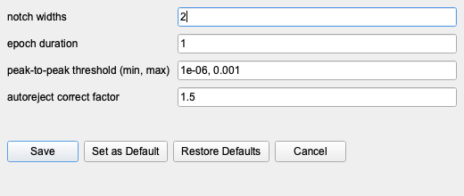

| Parameter | Meaning | Notes |
|---|---|---|
| `Notch widths` | Bandwidth around each notch frequency | One value can be broadcast to all notches |
| `Epoch duration` | Epoch length used by filter QC logic | Supports the rejection heuristics |
| `Peak-to-peak threshold min` | Lower amplitude bound | Helps reject flat or invalid segments |
| `Peak-to-peak threshold max` | Upper amplitude bound | Helps reject saturated or artifact-heavy segments |
| `Autoreject correct factor` | Correction factor used by automatic rejection heuristics | Higher values are more permissive |

### 7.4 `2. Annotations`

`Annotations` is not the same as `Filter -> Plot`.

- `Filter -> Plot` is for `bad` span editing
- `Annotations` is for named event annotations such as gait, turn, walk, or
  other paradigm-specific events

These named events are what later drive `Align Epochs`.

`Annotations` adds or edits named event labels. It does not replace the `bad`
spans created in `Filter -> Plot`.

#### `Configure Annotations`

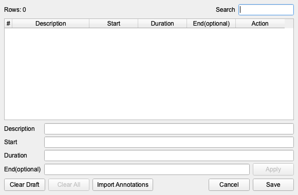

| Control | Meaning | Notes |
|---|---|---|
| `Rows: n` | Number of configured event rows | Not affected by the search filter |
| `Search` | Filter rows by description text | Does not change saved rows |
| table | Current event rows | Shows description, onset, duration, computed end, and delete action |
| `Description` | Event label | Required |
| `Start` | Event onset in seconds | Required and numeric |
| `Duration` | Event duration in seconds | Required and numeric |
| `End(optional)` | Convenience field for the draft row | Stored output still uses onset + duration |
| `Apply` | Add the draft row | Requires a valid draft |
| `Import Annotations` | Import rows from a CSV file | CSV header must be `description,onset,duration` |
| `Clear Draft` / `Clear All` / `Save` / `Cancel` | Common dialog behavior | See Section 4.3 |

### 7.5 `3. Bad Segment Removal`

This block has no dedicated dialog.

| Control | Meaning |
|---|---|
| `Apply` | Run bad-segment removal using the current `bad` and `edge` annotations |
| `Plot` | Plot the post-removal output |

### 7.6 `4. ECG Artifact Removal`

For the `sub-001 / ecg` example, this is the record-specific cleanup step that
follows filtering and bad-segment removal.

| Control | Meaning |
|---|---|
| `Method` | ECG removal method for the current record |
| `Select Channels` | Choose which channels participate in ECG removal |
| `Apply` | Run ECG artifact removal |
| `Plot` | Plot the ECG-cleaned output |

#### Generic `Select Channels` Dialog

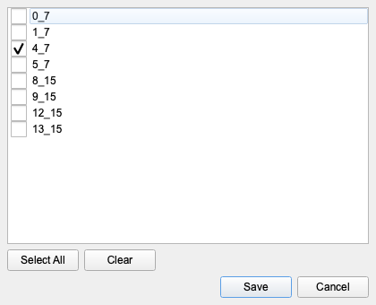

| Control | Meaning |
|---|---|
| checkbox list | Current channel selection |
| `Select All` / `Clear` | Toggle every row |
| `Save` | Use the selected channels |
| `Cancel` | Close without changing the selection |

### 7.7 `5. Finish`

| Control | Meaning |
|---|---|
| `Apply` | Write the final preprocess output |
| `Plot` | Plot the finish-step output |

`Finish` publishes the preprocess result consumed by `Build Tensor`.

### 7.8 `Visualization`

Visualization is read-only. It lets you inspect any preprocess step without
changing the record configuration.

| Control | Meaning |
|---|---|
| `Step` | Choose which preprocess output to visualize |
| `PSD -> Advance` | Open PSD plot parameters |
| `PSD -> Plot` | Plot PSD for the selected step and channels |
| `TFR -> Advance` | Open TFR plot parameters |
| `TFR -> Plot` | Plot TFR for the selected step and channels |
| `Select Channels` | Pick the channels used for PSD/TFR visualization |

#### `PSD Advance`

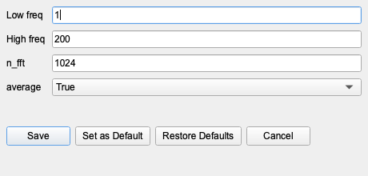

| Parameter | Meaning |
|---|---|
| `Low freq` | Lower plot frequency bound in Hz |
| `High freq` | Upper plot frequency bound in Hz |
| `n_fft` | FFT length in samples |
| `average` | Average PSD across the selected channels |

#### `TFR Advance`

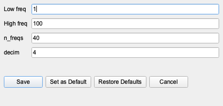

| Parameter | Meaning |
|---|---|
| `Low freq` | Lower plot frequency bound in Hz |
| `High freq` | Upper plot frequency bound in Hz |
| `n_freqs` | Number of frequencies used by the TFR |
| `decim` | Decimation factor used during TFR computation |

## 8. Gait Workflow with `sub-001 / gait`

From this point on, switch to:

- `Project = <demo-project-root>`
- `Subject = sub-001`
- `Record = gait`

The `gait` record is used for:

- `Localize`
- `Build Tensor`
- `Align Epochs`
- `Extract Features`

## 9. Localize Walkthrough with `sub-001 / gait`

Localize is record-scoped. It uses existing Lead-DBS outputs from the selected
project to build representative coordinate artifacts for later alignment and
feature workflows.

Localize does not replace Lead-DBS. It depends on an existing Lead-DBS project
and completed Lead-DBS results for the current subject.

When Localize is ready for the current record, `Align Epochs -> Finish` uses the
saved Localize outputs to merge representative-coordinate columns into the final
alignment raw tables.

### 9.1 `Match: Record Channels ↔ Lead-DBS Contacts`

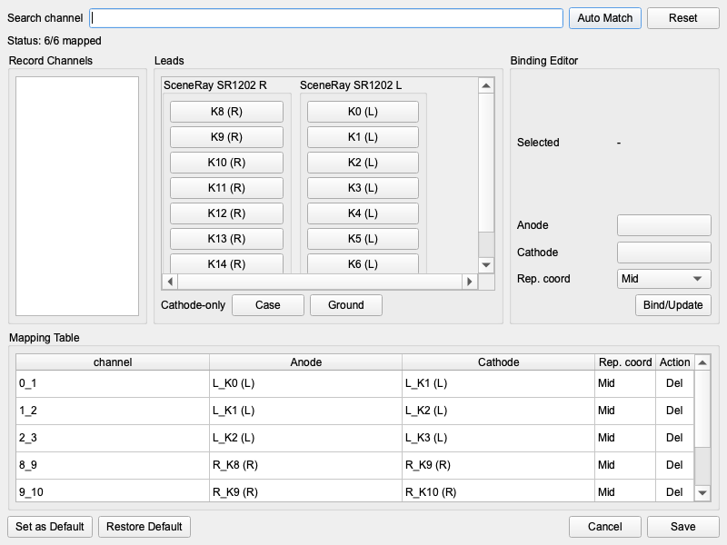

Use this Localize config in the practice flow:

- `demo/configs/localize/lfptensorpipe_localize_config.json`

| Control | Meaning | Notes |
|---|---|---|
| `Search channel` | Filter the unmapped channel list | Useful on larger channel sets |
| `Auto Match` | Try a best-effort automatic mapping | Review the result before saving |
| `Reset` | Clear all mappings in the current dialog session | Use when a previous attempt was wrong |
| `Status: x/y mapped` | Mapping completeness summary | `Save` requires full coverage |
| `Record Channels` | Unmapped channels that still need assignment | Selecting one loads it into the editor |
| `Leads` | Available reconstruction contacts grouped by lead | Click contacts to build the current draft |
| `Cathode-only` buttons | `Case` and `Ground` | Valid only after an anode is chosen |
| `Anode` / `Cathode` | Current draft endpoints | Can be cleared and rebound |
| `Rep. coord` | Representative coordinate to export | `Anode`, `Cathode`, or `Mid` |
| `Bind/Update` | Save the draft mapping for the selected channel | Writes to the mapping table |
| `Mapping Table` | All committed mappings | `Del` removes a row |
| `Set as Default` / `Restore Default` | Common default behavior with compatibility checks | Must match both current channels and current lead signature |
| `Save` | Persist the match payload | Disabled until every channel is mapped |

### 9.2 `Configure Localize Atlas`

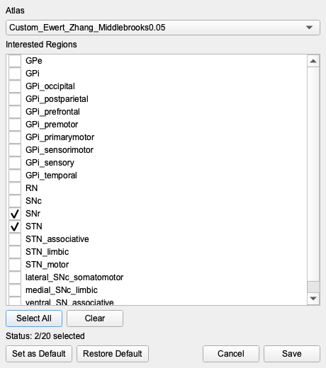

The atlas list is not hard-coded inside the app. It is discovered from the
Lead-DBS atlas directories for the current subject space under:

- `{Lead-DBS Directory}/templates/space/<space>/atlases`

| Control | Meaning | Notes |
|---|---|---|
| `Atlas` | Atlas used by Localize Apply | Choices depend on the current subject space and current Lead-DBS installation |
| `Interested Regions` | Regions that should produce membership columns | The app writes one column per selected region |
| `Select All` / `Clear` | Toggle all visible regions | `Save` requires at least one region |
| `Status: x/y selected` | Selection summary | Updates immediately |
| `Set as Default` / `Restore Default` | Common default behavior | Stored per space |
| `Save` | Persist the atlas and region selection for the current record | This does not run Localize by itself |

If you need to add atlases manually, follow the official Lead-DBS atlas guide:
[Acquiring and setting atlases](https://netstim.gitbook.io/leaddbs/appendix/acquiring-and-setting-atlases).

### 9.3 Localize Example

The example Localize config in this project uses:

- atlas `Custom_Ewert_Zhang_Middlebrooks0.05`
- selected regions `SNr` and `STN`
- a bilateral SceneRay-style match for channels `0_1`, `1_2`, `2_3`, `8_9`,
  `9_10`, and `10_11`

## 10. Build Tensor Walkthrough with `sub-001 / gait`

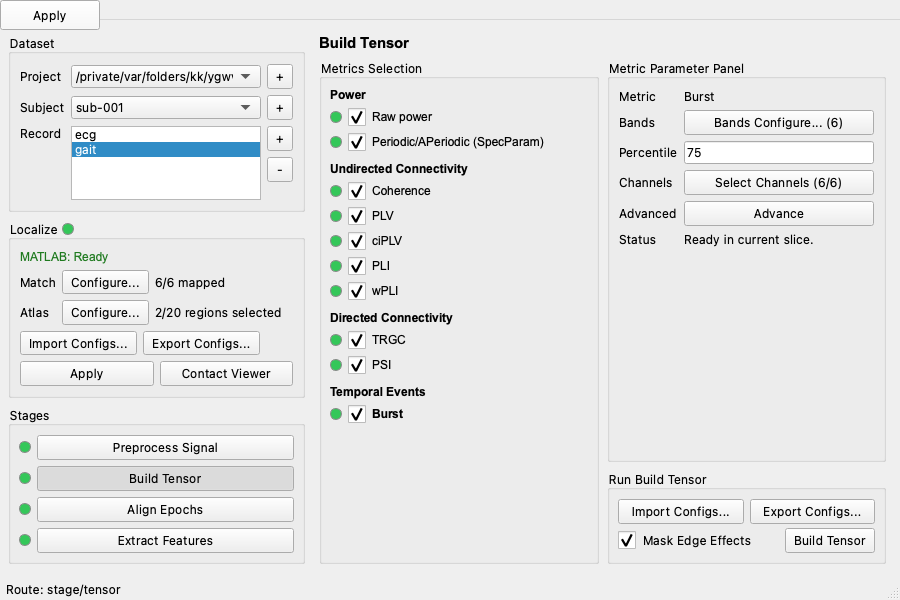

Use this tensor config in the practice flow:

- `demo/configs/tensor/lfptensorpipe_tensor_config.json`

### 10.1 Metrics Selection

| Element | Meaning |
|---|---|
| row checkbox | Include that metric in `Build Tensor` |
| metric name button | Make that row the active metric in the parameter panel |
| row indicator | Draft-aware state of that metric |
| groups | Metrics are grouped into `Power`, `Undirected Connectivity`, `Directed Connectivity`, and `Temporal Events` |

### 10.2 Metric Parameter Panel

The right panel only shows rows that are relevant to the active metric.

| Row | Used By |
|---|---|
| `Low freq (Hz)` | raw power, periodic/aperiodic, coherence, PLV, ciPLV, PLI, wPLI, TRGC |
| `High freq (Hz)` | same metrics as above |
| `Step (Hz)` | same metrics as above |
| `Time resolution (s)` | raw power, periodic/aperiodic, all connectivity metrics, PSI |
| `Hop (s)` | raw power, periodic/aperiodic, all connectivity metrics, PSI |
| `Method` | Spectral method selector for the active metric |
| `SpecParam freq range` | periodic/aperiodic only |
| `Bands Configure...` | PSI and Burst |
| `Percentile` | Burst |
| `Select Channels` | raw power, periodic/aperiodic, Burst |
| `Select Pairs` | connectivity metrics and PSI |
| `Advance` | Metric-specific advanced parameters |

For `Periodic/APeriodic (SpecParam)`, keep `SpecParam freq range` slightly
wider than the final `Low freq (Hz)` and `High freq (Hz)` bounds so the model
fit is less sensitive near the analysis edges.

### 10.3 Run Build Tensor Block

| Control | Meaning |
|---|---|
| `Import Configs...` | Load a tensor config JSON for the current record |
| `Export Configs...` | Save the current tensor config JSON |
| `Mask Edge Effects` | Mask edge artifacts in tensor outputs |
| `Build Tensor` | Run the selected metrics |

### 10.4 `Bands Configure`

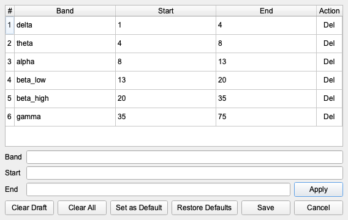

This dialog is used by PSI and Burst.

| Control | Meaning |
|---|---|
| table | Current band rows for the active metric |
| `Band` / `Start` / `End` | Draft row fields |
| `Apply` | Add the draft band |
| `Clear Draft` / `Clear All` | Common dialog behavior |
| `Set as Default` / `Restore Defaults` | Common default behavior |
| `Save` | Use the current band list for the active metric |

### 10.5 `Tensor Channels`

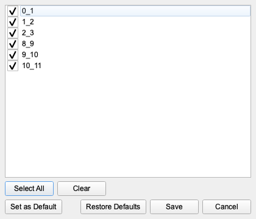

| Control | Meaning |
|---|---|
| checkbox list | Channel inclusion for the active metric |
| `Select All` / `Clear` | Toggle all channels |
| `Set as Default` / `Restore Defaults` | Common default behavior |
| `Save` | Use the current selection for the active metric |

### 10.6 `Tensor Pairs`

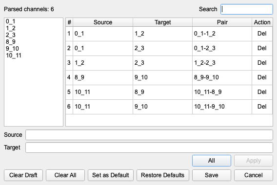

| Control | Meaning | Notes |
|---|---|---|
| `Search` | Filter channels and pairs | Useful when many channels exist |
| channel list | Draft source/target picker | Click one channel to set `Source`, then another to set `Target` |
| pair table | Current pair selection | `Del` removes one pair |
| `Source` / `Target` | Draft pair endpoints | The normalized pair preview updates automatically |
| `All` | Add every valid pair | Quick baseline |
| `Apply` | Add the current draft pair | Uses the current directed or undirected mode |
| `Set as Default` / `Restore Defaults` | Common default behavior | Stored separately from session selection |
| `Save` | Use the selected pairs for the active metric | Record-scoped |

### 10.7 Metric `Advance` Dialog Variants

#### Raw Power Advance

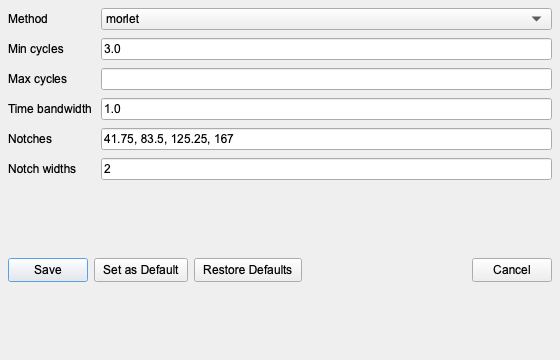

| Parameter | Meaning |
|---|---|
| `Method` | Spectral estimator (`morlet` or `multitaper`) |
| `Min cycles` | Minimum cycles for spectral estimation |
| `Max cycles` | Optional maximum cycles |
| `Time bandwidth` | Multitaper bandwidth control |
| `Notches` | Metric-specific notch centers in Hz |
| `Notch widths` | Metric-specific notch bandwidths |

#### Periodic/APeriodic (SpecParam) Advance

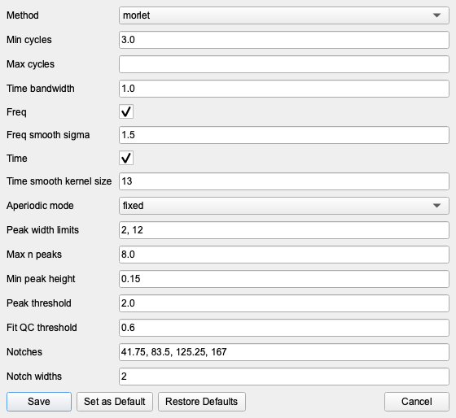

| Parameter | Meaning |
|---|---|
| `Method` | Spectral estimator used before decomposition |
| `Min cycles` / `Max cycles` | Spectral-estimation cycles |
| `Time bandwidth` | Multitaper smoothing strength |
| `Freq` | Enable pre-decomposition frequency-axis smoothing |
| `Freq smooth sigma` | Gaussian sigma in frequency bins |
| `Time` | Enable pre-decomposition time-axis smoothing |
| `Time smooth kernel size` | Median-filter kernel size in time bins |
| `Aperiodic mode` | `fixed` or `knee` fit |
| `Peak width limits` | Peak-width bounds in Hz, entered as `low,high` |
| `Max n peaks` | Maximum number of peaks to fit |
| `Min peak height` | Minimum peak height for peak detection |
| `Peak threshold` | Peak-detection threshold |
| `Fit QC threshold` | Minimum fit-quality threshold |
| `Notches` / `Notch widths` | Metric-specific notch exclusions |

#### Connectivity and PSI Advance

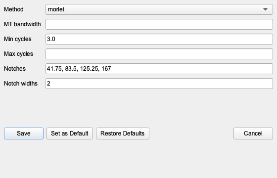

This layout applies to `Coherence`, `PLV`, `ciPLV`, `PLI`, `wPLI`, and `PSI`.

| Parameter | Meaning |
|---|---|
| `Method` | Spectral estimator |
| `MT bandwidth` | Multitaper bandwidth parameter |
| `Min cycles` / `Max cycles` | Spectral-estimation cycles |
| `Notches` / `Notch widths` | Metric-specific notch exclusions |

#### TRGC Advance

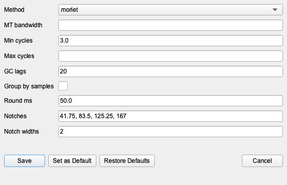

| Parameter | Meaning |
|---|---|
| `GC lags` | Number of lags for Granger/TRGC modeling |
| `Group by samples` | Group window lengths by exact sample count | Usually leave this off |
| `Round ms` | Millisecond grid used when `Group by samples` is off | Larger values can reduce the number of timing groups |

For most runs, keep `Group by samples` off and use `Round ms` to control
grouping. Smaller `Round ms` values preserve more timing detail, but they can
also create many slightly different window-length groups across frequencies.
More groups mean more backend calls and slower TRGC computation.

#### Burst Advance

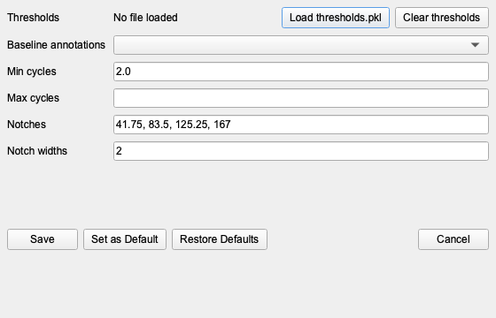

| Parameter | Meaning |
|---|---|
| `Thresholds` | Optional precomputed `thresholds.pkl` input |
| `Load thresholds.pkl` | Load threshold values from disk |
| `Clear thresholds` | Remove the loaded threshold payload |
| `Baseline annotations` | Optional annotation label used for baseline thresholding |
| `Min cycles` / `Max cycles` | Duration constraints for burst detection |
| `Notches` / `Notch widths` | Metric-specific notch exclusions |

## 11. Align Epochs Walkthrough with `sub-001 / gait`

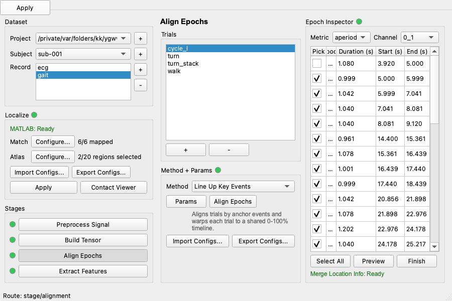

The example gait record already contains four useful trial types.

### 11.1 Trial Types Used in This Tutorial

| UI Trial Name | Method | Meaning | Example Config |
|---|---|---|---|
| `cycle_l` | `Line Up Key Events` | One gait cycle from one left-foot strike to the next left-foot strike | `demo/configs/align/lfptensorpipe_alignment_cycle-l_config.json` |
| `turn` | `Clip Around Event` | A turning episode with `pre`, `onset`, `offset`, and `post` windows | `demo/configs/align/lfptensorpipe_alignment_turn_config.json` |
| `turn_stack` | `Stack Trials` | The full turning interval normalized to `0-100%` | `demo/configs/align/lfptensorpipe_alignment_turn-stack_config.json` |
| `walk` | `Stitch Trials` | Concatenate all walking segments into one continuous output | `demo/configs/align/lfptensorpipe_alignment_walk_config.json` |

### 11.2 Trials Block

| Control | Meaning |
|---|---|
| trial list | Trials available for the current record |
| `+` | Create a new trial |
| `-` | Delete the selected trial |

### 11.3 Method + Params Block

| Control | Meaning |
|---|---|
| indicator | Draft-aware state of the selected trial's method configuration |
| `Method` | Alignment method for the current trial |
| `Params` | Open the method-specific parameter dialog |
| `Align Epochs` | Run alignment and write warped tensors |
| description text | Short explanation of the selected method |
| `Import Configs...` / `Export Configs...` | Load or save the current trial's alignment JSON |

### 11.4 Epoch Inspector Block

| Control | Meaning | Notes |
|---|---|---|
| indicator | Draft-aware finish state for the current trial | Tracks picked-epoch freshness |
| `Metric` | Metric to inspect | Usually one of the finished tensor outputs |
| `Channel` | Channel used for preview averaging | Changes with the selected metric |
| epoch table | Candidate epochs with pick checkboxes, durations, and time bounds | Picks drive `Preview` and `Finish` |
| `Select All` | Toggle all epoch picks | Becomes `Deselect All` when every row is already checked |
| `Preview` | Preview the average of the currently picked epochs | Non-destructive |
| `Finish` | Build raw tables from the currently picked epochs | Writes final alignment outputs and, when ready, merges Localize representative-coordinate columns |
| `Merge Location Info` | Read-only Localize merge status | `Ready` means `Finish` will attempt the Localize merge; `Not Ready` means `Finish` will write raw tables without those location columns |

`Merge Location Info` is tied to the current record's Localize state. A green
Localize state makes the merge available. If Localize is not ready, `Finish`
still writes the alignment raw tables, but it skips the representative-coordinate
merge step.

### 11.5 `Align Epochs Params` Variants

#### `Line Up Key Events` for `cycle_l`

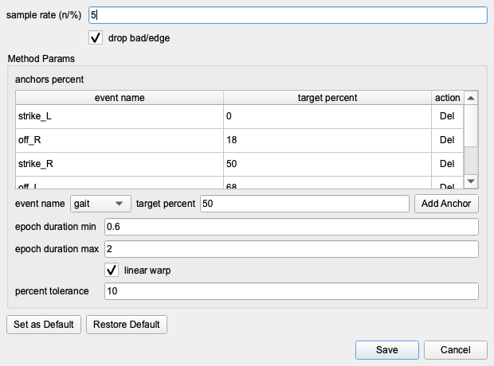

This method uses landmark events to warp each gait cycle onto a shared
percentage timeline.

| Parameter | Meaning |
|---|---|
| `sample rate (n/%)` | Sampling density over the normalized `0-100%` timeline |
| `drop bad/edge` | Drop epochs overlapping annotations that contain `bad` or `edge` |
| `anchors percent` table | Event labels and their target percentages on the normalized timeline |
| `event name` | Label used for a new anchor |
| `target percent` | Target location in `0-100` for that anchor |
| `Add Anchor` | Insert the current anchor row |
| `epoch duration min` / `max` | Optional duration bounds in seconds |
| `linear warp` | Enable piecewise linear warp between anchors |
| `percent tolerance` | Allowed anchor timing deviation in percent |

#### `Clip Around Event` for `turn`

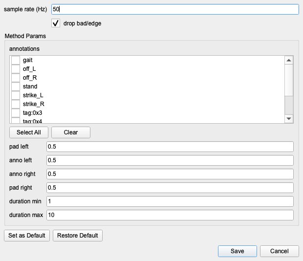

This method keeps real time in seconds and clips around event-centered windows.

| Parameter | Meaning |
|---|---|
| `sample rate (Hz)` | Target sampling density in real time |
| `drop bad/edge` | Drop epochs overlapping `bad` or `edge` annotations |
| annotation checklist | Labels to keep as epoch seeds |
| `Select All` / `Clear` | Toggle all visible labels |
| `pad left` | Seconds before annotation start |
| `anno left` | Seconds after annotation start |
| `anno right` | Seconds before annotation end |
| `pad right` | Seconds after annotation end |
| `duration min` / `max` | Allowed annotation duration range |

#### `Stack Trials` for `turn_stack`

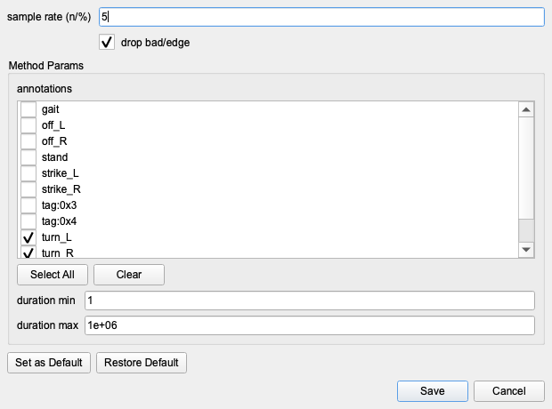

This method uses whole event intervals and normalizes each interval to a shared
`0-100%` axis.

| Parameter | Meaning |
|---|---|
| `sample rate (n/%)` | Sampling density over a normalized timeline |
| `drop bad/edge` | Drop intervals overlapping `bad` or `edge` annotations |
| annotation checklist | Labels to keep as stacked trials |
| `duration min` / `max` | Allowed annotation duration range |

#### `Stitch Trials` for `walk`

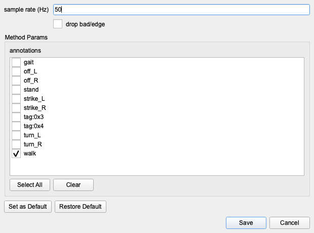

This method keeps real time and concatenates all selected intervals.

| Parameter | Meaning |
|---|---|
| `sample rate (Hz)` | Sampling density in real time |
| `drop bad/edge` | Drop intervals overlapping `bad` or `edge` annotations |
| annotation checklist | Labels to keep before stitching |

## 12. Extract Features Walkthrough with `cycle_l`

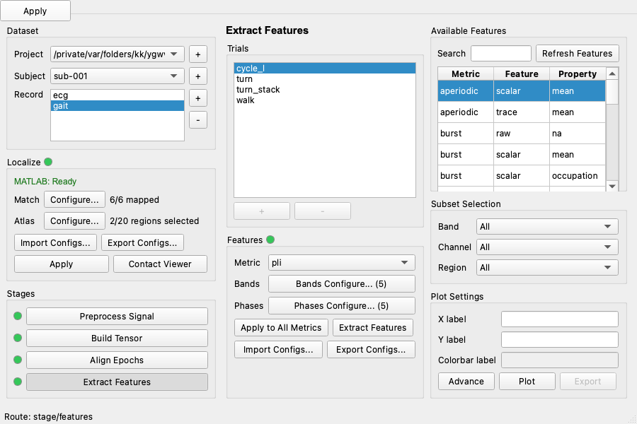

Use the following trial and feature config:

- `Record = gait`
- `Trial = cycle_l`
- `demo/configs/feature/lfptensorpipe_features_cycle-l_config.json`

### 12.1 `Features` Block

| Control | Meaning |
|---|---|
| indicator | Draft-aware feature extraction state for the current trial |
| `Metric` | Which metric's axes you are currently editing |
| `Bands Configure...` | Edit named bands for the selected metric |
| `Phases Configure...` | Edit named phases for the selected metric |
| `Apply to All Metrics` | Copy the current metric's axes to every metric in the trial |
| `Extract Features` | Run feature extraction for the current trial |
| `Import Configs...` / `Export Configs...` | Load or save the current trial's feature-axis JSON |

### 12.2 `Available Features`

| Control | Meaning |
|---|---|
| `Search` | Filter the generated feature files |
| `Refresh Features` | Rescan the current trial's feature outputs |
| table | Generated feature outputs grouped by metric, feature stem, and property |

### 12.3 `Subset Selection`

| Control | Meaning | Notes |
|---|---|---|
| `Band` | Band filter for the selected feature payload | Candidates depend on the current channel and region filters |
| `Channel` | Channel filter | Candidates depend on the current band and region filters |
| `Region` | Region filter | Candidates depend on the current band and channel filters |

### 12.4 `Plot Settings`

| Control | Meaning |
|---|---|
| `X label` | Override the default x-axis label |
| `Y label` | Override the default y-axis label |
| `Colorbar label` | Override the default colorbar label |
| `Advance` | Open plot-time transform and normalization settings |
| `Plot` | Plot the currently selected feature payload |
| `Export` | Export the last plotted figure and data |

### 12.5 `Bands Configure` and `Phases Configure`

#### Bands

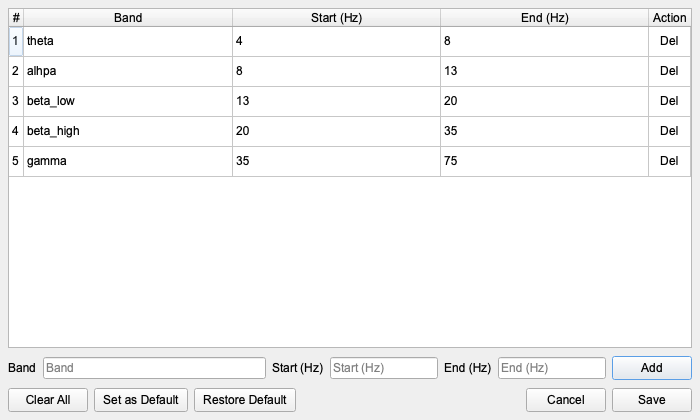

#### Phases

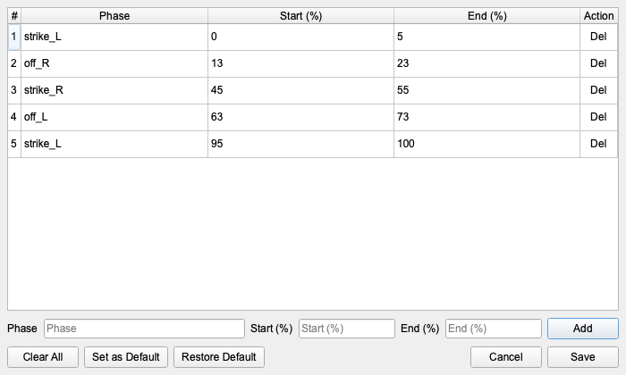

Both dialogs use the same structure. The main difference is the unit:

- bands use `Hz`
- phases use `%`

| Control | Meaning |
|---|---|
| table | Current rows for the selected metric |
| name field | Band or phase label |
| `Start` / `End` | Interval bounds |
| `Add` | Add the draft row |
| `Clear All` | Remove every row |
| `Set as Default` / `Restore Default` | Common default behavior |
| `Save` | Use the current rows for the selected metric |

For phases, duplicate names are allowed. In the `cycle_l` example, `strike_L`
appears both at the beginning and near `100%` to mark cycle wrap-around.

### 12.6 `Plot Advance`

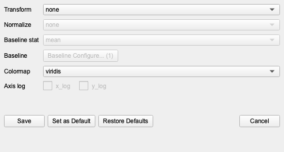

| Parameter | Meaning |
|---|---|
| `Transform` | Value transform applied before plotting |
| `Normalize` | Baseline normalization mode |
| `Baseline stat` | Statistic used to summarize baseline values |
| `Baseline Configure...` | Edit baseline percent ranges |
| `Colormap` | Colormap for matrix-style plots |
| `x_log` / `y_log` | Use log scale on the supported axis |

### 12.7 `Baseline Configure`

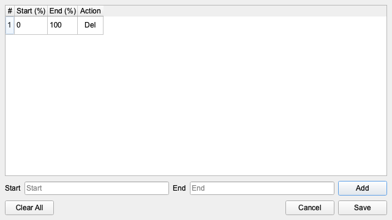

| Control | Meaning |
|---|---|
| table | Current baseline percent ranges |
| `Start` / `End` | Draft range bounds in percent |
| `Add` | Add the draft baseline range |
| `Clear All` | Remove every configured range |
| `Save` | Use the current baseline ranges |

### 12.8 Percentage-Time Limitation for `Burst`

`Line Up Key Events` and `Stack Trials` convert the time axis to a percentage
axis.

That matters for `Burst` features:

- `Burst` can still be part of the tensor or feature workflow
- but `Burst` cannot compute `rate` or `duration` on percentage-based time axes

In practice, this limitation applies to the percentage-time trials in this
guide, including:

- `cycle_l`
- `turn_stack`

## 13. Dialog Coverage Map

Use this section as a quick index for the dialogs referenced above.

| Dialog | Covered In |
|---|---|
| `Settings -> Configs` | Section 1.3 |
| `Import Record` | Section 6 |
| `Reset Reference` | Section 6.4 |
| `Match: Record Channels ↔ Lead-DBS Contacts` | Section 9.1 |
| `Configure Localize Atlas` | Section 9.2 |
| `Filter Advance` | Section 7.3 |
| `Configure Annotations` | Section 7.4 |
| generic `Select Channels` | Section 7.6 |
| `PSD Advance` | Section 7.8 |
| `TFR Advance` | Section 7.8 |
| `Bands Configure` for Tensor | Section 10.4 |
| `Tensor Channels` | Section 10.5 |
| `Tensor Pairs` | Section 10.6 |
| `Raw power Advance` | Section 10.7 |
| `Periodic/APeriodic Advance` | Section 10.7 |
| connectivity/PSI `Advance` | Section 10.7 |
| `TRGC Advance` | Section 10.7 |
| `Burst Advance` | Section 10.7 |
| `Align Epochs Params` for all four methods | Section 11.5 |
| `Bands Configure` for Features | Section 12.5 |
| `Phases Configure` | Section 12.5 |
| `Plot Advance` | Section 12.6 |
| `Baseline Configure` | Section 12.7 |

## 14. External References and Common Mistakes

### 14.1 External References

- MNE browser annotation editing:
  [Annotating continuous data](https://mne.tools/stable/auto_tutorials/raw/30_annotate_raw.html)
- Lead-DBS atlas installation:
  [Acquiring and setting atlases](https://netstim.gitbook.io/leaddbs/appendix/acquiring-and-setting-atlases)

### 14.2 Common Mistakes

- `Build Tensor` is disabled: `Preprocess Signal` is not green yet.
- `Align Epochs` is disabled: `Build Tensor` is not green yet.
- `Extract Features` is disabled: the shared current trial is not green yet in
  `Align Epochs`.
- `Filter -> Plot` and `Annotations` are being used as if they were the same
  tool: `Filter -> Plot` is for `bad` spans, while `Annotations` is for named
  event labels.
- `Confirm Import` stays disabled after parsing: `Reset reference` is enabled,
  but no reset-reference rows were configured.
- A Localize config import fails: the config must match the current record's
  channels, current lead signature, and current subject space.
- An atlas does not appear in `Localize`: it is not available under the current
  Lead-DBS installation and current subject space.
- Finished alignment tables do not contain location columns: `Localize` was not
  green for the current record, so `Finish` skipped the representative-coordinate
  merge.
- `Burst` `rate` or `duration` is missing on a percentage-time trial: that is
  expected for percentage-axis alignments such as `cycle_l` and `turn_stack`.
