# LFP-TensorPipe Demo Tutorial

This tutorial follows one validated single-record path from import to final
feature visualization:

- `Subject`: `sub-001`
- `Record`: `gait`
- `Trial`: `cycle_l`

Use this page when you want to reproduce the published demo end to end. Use
[APP_CONTROL_REFERENCE.md](APP_CONTROL_REFERENCE.md) when you want a control-
level explanation of a specific panel or dialog.

## 1. Demo Background

The demo dataset was recorded with a SceneRay `SR1202` system from a gait task
performed by a patient implanted in `STN + SNr`.

The acquisition was synchronized with a wireless electrophysiology recorder:

- the click sound generated by pressing the recorder marker button was captured by the gait-video audio track
- the same click sound was also visible in the LFP-side sync markers
- aligning those two click streams aligns the LFP recording with the video

The shipped demo inputs mean:

- `audio_marker.mp3`: the click sound captured from the gait-video audio track
- `annotations.csv`: manually labeled gait events
- `dataset/configs/*`: the validated tutorial configs used to reproduce the
  walkthrough quickly

Throughout this guide:

- `<demo-project-root>` means your local demo project copy
- `<lead-dbs-root>` means your local Lead-DBS installation root
- `<matlab-root>` means your local MATLAB installation root

## 2. First Launch and Project Context


The key status to notice is the `Localize` block. Once the machine-local
dependencies are configured correctly, it should show `MATLAB: Ready`.

On first launch, open the configs dialog and set the local paths used by
`Localize`:

- Windows: app-window top-left `Settings -> Configs`
- macOS: screen top-left menu bar `LFP-TensorPipe -> Preferences -> Configs`


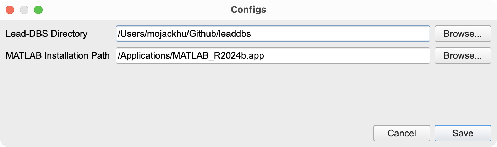

Use:

| Control | Value |
|---|---|
| `Lead-DBS Directory` | `<lead-dbs-root>` |
| `MATLAB Installation Path` | `<matlab-root>` |

After saving valid paths, return to the home page and confirm that
`Localize -> MATLAB: Ready` is visible.

This walkthrough assumes one fixed local context for the whole run:

| Item | Value |
|---|---|
| `Project` | `<demo-project-root>` |
| `Subject` | `sub-001` |
| `Record` | `gait` |
| `Trial` | `cycle_l` |

## 3. Import `sub-001 / gait`

This step creates the project record from the raw SceneRay export and turns it
into the single `gait` record used by the rest of the tutorial.

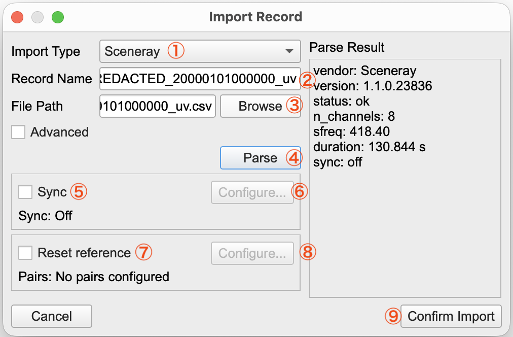

Control map:

- `① Import Type`: choose the parser flow. For this demo the UI label is
  `Sceneray`.
- `② Record Name`: enter the imported record name. Use `gait`.
- `③ File Path`: point to
  `<demo-project-root>/dataset/sub-001-gait/IPG_SERIAL_REDACTED_20000101000000_uv.csv`.
- `④ Parse`: parse the selected file before importing.
- `⑤ Sync`: enable pre-import timeline alignment.
- `⑥ Configure...`: open the sync dialog.
- `⑦ Reset reference`: enable bipolar remapping before import.
- `⑧ Configure...`: open the reset-reference dialog.
- `⑨ Confirm Import`: commit the imported record after all required setup is
  saved.

Also enable `Advanced` and set the metadata sidecar to:

- `<demo-project-root>/dataset/sub-001-gait/IPG_SERIAL_REDACTED_20000101000000.txt`

Click `Parse` first. The parse summary should report the SceneRay vendor,
sampling rate, duration, and channel count.

Parsing rejects positive or negative infinity in Sceneray neural-signal cells
before it creates the preview Raw. Correct the source export rather than
replacing or clipping the value. This check does not change the documented
packet-gap and missing-cell zero behavior. The same infinity rejection applies
to Legacy CSV and PINS imports; approved Legacy CSV `NaN` missing values remain
distinct and are not rejected by this rule.

Parsing also rebases the recording onto a zero sample offset, so every imported
record shares one time convention before `Sync` and `Reset reference` run.
Nothing moves in time: `first_samp` becomes `0`, `meas_date` advances by the same
amount, and every annotation onset shifts back by it, so absolute timestamps and
the spacing between markers and samples are unchanged. Sources that already start
at sample `0` — every vendor flow in this tutorial — are left untouched. When a
rebase does happen, the parse summary adds a `timeline:` line reporting it.

### 3.1 Configure `Sync`

This step aligns the LFP recording with the gait-video time base. In this
demo, the alignment is built from the recorder button clicks that appear both
in the LFP-side markers and in the video audio track.

Check `Sync`, then open `Configure...`.


Control map:

- `① Input Type`: choose `Audio` for the external source.
- `② File Path`: use
  `<demo-project-root>/dataset/sub-001-gait/audio_marker.mp3`.
- `③ Load / Detect`: detect the external peaks from the audio file.
- `④ Auto Pair by Order`: pair the detected LFP markers and external markers.
- `⑤ Sync`: run the lag estimate and create the QC preview.

Use the validated demo values:

| Control | Value |
|---|---|
| `LFP source` | `Parsed annotations` |
| `External source` | `Audio` |
| `External path` | `<demo-project-root>/dataset/sub-001-gait/audio_marker.mp3` |
| `Pairing` | `Auto Pair by Order` |
| `Correct sfreq` | unchecked |

`Load / Detect` accepts only audio whose decoded samples are all finite. If the
file contains `NaN`, `+Inf`, or `-Inf` in any mono or stereo channel, the whole
reload is rejected before channel averaging or peak detection. The dialog keeps
the previously loaded markers, pairs, estimate, and preview so a malformed file
cannot silently become a synchronization pulse.

The demo uses two marker pairs:

- `tag_3` ↔ `external_peak_0`
- `tag_4` ↔ `external_peak_1`

Click `Sync` to generate the preview shown in the below figure.

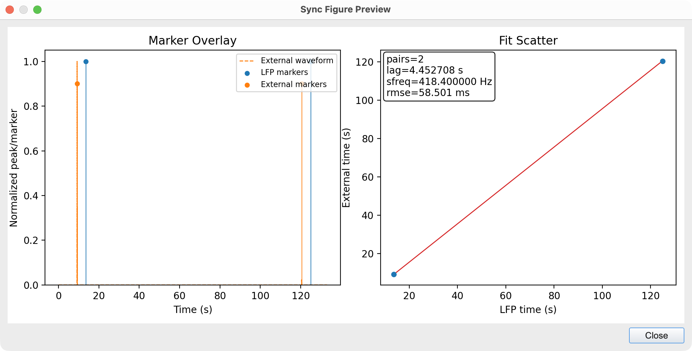

In the preview:

- `pairs` is the number of explicit marker pairs used by the estimate
- `lag` is the time offset applied during import
- `sfreq` is the synchronized sampling rate

Click `Save` in the sync dialog before returning to the import window.

### 3.2 Configure `Reset Reference`

This step remaps the imported vendor channels into the bipolar derivations used
throughout the tutorial.

Check `Reset reference`, then open `Configure...`.

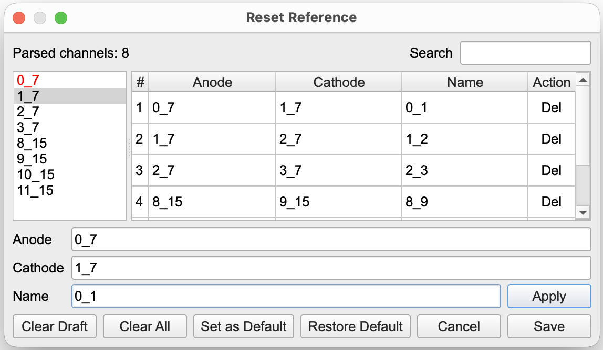

Add these six bipolar rows so the imported channel names match the tutorial
configs used later by `Localize` and `Build Tensor`:

| Anode | Cathode | Name |
|---|---|---|
| `0_7` | `1_7` | `0_1` |
| `1_7` | `2_7` | `1_2` |
| `2_7` | `3_7` | `2_3` |
| `8_15` | `9_15` | `8_9` |
| `9_15` | `10_15` | `9_10` |
| `10_15` | `11_15` | `10_11` |

Click `Save` before returning to the import dialog.

When both are ready, click `Confirm Import`.

Expected imported channels:

- `0_1`
- `1_2`
- `2_3`
- `8_9`
- `9_10`
- `10_11`

### 3.3 Fix a Wrong Record Name with `R`

If you typed the record name incorrectly during import, you do not need to
delete and re-import the record. This action corrects the record name without
throwing away the imported data or later artifacts. Use `Record R` instead.

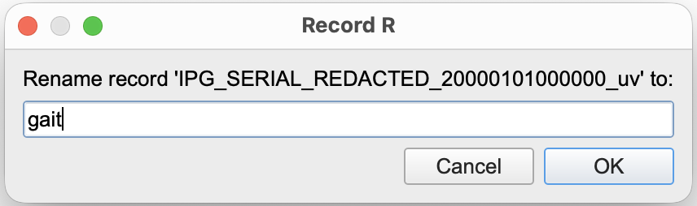


## 4. Localize

`Localize` is record-scoped and independent from the preprocess/tensor/align
stage chain. It can be configured as soon as the imported record is available.
This stage attaches representative anatomical coordinates and atlas labels to
the imported bipolar channels so later outputs can carry localization context.

Before clicking `Apply`, make sure the Lead-DBS subject space matches the space
used during Lead-DBS localization. The tutorial assumes:

- `MNI152NLin2009bAsym`

To reproduce the tutorial result, place the dataset atlas folder under:

- `leaddbs/templates/space/MNI152NLin2009bAsym/atlases`

The below figure shows the `Localize` block.


Control map:

- `① Match status`: how many record channels are mapped
- `② Atlas status`: how many regions are selected
- `③ Apply`: generate representative-coordinate outputs
- `④ Contact Viewer`: launch the MATLAB-based 3D viewer

Use `Import Configs...` to load the tutorial config quickly:

- `dataset/configs/localize/lfptensorpipe_localize_config.json`

Use `Export Configs...` whenever you want to save your own local variant.

### 4.1 Match Record Channels to Lead-DBS Contacts

This step binds each imported bipolar channel to the Lead-DBS contacts that
define it. In this demo, the match table also defines that each channel uses
the midpoint between its anode and cathode as the representative coordinate.

Open `Match -> Configure...`.

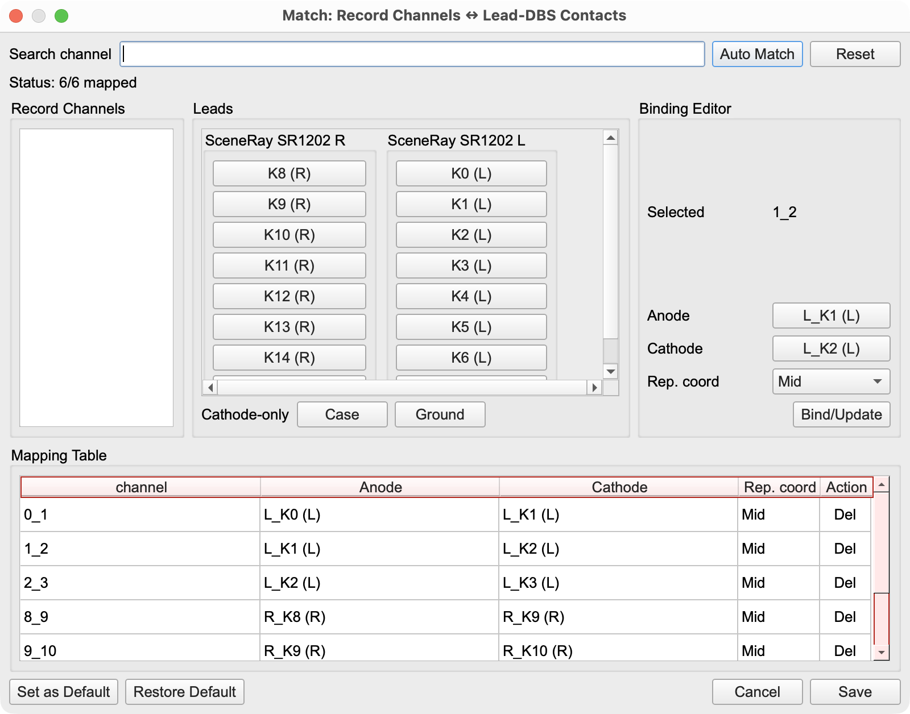

Control map:

- `① Auto Match`: attempt automatic channel-to-contact mapping
- `② Binding Editor / Bind-Update`: manual mapping area used when Auto Match is
  incomplete or not ideal
- `③ Save`: write the current record-scoped match table

The tutorial mapping uses `rep_coord = Mid` for all six bipolar channels.

Auto Match follows the current implementation contract:

- parse record channels as `left_right` with an optional trailing `_L` or `_R`
- build per-lead contact-index maps from contact labels such as `K1 (L)` or
  `K10 (R)`
- match both endpoints on the same lead
- apply the trailing `_L/_R` token only as a side constraint
- compare endpoint indices case-insensitively
- write `Anode`, `Cathode`, and `Rep. coord = Mid` only when exactly one lead
  is a valid candidate
- skip ambiguous or missing matches instead of writing a guess

If Auto Match is not ideal, use the Binding Editor in `②` to select
`Anode`, `Cathode`, `Rep. coord`, then click `Bind/Update`.

### 4.2 Configure the Atlas

This step defines which atlas and which regions are queried when representative
coordinates are converted into anatomical labels. In this demo, those labels
are later merged into aligned epochs and feature outputs.

Open `Atlas -> Configure...`.

The below figure shows the atlas configuration used by the tutorial.


Use:

| Control | Value |
|---|---|
| `Atlas` | `Custom_Ewert_Zhang_Middlebrooks` |
| `Interested Regions` | `SNr`, `STN` |

### 4.3 Localize and Contact Viewer

Click `Apply` in the Localize block after Match and Atlas are ready.

`Contact Viewer` is a visual QC surface for the localization result. Use it to inspect the reconstructed contacts and the representative points before trusting the
record-level anatomy metadata.

When you open `Contact Viewer`, MATLAB starts first and may need time to load.
The below figure shows the sphere control used to adjust representative-point
size inside the viewer workflow.

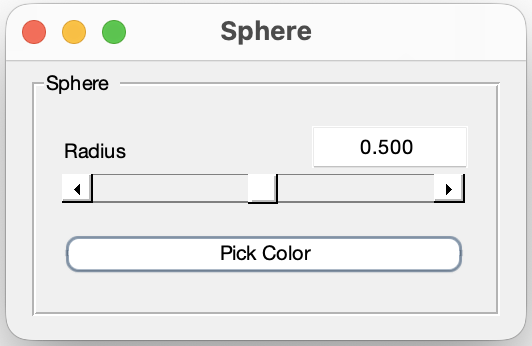

The figure shows the rendered contact-viewer scene.

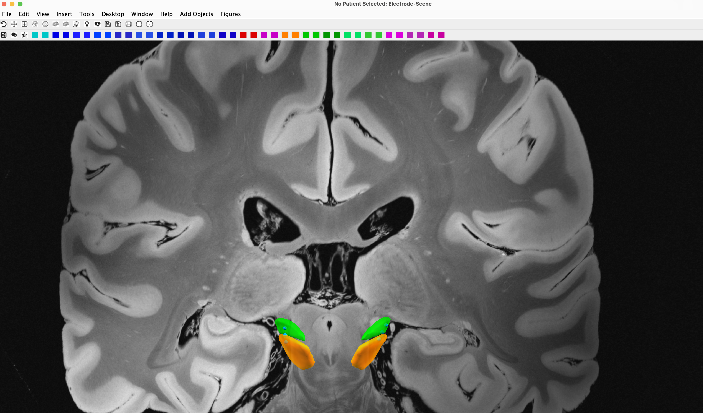

## 5. Preprocess Signal and QC

This stage cleans the imported record and prepares the final continuous signal
used by tensor building, epoch alignment, and feature extraction.

The below figure is the control overview of the `Preprocess Signal` page.

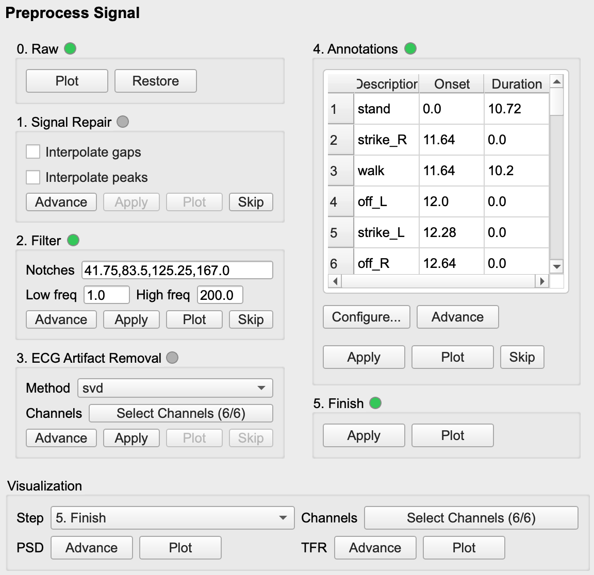

Use the following step-purpose map while reading the rest of the preprocess
section:

| Step | Purpose | Demo action | Feeds |
|---|---|---|---|
| `0. Raw` | Confirm that the imported raw signal, markers, and duration entered the project correctly | run | filter QC |
| `1. Filter` | Apply core band-pass and demo-specific notch filtering, and annotate bad spans | run | ECG and annotation QC |
| `2. ECG Artifact Removal` | Optionally suppress residual cardiac contamination | skip | annotations when needed |
| `3. Annotations` | Write manually labeled gait events and final BAD intervals onto the current continuous time axis | run | alignment anchors and feature timing |
| `4. Finish` | Export the finalized result with physical start/end edge markers | run | tensor, align, features |
| `Visualization` | Show PSD/TFR QC without rewriting the data | run as needed | manual QC only |

The validated preprocess path for this demo is:

1. `Raw -> Apply`
2. `Filter -> Apply`
3. `Filter -> Plot` for manual QC
4. leave `ECG Artifact Removal` gray/skipped for this clean demo
5. `Annotations -> Configure... -> Apply`
6. `Finish -> Apply`
7. `Visualization` QC with PSD and TFR plots

### 5.1 Step 0: Raw

This step is the import sanity check. In this demo, it confirms that the raw
signal, marker timing, and channel set are correct before any cleanup starts.

The below figure is the plot for `Preprocess Signal step 0.Raw`.

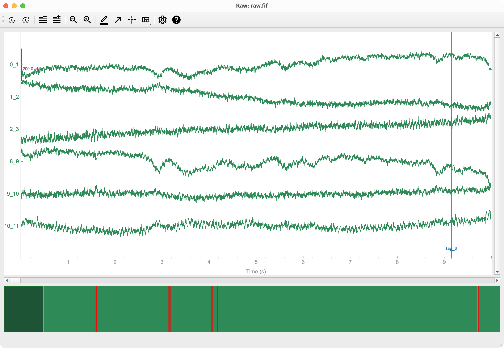

Run `Raw -> Apply` first, then use `Plot` to confirm the imported signal and
markers are visible before filtering.

### 5.2 Step 1: Filter

This step performs the base signal cleanup used by the rest of the pipeline. In
this demo, it applies the tutorial band-pass and SceneRay-specific notch filtering, and annotates bad spans before any event-related processing.

The tutorial filter uses:

| Parameter | Value |
|---|---|
| `Low freq` | `1.0` |
| `High freq` | `200.0` |
| `Notches` | `41.75, 83.5, 125.25, 167.0` |

`Low freq`, `High freq`, and `Notches` may be left blank to disable the
corresponding high-pass, low-pass, or notch operation. Every entered frequency
must be finite. `High freq` and every notch must remain strictly below the
input Nyquist frequency; Filter Apply shows a blocking warning instead of
silently clipping or dropping an unsupported value. In Filter Advance, leaving
the complete peak-to-peak threshold field blank disables only fixed
peak-to-peak rejection and keeps AutoReject active.

Automatic Filter detection does not use channels that are already listed in
`raw.info["bads"]`. Fixed peak-to-peak rejection and AutoReject share the same
remaining channel set, so a globally bad channel cannot turn its amplitude
into global time-domain BAD windows. The channel remains in the Filter output
and remains listed bad; only its participation in automatic detection is
removed. If every channel is listed bad, Filter Apply stops and asks the user
to restore at least one usable detection channel. Existing BAD time intervals
remain eligible AutoReject training windows by design.

This notch list is demo-specific. SceneRay uses `83.5 Hz` AC coupling between
the LFP recorder and the IPG, so this dataset needs the half-frequency harmonic
series to be notched. That is why the tutorial notches `41.75`, `83.5`,
`125.25`, and `167.0 Hz`. Do not treat this list as a universal default for
other datasets.

The below figure is the plot for `Preprocess Signal 1.Filter`.

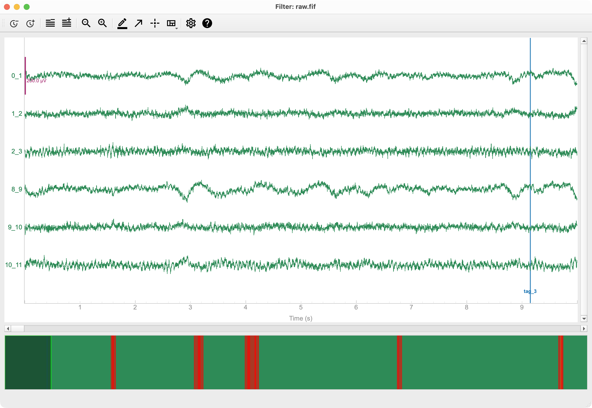

This is the main manual QC step of the preprocess section:

- click `Filter -> Apply`
- after Apply creates a yellow review Preview, open `Filter -> Plot`
- press `a` in the MNE browser to enter annotation edit mode
- adjust the `BAD` spans if the automatically detected windows are not
  acceptable
- close the browser. No confirmation is shown: the app automatically rereads
  the unfiltered Raw, refilters it under the reviewed global/channel-specific
  `BAD` and `EDGE` annotations, and accepts the result only after that
  finalization succeeds.

Two independent Filter Advance controls govern finalization:

- `isolate BAD boundaries` is on by default. It filters every valid interval
  between global or channel-specific BAD/EDGE boundaries independently.
- `mark filter edges` is off by default. When enabled, it marks the exact
  combined band-pass and notch FIR support at every filtered interval edge as
  `EDGE_filter`.

Both settings share the same review lifecycle and rebuild the accepted result
from the original unfiltered Raw. Edge marking changes only annotations; it
does not change the independently filtered numeric values.

Before Filter Apply, Plot is unavailable for a record with no existing Filter
result. A valid yellow review Preview is plottable but later preprocess steps
remain blocked until it is finalized. An existing green finalized or legacy
Filter result may still be opened without another Apply. Closing such a plot
without changing annotations or bad-channel selections does not rewrite data or
invalidate existing results; closing it after a real edit automatically
refinalizes from the original Raw.

Creating a Preview does not invalidate an earlier accepted Filter generation or
its downstream results. Those results remain preserved but temporarily
unavailable while review is pending. They are invalidated only after closing the
Preview successfully accepts a changed Filter result; a failed finalization
leaves the earlier accepted generation and downstream state unchanged.

With `isolate BAD boundaries` off, the reviewed Raw is filtered continuously,
exactly like MNE whole-Raw filtering. Ordinary `BAD`/`BAD_gap` annotations do
not make MNE treat their two sides as independent signals, so artifact energy
inside a reviewed BAD interval can ring into the retained signal on both sides.

With isolation on, each valid interval is filtered independently and reviewed
BAD samples remain numerically unfiltered. The interval endpoints use MNE
padding because real samples across a BAD boundary are unavailable. Leaving
`mark filter edges` off explicitly accepts those padding-dependent values and
does not add `EDGE_filter`. Enabling edge marking adds the system-owned label to
the complete FIR support at every interval endpoint, including the physical
recording endpoints. Do not create or rename annotations to the reserved exact
description `EDGE_filter`.

One support radius is about 4.95 s at a 1 Hz high-pass and 250 Hz sampling. A
segment shorter than two radii is still filtered; its complete support depends
on padding and is marked in full only when `mark filter edges` is enabled. A
zero-duration `BAD` point also creates a filtering boundary. Dense BAD marks can
therefore make edge marking exclude a large share of a recording, while leaving
marking off preserves those padding-derived samples. Changing either control
makes the Filter result and its downstream consumers stale.

#### Channel-specific BAD intervals in the MNE browser

Dragging across the signal while annotation mode is active creates an annotation
for all channels by default. To restrict the new interval to one or more channels:

1. press `a` to enter annotation mode
2. select or add the required `BAD` description
3. drag across the required time interval
4. hold `Shift` and left-click the shaded annotation over each affected channel
   trace
5. close the browser to automatically refilter and accept the reviewed result

For example, one `Shift`-click over channel `A` assigns the interval to `A` only;
another `Shift`-click over channel `B` assigns it to both `A` and `B`. A
channel-specific interval is displayed with a lighter fill and dashed outline.
Do not click the channel name for this purpose: clicking a channel name marks or
unmarks that entire channel in `raw.info["bads"]`, rather than limiting one time
interval. A channel marked this way is excluded from later automatic Filter
P2P/AutoReject detection but is retained in the output Raw. An annotation with
no assigned channel remains global and applies to the time interval on all
channels.

Channel membership is stored in `raw.annotations.ch_names` and is preserved by
Browser saving, timeline normalization, Sync, filtering, and Reset Reference.
For local metrics, a channel-specific BAD/EDGE interval masks only that channel.
For connectivity metrics, it masks only pairs containing that channel. An
annotation with no channel assignment remains global.


### 5.3 Step 2: ECG Artifact Removal

This step is an optional cleanup pass for residual cardiac contamination. It is skipped in the demo, as no such contamination is present.

If real data still show ECG bleed-through after the earlier preprocess steps,
apply ECG cleanup here before finalizing the record.

Choose `template`, `perceive`, or `svd` under `Method`, select the channels to
clean, and use `Advance` when the method defaults need adjustment. The Advance
dialog shows only the selected method's parameters and retains independent
values for all three methods. Its shared `mark filter edges` checkbox is off by
default and is not an ECG-algorithm parameter.

ECG cleanup excludes positive-duration annotations whose descriptions begin
with `BAD`, using the same case-insensitive prefix rule as MNE. For example,
`BAD artifact`, `Bad artifact`, and `bad artifact` are equivalent. The original
annotation descriptions and channel scopes are preserved.

After ECG Apply, use ECG Plot to inspect residual cardiac contamination. BAD
support added or expanded in that browser did not exist when the Filter input
was created. On close, `mark filter edges` optionally expands only this new
support by the exact accepted Filter FIR radius and records the adjacent support
as `EDGE_filter_post_ecg`. It does not mark every detected heartbeat or the
template/SVD correction windows. Existing Filter-input BAD support cannot be
shortened or removed in ECG Plot; return to Filter Plot and rerun Filter and ECG
when that review decision changes. When Filter is skipped, ECG consumes Raw and
its `mark filter edges` policy is disabled.

If ECG was run previously but should no longer participate, press the compact
`Skip` button at the end of its panel action row. Its checked state bypasses ECG
without changing the ECG indicator, artifact, or run log. Annotations and Finish
become stale until they are applied again from the new earlier source. Click the
checked button again to reintroduce the unchanged ECG result; if that result is
yellow, it resumes blocking later steps. A successful ECG Apply also clears
Skip. Filter and Annotations use the same reversible in-panel toggle.

### 5.4 Step 3: Import Annotations

This step writes manually labeled gait events and final BAD intervals onto the
current continuous signal timeline. In this demo, event annotations later
define the alignment anchors and feature windows.

Open `Annotations -> Configure...`.

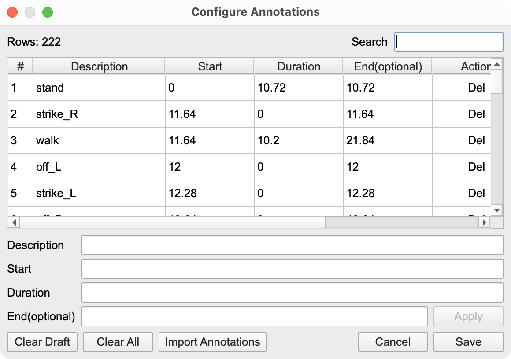

Import:

- `<demo-project-root>/dataset/sub-001-gait/annotations.csv`

Then click `Apply`.

Every imported row is interpreted in seconds from the first sample of the
current source Raw. Apply intersects each positive-duration interval with the
record-relative half-open support `[0,n_times/sampling_rate)`. A partial overlap
is silently clipped, while an interval with no overlap is omitted. A
zero-duration point is retained only when its onset lies inside that support;
otherwise it is omitted. After Apply, the table and `annotations.csv` show the
effective clipped/retained rows written to the Raw.

Use `Annotations -> Advance`, immediately to the right of `Configure...` on the
first compact control row, to set the default-off `mark filter edges` policy.
The second row contains `Apply`, `Plot`, and `Skip`. The policy applies to BAD support added
or expanded by Annotations Apply or Plot. When enabled, it uses the exact Filter
generation in the current source lineage and writes
`EDGE_filter_post_annotations`; it does not refilter data or change BAD
support. The policy is disabled when Filter was skipped.

The existing annotation screenshot predates the renumbering but shows the same
MNE annotation-review interaction:

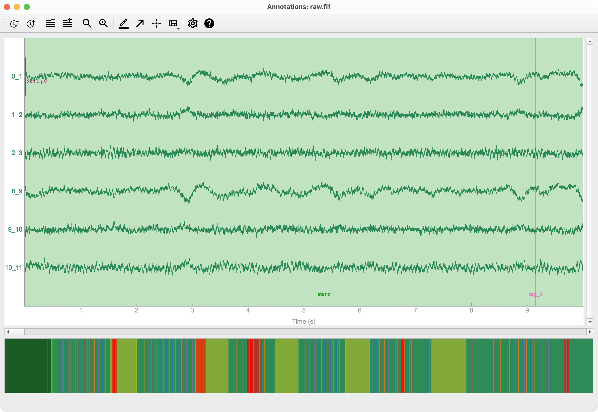

### 5.5 Step 4: Finish

This step exports the finalized preprocess result that downstream modules read.
In this demo, `Finish -> Apply` promotes the Annotations output, so Tensor,
Align, and Features all start from the same continuous record. Finish adds
zero-duration `EDGE` markers at the physical recording start and last sample,
regardless of which optional preprocess steps were run.

After skipping ECG cleanup in this walkthrough, go directly to `Finish ->
Apply`.

### 5.6 PSD and TFR QC

These QC views let you inspect the cleaned signal in the frequency domain
without changing any saved preprocess artifact. In this demo, they are the last
quality check before moving on to tensor building.

The below figure shows PSD QC on the `0. Raw`.

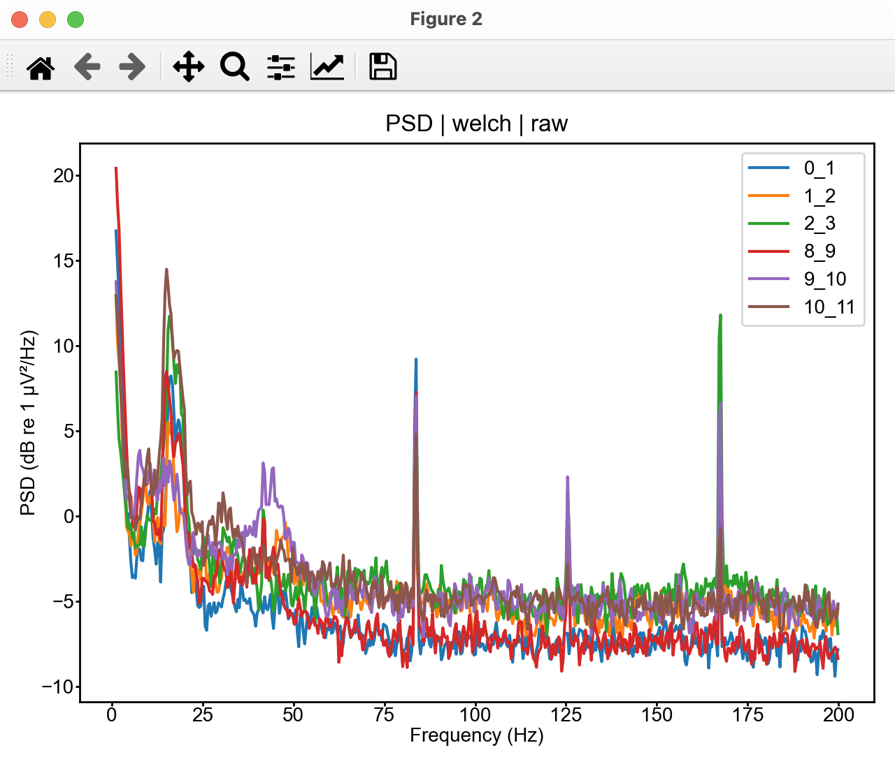

For cleaned-signal QC, select `4. Finish` after Finish Apply. The obsolete Bad
Segment Removal snapshot is no longer an eligible Visualization source.

The figure shows the TFR visualization parameters dialog.

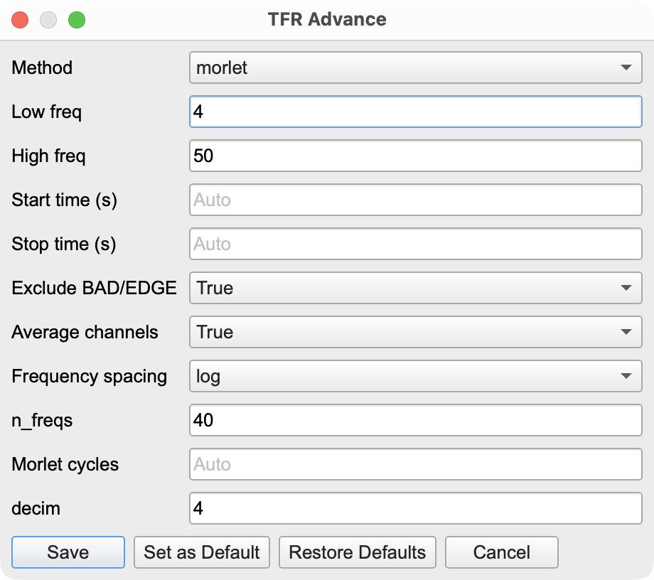

Use:

| Parameter | Value |
|---|---|
| `Low freq` | `4` |
| `High freq` | `50` |
| `n_freqs` | `40` |
| `decim` | `4` |

The TFR plot overlays red shadows over the MNE-rounded sample support of
positive-duration annotations whose descriptions begin with `BAD`
or `EDGE`, ignoring letter case. Global annotations affect every selection. A
channel-specific annotation is shown only when it affects a selected channel;
when several channels are selected and their power is averaged, the displayed
shadow is the sample-support union across those channels. Zero-duration point
annotations have no interval to shade. This overlay is visual QC only and does
not mask or rewrite the TFR data.

The below figure shows the TFR QC result after finishing preprocess.

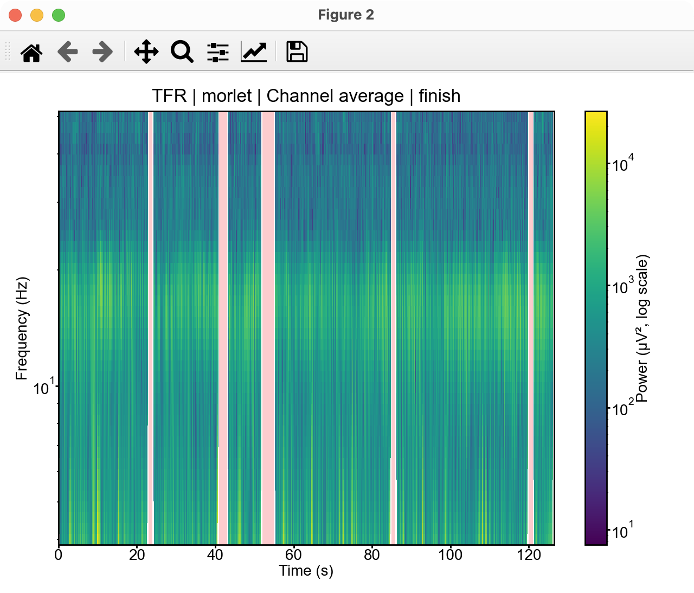


## 6. Build Tensor

This stage converts the finalized preprocess signal into time-frequency and
connectivity tensors. In this demo, those tensors become the source used by
epoch alignment and feature extraction.

Switch to `Build Tensor`.


Import the tutorial config:

- `dataset/configs/tensor/lfptensorpipe_tensor_config.json`

Use `Export Configs...` if you want to save your own local tensor variant.

The core tensor parameters define the shared time-frequency grid used by most
metrics:

| Parameter | Meaning |
|---|---|
| `Low freq` | Lower bound of the analyzed frequency range |
| `High freq` | Upper bound of the analyzed frequency range |
| `Step` | Frequency sampling interval, which controls how dense the frequency axis is |
| `Time resolution` | Window scale used for each time-frequency estimate |
| `Hop` | Time step between adjacent windows on the output time axis |

These controls define the base grid. More specialized method-specific and
metric-specific parameters are configured in each metric's `Advance` dialog.

The validated demo config enables:

- `raw_power`
- `periodic_aperiodic`
- `coherence`
- `plv`
- `ciplv`
- `pli`
- `wpli`
- `trgc`
- `psi`
- `burst`

`Absolute imaginary coherence (|ImCoh|)` is also available and is unchecked by
default. Enable it when you want to examine the non-zero phase-lag component of
connectivity alongside Coherence. For a direct comparison, use the same channel
pairs, frequency range, time settings, spectral method, and notch settings for
both metrics. `|ImCoh|` is an undirected magnitude and must not be interpreted
as lead-lag direction or causality.

ciPLV has a formula-defined degeneracy for two perfectly identical signals with
an exact zero phase difference. In that limiting input, its imaginary phase-locking
term is `0` while its correction denominator is also `0`, so the stored result is
`NaN`, not ciPLV `0`. This is an expected mathematical limitation rather than a
failed estimator implementation. Independently acquired neural channels are not
expected to be exactly identical sample for sample. If an empirical ciPLV tensor
is entirely `NaN`, check for a duplicated channel selection, duplicated imported
data, or channels made identical by re-referencing before interpreting the result.
A completed Build Tensor state records that the requested computation finished;
it does not redefine this degenerate ciPLV input as a finite value.

PLI and wPLI have a separate numerical limitation for perfectly identical
zero-phase signals. Machine-precision imaginary residuals can enter the sign or
small-denominator formulas and produce a finite nonzero result. LFP-TensorPipe
preserves the installed MNE-Connectivity estimator output instead of applying an
arbitrary tolerance or forcing this exact case to zero. Do not interpret that
degenerate duplicate-input result as evidence of meaningful lagged
connectivity. If empirical channels are identical or proportional, first check
for duplicated channel selection, duplicated imported data, or channels made
equivalent by re-referencing. Ordinary non-identical PLI/wPLI results retain
their standard interpretation.

For this walkthrough:

1. import the config
2. verify the enabled metric list
3. keep `Mask Edge Effects` enabled so edge-prone samples near window
   boundaries stay masked during downstream analysis
4. click `Build Tensor`

For Raw Power and Connectivity metrics, the mask covers the complete raw-data
support consumed by each retained estimate. This includes the Connectivity
analysis span plus required spectral support. If a notch-cut frequency is
reconstructed from neighboring frequencies, it also includes both donors'
supports. Therefore, a finite value never depends on a matching BAD/EDGE sample
when masking is enabled. Extra crop margin that is discarded before estimation
does not unnecessarily enlarge the mask.

For Burst, keep `Isolate BAD/EDGE boundaries` enabled in Burst Advance for the
recommended scientific path. The option prevents annotated signal from entering
the neighboring valid segment's zero-phase band-pass and Hilbert-envelope
calculation. Burst then masks the automatic transform guard at both ends of each
valid segment. Disabling the option retains the historical whole-record
transform followed by BAD/EDGE masking, which is useful only for controlled
comparison. Global `Mask Edge Effects` off is a diagnostic mode and makes Burst
boundary isolation dormant.

Isolation can reduce usable duration when BAD/EDGE annotations are dense. A
segment that is too short to support filtering plus both guards is represented
as invalid `NaN`, not as an unfiltered or non-Burst zero. Review the completed
Burst tensor metadata's retained-support fractions before interpreting rate or
occupancy.

### 6.1 Reconstructing Periodic/Aperiodic Notch Intervals

Periodic/Aperiodic notch intervals are reconstructed in
log-frequency/log-power space before SpecParam decomposition. The neighboring
valid bins define the local baseline, while a clean, equal-width segment from
the same spectrum supplies the residual shape.

Effective intervals are sorted on the actual SpecParam frequency grid.
Intervals that overlap, or that leave no valid model bin between them, are
merged before reconstruction. This guarantees that both baseline anchors lie
outside every effective notch interval.

For each merged interval, at least one side must provide a continuous donor
segment whose interior contains the same number of bins as the interval. The
entire donor segment, including its two measured boundary bins, must stay on
the model grid and outside every effective notch interval.

Donor sides and orientations are balanced across time windows with a
reproducible record-specific assignment. This preserves local variance,
frequency covariance, and extrema without imposing a deterministic straight
bridge.

A notch interval wholly outside the SpecParam fitting range is ignored. Any
interval that intersects the fitting range must remain strictly inside both
boundaries and must have at least one valid donor side. Periodic/Aperiodic
Advance saving, Tensor config import/export, and Build Tensor validation reject
an interval that touches or crosses either fitting boundary or has no clean,
equal-width donor segment.

After reconstruction and the configured smoothing steps, SpecParam estimates
the aperiodic and periodic model components. The Periodic tensor is evaluated
over the complete frequency grid from the fitted Gaussian center frequency,
height, and sigma. Its exact stored-value semantics are described in
"Periodic/Aperiodic stored-value semantics" below.

## 7. Align Epochs

This stage aligns epochs. In this gait demo, it cuts the continuous tensor into event-locked gait epochs and warps them onto a common percentage timeline, turning multiple gait cycles into a comparable cycle-level analysis set.

Switch to `Align Epochs`.

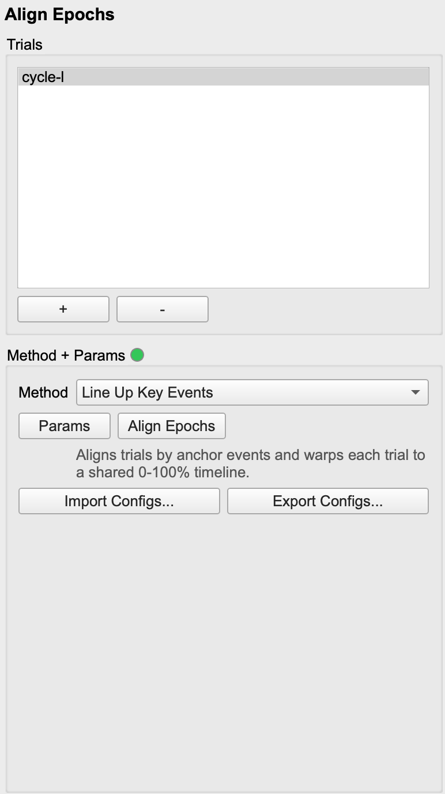

Control map:

- `① +`: create or select the trial definition
- `② Method`: choose the alignment method
- `③ Params`: edit the method parameters
- `④ Align Epochs`: generate the warped tensors for the selected trial

Import the tutorial config:

- `dataset/configs/align/lfptensorpipe_alignment_cycle-l_config.json`

Use `Export Configs...` if you want to save your own alignment variant.

The below figure shows the validated parameter set for `cycle_l`.

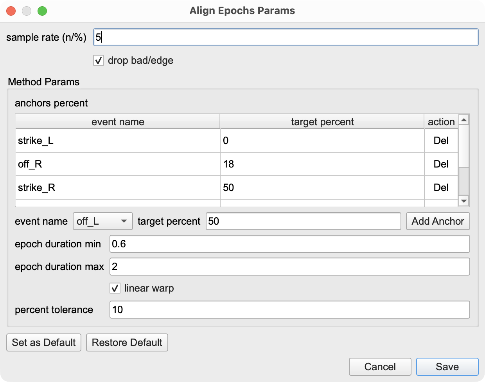

Use:

| Control | Value |
|---|---|
| `Method` | `Line Up Key Events` |
| `Anchors` | `0=strike_L`, `18=off_R`, `50=strike_R`, `68=off_L`, `100=strike_L` |
| `Epoch duration min` | `0.6 s` |
| `Epoch duration max` | `2.0 s` |
| `Linear warp` | enabled |
| `Percent tolerance` | `10` |
| `Drop bad/edge` | enabled |
| `Sample rate` | `5 n/%` |

For Line Up Key Events, this value is a sampling density on the normalized
0-to-100% timeline, not physical Hz. The output grid is uniform, and each grid
percentage is mapped directly through the configured event anchors to its
source-signal position. A target anchor is a discrete output sample only when
its percentage is representable on that grid; otherwise it remains the exact
continuous breakpoint between neighboring output samples.

Starts are evaluated chronologically. Each start uses the earliest
duration-eligible end not already consumed by an accepted group, and accepted
groups may overlap in time. Once that end is fixed, exactly one complete
strictly ordered anchor sequence must satisfy the percentage tolerance.
Missing or ambiguous anchors, or a BAD/EDGE overlap when dropping is enabled,
reject the group rather than selecting an arbitrary candidate or rematching the
same start to a later end.

### 7.1 Pick, Preview, and Finish

This QC step decides which aligned epochs are trustworthy enough to keep. In
this demo, only the picked epochs are exported and all later feature analyses
use that accepted set.

After running `Align Epochs`, stay in `Epoch Inspector`.

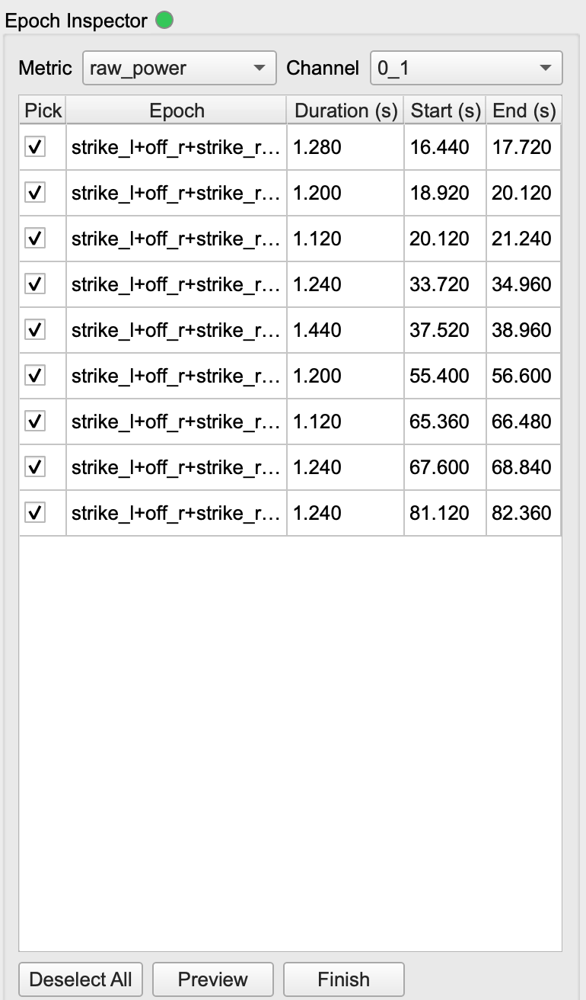

Control map:

- `① Metric`: choose the tensor used for QC
- `② Channel`: choose the representative channel
- `③ Pick`: keep or exclude individual epochs
- `④ Preview`: inspect the currently picked set
- `⑤ Finish`: export the currently picked set

This is the key downstream rule:

- only the checked rows in `Pick` are included in all later analysis

Use `Preview` as the manual QC surface for deciding whether an epoch should be
excluded.

The below figure shows the preview result for the selected picked set.

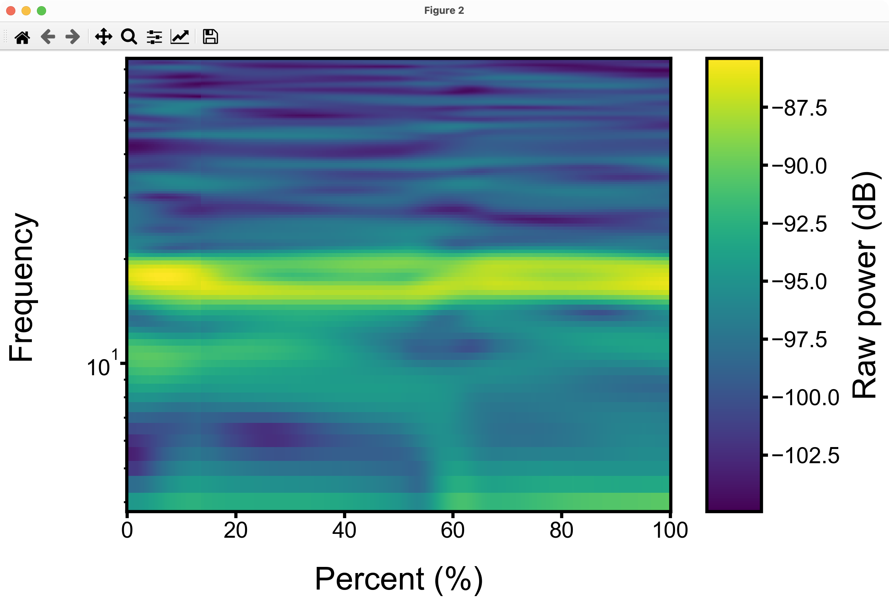

Before clicking `Finish`, confirm that the footer says:

- `Merge Location Info: Ready`

That status means the aligned export will merge localization metadata together
with the picked epochs.

## 8. Extract Features and Available Features

This stage reduces the aligned tensors into quantitative feature tables and
then visualizes selected feature slices. In this demo, the same stage also
defines which frequency bands and time windows the software will summarize.

Switch to `Extract Features`.

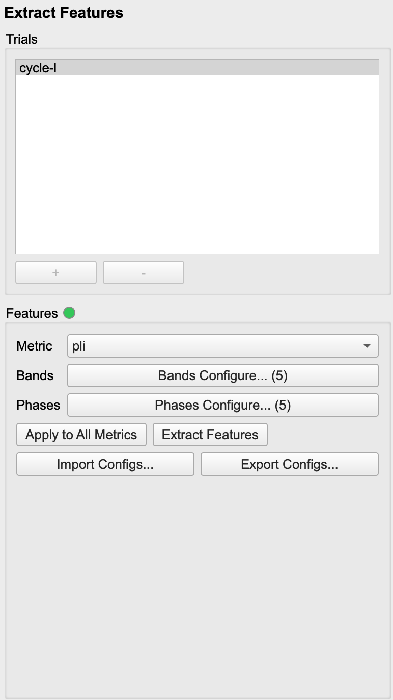

Import the tutorial config:

- `dataset/configs/feature/lfptensorpipe_features_cycle-l_config.json`

Use `Export Configs...` if you want to save your own feature-axes variant.

Click `Extract Features` after the import is complete.

Use `Bands Configure...` to define the frequency bands of interest and
`Phases Configure...` to define the time windows of interest. The software
computes feature values for the combinations of those configured bands and time
windows for each selected metric. Phase `Start (%)` and `End (%)` values use an
explicit 0-to-100 percentage scale: `1` means 1% of the aligned time span, not
the full span. The next two figures show the tutorial's saved band and phase
definitions.

These axis settings are a per-trial draft. An upstream rerun can make Extract
Features stale or temporarily unavailable, but it does not reset the draft.
When a new Align Finish result is accepted, unchanged metrics keep their axes,
new metrics receive their own defaults, and removed metrics retain dormant
settings that are reused if they return. PSI, Burst, and other automatic-band
metrics continue to obtain band labels from the accepted Alignment raw table;
their phases remain user configured. Plot subsets and plot-advance controls do
not change extraction axes.

For numeric axes, the `mean` reducer treats each configured band or phase as a
continuous interval. It uses trapezoidal integration over the complete interval,
including the final interval segment. If a requested boundary lies between two
samples, the boundary value is linearly interpolated. Adjacent phases may share
their boundary point, but that zero-width point does not duplicate any integrated
area. Within a nonzero-width interval, an isolated finite sample separated from
other finite samples by non-finite values has no continuous trapezoidal support
and does not contribute to the mean. If no finite segment spans a positive
coordinate width, the mean is `NaN`. An explicitly configured zero-width
interval remains a point query. Other reducers retain their discrete sample or
event-selection semantics.

For `Clip Around Event` and `Stitch Trials`, every retained source fragment is
a discontinuous piece even though the display places the pieces next to each
other. Alignment interpolates only within a piece. Non-Burst spectral and
scalar `mean` Features map each phase back to the original Tensor timeline,
integrate each mapped fragment separately, and combine the fragment numerators
and valid physical durations. The first and last sample of every fragment both
participate. If a persisted source-fragment boundary lies between native Tensor
timestamps, the nearest sample owned by that fragment is held constant to the
exact boundary. Samples from a gap or neighboring fragment are never used, and
no trapezoid is drawn across a stitched boundary.

### Feature value transformations

Feature processing distinguishes between two numerical domains:

- The **native domain** contains the original metric values, such as linear
  power, connectivity estimates, or event measurements.
- The **transformed domain** contains values after applying the transform
  assigned to the metric.

The selected transform determines the order of frequency interpolation,
time-axis alignment, feature reduction, tensor storage, and feature storage.

#### Processing order by transform

| Transform | Definition | Frequency and time interpolation | Feature reduction | Tensor storage | Feature storage |
|---|---|---|---|---|---|
| `dB` | `10 * log10(x)` | Transformed domain | Transformed domain | Native domain | Native domain |
| `log10` | `log10(x)` | Transformed domain | Transformed domain | Native domain | Native domain |
| `fisherz` | `atanh(x)` | Native domain | Native domain | Native domain | Native domain |
| `fisherz_sqrt` | `atanh(sqrt(x))` | Native domain | Native domain | Native domain | Native domain |
| `logit` | `ln(x / (1 - x))` | Native domain | Native domain | Native domain | Native domain |
| `asinh` | `asinh(x)` | Native domain | Native domain | Native domain | Native domain |
| `none` | No transformation | Native domain | Native domain | Native domain | Native domain |

For metrics using `dB` or `log10`, values are transformed before frequency
interpolation, time-axis alignment, and feature reduction. Interpolated tensor
values are converted back to the native domain before the Tensor artifact is
saved. During Feature extraction, reduced spectral, trace, and scalar outputs
are calculated in the transformed domain and then inverse-transformed before
native-domain storage. Raw Feature output bypasses reduction and is stored in
the native domain directly.

For a mean power feature using the `dB` transform, the calculation is:

`mean(10 * log10(power))`

rather than:

`10 * log10(mean(power))`

The corresponding native value stored in the Feature artifact is:

`10 ** (mean(10 * log10(power)) / 10)`

Applying the declared `dB` transform to that stored value recovers the
transformed-domain reduction exactly, apart from floating-point roundoff.

The retained internal `log` mode continues to mean the natural logarithm for
existing saved configurations. It is not reinterpreted as `log10`.

This domain conversion applies to `mean` and `median`, whose outputs remain
values of the original metric. The `count`, `rate`, `duration`, and Burst
`occupancy` reducers instead produce new native quantities. Their results are
stored unchanged with an identity (`none`) transform policy; for example, an
event count is never interpreted as a dB value and inverse-transformed.

Burst scalar features are calculated on the original full-rate Burst tensor,
not on the resampled Alignment display. The configured Feature phase remains
a percentage interval; the application maps it back through the saved trial
geometry before calculating mean Burst amplitude, rate, mean duration, and
occupancy. Positive Burst amplitudes are reduced in the `log10` domain and
converted back to volts, so the stored mean is a duration-weighted geometric
mean. Valid non-Burst zeros remain event-state values and are never passed to
`log10`. Consequently, changing only the Alignment sample rate must not change
these scalar values.

Burst notch exclusions are denoising operations and do not define a separate
subband-pooling metric. If a named Burst band is split around one or more notch
holes, the application filters the surviving segments, reconstructs the band
by summing those segment signals, and then computes one Hilbert envelope. This
preserves the declared whole-band envelope, including cross-segment beating;
the application does not combine segment envelopes with RSS.

If a record contains an older Burst tensor or `occupation-*` output, rerun
Burst, Align Run, Finish, and Extract Features. The application does not guess
or migrate the meaning of legacy Burst values.

For metrics using `fisherz`, `fisherz_sqrt`, `logit`, or `asinh`, frequency
interpolation, time-axis alignment, and feature reduction are performed in the
native domain, and Feature values are stored in the native domain. The assigned
transform remains in the artifact metadata so a downstream analysis or plotting
step can apply it explicitly without implying that the stored values are
already transformed. This order preserves the original aggregation meaning and
boundary values of bounded or signed estimators.

When the transform is `none`, interpolation, reduction, tensor storage, and
feature storage all remain in the native domain.

#### Transform assignments by metric

The following table lists the transform currently assigned to each tensor
metric and output type.

| Metric or output | Transform | Interpolation domain | Reduction domain | Tensor storage domain | Feature storage domain |
|---|---|---|---|---|---|
| Raw power | `dB` | Transformed | Transformed | Native linear power | Native linear power |
| Periodic model component from Periodic/Aperiodic decomposition | `dB` | Transformed | Transformed | Native unitless factor | Native unitless factor |
| Aperiodic offset | `none` | Native | Native | Native | Native |
| Aperiodic exponent | `none` | Native | Native | Native | Native |
| Aperiodic knee | `none` | Native | Native | Native | Native |
| Periodic/Aperiodic fit error | `none` | Native | Native | Native | Native |
| Periodic/Aperiodic goodness of fit | `none` | Native | Native | Native | Native |
| Coherence | `fisherz` | Native | Native | Native | Native |
| Absolute imaginary coherence (\|ImCoh\|) | `fisherz` | Native | Native | Native | Native |
| PLV | `logit` | Native | Native | Native | Native |
| ciPLV | `logit` | Native | Native | Native | Native |
| PLI | `logit` | Native | Native | Native | Native |
| wPLI | `logit` | Native | Native | Native | Native |
| TRGC | `none` | Native | Native | Native | Native |
| PSI | `none` | Native | Native | Native | Native |
| Burst amplitude (`mean`) | `log10` | Transformed | Transformed | Native | Native |
| Burst duration | `none` | Native | Native | Native | Native |
| Burst rate | `none` | Native | Native | Native | Native |
| Burst occupancy | `none` | Native | Native | Native | Native |
| Other burst event measurements | `none` | Native | Native | Native | Native |

#### TRGC grouped-estimation interpretation

TRGC may divide the requested frequencies into multiple groups so that lower
frequencies can use longer estimation windows. Each group is estimated
independently and may use a different estimation window and/or model frequency
range. The resulting frequency-axis output is the concatenation of those group
results rather than one continuous TRGC model.

When the actual runtime plan contains more than one TRGC frequency group,
`Run Build Tensor` displays a warning before computation starts. Select
`Return` to keep the current parameters without starting the run, or select
`Continue` to run the approved grouped calculation. Results remain comparable
for the same frequency across runs only when all TRGC settings and group
assignments remain unchanged. Do not interpret the concatenated output as one
continuous TRGC spectrum or extract a frequency band that crosses a group
boundary.

The grouping preview is advisory rather than a Build Tensor validation gate.
If the preview cannot be prepared, Build Tensor still starts with every
selected metric. The worker then records any real TRGC preparation failure in
the TRGC metric log while allowing unrelated metrics to continue under the
normal per-metric failure-isolation contract.

#### Periodic/Aperiodic stored-value semantics

The names `Periodic` and `Aperiodic` follow the standard SpecParam conceptual
decomposition. They do not imply that the two persisted artifacts are additive
linear-power arrays.

SpecParam fits the model additively in the log10-power domain:

```text
log10(P_full_fit) = L_aperiodic + G_periodic
```

The persisted Periodic tensor is the exponentiated periodic model component:

```text
Periodic = 10 ** G_periodic
         = P_full_fit / P_aperiodic_fit
```

It is therefore a dimensionless multiplicative factor relative to the fitted
aperiodic component. `Periodic = 1` means that no periodic elevation was
modeled at that frequency and time. `Periodic = 2` means that the modeled full
power is twice the fitted aperiodic level. The value is not the additive
absolute-power difference `P_full_fit - P_aperiodic_fit` and must not be added
directly to an aperiodic power spectrum.

The artifact named `tensor/aperiodic/tensor.pkl` stores the time-aligned
SpecParam parameters and fit statistics, such as offset, exponent, optional
knee, fit error, and goodness of fit. It does not store a frequency-resolved
aperiodic power tensor. These representation choices preserve the standard
Periodic/Aperiodic terminology while making the numerical interpretation
explicit.

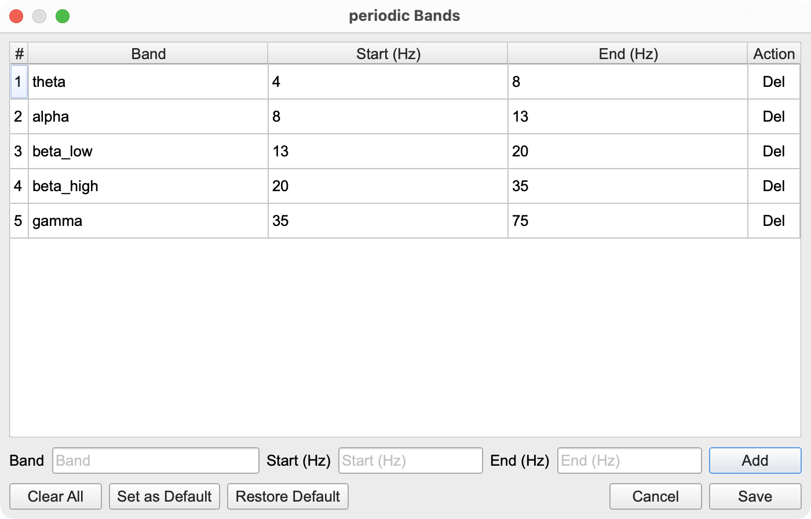


### 8.1 Select the Feature to Plot

This step chooses which extracted feature table to inspect and which subset of
that table to render. In this demo, it narrows the output to one metric, one
channel, and one region for plotting.

After extraction finishes, click `Refresh Features` and select the row shown in
the below figure.

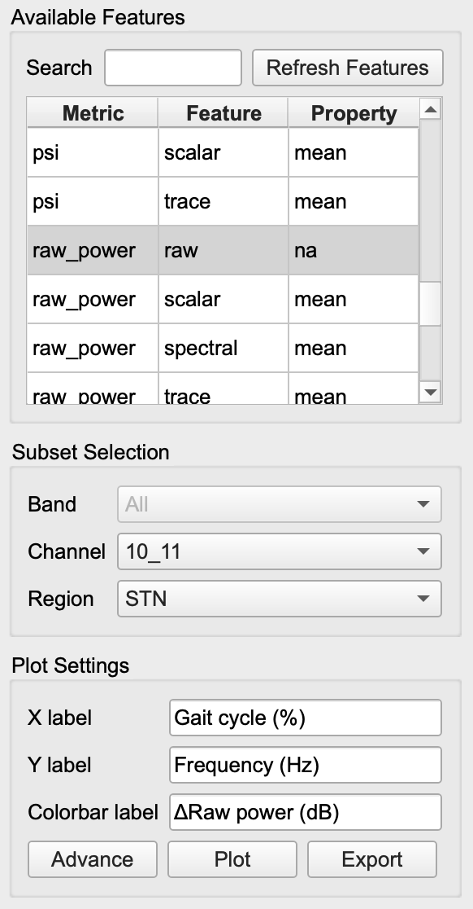

Use:

| Control | Value |
|---|---|
| `Feature row` | `raw_power | raw | na` |
| `Band` | `All` |
| `Channel` | `10_11` |
| `Region` | `STN` |
| `X label` | `Gait cycle (%)` |
| `Y label` | `Frequency (Hz)` |
| `Colorbar label` | `ΔRaw power (dB)` |

### 8.2 Baseline and Plot Settings

This step controls how the selected feature is normalized and rendered. In this
demo, plot advance sets the transform, normalization, and color mapping, then
baseline configure defines the percentage time interval used for normalization.

The below figure shows the plot-advance state used by the tutorial.


Use:

| Parameter | Value |
|---|---|
| `Transform` | `dB` |
| `Normalize` | `mean` |
| `Baseline stat` | `mean` |
| `Baseline` | `0-100` |
| `Colormap` | `cmcrameri.vik` |
| `x_log` | `false` |
| `y_log` | `true` |

From `Baseline Configure...`, define the percentage time interval used for
normalization. In this tutorial, the baseline uses the full gait-cycle range.


Add one baseline range:

- `0` to `100`

Use `Export` in the plot settings area when you want to save both the current
figure and the data used to render it.

### 8.3 Final Plot

This step renders the final visual output of the walkthrough. In this demo, it
closes the pipeline by turning one imported record, one aligned trial, and one
selected feature into a publication-style heatmap.

Click `Plot` to generate the result shown in the below figure.

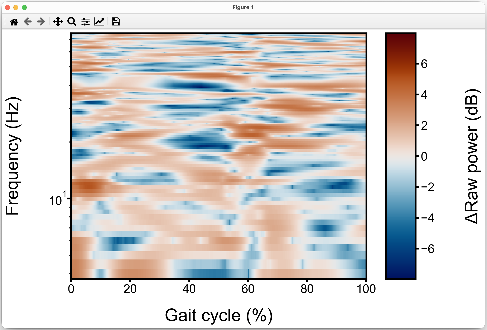


## 9. Quick Reproduction Notes

- Use the tutorial configs through `Import Configs...` whenever the page offers
  it. That is the fastest way to reproduce the walkthrough result.
- Use `Export Configs...` to save your own local variant after you modify a
  page.
- `Confirm Import` stays disabled until both `Sync` and `Reset reference` are
  saved.
- The SceneRay notch list in this demo is data-source specific and should not
  be copied blindly to unrelated datasets.
- The tutorial intentionally skips `ECG Artifact Removal`.
- The downstream analysis uses only the epochs checked in `Pick`.

For control-level descriptions of each page and dialog, continue with
[APP_CONTROL_REFERENCE.md](APP_CONTROL_REFERENCE.md).
